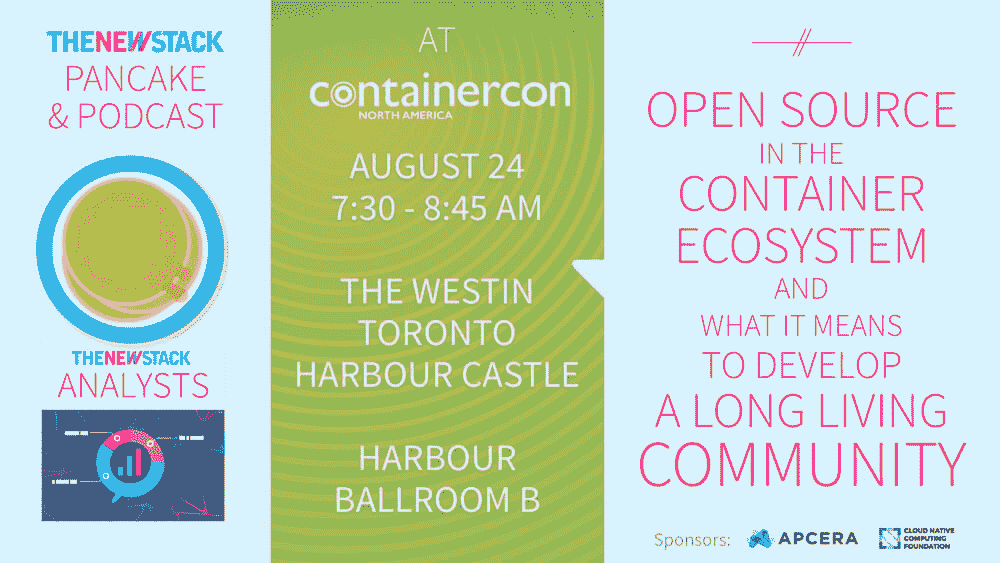

# 年轻开源开发者的未来之路

> 原文：<https://thenewstack.io/powerful-collaboration-tools-open-source-community/>

多年来，开发人员已经开始接受开源，许多人在早年就因为共同的兴趣而联系在一起。无论是玩游戏，弄清楚计算机硬件如何工作，还是解决棘手的数学问题，开源都是那些无法访问商业软件的人在项目上联系和合作的一种方式。

在本周的第 110 集 [The New Stack Analysts](https://thenewstack.io/podcasts/) 播客中，我们将探讨开发人员是如何从开源起步的，为什么 foundations 可能不是引入开源社区的完美解决方案，以及在当今的开源生态圈中，报告错误和解决问题的最佳实践是什么。New Stack 创始人 Alex Williams 和联合主持人 [Lee Calcote](https://twitter.com/lcalcote) 与 [Apcera](https://www.ericsson.com/en/digital-services/edge-computing) 软件工程师[Jamie pia](https://www.linkedin.com/in/jaimepina)和 Apcera 首席软件架构师 [Josh Ellithorpe](https://www.linkedin.com/in/joshellithorpe) 进行了交谈，以获得他们对这些问题和更多问题的见解。

[#107:年轻开源开发者的前路](https://thenewstack.simplecast.com/episodes/107-the-path-ahead-for-the-young-open-source-developer)

对话[也可以在 YouTube 上听到](https://www.youtube.com/watch?v=XiSDtFnx99s)。

对于年轻的开发者来说，时代已经变了。埃利索普在成长过程中最初没有互联网接入，不得不从印刷材料、学校课堂、公告栏交换中获取源代码，“……并查看其他项目，人们出于好心让你查看代码，”他说。

“我认为今天的开发人员真正分享了这种体验。这才是推动开源的真正原因。你想回报教育你的社区，”埃利索普说。

pia 使用同行协作来构建坚实的编程基础。“我发现与朋友交谈，能够分享我的屏幕，或者能够在白板上画出一些算法或有帮助的东西。我想这就是为什么像 Slack 或 Gitter 这样的工具让事情变得如此简单，”他说。

Ellithorpe 解释说，今天的许多工作流自动化和代码检查工具已经帮助开源项目贡献者进入了正轨。“我认为我们今天看到的许多自动化工具实际上是为了让开发人员更快地参与进来。Ellithorpe 说:“像自动化代码检查、对存储库的 CI 和 CD 检查以及像 Travis T1 这样的工具已经真正成为与开源社区做生意的成本。

演讲转向了基金会在开源社区中的角色。埃利索普没有拐弯抹角，清楚地陈述了他对基金会在当今开源生态圈中的角色的看法。“我不喜欢社区对什么可以提交什么不可以提交设置太多的规则和条例。当[基金会介入](https://thenewstack.io/engaging-meaningfully-open-source-communities/)时，对项目的方向有太多的发号施令，这实际上扼杀了创新。”

Apcera 是新堆栈的赞助商。

多里安·卡尔塔洛夫斯基通过 [Unsplash](https://unsplash.com/) 拍摄的特写图片。

<svg xmlns:xlink="http://www.w3.org/1999/xlink" viewBox="0 0 68 31" version="1.1"><title>Group</title> <desc>Created with Sketch.</desc></svg>