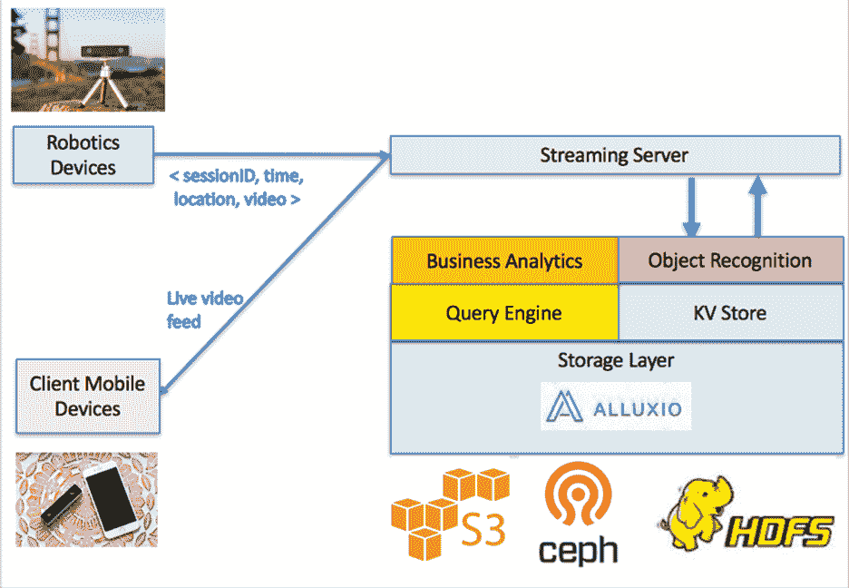
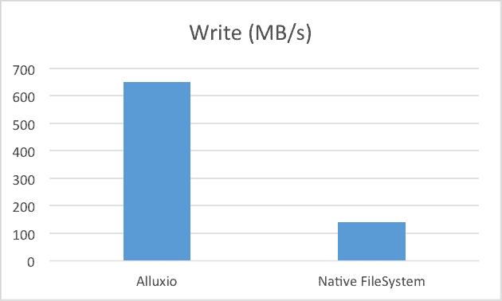

# 感知机器人从 Alluxio 分布式存储中获得性能提升

> 原文：<https://thenewstack.io/powering-robotics-clouds-alluxio/>

 [刘绍山

刘绍山目前是 PerceptIn 的董事长兼联合创始人，致力于开发下一代机器人平台。](https://www.perceptin.io/) 

在 PerceptIn，我们通过我们专有的机器学习算法和最先进的云架构，构建具有对象识别功能的尖端监控机器人。我们的机器人智能地巡视用户的财产，并在检测到任何异常时发出警报。

除了点播视频流和警报功能，我们的机器人还可以识别物体，并可以识别和播放用户想要搜索的物体。例如，对于有宠物的家庭，我们的机器人将能够识别宠物何时出现在画面中，用户可以在存储的视频中搜索宠物被拍摄到的所有实例，让房主看到他们的宠物在他们不在时在做什么。

来自视频流的大量数据，加上客户对机器人和视频数据的 24 小时控制和远程访问的需求，推动了对高性能和可扩展云架构的需求。这篇博文探讨了 [PerceptIn](https://www.perceptin.io/) 如何使用 [Alluxio 分布式存储软件](https://www.alluxio.com/)作为支持用户需求的关键技术来设计和实现云架构。更重要的是，我们希望展示 Alluxio 如何提供高吞吐量、低延迟和统一的名称空间来支持这些新兴的云架构。

## 为机器人构建云架构

机器人应用的兴起要求新的云架构提供高吞吐量和低延迟。问题包括:

 [孙大为

孙大为目前在清华大学和 PerceptIn 工作，从事深度学习和云基础设施、自主机器人以及嵌入式系统的研究。](https://www.perceptin.io/) 

*   **客户要求实时响应**:至关重要的一点是，用户能够访问点播视频，并能实时获得任何异常情况的通知。因此，云解决方案必须为写入和检索视频源提供高吞吐量和低延迟。
*   **大规模数据分布在不同的存储系统中**:点播视频流会产生大量数据，而且并非所有数据都是相同的。根据数据的年龄以及它是否被我们的定制应用程序(如我们的点播视频流应用程序和我们的对象检测应用程序)使用，数据存储在不同的存储系统中，以优化资源分配效率。

这些要求意味着，我们需要一个存储引擎，它不仅能够处理大量的传入数据(这些数据最终会出现在不同的存储系统中)，还能为写入和检索视频源提供高吞吐量和低延迟。

## PerceptIn 通过 Alluxio 为机器人云提供动力

为了满足上述要求，我们设计并实施了云架构:

感知视频流云架构

我们利用 Alluxio 作为存储层，它可以跨内部和云中的不同存储系统提供高性能和统一性。借助 Alluxio，我们的业务分析、对象识别、查询引擎和键值存储都可以以内存速度轻松地与存储在亚马逊网络服务简单存储服务(S3)、Ceph 和 Hadoop 文件系统(HDFS)中的数据进行交互。

为了理解 Alluxio 在这种情况下的帮助，让我们首先比较一下 Alluxio 的写吞吐量与本地磁盘的写吞吐量。这一吞吐量至关重要，因为它决定了我们将视频馈送写入存储的速度。如果吞吐量太低，那么存储层可能会成为整个多媒体数据管道的瓶颈。如下图所示，使用 Alluxio 可以轻松实现超过 650 MB/s 的吞吐量，而使用本机文件系统只能实现 120 MB/s 的吞吐量。

因此，在这种情况下，Alluxio 提供了至少 5 倍的性能提升，因为写入 Alluxio 内存存储避免了遇到硬盘 I/O 瓶颈。

写入性能

然后我们比较了视频检索延迟。使用 Alluxio，可以在 500 毫秒内检索到视频。然而，当视频存储在远程机器上时，延迟可能高达 20 秒。因此，使用 Alluxio 来缓冲“热门”视频数据可以将检索延迟减少多达 40 倍，这对用户体验至关重要。

此外，不同的用户需要 Alluxio 下不同的存储系统，有些使用 Ceph，有些使用 HDFS，有些使用 S3。如果没有 Alluxio，我们将不得不管理多个接口，每个接口对应一个存储系统。有了 Alluxio 的统一命名空间，我们现在可以维护一个主要接口，同时享受不同底层存储的好处。

## 结论

机器人云架构的兴起带来了许多新的要求，这些要求转化为对存储层的要求。存储层需要用统一的接口支持异构持久存储，以简化开发和管理。此外，存储层需要提供高吞吐量和低延迟，以加快洞察速度。Alluxio 完美地满足了这些需求，因此我们选择 Alluxio 作为我们云基础架构的默认存储引擎。

<svg xmlns:xlink="http://www.w3.org/1999/xlink" viewBox="0 0 68 31" version="1.1"><title>Group</title> <desc>Created with Sketch.</desc></svg>