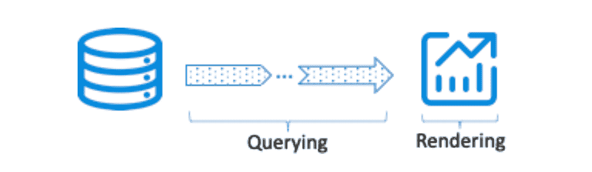
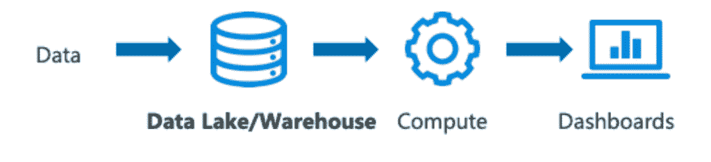
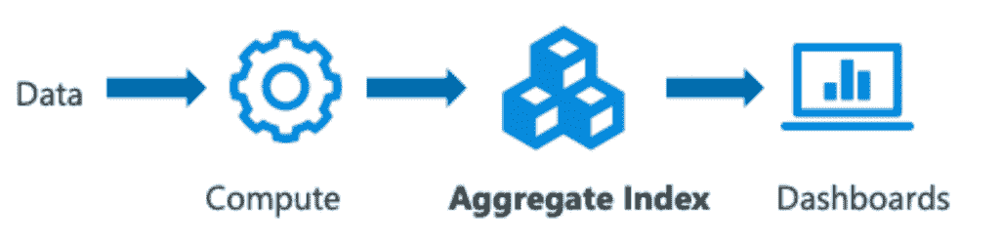
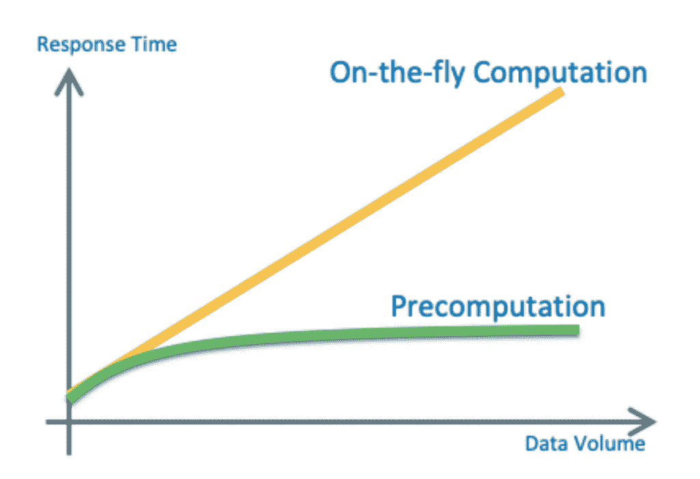

# 预计算:高清云分析的关键

> 原文：<https://thenewstack.io/precomputation-the-key-to-high-definition-cloud-analytics/>

 [李康

李康是 Kyligence 美国运营部的负责人，他还与技术合作伙伴一起构建联合解决方案。李在大数据和分析领域拥有丰富的经验。在加入 Kyligence 之前，他曾在 Oracle、Informatica 和 MapR 工作，帮助客户构建数据库、数据仓库和大数据解决方案。](https://kyligence.io/) 

从大数据时代一开始，对于那些承担分析任务的人来说，大数据量就一直是恐惧、不确定性和怀疑的来源:为了处理大数据，有一种观点认为必须让它变小。鉴于当时原始的处理工具和编程模型，显然没有人能够实际处理“高清晰度”数据。

对于许多重要的算法——推荐、预测、行为建模——对单一真实来源的需求已经被基于可用数据集的最高概率所取代。鉴于使用机器学习来实现新的收入流或更大的销售渠道的商业优势，我们愿意等待数小时、数天或数周来完成这些模型。

但是，机器学习的兴起并没有减弱我们与数据互动的愿望——用实时的高清数据进行探索和实验。这不仅现在是可能的，而且作为开源项目 [Apache Kylin](http://kylin.apache.org/) 的一部分，智能地、系统地使用预计算技术也是可行的。

Apache Kylin 是一个在大数据环境中实现预计算模式的开源项目。Apache Kylin 背后的公司 Kyligence 是由创建 Kylin 项目的团队创建的。Kyligence 提供了 Kylin 的商业版本，可以部署在云中或内部。一些世界上最大的金融机构、电子商务网站、电信供应商和消费品公司一直在使用 Kylin 技术来解决他们最具挑战性的分析问题。

在本文中，我们将了解预计算这一熟悉的概念，预计算是一种提高分析性能并在云中实现超大型(数百 TB 到数 Pb)数据集查询的亚秒级响应时间的方法。

## 对于云中的分析，多快才算够快？

“我的查询很慢！不能用了。”

这可能是我们从业务用户那里听到的关于他们在云中的分析体验的最常见的抱怨。虽然每个人都喜欢以思维的速度进行分析，但现实是我们花了太多时间等待仪表盘刷新。自然地，我们开始寻找下一个闪亮的 BI 工具，希望它比我们正在使用的工具运行得更快。然而，性能挑战可能是系统性的，不容易通过使用另一个 BI 客户端来解决。

图 1:总延迟=查询延迟+呈现延迟

导致仪表板延迟的因素有两个:获取和准备数据的时间以及呈现和更新 UI 的时间，如图 1 所示。最终用户通常没有意识到大部分延迟(通常称为查询延迟)实际上来自第一步。对于复杂的查询和大型数据集，查询延迟可能是几十秒到几十分钟。显然，在这种情况下，无论你的 BI 工具绘制图表的速度有多快，用户体验都会很慢。

理想情况下，为了真正支持思维速度的分析，我们需要总延迟(从用户点击鼠标到仪表板被刷新的时间)在 1 秒左右，不超过 3 秒。这意味着对于大多数用例，我们的查询延迟应该小于一秒，对于最复杂的场景，应该是一到两秒。

为了感受到我们真正获得了对高清数据的准确分析，我们需要在 Pb 级数据集上实现这种级别的延迟。这必须适用于最复杂的分析场景，在这种场景中，成千上万的并发用户要分析数十个属性。这是现代分析系统对后端数据服务层要求的性能类型。

## 动态计算与预计算

创建数据仓库是为了最大限度地提高查询性能，方法是以一种易于汇总数据以用于报告和仪表板的方式来组织数据。数据按主题区域分组，以星型模式组织，并基于关键过滤器或分组条件进行分布。因此，在数据仓库中汇总数据比在事务数据库中汇总要快得多。

在大数据世界中，列存储按列而不是按行排列数据。由于大多数分析查询对汇总某些列中的数据感兴趣，所以列存储极大地提高了分析查询的性能。Presto、Apache Impala 和 Kinetica 等新一代查询引擎旨在提出跨大量服务器并行处理数据的方法。这些新的软件技术，加上硬件(如 GPU、更快的网络和更快的磁盘)的进步，极大地提高了查询性能。

在过去的几年里，我们也看到了云数据仓库的出现，雪花就是最著名的例子。在云数据仓库中存储数据已经变得像点击几次鼠标一样简单，用户不需要担心许多通常需要经验丰富的 DBA 来执行的管理任务。云数据仓库极大地减少了在云中组织和分析数据所需的工作量。

但是所有这些技术都是在从数据仓库或文件系统中读取数据后运行分析处理的。您想知道第三季度销售了多少产品吗？让查询引擎读取这些记录，计算总金额，并将结果发送回来。从 2019 年开始怎么样？嗯，我们会读取 2019 年以来的所有记录，然后给你总数。

这显然是一个简化的场景。数据仓库有许多优化方法(例如位图索引、SQL 优化)来提高查询性能，但原则仍然是正确的，如图 2 所示:扫描、计算、服务结果、清洗和重复。

图 2:存储、查询和计算

## 将计算移到流程的早期阶段

与其读取原始数据并为每个查询计算摘要，不如我们在查询发出之前计算摘要并保存结果。这样，当用户问这些问题时，他们会立即得到答案。这就是预计算的概念(参见图 3)。

图 3:计算、存储和查询

正如许多阅读本文的人所知，预计算在计算中并不是一个新概念。多年来，人们一直在 RDBMS 中使用各种数据索引策略和物化视图。在操作系统和微处理器中也有很多例子。关于这个主题的更多背景知识，你可以参考我写的一篇关于预计算的[发展的简短博客。](https://kyligence.io/blog/the-evolution-of-precomputation-technology/)

## 预计算，现代分析的范式转变

在 Apache Kylin 环境中，聚合和其他关键度量是预先计算的。预计算的结果作为索引保存在存储层中。我们还可以为某些属性定义逻辑层次结构，例如时间(日、周、月、季度、年等。)、地点(城市、州、国家等。)、产品(产品家族、产品类别、产品线等。)，以此类推，实现下钻和上滚。查询和获取结果变成了简单的查找操作，这通常比强力聚合和计算快几百倍。

这种架构的好处是巨大的。首先，查询延迟不会随着数据量的增加而增加(公平地说，当处理大索引时，查询延迟会稍微长一些，但是与典型的 MPP 查询引擎的性能相比，这种增加是可以忽略的)。

延迟曲线如图 4 所示。

图 4:动态计算与预计算

Apache Kylin 预计算层的另一个好处是支持大量并发用户的能力。由于大多数传统查询引擎需要在运行时计算数据并在内存中组装结果集，因此支持数百或数千个并发用户不仅会导致不可接受的延迟，而且还需要大量内存。有了 Kylin 的预计算架构，每个查询都是非常轻量级的——通常只是一个简单的查找——因此我们可以轻松地扩展以处理数千个并发用户，而不会牺牲性能。

预计算带来的好处之一是显著节省了云基础架构的成本。云提供商——尤其是云数据仓库供应商——对消耗的每个 CPU 周期收费，这意味着用户必须为计算的每个聚合付费。因此，如果有人编写了一个糟糕的查询，或者如果有许多用户发出查询，您将在月底看到云成本的飙升。另一方面，使用预计算，每个查询的成本是最小的。

这种架构也非常适合云数据湖架构。可以使用 AWS 胡迪和 Azure Data Factory 等服务将原始数据吸收到数据湖中。为了运行预计算作业，我们可以按需启动计算资源，完成作业，然后关闭这些计算节点。根据查询需求，我们还可以动态地增加或减少查询节点来服务查询。

## 知道预计算什么

可能想到的第一个问题是:我如何知道应该预先计算什么结果？一种方法是手动分析 SQL 或 MDX 查询，以了解哪些数据集和结果最常用，从而建议应该创建哪些聚合索引。

一种更具前瞻性的方法表明，这个问题提供了一个明确的机会，将人工智能应用到您的预计算策略中。关键是利用机器学习算法来预测分析师会提出的问题。通过学习用户的查询历史、分析行为、元数据和数据访问，我们可以应用人工智能算法来预测用户会问什么问题，从而从预先计算的答案中受益。正如任何好的机器学习模型一样，我们收到的查询越多，我们处理的数据越多，我们服务的用户越多，这些预测就越准确。

通过了解用户会问什么问题，软件可以自动选择最佳策略来运行适当的查询，获得正确的答案，并将它们存储在分布式文件系统中。许多人可能会问“为什么是文件系统—为什么不是内存？”原因在于，云数据湖(Cloud Data Lake)等文件系统以非常合理的成本为我们提供了无限的存储能力，同时还保持了出色的数据访问性能。由于今天的分布式计算和存储系统，我们现在可以在短时间内以低成本处理数万亿行数据。这是在高清数据上实现交互式分析的本质。

## 摘要

信息工作者面临的挑战之一是快速操作和分析他们可用的大量数据。我们最初的想法是让数据变得更小，但这是以时间、精力和运营费用为代价的。借助 Apache Kylin 的预计算架构，分析数据管道得到了简化，用户能够与更大的数据集进行交互，以获得我们期待已久的更清晰、更高清的洞察类型。

<svg xmlns:xlink="http://www.w3.org/1999/xlink" viewBox="0 0 68 31" version="1.1"><title>Group</title> <desc>Created with Sketch.</desc></svg>