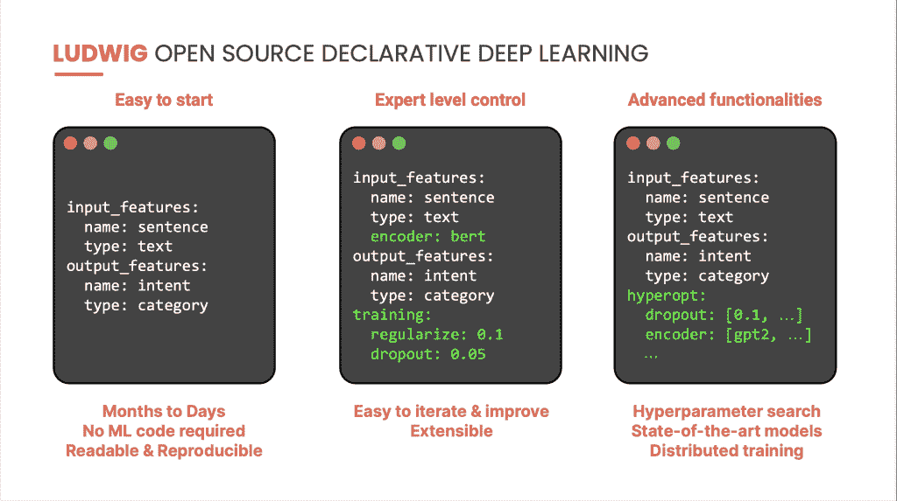

# Predibase 采用声明式方法进行 AutoML

> 原文：<https://thenewstack.io/predibase-takes-declarative-approach-to-automl/>

众所周知[创建和部署机器学习模型需要太长时间](https://thenewstack.io/creating-machine-learning-models-takes-too-much-time/)。在 Algorithmia 的“ [2021 年机器学习企业趋势”(T3)中，25%的受访者表示创建一个模型需要一周到一个月的时间，而 24%的人认为需要一个月到一个季度的时间。37%的人说部署一个模型需要四分之一到一年的时间。](https://web.archive.org/web/20201210182823/https:/info.algorithmia.com/tt-state-of-ml-2021)

在优步，涉及 1500 行 TensorFlow 的意向分类系统花了五个月时间创建，七个月时间部署。

第二个机器学习项目是欺诈检测，包含 900 行 PyTorch，创建和部署分别花了 5 个月和 4 个月。

一个包含 1，200 行 PyTorch 的产品推荐工具花了六个月时间创建，七个月时间部署。

总部位于旧金山的初创公司 [Predibase](https://predibase.com/) 准备通过提供一个数据科学家和非专家都可以使用的低代码声明式 ML 平台来改变这种情况，缓解组织雇用更稀缺和昂贵的数据科学家的压力。用户只需说出他们想做什么——从 6 行 Python 代码开始——然后让系统来决定如何做以及所需的基础设施。

它建立在两种机器学习技术的基础上，这两种技术是由优步的 Predibase 创始人 Ludwig 和 Horovod 创造的。 [Ludwig](https://ludwig-ai.github.io/ludwig-docs/0.5/) 是一个开源的、[声明式机器学习框架](https://ludwig-ai.github.io/ludwig-docs/0.5/user_guide/what_is_ludwig/#why-declarative-machine-learning-systems)，它提供了 autoML 解决方案的简单性和编写自己的 PyTorch 代码的灵活性。 [Horovod](https://eng.uber.com/horovod/) **，**优步[米开朗基罗深度学习工具包](https://eng.uber.com/michelangelo-machine-learning-platform/)的开源组件，使得使用 TensorFlow 更容易启动——并加速——分布式深度学习项目。

“经验是，数据科学组织必须从根本上重新发明轮子，为这些产品中的每一个产品创建定制的解决方案，它们之间没有太多的共同点。Predibase 首席执行官皮耶罗·莫里诺表示，正因为如此，整个组织成为了机器学习应用的瓶颈。结果是，机器学习模型为组织带来价值需要太长的时间。

相比之下，他将一个[声明式配置](https://arxiv.org/abs/2107.08148)系统比作 Kubernetes 为基础设施所做的。

“我们的愿景是让机器学习像编写 SQL 查询一样简单，”莫利诺说。

基本思想是让用户将整个模型管道指定为配置——他们关心的部分——并将其余部分自动化。

“传统的机器学习项目涉及复杂的 ML 生命周期，跨越特征和数据工程；模型开发和培训；以及模型生产和管理。埃克森集团研究副总裁[凯文·佩特里](https://www.linkedin.com/in/kevinpetrietech/)说:“跨职能数据科学团队努力以一致和可持续的方式管理这些阶段。

“Predibase 代表了简化 ML 生命周期的创新水平。Predibase 提议让数据科学团队为他们的 ML 模型指定期望的输入和输出。也就是说，他们创建配置文件，然后预测如何实现。数据科学团队仍然可以自定义尽可能多的参数，等等。因为他们喜欢通过模块化的改变来满足新的或变化的客户需求。

“简而言之，Predibase 建议最大限度地降低 ML 生命周期的复杂性，这是数据科学项目取得成功的最大障碍。”

很容易上手。例如，可以用六行代码创建优步意图分类系统。你得到的东西是可读的、可复制的、可分享的，他说。

但其中一个好处是，您保留了专家所需的所有灵活性和控制力。因此，您可以通过配置指定关于模型的所有细节——在不同的模型架构、训练参数和数据预处理中进行选择。所有这些都可以通过配置中的一个参数来访问，这使得迭代和改进模型变得很容易。仅使用新配置进行更改。

它也是可扩展的。因此，如果您是专业开发人员，您可以将自己的键添加到配置中。例如，您可以通过添加您自己的 PyTorch 来扩展它，然后可以从配置中引用它。

## 知识渊博的团队

该公司在机器学习方面有深厚的专业知识。

路德维希的创造者莫利诺以前是斯坦福大学的研究人员，也是优步人工智能的联合创始人和高级研究科学家。

Predibase 的联合创始人包括:

*   优步深度学习培训团队的前高级软件工程师和技术主管 Travis Addair 。他是 Horovod 项目的合著者和[弹性 Horovod](https://horovod.readthedocs.io/en/stable/elastic_include.html) 的作者
*   [Devvret Rishi](https://www.linkedin.com/in/devvret-rishi-b0857684/) ，前谷歌云人工智能和其他项目的产品经理。他是 Kaggle 机器学习社区的第一任产品经理，也是哈佛大学的人工智能助教。
*   斯坦福人工智能实验室和机器学习小组的副教授 Chris Ré 。他创建了 [Overton](https://machinelearning.apple.com/research/overton) ，一个类似于苹果公司 Ludwig 的专有系统。

pred base[使用户能够](https://medium.com/predibase/introducing-predibase-the-enterprise-declarative-machine-learning-platform-10e2a388d465)轻松连接到存储在云数据堆栈上任何地方的结构化和非结构化数据；编写模型管道配置并在可扩展的分布式基础设施上运行，以便像在单台机器上一样容易地训练模型；单击一个按钮即可部署模型管线，并立即对其进行查询。

“Predibase 正在构建第一个声明性 ML 平台，使企业能够开发和操作模型，从数据到部署，而不必在简单性和细粒度控制的强大功能之间做出选择。“开源基金会及其商业平台测试版在财富 500 强中的快速成功令人难以置信，”Greylock 合伙人 [Saam Motamedi](https://www.linkedin.com/in/saammotamedi/) 在最近宣布的 1625 万美元 A 轮融资中表示。

Predibase 仍处于财富 500 强客户的私人测试阶段，预计将于今年下半年正式发布。

## 细粒度控制

客户一直在使用大约 10 亿到 20 亿行的数据集，大约 100 到 200 列和数百 GB。内部基准测试已经运行到 2tb。然而，根据 Rishi 的说法，Ludwig 和 Horovod 已经在更大的数据集上进行了测试。

该公司坚持认为，它采取了不同于其他自动机器学习产品的方法。

莫利诺解释说:“例如，想想像 [DataRobot](https://www.datarobot.com/) 或 [Google Cloud AutoML](https://cloud.google.com/automl) 这样的东西，[它们]提供这些接口，你可以输入数据，点击一个按钮，然后你就可以得到模型。”。“我们发现，这实际上让许多用户和客户非常不满意，因为他们往往是没有任何可配置性或控制力的黑匣子。因此，一旦平台没有给你一个现成的好模型，你就有点卡住了，最终你会被淘汰。”

用户可以完全通过 Python、UI 或 PQL(SQL 的一种扩展)来访问 Predibase 中的功能。

Rishi 解释说，PQL 扩展包括谓词，允许你将机器学习和数据结合在一起。它的灵活性使机器学习成为数据用户的语言，因此他们可以使用“过滤”、“按集合分组”、“连接”或任何其他他们在 SQL 中熟悉的命令。它是可扩展的。简单地添加新特性作为附加谓词。Predibase 使得使用文本、图像和其他类型的字段就像使用标准表格字段一样简单。

“这真的很简单。它将机器学习带到了更广泛的熟悉 SQL 的用户手中，但同时，在幕后，Ludwig 配置系统的功能和灵活性为结构化和非结构化数据以及两者的结合提供了最先进的性能，”Molino 说。

“最后，我们还抽象化了基础架构……基于 Horovod，他们可以大规模培训和部署模型。它基本上是一个高技术水平的基础设施，不需要有一个高技术水平的工程团队来建造它。它已经为您构建好了。”

可以通过 Python SDK 和 PQL 语言将模型作为 REST APIs 进行查询。尽管整个流程都封装在平台中，但是如果用户需要在其他地方运行模型，也可以将其导出。

一个模型存储库页面总结了模型，就像配置一样，使得比较模型版本变得容易。

Molino 说，该公司将在今年上半年使该产品具备健壮性、企业级安全性并支持多云部署。在 GA 发布后，它希望与更广泛的 ML 生态系统集成，例如使用像 [dbt](https://towardsdatascience.com/agile-machine-learning-with-dbt-and-bigquery-ml-c067431ef7a9) 这样的工具，并最终实现 Predibase 自助服务。

<svg xmlns:xlink="http://www.w3.org/1999/xlink" viewBox="0 0 68 31" version="1.1"><title>Group</title> <desc>Created with Sketch.</desc></svg>