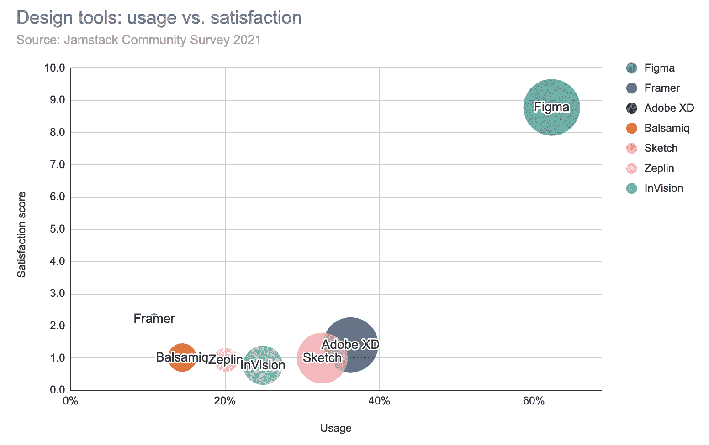
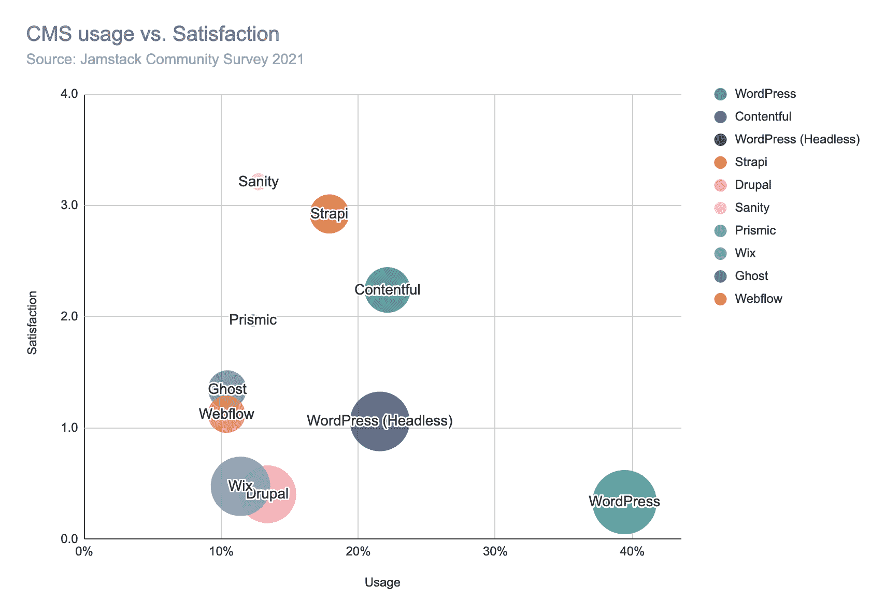
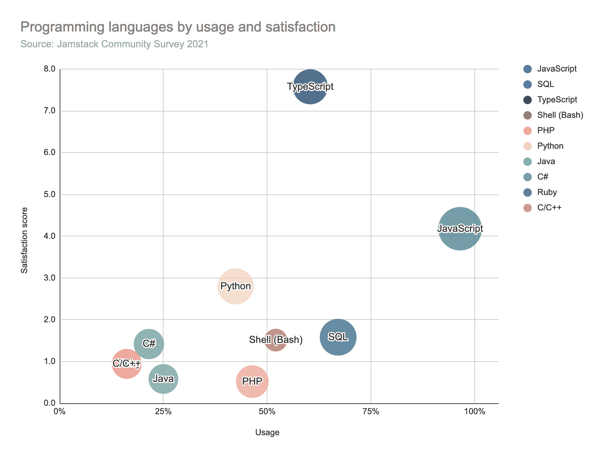
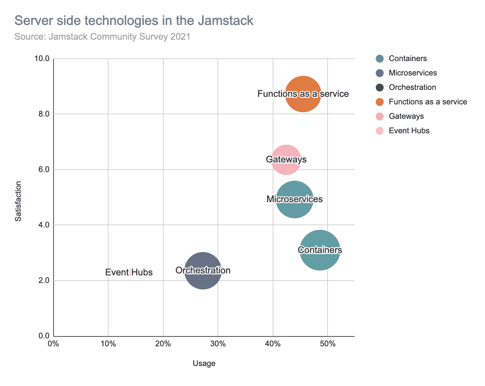
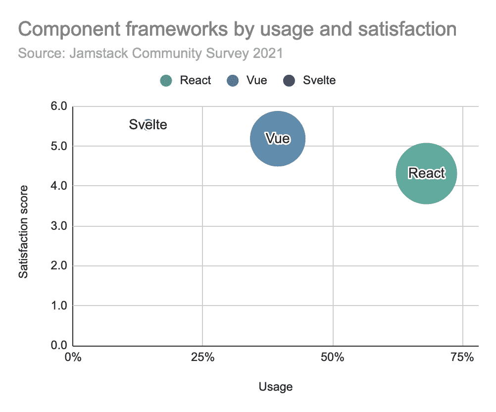
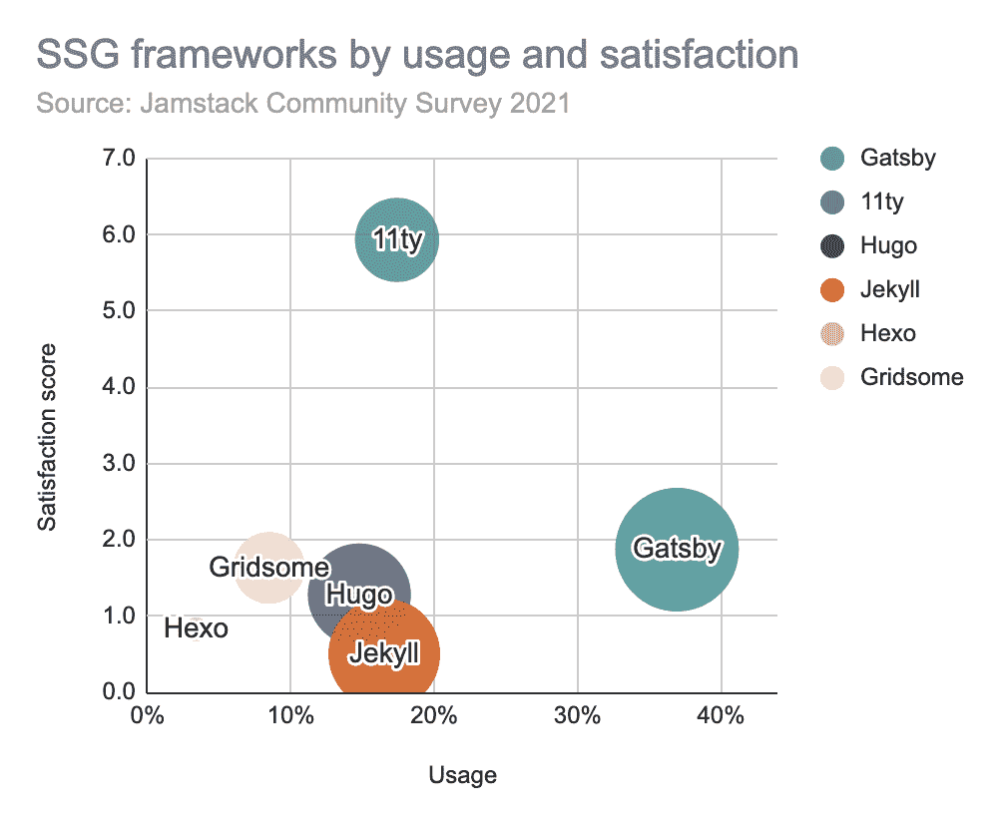
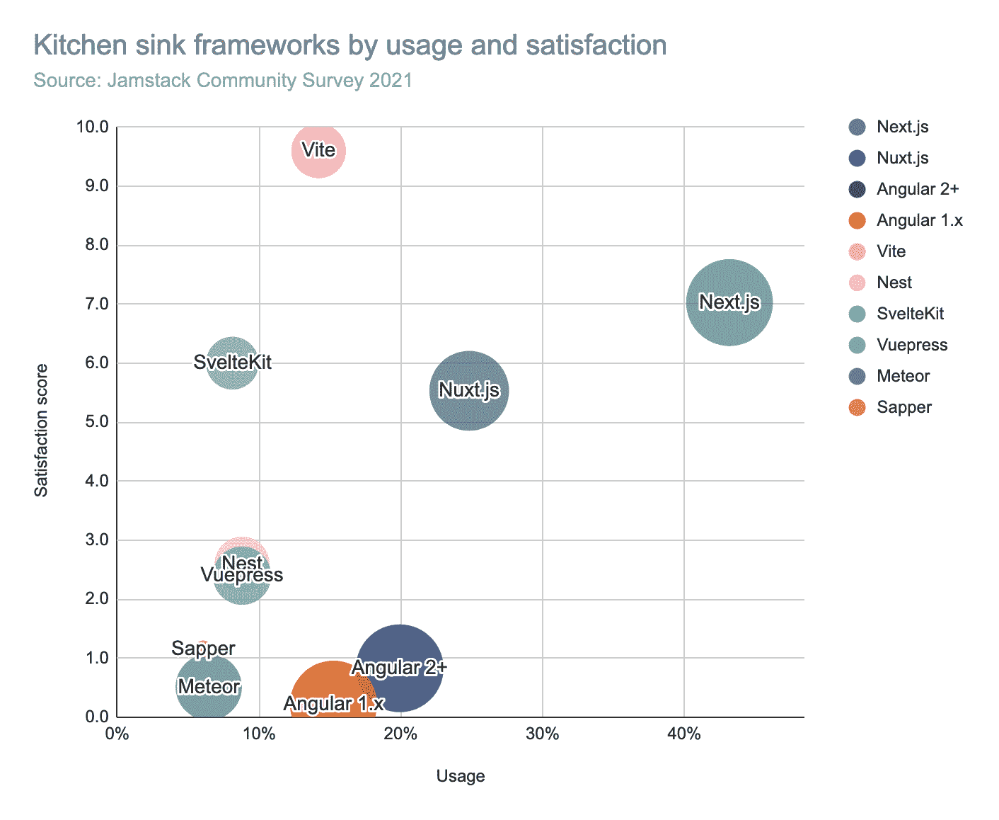

# 对 2022 年 Jamstack 的预测

> 原文：<https://thenewstack.io/predictions-for-the-jamstack-in-2022/>

 [劳里·沃斯

劳里是 Netlify 的一名数据分析师，该公司创建了 Jamstack 架构。自 1996 年以来，他一直是一名网站开发人员，偶尔会停下来创建 awe.sm (2010 年)和 npm Inc (2014 年)等公司。他热爱网络，想把它变得更大更好。](https://www.linkedin.com/in/seldo/) 

我已经做了 25 年的网站了，在这段时间里，网络行业都有一句老话:“这还是太难了。”网站越好，每个人对它们的期望就越高。这为简化和加速我们的工作带来了持续的压力，反过来又推动了 API、工具和框架的无尽创新。同样的压力产生了 Jamstack，一种将改进的性能与操作简单性结合起来的架构。

今年早些时候，Netlify 进行了第二次年度 Jamstack 社区调查，并于 10 月份发布了全部结果。虽然这些很好地总结了开发人员社区当前对 Jamstack 的想法，但它们也向我们展示了 2022 年 Jamstack 开发的前景。以下是我的预测。

**1。如果您还没有使用 Figma，您可能要开始使用了。**

超过 60%的开发者说他们在建筑网站的设计阶段使用 Figma。Figma 的满意度也很高，这是说“我想多用这个”的人与说“我想少用这个”的人的比率。因为 Figma 的满意度得分很高，所以您可以期待在新的一年看到更多的增长。

**2。Strapi 和 Sanity 的使用将会大幅增长。**

在我们对[内容管理系统](https://jamstack.org/survey/2021/#choices-cms)的观察中，有两个突出的:Strapi 和 Sanity。从 2020 年到 2021 年，两者都显示出强劲的使用增长，并且两者都有很高的满意度得分，表明未来将进一步增长。一般来说，无头内容管理系统比 WordPress 和 Drupal 等经典内容管理系统增长更快，这两个系统都将在 2021 年失去用户。

【T2

**3。TypeScript 将从 JavaScript 中窃取开发人员的注意力。**

这些年来，TypeScript 的受欢迎程度一直在稳步增长，而普通 JavaScript 的受欢迎程度却在下降。60%的开发者说他们在 2021 年使用 TypeScript ，这比 2020 年上升了 14 个百分点。另外，TypeScript 的满意度高达 7.6 分。

一些满意度高的小语种也有可能在 2022 年开始使用:我从这些数据中挑选的是 Rust and Go。

**4。无服务器功能成为主流。**

我们没有问 2020 年的无服务器功能，但是令人吃惊的是，46%的开发者报告说他们在过去的一年中至少在他们的一些项目中使用了无服务器功能。这使得无服务器功能成为稳固的主流技术，与容器和微服务齐名。凭借其巨大的满意度得分，开发人员似乎对使用无服务器功能的结果感到高兴，我预计他们将在 2022 年超过 50%的使用率。

**5。组件库:React 将保持第一，但更多的人会关注 Svelte。**

有如此多的 [web 框架选项](https://jamstack.org/survey/2021/#choices-frameworks)——它们的用途如此不同——我们把它们分成三组。第一个是组件库:这三个都有很高的满意度和可靠的使用。React 仍然是最受欢迎的，我预计它将在 2022 年保持这一水平——然而，我预计 Svelte 将看到最大的增长。

**6。静态网站发电机:2022，11 年？**

我们的第二类 web 框架是静态站点生成器(SSG)。这里的类别领导者是 Gatsby.js，但我对 2022 年的预测是从 11ty 的一大飞跃，11ty 自 2020 年以来增长迅速，也有令人钦佩的满意度得分。

**7。厨房水槽框架:Next.js 将站稳脚跟；Vite 将很快获得。**

针对全功能 web 应用的“厨房水槽”框架是一个拥挤的类别。最受欢迎的选择 Next.js 与 React 紧密结合。我预计 React 的受欢迎程度会持续下去，Next.js 也会继续下去。Next.js 在 2021 年出现了使用增长，并且仍然有着惊人的 7.0 满意度评分。

唯一一个满意度超过 Next.js 的框架是 Vite，我认为它将在 2022 年表现强劲。如果你还没有玩过它，今年可能是检验它的一年——特别是因为它可以很好地与所有主要的组件库一起使用，包括 React、Vue 和 Svelte。

## 总体预测

除了这些具体的预测，我的总体看法是，对于 Jamstack 开发人员来说，这将是又一个伟大的一年。这种架构模式已经席卷了 web 开发世界，并很快成为新开发人员学习如何构建网站的默认方式，正如 2021 年大量学生涌入 Jamstack 开发人员群体所示。我很高兴地看到 Netlify 观察到的许多趋势在其他行业调查中得到了呼应，比如去年 JS 的[状态](https://2020.stateofjs.com/en-US/)和 GitHub 最近的[octo verse 的](https://octoverse.github.com/)状态报告。我很高兴看到 2022 给 Jamstack 带来了什么新的技巧和工具，希望你也是。

<svg xmlns:xlink="http://www.w3.org/1999/xlink" viewBox="0 0 68 31" version="1.1"><title>Group</title> <desc>Created with Sketch.</desc></svg>