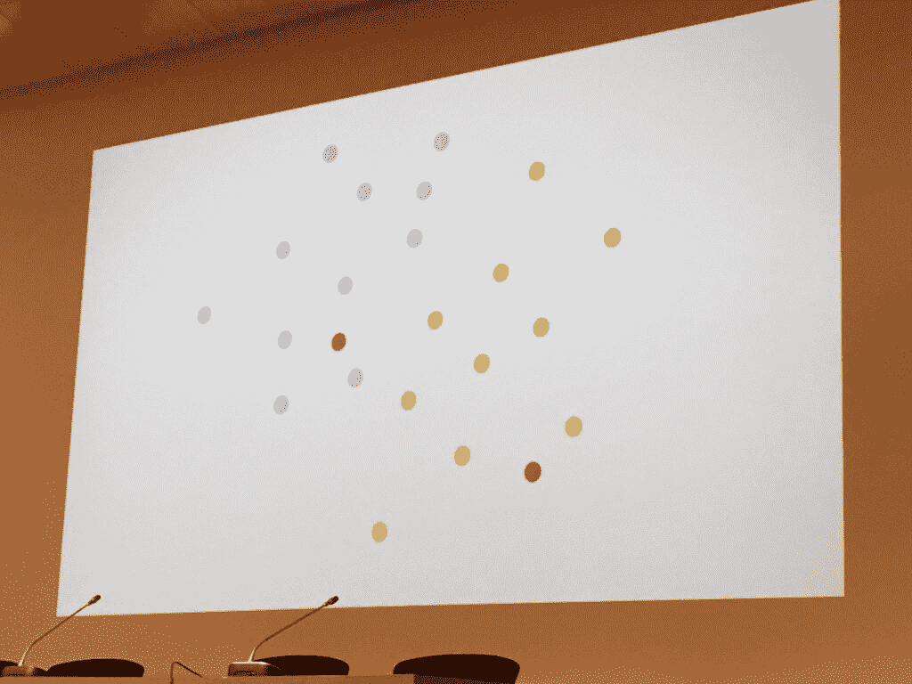
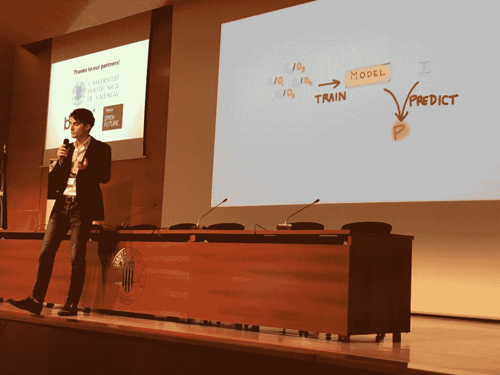
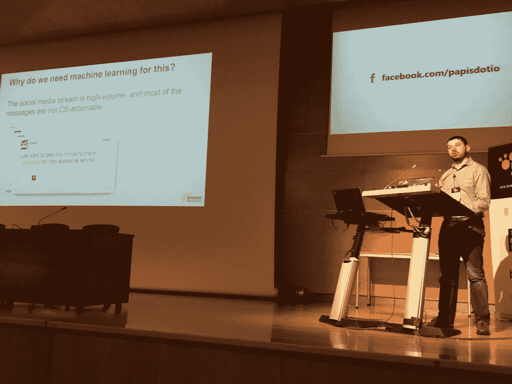
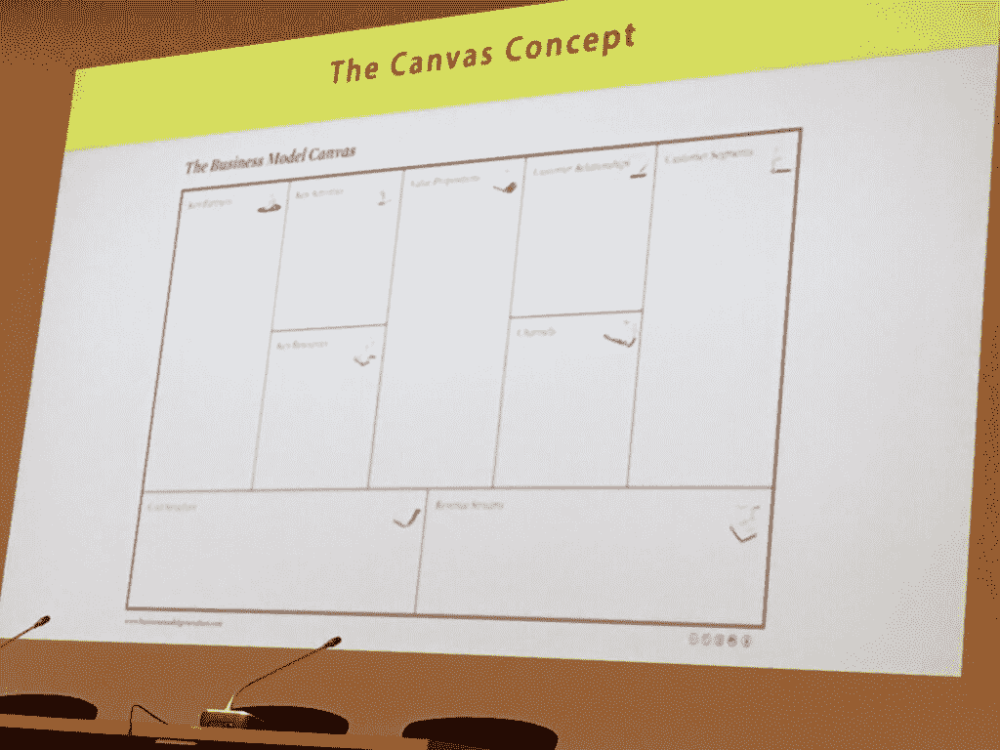

# 预测分析如何改善决策

> 原文：<https://thenewstack.io/predictive-analytics-can-improve-decision-making/>

当然，如果你是一个算牌的扑克明星，你会是预测分析的忠实粉丝，但除此之外，[预测分析](https://thenewstack.io/predictive-apis-driving-machine-learning/)通常不会影响你的日常决策，不是吗？然而，由[机器学习](https://thenewstack.io/whats-store-machine-learning-2016/)、[人工智能](https://thenewstack.io/fuzzy-io-aims-democratize-artificial-intelligence-developers/)和越来越多的[深度学习](https://thenewstack.io/deep-learning-algorithm-helps-driverless-cars-recognize-pedestrians-better/)驱动的预测分析可能每天都在接触你。

从客户服务到社交媒体，再到金融科技，再到你的收件箱，预测分析越来越多地推动你所看到的内容和你看到它的时间。事实上，零售预测应用提供商 Lars Trieloff 的产品管理总监估计，超过一半的应用都有预测组件。

在西班牙瓦伦西亚举行的 2016 国际预测 API 和应用会议(PAPI)上，我们发现了这项超凡技术的一些现实应用，从科幻和学术领域到董事会会议室。

## 人工智能和预测分析

“如果你没有例子，你就没有机器学习，”PAPIs chair 和机器学习博士说 [Louis Dorard](http://www.louisdorard.com/#home) 。"预测分析是关于描述、预测、说明以及最终自动化决策."

多拉德举了一个例子:看看下面这张由蓝色和黄色圆点组成的简单地图。如果您添加另外两个未知颜色的点，根据它们在分组中的位置(基于其他蓝色和黄色点的历史数据)，您可以根据您在数据中绘制的不可见边界的哪一侧猜测哪个应该是蓝色的，哪个应该是黄色的。

你可以通过满足预测分析的三个需求来做出这些预测:

1.  输入和输出的例子。
2.  足够数量的投入和产出。
3.  相似输入导致不相似输出时的修正。

你也可以应用这种点逻辑来简化更复杂的情况，从确定一封电子邮件是垃圾邮件还是垃圾邮件，到一辆自动驾驶汽车在极端情况下决定撞上谁。

预测分析是基于对某些输入进行归纳和输出。让我们继续浏览一些预测分析示例，了解这些输入如何带来影响您底线的输出。

## 客户服务和客户流失检测

几乎每个企业都必须担心获得和留住新客户，这是预测分析最引人注目的使用案例之一。 T 通过结合客户数据和收入，企业可以更好地获得销售线索，也可以更好地为客户服务。产品和价格的输入可以用来进行更明智的销售，而客户数据和产品的输入可以带来更好的价格。

但是，预测分析最有助于客户流失分析的地方是根据当前和以前的客户确定客户流失指标。多拉德解释了应用于客户流失的不同层次的分析:

1.  描述性分析:了解随时间变化的流失率。
2.  预测分析:知道谁是下一个流失对象。
3.  规定性分析:决定你应该对每个将要离开的顾客做些什么。

通过说明性分析，你开始应用策略来减少客户流失的可能性，比如让客户转向不同的计划，或者为他们提供更多关于如何使用你的产品或服务的培训。

然而，你必须将以下变量纳入你的机器学习结果:

*   客户演示和背景。
*   流失预测和行动预测
*   预测的不确定性(或不准确性的百分比)
*   客户带来的收入和行动成本
*   频率的约束

从这里开始，你应该能够找到正确的准确性和可预测性水平，以确保  你得到了想要的结果，而不会错过客户或对错误的客户应用错误的减少流失策略。多拉德说，如果做得好，它还可以让你根据财务因素，优先考虑先向谁求爱。

## 过滤社交媒体上的杂音

社交媒体中有无数的预测分析用例，但现在让我们继续关注客户服务。亚马逊的[亚历克斯·英格曼](https://twitter.com/alex_ingerman)也在瓦伦西亚的 PAPIs 大会上讲述了他使用[亚马逊机器学习公共 API](https://aws.amazon.com/machine-learning/) 的经历，将其应用于预测性客户服务，特别是通过 Twitter API 找到重要的社交媒体对话。

为什么听 Twitter 对 [@awscloud](https://twitter.com/awscloud) 及其 50 多万粉丝很重要？英格曼解释道:

*   客户可能报告了一个可能的服务问题。
*   一位客户正在提出功能请求——inger man 说，亚马逊网络服务产品路线图的 90%是由客户驱动的。
*   顾客生气或不高兴。
*   顾客问了一个非常具体的问题。

那么，他们为什么需要使用机器学习来实现自动化呢？“社交媒体流是高容量的，大多数消息——超过 80%到 90%的@awscloud 句柄——都不是客户服务可操作的。”英格曼说。大部分都没用，因为那是因为它们:

*   笑话
*   自我宣传
*   一次公开谈话
*   谢谢你的

这就是为什么亚马逊建立了一个端到端的应用程序来过滤重要的客户服务呼叫，并将它们从社交媒体团队重新路由到适当的支持部门。

以下是亚马逊使用亚马逊平台过滤掉这些对话的步骤。注意，虽然亚马逊经历了这一过程，并在 Github 上公开了完整的代码样本 [，但英格曼表示，这并不完全是亚马逊过滤社交媒体的方式——他不能透露具体细节——但它仍然是如何通过预测分析和机器学习解决商业问题的一个很好的例子。](https://github.com/awslabs/machine-learning-samples/tree/master/social-media)

1.  **阐述商业问题。**立即找到提到@awscloud 的新推文，摄取并分析每条推文，以预测 CS 代理是否应该对此采取行动
2.  **建立数据流。** 
3.  **挑选机器学习策略。**
4.  **获取数据。**检索过去的推文，他说这些数据很容易获得，结构良好且干净。
5.  **标注数据。**他们标记了过去的推文，并发现了连接数据点和标签的模式。英格曼建议你首先尝试手工贴标。“最初的几打很有趣。一旦超过 100 左右，这就成了一个真正的问题，”他说。亚马逊为人类智能提供了一个[市场](http://docs.aws.amazon.com/AWSMechTurk/latest/AWSMechanicalTurkRequester/Welcome.html),所以你可以外包这个乏味的机器学习步骤。
6.  **让机器学习模型与业务需求保持一致。**具体来说，要注意标记为“可操作”但实际上可能会浪费少量客户支持时间的误报，更重要的是，要注意标记为“不可操作”但可能会让您失去客户的误报。在这种情况下，他们设置了一个模型必须“确定”的阈值，以较少的假阴性为代价接受更多的假阳性。

英格曼说，同样的策略可以应用于脸书、电子邮件、客户评论甚至扫描传真。下面显示的预测分析流程中唯一改变的部分是模型。

未来，一家公司会尝试将这些预测与自动结果联系起来，就像一个知识库，可以在推特上发布对常见问题的回答。

## 但是人类在这一切中扮演什么角色呢？

这还不叫机器自主学习——至少现在还不是！这是因为预测分析需要成为商业战略的一部分。甚至在开始实现任何东西之前，尝试使用一个 [**机器学习画布**](https://github.com/louisdorard/machinelearningcanvas) 来确保你针对正确的问题，使用正确的技术，并确保不同背景的团队成员不会相互误解。

最后，多拉德提醒我们:“垃圾进来，垃圾出去。”模型的好坏取决于输入其中的数据，所以，不管有多少基于机器的自动化正在发生，你都需要几个人来检查一切是否正常。

毕竟，正如机器学习软件提供商[萨塔利亚](https://www.satalia.com/)的创始人[丹尼尔·休姆](https://www.linkedin.com/in/danielhulme)所指出的，如果你只是简单地让一台电脑照射癌症，最简单的解决办法就是消灭人类。深度学习的下一步将是区分可接受和可取行为的伦理验证。

通过 Pixabay 的特征图像。

<svg xmlns:xlink="http://www.w3.org/1999/xlink" viewBox="0 0 68 31" version="1.1"><title>Group</title> <desc>Created with Sketch.</desc></svg>