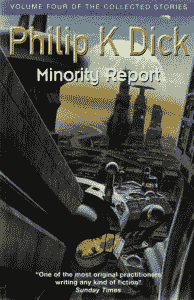

# 预测性警务是真实的；只是不太有效

> 原文：<https://thenewstack.io/predictive-policing-real-just-not-effective/>

预测性警务能否防患于未然？这听起来像是科幻小说中的一个想法——具体来说，是出自菲利普·K·蒂克 1956 年的短篇小说《[少数派报告](http://www.philipkdickfans.com/mirror/websites/pkdweb/short_stories/The%20Minority%20Report.htm) *，*》，讲述了一个“预防犯罪部门”在任何犯罪发生之前逮捕嫌疑人的故事。

科技能让这个梦想成真吗？据《科学》杂志上个月末的一篇文章[报道，预测性警务已经被全美 60 个不同的警察部门使用，该文章称，从脸书档案、轻微犯罪的统计数据到 911 电话的信息，一切都被输入到算法中。](http://www.sciencemag.org/news/2016/09/can-predictive-policing-prevent-crime-it-happens)

“它让我们变得更聪明。亚特兰大警察局局长乔治·特纳在[PredPol](https://youtu.be/Pv9MtIaX4cQ) 主页上自豪地展示的一段视频中说:“这让我们站在了这个国家正在发生的事情的最前沿。”pred pol 是一家生产预测警务软件的公司。

但有一件事连菲利普·k·迪克都没有预料到:预测性警务并没有真正发挥作用。至少目前还没有。

《科学》的文章描述了匹兹堡的两名年轻警察得到了[射击观察员](https://twitter.com/shotspotter)的帮助，“这是一个传感器网络，可以检测枪声，并将信息传递给安装在前座之间的笔记本电脑。”ShotSpotter 本身并不是预测性警务，但该系统很快将升级为“犯罪扫描”地图，显示“犯罪可能发生的地方”，这是基于卡内基梅隆大学科学家 [Wil Gorr](http://www.heinz.cmu.edu/faculty-and-research/faculty-profiles/faculty-details/index.aspx?faculty_id=40) 和 [Daniel Neill](https://www.cs.cmu.edu/~neill/) 开发的算法。

预测性警务仍然是全世界研究的热门目标。例如，上个月，卡迪夫大学[社会数据科学实验室](http://socialdatalab.net/)的威尔士研究人员从美国司法部获得了 80 万美元的资助，用于为洛杉矶开发一个预测性的警务模型——特别是针对仇恨犯罪。

TechWeek Europe 报道说:“在未来三年里，研究人员团队将涌入推特数据，并将其与洛杉矶地区报告的仇恨犯罪进行交叉引用，以发现有利于创建标记或签名的趋势，这些标记或签名可以识别潜在的仇恨犯罪是否会在何时何地发生，从而使执法部门能够先发制人地进行干预。”

对警察部门来说，这是一个有吸引力的提议。“我不会得到更多的钱，”洛杉矶警察局长查理·贝克在 PredPol 网站上说。“我不会去找更多的警察。我必须更好地利用我所拥有的，这就是预测性警务的意义所在……”

只有一个问题。不清楚它是否真的有效。

芝加哥尝试了一个项目来降低该市的高谋杀率，其崇高目标是拯救生命，并为预测性警务开辟一条新的道路。芝加哥警察局的技术负责人告诉《科学》杂志，因为犯罪分散在整个城市，所以集中在特定地区没有帮助。因此，该市使用了 200 万美元的拨款来测试一种新的算法，该算法可以在枪击事件发生前识别出谁最有可能卷入其中。“希望这份名单可以让警察为处于危险中的人提供社会服务，同时也防止可能的枪手拿起枪，”[The Verge](http://www.theverge.com/2016/8/19/12552384/chicago-heat-list-tool-failed-rand-test)报道。

但是来自[兰德公司](http://www.rand.org/)的一份详细报告得出结论[零条生命被挽救](https://link.springer.com/article/10.1007/s11292-016-9272-0?wt_mc=Affiliate.CommissionJunction.3.EPR1089.DeepLink)——并且总体来说 426 名可能的枪手名单甚至没有按计划使用。“对于如何处理‘战略嫌疑人名单’上的个人，没有切实可行的指导方针，行政或管理部门很少关注试点项目，对地区指挥官也很少或根本没有跟进，”报告总结道。它的一位作者向 The Verge 指出，芝加哥警察局有 11 个不同的反暴力项目在进行中，而可能的枪手名单“只是丢失了。”但是它确实指出了这个项目的一个结果。名单上的人更有可能被逮捕，促使 The Verge 得出结论，这“实际上是一种事后寻找嫌疑人的方法”。

这是对预测性警务的最大担忧之一。据《科学》杂志报道，一些团体认为这只是“通过掩盖科学赋予的合法性”来隐藏种族偏见人权数据分析小组的一名分析师、密歇根州立大学的一名博士生说，如果刑事司法系统中存在偏见，这种偏见就会体现在最终输入算法的统计数据中。“他们不是在预测未来。他们实际上预测的是下一次警方记录的观察将会发生在哪里。”

电子前沿基金会也指出了这个项目的另一个问题。“我们从过去的例子中知道，当警察预计会发生暴力时，他们通常会以暴力回应。”

但更大的问题是，预测性监管本身可能不起作用。《科学》杂志采访了兰德研究的作者，他抱怨说，要预测具体的犯罪，“我们需要将预测的精确度提高 1000 倍。”相反，从目前的情况来看，他们的报告得出结论说，“预测能力的增加往往显示收益递减。”

它可能是大数据的圣杯。尽管美国司法部的研究分支机构美国国家司法研究所(u . s .[National Institute of Justice](http://www.nij.gov/Pages/welcome.aspx))几十年来一直在研究犯罪数据，“直到最近，计算能力和存储的限制使他们无法使用大型数据集。”

《科学》杂志采访了加州大学洛杉矶分校的人类学家 P. [Jeffrey Brantingham](http://www.anthro.ucla.edu/faculty/p-jeffrey-brantingham) ，他指出，当警察部门更好的数据收集使预测犯罪的能力“成为现实可能性，而不仅仅是理论上的新奇事物”时，事情在 2006 年开始发生变化布兰廷汉姆与博士后学者乔治·莫勒(George Mohler)一起开发了“pred pol”——一个专有软件包，其中有一个算法可以预测警官下一次值班期间会发生什么。

但是这是问题的一部分，[人权数据分析小组](https://hrdag.org/)的一位分析师认为——它也面临着封闭源码软件所面临的限制。“出于透明度和政策制定者的考虑，我们需要对正在发生的事情有一些了解，以便能够得到外部团体的证实。”

人们对这些项目还是很有信心的。芝加哥警察局认为兰德的分析来得太早，他们的计划“自那以后有了很大的发展”，现在已经完全融入了该部门的管理问责流程。虽然 RAND 专注于该程序的第 1 版，但他们现在使用的是第 5 版，“这是一个显著的改进。”

但科学最终得出结论，当谈到预测性警务的力量时，“证据不足，为数不多的数据点也不令人鼓舞。”然而，他们也承认很难进行全面的测试或建立一个控制组。匹兹堡警察局长指出:“警察局长的平均任期为 3 年。”。“我没有时间控制。”

2012 年在路易斯安那州的什里夫波特资助了一项这样的研究，发现目标地区和“控制区”之间几乎没有区别。但进一步的分析显示，最初几个月之后，人们对该软件的热情逐渐消退，这可能会扭曲调查结果。

从数据中似乎可以得出另一个教训:在现实世界中，警察和社区之间的良好关系是无可替代的。哥伦比亚特区大学的一名预测警务专家(兼法学教授)向 The Verge 抱怨称，他们复杂的算法只是一个起点。匹兹堡的警察局长同意批评者的说法，即充其量，数据需要成为结合社会服务项目等其他方法的解决方案的一部分。“谁会利用足够的数据变得真正优秀，并拥有足够强大的关系？这是这个国家的警察现在面临的挑战。”

在苏格兰，警察现在被鼓励多发推特，只是为了与社区建立更好的联系。“真正有所作为的是给人们机会与警察进行双向对话，讨论对他们来说重要的事情，”副警察局长戈登·斯考比说。

兰德研究的作者指出，也许这不是大数据能够解决的问题。毕竟，当输入数据中隐藏着复杂(和非线性)的关系时，大数据是有用的。但不幸的是，犯罪“要简单得多——风险越大，犯罪就越多。

“没有真正复杂的关系在进行。”

<svg xmlns:xlink="http://www.w3.org/1999/xlink" viewBox="0 0 68 31" version="1.1"><title>Group</title> <desc>Created with Sketch.</desc></svg>