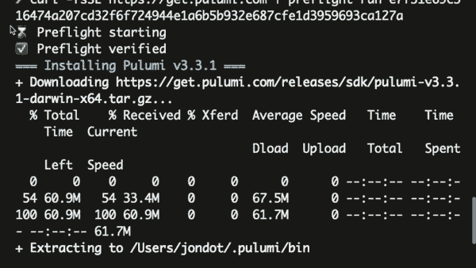

# 预检通过单行代码防御供应链攻击

> 原文：<https://thenewstack.io/preflight-defends-against-supply-chain-attacks-with-single-line-of-code/>

自诩为“开发者至上”的网络安全公司 Spectral 发布了 [Preflight](https://github.com/SpectralOps/preflight) ，这是一款帮助防止供应链攻击的开源工具。虽然这些攻击可以采取不同的形式，例如广为人知的[太阳风攻击](https://thenewstack.io/solarwinds-the-worlds-biggest-security-failure-and-open-sources-better-answer/)，但它们大致可以归类为通过有权访问目标系统和数据的第三方获得访问权限的攻击。

对于预检，今年早些时候的 Codecov 事件就是一个例子，Codecov 使用的一个工具被秘密替换，修改了代码的一个关键部分，然后改变了信息的报告目的地。直到一名有安全意识的用户检查了该工具 Github 版本的安全哈希算法 1 (SHA-1)校验和，并将其与他们从 Codecov 下载的校验和进行比较，发现两者不同，这一漏洞才被发现。

Spectral 的首席执行官兼联合创始人 Dotan Nahum 将 Codecov 的情况比作一个家庭厨师，他盲目地一遍又一遍地遵循相同的食谱，从来没有注意过任何成分，直到有一次他们加入了有害的东西，而从未意识到这一点。

“如果你已经按照这个食谱做了很长时间，有人改变了它，你不知道更好，你只是继续做另一个煎饼，那么显然你会以一些非常糟糕的事情结束。从本质上讲，Codecov 就是这样，”纳胡姆说。“现在每个人都在网上这么做，这是一种不好的做法。这实际上是一种不好的做法，但却被误认为是一种好的做法。事实上，这种痛苦潜伏了很长时间，现在我想每个人都意识到我们需要改变这种状况。”

根据 Nahum 的说法，Codecov 的回应是不充分的，因为该公司建议用户采取两项预防措施。“他们基本上是说，在你将来运行我们的脚本之前，先观察它，确保它是好的，然后验证它。现在，这两条指令是超级非晶的，对吧？验证一下是什么意思？如果我是一个没有安全感的开发人员，我只想把事情做好。我不知道验证是什么意思。”

他说，创建预检是为了介入并处理这部分流程，确保这种类型的黑客攻击不可能继续进行。预检可以插入到持续集成(CI)过程中，通过执行校验和来自动验证第三方可执行文件，以确保该应用程序确实是他们想要运行的应用程序，而不是其他应用程序。此外，Preflight 与反恶意软件网站合作，以确保即使它是正确的应用程序，它也不包含恶意软件。

与此同时，Nahum 承认，建议下载第三方工具以确保第三方工具不是安全漏洞的来源，这有点令人费解。

“这里有点先有鸡还是先有蛋，因为，如果你仔细想想，你会得到一个验证来验证第三方。你对不同的验证工具本身有什么保证？你也需要核实一下。这有点自相矛盾，”纳胡姆说。“我们解决这个矛盾的方法是，听着，这是开源的，你可以自己编译。在你编译它之后，把它放在你的 Artifactory 或者你的二进制存储器中，这样你就可以确保信任链没有被破坏。信任链总是从你开始。这是您可以绝对肯定整个链是可信的唯一方法。”

在创建 Preflight 的过程中，Nahum 说他们确保了项目的简单，这样它就可以被“一个没有领域知识的普通开发人员”审查，这也是他们选择 Go 编程语言的部分原因。他们还通过确保预检没有任何网络依赖性来确保预检本身的安全。

“这是一种基础设施语言，”纳胡姆说。“人们的眼睛被训练来检查 Go 源代码的安全性。我们将所有这些都考虑在内，并选择了实际上与生态系统相关的语言，在本例中，是云原生语言。因此，任何对[云本地计算基金会](https://cncf.io/?utm_content=inline-mention)项目进行审查的笔式测试人员，都是用 Go 编写的，一切都一目了然。”

鉴于预检在软件开发生命周期中的位置是在创建二进制文件时接近尾声，Nahum 说，他预计将预检与其他安全信息和事件管理(SIEM)工具集成是有潜力的。他说，例如，如果许多 CI 构建同时失败，这可能意味着攻击即将来临，这种信息可以用来警告最终用户。

<svg xmlns:xlink="http://www.w3.org/1999/xlink" viewBox="0 0 68 31" version="1.1"><title>Group</title> <desc>Created with Sketch.</desc></svg>