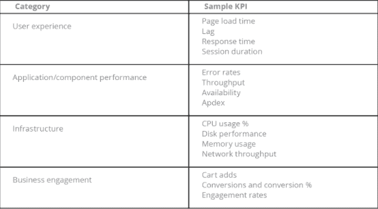

# 准备采用云:10 步云迁移清单

> 原文：<https://thenewstack.io/prepare-to-adopt-the-cloud-a-10-step-cloud-migration-checklist/>

参与云计算已经十多年了，我听说许多 IT 高管正在努力将关键的企业应用程序迁移到公共云。在几个案例中，他们的团队在云迁移方面举步维艰或者只取得了有限的成功。但他们从未放弃，并在随后的尝试中利用他们学到的经验来提高成绩。如果您的组织希望实现任务关键型应用程序的现代化，并且您计划将云迁移作为这一过程的一部分，那么您不希望重复他人的错误。

因此，这篇文章利用这些知识构建了一个 10 步清单，列出了您需要考虑和解决的主要领域，以最大限度地提高成功云迁移的机会。

## 步骤 1:建立迁移架构师角色

 [凯文·唐斯

作为 New Relic 的解决方案战略总监，Kevin 对 IT Opps、云行业有着深刻的了解，并与客户和合作伙伴一起努力，帮助他们实现云采用之旅。他在企业软件行业已经工作了 20 多年，并且作为面向客户的解决方案架构师已经工作了 12 年，向所有垂直行业销售企业软件解决方案。](https://www.linkedin.com/in/kevin-downs) 

在开始云迁移之前，建立迁移架构师角色来领导这项工作。迁移架构师是系统架构师级别的职位，负责规划和完成迁移的所有方面。他们的核心职责应该包括定义成功迁移所需的必要重构、设计数据迁移策略、定义云解决方案需求，以及确定迁移优先级和生产切换机制。

在大型迁移项目的过程中，必须做出许多决策和技术计划，拥有一个负责迁移所有方面的迁移架构师对于项目的成功至关重要。

## 步骤 2:选择您的云集成级别

当您将应用程序从内部数据中心迁移到云时，有两种方法可以迁移您的应用程序—浅层云集成或深层云集成。

对于浅层云集成(有时称为“提升和转移”)，您将内部部署的应用程序移动到云中，并且不更改(或有限更改)您为了运行应用程序而在云中实例化的服务器。任何应用程序更改都足以让它在新环境中运行。你不用云独有的服务。这种模式也被称为“提升和转移”,因为应用程序“按原样”提升，并原封不动地移动或转移到云中。

对于深度云集成，您可以在迁移过程中修改应用程序，以利用关键的云功能。这可能并不比使用自动伸缩和动态负载平衡更高级，或者它可能与使用无服务器计算能力一样复杂，例如针对应用程序的部分使用 [AWS Lambda](https://aws.amazon.com/lambda/) 。它还可能涉及使用特定于云的数据存储，如[亚马逊 S3](https://aws.amazon.com/s3/) 或 [DynamoDB](https://aws.amazon.com/dynamodb/) 。

## 第三步:选择单一云或多云

在您开始云迁移之前，请解决这个问题:您是希望选择一个云提供商并迁移您的应用程序，以便它针对该单一环境进行优化运行，还是希望您的应用程序在多个云提供商上运行？

优化您的应用程序以与特定的云提供商合作相对简单。您的开发团队只需要学习一套云 API，您的应用可以利用您选择的云提供商提供的一切。

这种方法的缺点是供应商锁定。一旦您更新了您的应用程序，使其只与一个提供商合作，那么将您的应用程序迁移到另一个提供商可能需要与最初的云迁移一样多的工作。此外，拥有单一云提供商可能会对您与云提供商协商重要条款(如定价和 SLA)的能力产生负面影响。

但是等等，事情变得更复杂了。使用多个云提供商有几种不同的模式:

**一云一应用；不同云中的另一个应用程序。**也许最简单的多云方法是在一个云提供商上运行一组应用程序，在另一个云提供商上运行另一组应用程序。这种方法增加了您与多个提供商的业务杠杆，以及将来在何处放置应用程序的灵活性。它还允许您为运行应用程序的提供者优化每个应用程序。

**将您的应用拆分到多个云提供商。**一些公司选择在一家云提供商处运行应用程序的部分内容，而在另一家云提供商处运行应用程序的其他部分。这种方法允许您利用每个提供商提供的关键优势(例如，一个提供商可能有更好的 AI 能力，而另一个提供商可能以其数据库速度而闻名)。这里的风险是，您的应用程序依赖于两个提供商的性能，任何一个提供商的任何问题都可能影响您的应用程序的客户体验。

构建与云无关的应用。其他公司开发的应用可以在任何云提供商上运行。使用这种方法，您可以在多个提供者上同时运行您的应用程序，或者在它们之间分配您的应用程序负载。这种模式为您在供应商谈判中提供了极大的灵活性，因为您可以轻松地将负载从一个云提供商转移到另一个云提供商。缺点是您可能会发现很难使用每个云提供商的关键功能，从而降低了在云中托管应用程序的好处。

## 步骤 4:建立云 KPI

关键性能指标(KPI)是您收集的关于您的应用程序或服务的度量标准，用于衡量它的性能是否符合您的预期。云迁移的最佳 KPI 显示了您正在进行的迁移是如何进行的，揭示了您的应用程序中可能隐藏的可见或不可见的问题。也许最重要的是，云迁移 KPI 可以帮助您确定迁移何时完成和成功。

云迁移 KPI 有几个主要类别:

对于每个类别，确定哪些指标对您的业务最重要，哪些指标将受到云迁移的最大影响。

## 步骤 5:建立性能基线

基线是测量应用程序或服务的当前(迁移前)性能的过程，以确定其未来(迁移后)性能是否可接受。基准可帮助您确定迁移何时完成，并验证您预期的迁移后性能提升。您还可以在云迁移期间参考基准来诊断出现的任何问题。

为您决定衡量的每个 KPI 设置基线指标。确定收集数据的时间，以确定基线。选择一个短的基线周期(比如一天)可以让您移动得更快，但是您可能无法收集到有代表性的性能样本。选择一个更长的时间段作为基线(比如一个月)显然需要更多的时间，但是可以提供更有代表性的数据。

您还需要确定是否希望只收集平均的或代表性的基线数据，或者是否希望包括在“高峰”或“关键”时期收集的数据。无论哪种数据收集模式适合您的行业，一定要清楚地定义您要收集的数据类型和时间段。

## 步骤 6:确定迁移组件的优先级

您还必须决定是一次性迁移整个应用程序，还是逐个组件或逐个服务地迁移到云组件。

首先，确定您的服务之间的连接，以及哪些服务依赖于哪些其他服务。使用依赖关系图来决定应该迁移哪些组件以及迁移的顺序。从依赖最少的服务开始通常是有意义的。在这种情况下，您将首先迁移最内部的服务，然后再迁移最外部的服务——通常是离您的客户最近的服务。另一种方法是从最接近客户的服务(最外部的服务)开始，这样您就可以控制对客户的任何影响。

## 步骤 7:执行任何必要的重构

在迁移应用程序和服务之前，您可能希望对它们进行其他工作，以便它们尽可能高效地在云中工作。例如，您可能想要重构您的应用程序:

*   因此，它可以有效地处理可变数量的运行实例，从而实现动态扩展，潜在地节省您的云服务成本。
*   以便您的资源利用率可以更好地利用动态云功能，例如根据需要动态分配和取消分配资源的能力，而不是提前静态分配资源。

在迁移之前迁移到更加面向服务的架构，这样您可以更轻松地将单个服务迁移到云中。

## 步骤 8:创建数据迁移计划

迁移数据是云迁移中最棘手的部分之一。数据的位置会显著影响应用程序的性能。当数据访问方法仍然主要在本地时，将数据移动到云中会显著影响性能。如果数据仍在本地，但访问数据的服务驻留在云中，情况也是如此。

数据迁移的选项包括:

*   在内部和云数据库之间使用双向同步机制。一旦您将数据的所有消费者都转移到了云中，就要删除本地数据库。
*   使用与基于云的数据库单向同步的本地数据库，并允许消费者仅连接到本地版本。准备就绪后，禁用对本地版本的访问，这样基于云的版本就成为主数据库，并允许基于云的用户访问新数据库。
*   使用云数据迁移服务，比如那些可以从[亚马逊网络服务](https://aws.amazon.com/cloud-data-migration/)获得的服务。

## 步骤 9:转换生产

您何时以及如何将生产系统从传统的内部解决方案切换到新的云版本？答案取决于应用程序的复杂性和架构，尤其是数据和数据存储库的架构。

有两种常见的方法:

*   一次做完。等到您将整个应用程序或服务迁移到云中并验证它可以在那里工作，然后将流量从内部堆栈切换到云堆栈。
*   一次做一点点。转移几个客户过来，测试一下东西还能用，然后再转移几个客户。继续这一过程，直到您将所有客户都转移到基于云的应用程序。

## 步骤 10:检查应用程序资源分配

即使您已经将所有东西都迁移到了云中，还有一些事情需要考虑。最重要的是资源优化。云针对动态资源分配进行了优化，当您静态分配资源(例如服务器)时，您没有利用云的优势。当您迁移到云时，确保您的团队有一个为您的应用程序分配资源的计划。当您需要为云中的应用程序分配额外的资源时，供应商通常可以随时提供几乎任何数量的资源。

该清单中的 10 个步骤涵盖了很多方面，但在云迁移过程中，您肯定还需要考虑其他一些事情。例如，创建安全可靠的云环境显然是任何云迁移的关键部分。幸运的是，主要的云提供商提供了大量的工具和资源来帮助您构建和维护一个安全的系统。

通过 Pixabay 的特征图像。

<svg xmlns:xlink="http://www.w3.org/1999/xlink" viewBox="0 0 68 31" version="1.1"><title>Group</title> <desc>Created with Sketch.</desc></svg>