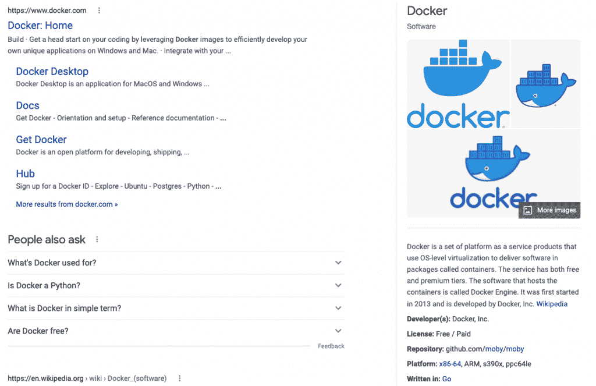

# Presearch 推出分散式 Web3 搜索引擎

> 原文：<https://thenewstack.io/presearch-launches-decentralized-web3-search-engine/>

去中心化仍然是促使相当一部分公司认同 Web3 技术的最大因素之一。虽然脸书、推特和其他社交媒体网站因其集中化而备受关注，但我不知道还有什么比搜索更集中化的了，在搜索领域，谷歌保持着 92%的市场份额。像 DuckDuckGo 这样的一些新贵已经开拓了利基市场，但没有一家公司能够削弱谷歌的主导市场地位。

[Presearch](https://presearch.io/about) 正寻求用一种去中心化的方法来改变这种情况，以建立一个更好的[搜索引擎](https://presearch.com/)。该公司最初是由[科林·佩普](https://twitter.com/colinpape?lang=en)在 2017 年创立的，以应对他在之前的初创公司 ShopCity.com 与谷歌竞争时面临的[挑战。在接受 New Stack 的采访时，Pape 说:“我为 Presearch 建立了一个原型，认为它是搜索的瑞士，具有多搜索用户界面，可以让一组搜索引擎打破谷歌对搜索的垄断，但仍然尊重那些个人搜索体验。”](https://www.mercurynews.com/2011/07/28/local-business-site-challenges-google-ranking-2/)

随着时间的推移，预搜索发展到包括一些 Web3 元素。佩普说，“这一愿景演变为在一切的核心拥有一种加密货币，奖励使用搜索的人们，并使货币成为广告平台的强制性支付机制，为其提供需求来源，并最终使所有这些不同的贡献者都能参与到生态系统中来。”

本周，Presearch 从他们的 testnet 环境转移到 mainnet。它的分散式基础设施由 65，000 个节点组成，目前主要集中在美国。这些节点正逐步从 testnet 迁移到 mainnet。作为向 mainnet 迁移的一部分，他们扩展了节点网关以增加地理分布，在法兰克福、德国和新加坡增加了网关。除了路由搜索流量之外，网关还在将搜索传递给各个节点时对搜索进行匿名处理，从而提供最终出现在网页中的结果。随着网络的发展，预计会有更多的地理分布。

像其他 Web3 项目一样，运行节点的部分动机是赚取预令牌，即预搜索加密货币。[节点](https://nodes.presearch.org/)运行在 Docker 容器中。Presearch 为[提供了大量关于设置的文档](https://docs.presearch.org/nodes/setup)，并且像其他 Web3 项目一样，在 [Discord](https://discord.presearch.com) 上有一个活跃的支持社区。甚至有一个社区驱动的努力来支持在 Raspberry Pi 硬件上运行的节点，称为 [Preberry](https://docs.presearch.org/nodes/preberry) ，与其他 Web3 项目相比，它保持了合理的低门槛。

## 为预研开发

我发现 Presearch 有趣的原因之一是他们开发特性的方法。如果你是使用谷歌的 92%的搜索者中的一员，你可能熟悉出现在搜索结果旁边的知识面板——就像下面的例子，来自对 Docker 的搜索。

Presearch 已经将这些外包给了社区，这意味着如果你是一名开发者，已经有了关于某个特定主题的有用数据，你可以使用 GitHub 上的 [JavaScript 模板](https://github.com/PresearchOfficial/presearch-packages)构建一个 Presearch 社区包，并提交考虑。您可以使用自己喜欢的工具开发数据源，实现依赖于 JavaScript 和 HTML。

Pape 解释道，“我们的社区是让更多开发者参与搜索的唯一途径。我们是一个相当小的团队，所以竞争的唯一方式是让社区参与进来，并发现那些谷歌和其他人永远不会去的利基机会，在那里我们可以提供高价值的页面体验。”Presearch 打算在不久的将来推出一个激励计划，以进一步鼓励构建社区包。他们还计划为用户提供一个选择，如果不止一个开发者为页面上的知识面板结果提供一个有用的包。

开发人员参与预搜索的另一个可能途径是围绕利基主题构建高度有针对性的搜索体验，然后将其集成到预搜索结果集中。

## 搜索的未来是去中心化的吗？

DuckDuckGo 和 Brave 都已经占领了大规模搜索空间的一小部分，还有其他一些利基竞争者。Presearch 的分散式方法整合了来自广泛社区的基础设施和搜索功能，这无疑是一种新颖的方法，随着时间的推移，这种方法可能会越来越有吸引力。

目前，Presearch 拥有 380 万注册用户，每月产生 1.5 亿次搜索。这只是谷歌单日搜索量的一小部分。然而，由于专注于匿名浏览，页面上有限的广告足迹，以及开发者社区增加价值的机会，Presearch 有显著增长的潜力。

<svg xmlns:xlink="http://www.w3.org/1999/xlink" viewBox="0 0 68 31" version="1.1"><title>Group</title> <desc>Created with Sketch.</desc></svg>