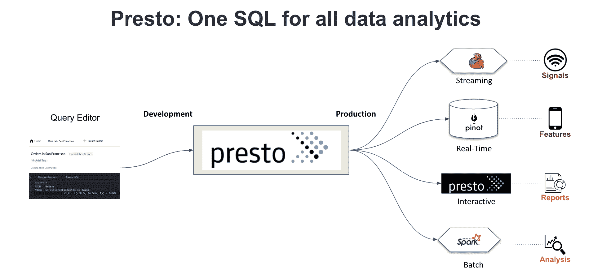

# 很快:在开放的全 SQL 平台上进行数据分析

> 原文：<https://thenewstack.io/presto-a-data-analytics-ecosystem-built-on-an-open-all-sql-platform/>

组织越来越依赖数据分析来指导其运营。但是处理越来越复杂的数据类型和数据源所需的专业技能为将数据转化为有用的见解设置了障碍。

不同类型的数据需要不同的查询引擎和编程语言，数据工程师必须学习和使用多种工具，首席信息官必须在封闭生态系统的效率和开放生态系统的潜在混乱之间做出选择。

Presto Foundation 开源社区提供了另一种选择:在一个完全不同的数据分析生态系统中使用 SQL 作为主要语言和接口的平台。

开源的 Presto 分布式查询平台对于大多数公司来说是一个很好的起点，因为其全面的数据库连接器套件可以有效地执行中小规模的数据分析。随着公司数据分析需求的增长，他们专注于流、实时、批处理和其他领域，Presto 可以继续成为数据分析师的主要 SQL 开发引擎，同时通过社区支持的集成与其他专业引擎透明地对接。

此外，通过在整个数据分析生态系统中扩展 SQL，Presto 有助于使分析过程民主化，使更多依赖数据工作的人能够查询数据以获得答案。

我在这里的参考框架是 Presto 基金会的主席和优步的工程总监，这是一家互联网规模的公司，面临着令人生畏的数据量和复杂性挑战。根据我的经验，我认为 Presto 也很有可能帮助你的公司。

## **SQL 无处不在**

如果一家企业取得了成功，其数据量和复杂性都会随着时间的推移而增长。作为企业在快速变化的市场中保持竞争力的一种方式，数据的重要性也在增长。

但是[老派的数据仓库](https://thenewstack.io/why-the-self-adapting-data-warehouse-is-the-future/)过于静态，无法进行有效的数据分析，尤其是在大规模的情况下。数据湖和最近的数据湖库解决了存储的规模问题，但它们仍然对从数据中提取洞察力构成挑战。

目前，各种孤立的系统有不同的数据分析引擎、查询语言和接口。不仅管理它们变得越来越困难，而且它们还带来了数据新鲜度和一致性的问题。

例如，假设您想要发布一份报告并立即共享，或者实时进行监管或合规性报告，而数据仓库和查询引擎需要编程，那么看似简单的任务可能需要 24 到 48 小时才能完成。到那时，你原本想回答的问题可能就无关紧要了。

我们在优步看到的一个例子是，使用 Uber Eats 的餐厅希望快速了解到目前为止他们收到了多少订单以及订单的种类。或者他们的数字广告转化的有多好。如果数据仓库和查询引擎不能及时交付这些数据来影响业务决策，那么就没有办法调整那些不起作用的数据，也没有办法加倍投资那些证明有效的数据。

查询时间越长，数据越不新鲜。每次您必须连接数据集或将它们从一个系统移动到另一个系统时，都会有在结果中引入不一致和不准确的风险。

但是，如果从数据中提取有用的见解不需要复杂的编程技能和对不同数据系统的专业知识，那会怎么样呢？SQL 是一种更简单的语言，大多数处理数据的人都很熟悉。事实证明，在整个数据分析生态系统中使用 SQL 作为查询语言和接口，极大地简化了数据分析的复杂性。以这种方式使用 SQL 正是 Presto 平台所支持的。

通过使用相同的基于 SQL 的平台来查询流、交互式、实时和批量分析系统，它扩展了数据工程管道，并允许数据工程师以更少的工作量完成更多的工作。这也有助于数据分析的民主化。例如，在一个互联网规模的组织中，可能只有少数数据工程师能够为各种数据类型编写查询代码，但是可能有成千上万的人是 SQL 用户。

通过对 SQL 的广泛熟悉，Presto 在整个组织中更广泛地扩展了分析流程的可用性。由于如此多的工程师知道 SQL，他们中的更多人可以执行数据查询，使分析见解更快、更普遍，并帮助数据分析师变得更有效率。

## **制定开放度量表**

太多时候，人们认为开源适合更小、更包容的用例，但不适合大规模的工作。首席信息官们尤其相信，封闭的专有系统比开源系统更容易预测，因此也更安全。

Presto [最初是脸书](https://thenewstack.io/from-big-to-fast-presto-continues-to-shine-for-cloud-data-lake-analytics/)的一个项目，在它成为开源之前，已经是一个互联网规模的公司，在 Linux 基金会的支持下运行。依赖于互联网规模的公司，Presto 从一开始就被设计和构建为高度可扩展和可靠的。作为一个由开放社区支持的开源平台，随着社区成员做出改进并反馈到平台中，它变得更加强大。

当你下载 Presto 的最新版本时，你得到的是优步和脸书等公司在生产、测试和其他方面使用的相同版本。即使您的组织现在不是，而且可能永远也不会是一个互联网规模的企业，您使用与行业巨头相同的软件也是很重要的，因为您可以确信它可以快速、可靠地处理您可能向它扔过来的任何东西。

一个无法快速扩展的方面——这是一件好事——是随着提取和分析数据的人数增加，您的云费用会增加。你可以免费下载 Presto，定制它，让你喜欢的人尽可能多的使用它，并且你的云基础设施账单不会增长，直到你的数据量本身增长。

开源在规划和发展数据分析生态系统方面提供了更大的灵活性。Presto 等开源方法实现了一致的数据分析生态系统，帮助您避免专有系统的供应商锁定。

一个警告:并不是所有的开源软件都是平等的。出于治理、灵活性、规模、持续技术增强和“游戏中的皮肤”的原因，采用由真正开放的社区支持的开源技术，而不是由单个公司实体支持，这一点很重要。普雷斯托检查所有重要的盒子。

## **结论**

每个月大约有 10，000 人在优步使用 Presto。因为它是开源的，我们可以修改它来满足我们的特殊需求。例如，地理空间数据对优步这样的公司很重要，但对脸书这样的公司就不那么重要了。

我们今天在优步所经历的是许多其他公司在未来几年将面临的，因为数据在复杂性和对业务成功的重要性方面都在不断增加。Presto 速度快，易于使用，在 up 上小规模使用，因此可以在公司发展的早期采用，并随着业务的增长继续使用。即使是像优步这样规模的公司，90%到 95%的时间里，Presto SQL 都能满足我们的需求。

无论您目前的规模如何，如果您成功了，您的数据需求将会继续增长。您越早转向基于开放式 SQL 的方法，就越容易支持和推动您的发展。从长远来看，如果您选择一个能够随业务增长的数据平台，您将从您的数据中获得更多。

<svg xmlns:xlink="http://www.w3.org/1999/xlink" viewBox="0 0 68 31" version="1.1"><title>Group</title> <desc>Created with Sketch.</desc></svg>