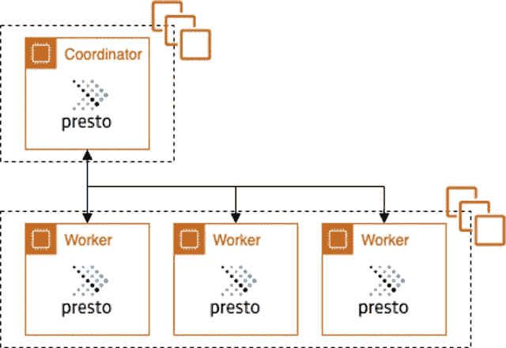

# 大数据 SQL:挑战、考虑因素、云解决方案

> 原文：<https://thenewstack.io/presto-for-big-data-sql-challenges-considerations-cloud-solutions/>

SQL 是数据从业者和分析师的通用语言。因此，即使出现了更新的数据湖分析数据系统，SQL 接口也是必不可少的。Meta(以前的脸书)将 Hive 开发为基于 Hadoop 的第一代数据湖之上的 SQL 接口。但是，蜂巢也有它的缺点。Hive 的性质不利于仪表板和即席分析所需的人类规模的交互。

因此，基于内存架构， [Presto](https://prestodb.io/) 被构建来满足这些交互和特定用例的低延迟需求。Presto 还在其他领域进行了改进，包括标准化 ANSI SQL 接口——而不是像 [HiveQL](https://cwiki.apache.org/confluence/display/Hive/LanguageManual) 这样的 SQL 方言——以及直接连接到其他数据源的可插拔连接器，从而实现更大的灵活性和联合工作负载。

今天，Presto 在一些最成功的互联网规模的公司中被大量使用，包括 Meta(拥有 300PB 的数据，1，000 个每日活跃用户和 30，000 个每日查询)，优步(50PB，7，000 个每周活跃用户和 1 亿个每日查询)和字节跳动(100 万个每日查询)。

Presto 项目已经成为 Linux 基金会的一部分，确保开放治理和社区管理。

Presto 的采用和性能使查询引擎和围绕查询引擎构建的数据堆栈(如 Lakehouses)成为一种可行的(也可以说是更灵活的)大数据一体化 SQL 解决方案的替代方案。

在本文中，我们将了解更多关于 Presto 的技术方面，以及像 Ahana Cloud 这样的云解决方案如何使数据团队和组织能够利用它。

## 普雷斯托建筑

让我们简单地了解一下 Presto 架构和系统。

### 协调员和工人

Presto 是一个分布式系统，这使得它可以根据数据大小进行扩展。像许多分布式计算系统一样，Presto 将计划工作的活动和工作本身的实际处理分开。在 Presto 中，流程被分成两种服务器类型— [协调者](https://prestodb.io/docs/current/overview/concepts.html#coordinator)和[工作者](https://prestodb.io/docs/current/overview/concepts.html#worker)。Presto 集群有一个协调器和一个或多个工作器。大型集群拥有数百名员工并不罕见。最近，Presto 社区引入了[多个分散的协调器](https://prestodb.io/blog/2022/04/15/disggregated-coordinator)，以便在单个集群中扩展到更多的工作人员，并提高集群的可用性。

### 连接器

Presto 被设计成支持[数据源连接器](https://prestodb.io/docs/current/overview/concepts.html#connector)(而不是仅仅被绑定到一个数据湖)。连接器提供了基于表的数据源模型，类似于关系数据库管理系统(RDBMS)中的数据源模型。在 Presto 中，一个连接器提供了一个三级层次结构，即[目录](https://prestodb.io/docs/current/overview/concepts.html#catalog)、[模式](https://prestodb.io/docs/current/overview/concepts.html#schema)和[表](https://prestodb.io/docs/current/overview/concepts.html#table)，以表的形式公开数据源数据；无论底层数据源本质上是关系型还是表格型(例如 NoSQL)，都是如此。连接器实现处理将本地数据源格式转换为 Presto 查询引擎的统一内存表格式的细节；最终用户只是通过 SQL 以表、列和行的形式处理数据。

### 配置和管理

Presto 通过正确格式化和放置的配置文件进行配置。

**访问控制**

Presto 提供了两个级别的基本访问控制框架——系统访问控制和连接器访问控制。[系统访问控制](https://prestodb.io/docs/current/security/built-in-system-access-control.html)主要处理谁可以访问什么目录以及访问的程度(例如，只读)。连接器访问控制特定于每个连接器，由连接器实现处理。连接器访问控制通过熟悉的[授权](https://prestodb.io/docs/current/sql/grant.html)和[撤销](https://prestodb.io/docs/current/sql/revoke.html) SQL 语义公开数据访问控制。对于更细粒度的数据访问控制，Presto 可以集成第三方数据授权框架，如 [Apache Ranger](https://ranger.apache.org/) 和 [AWS Lake Formation](https://aws.amazon.com/lake-formation/) 。

**资源组**

Presto 还提供了一种机制——称为[资源组](https://prestodb.io/docs/current/admin/resource-groups.html)——来限制资源使用和强制执行排队策略，例如限制并发运行查询的数量、CPU 时间和内存使用。这些策略可以根据用户、客户机源和查询类型来定义(例如，SELECT 与 INSERT 与 DDL)。

## 快速入门

有几种方法可以开始使用并快速部署。对于直接的本地安装，你可以抓取任何版本的 [tarball 和/或 JAR](https://repo1.maven.org/maven2/com/facebook/presto/presto-server/) (参见[版本说明](https://prestodb.io/docs/current/release.html))并按照[的指示部署那些工件](https://prestodb.io/docs/current/installation/deployment.html)。对于更加打包的部署，您可以尝试使用一个 [Presto Docker 映像。](https://hub.docker.com/r/ahanaio/prestodb-sandbox)最后，如果你不想完全担心管理基础设施，Ahana 提供了一个[免费的永久 Presto 托管服务社区版。部署 Presto 后，您可以通过](https://ahana.io/docs/community-gs) [JDBC](https://prestodb.io/docs/current/installation/jdbc.html) 或 [Presto CLI](https://prestodb.io/docs/current/installation/cli.html) 连接到集群，并通过[标准 ANSI SQL 语法](https://prestodb.io/docs/current/sql.html)查询您的数据源。

## 挑战

### 挑战 1:管理和配置分布式基础设施

开始使用 Presto 是一回事，但是在持续的基础上为生产工作负载管理和配置像 Presto 这样的分布式系统是一项挑战，尤其是在内部环境中。即使有了云，在基础设施和配置上也会有摩擦。

在基础架构方面，您将希望利用任何弹性和专门的计算资源。例如，您可能希望在高使用率和低使用率期间分别横向扩展和增加工作人员数量，以优化利用计算资源和管理成本。您可能想要微调硬件，以在工作负载 SLA 和可预测性方面获得最佳性价比，例如利用 [spot 实例](https://aws.amazon.com/ec2/spot)和使用基于 ARM 的处理器。

即使可以管理基础架构，Presto 的配置也很复杂。Presto 已经公开了数百个配置参数，以便进行调整。这些配置参数可以提供灵活性，并且是开源开发的自然分支。然而，它会很快导致管理上的头痛。

当谈到管理云中的 Presto 基础架构和配置时，您会想要考虑您想要或需要的控制程度，以及为了简单性可以牺牲多少。一方面，您可以不使用服务器(例如，Amazon Athena)，抽象掉大部分底层基础设施，公开一个简单的查询接口和连接性——如果您愿意，也可以称之为查询即服务。这在开始时可以很好地工作，但是随着时间的推移，不透明性(即有限的可见性和控制)可能会阻止更好或更优性价比所需的高级调整。此外，在某些情况下，配额限制或计算资源的多租户共享可能会导致不一致的延迟性能，在后续提交中，对相同数据的相同查询可能需要更长时间。

另一方面(例如，Amazon EMR)，您可以完全自己管理基础架构，并采用更加“自己动手”的方法。你将拥有完全的控制权。但是，在这种情况下，您需要理解和管理任何正在进行的调优(例如，配置)和操作。当考虑几个集群时，所有这些都变得更加严重，考虑到调优的重要性，为不同的工作负载设计多个集群是很常见的。

最后，托管服务(例如， [Ahana Cloud](https://ahana.io/ahana-cloud/) )可以在控制和简单性之间提供平衡，其中最重要的配置在易于使用的界面中公开。对于那些已经超越了无服务器选项的限制，但不想或不具备完全控制基础架构和配置的专业知识的团队来说，这可能是一个正确的选择。无论您选择何种部署风格或产品，您还需要考虑新的软件版本和升级，以获得新的功能、稳定性和修复，包括 Presto 本身和任何底层依赖项(例如 Kubernetes 集群)。

最后一点是关于数据隐私和数据泄露的风险。对于涉及数据的数据基础架构，了解数据的流动方式和潜在的风险点非常重要，不仅要了解组织自身的数据，还要了解可能给客户带来风险的任何数据。例如，出于这个原因，Amazon EMR 和 Ahana 云托管服务故意将所有 Presto 集群基础设施部署到客户的帐户和网络中。

### 挑战 2:协调分类服务

作为一个查询引擎，Presto 只是数据湖之上或跨数据源联合的 SQL 工作负载所需的更广泛的分解服务栈中的一部分。需要元数据目录来允许 Presto 确定对于给定的查询应该正确扫描哪些文件；此外，元数据目录可以包含对优化查询性能至关重要的有价值的数据统计信息。另一个重要部分是细粒度的数据访问控制，控制哪些用户可以访问哪些表、列和行。

Ahana Cloud 不仅可以轻松部署 Presto，还可以与相关服务集成。在元数据目录的情况下，Ahana Cloud 可以集成一个开放选项，如 Hive Metastore 或云原生选项，如 AWS Glue。事实上，为了方便起见，Ahana Cloud 也提供了内置的 Hive Metastore。对于数据访问控制，Ahana Cloud 提供了开放和云本地选项的简单集成，例如 Apache Ranger 和 AWS Lake Formation。

### 挑战 3:性价比

在所有的基础设施、配置和部署都完成之后，必须有一个可持续的成本价值轨迹。随着数据越来越多，SQL 计算成本(已经是大数据 SQL 堆栈中的主要成本驱动因素)将继续增长。在云中，建立在对象存储上的数据湖提供了可扩展的、有弹性的、低成本的文件存储，而不是昂贵的专用硬件。设计良好且价格合理的查询引擎服务可以为非数据湖替代方案提供卓越的性价比优势。

我们的解决方案 Ahana Cloud 能够提供比同类解决方案至少高三倍的性价比，因为它具备复杂的多级缓存、智能自动扩展以及在性价比优化的 CPU 上运行的能力。这将随着正在进行的[更高效](https://engineering.fb.com/2022/08/31/open-source/velox/) [原生执行](https://engineering.fb.com/2022/08/31/open-source/velox/)的工作而进一步显著改善。

## 结论

在这篇文章中，我们向您介绍了 Presto，它是如何工作的，以及部署和管理 Presto 服务的一些挑战。与内部部署相比，云有助于缓解许多棘手问题，并且有几种针对云的 Presto 解决方案。尽管如此，挑战依然存在。Ahana Cloud 是 Presto 的云原生托管服务，旨在提供简化的管理和配置，而不限制最重要的控制方面，从而为数据湖上的大规模 SQL 生产工作负载提供一流的性价比。

<svg xmlns:xlink="http://www.w3.org/1999/xlink" viewBox="0 0 68 31" version="1.1"><title>Group</title> <desc>Created with Sketch.</desc></svg>