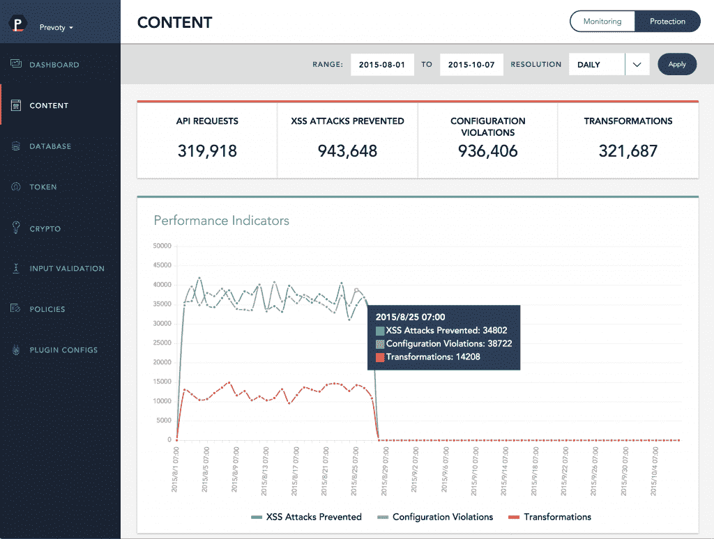
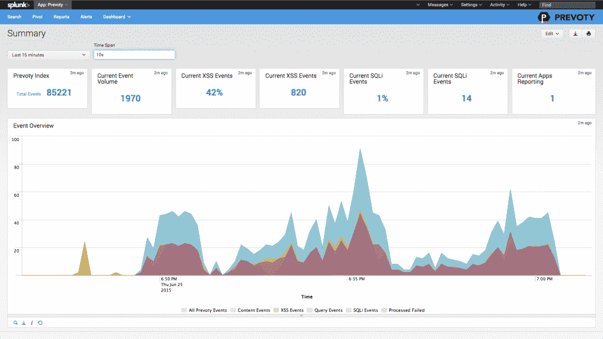

# Prevoty 在应用程序中嵌入了防御措施

> 原文：<https://thenewstack.io/prevoty-embeds-defenses-within-application/>

预测者表示，2017 年，企业将继续将安全重点从终端设备转移到所有应用程序和服务的用户和信息。

在越来越基于云、短暂的微服务架构中，堡垒式的基于边界的策略不再有效，红点风险投资公司的莱尼·普鲁斯(Lenny Pruss)曾在这里讨论过。他说，今天的安全范式必须以应用为中心，由开发人员驱动，由内而外构建。

运行时应用程序自我保护(RASP)是一种将安全保护嵌入应用程序本身的方法，是一种阻止攻击并解决组织在快速缓解漏洞方面的困难的方法。

“过去，应用程序安全涉及两件事:测试，要求开发人员在生产前和生产后测试他们的代码，以找到漏洞。洛杉矶 RASP 供应商 [Prevoty](https://www.prevoty.com/) 的联合创始人兼首席执行官[朱利安·贝朗热](https://www.linkedin.com/in/julien-bellanger-55734515)解释道:“如今，随着大量开发人员和代码被推进更快的发布流程和敏捷开发，测试投入生产的所有代码变得几乎不可能。

第二种安全方法涉及 web 应用程序防火墙，它本质上是监视流量的网络设备。

“这些基本上是查看 HTTP 请求的机器，但对应用程序中发生的事情几乎没有了解。他们很难维护，随着微服务和云的兴起，很难在一切面前维护一个 web 应用防火墙，”他说。

RASP 提供了一个应用程序的逻辑流、数据流和配置的综合视图。 [RASP 可用于阻止未经授权的尝试](http://www.infoworld.com/article/3089951/security/how-rasp-protects-applications-from-attacks.html)执行 shell 命令，并限制对文件系统和网络套接字等计算资源的访问。

Prevoty 将一个代理嵌入到应用程序中，该代理将分析应用程序中发生的一切，并与应用程序一起去任何地方，无论是测试、预生产还是各种生产环境。

它可以防御 [OWASP 十大](https://owasp.org/www-project-top-ten/)攻击，例如跨站点脚本、SQL 注入、跨站点请求伪造等，特别是针对应用程序和底层数据库的攻击。OWASP 是开放 Web 应用程序安全项目，[，它试图提供与 Web 应用程序安全相关的信息](https://owasp.org/about/)。

开发人员可以使用 Prevoty 的软件以及 Chef、Puppet 和所有其他开发工具，而无需对应用程序本身进行任何代码更改。

## 专注于执行

Prevoty 不依赖于行为分析、签名或模式，而是使用 [LANGSEC](https://www.prevoty.com/science/langsec/#langsec) ，这是一种基于语言的过程，用于了解诸如内容有效负载、数据库查询、操作系统命令等数据将如何在环境中执行。

[https://www.youtube.com/embed/o_d3YuM4Tcg?feature=oembed](https://www.youtube.com/embed/o_d3YuM4Tcg?feature=oembed)

视频

根据首席技术官 Kunal Anand 的说法，它提供了更复杂的可视性和智能。

“如果我们进行数据库查询，我们不仅会告诉您数据库查询有问题，还会告诉您它到底有什么问题。我们告诉你这是同义反复——类似于 1 等于 1——或者是数据库查询中的矛盾，”他解释道。

Prevoty 与 HPE、Vericode、Checkmarx、对比安全等公司展开竞争。其客户包括[奥斯卡医疗](https://www.prevoty.com/static/pdf/Prevoty-Case-Study-oscar.pdf)、[密西根州立大学](https://www.prevoty.com/static/pdf/Prevoty-Case-Study-MSU.pdf)和[漂白报告](https://www.prevoty.com/static/pdf/150403_Case_Study_Bleacher_Report_100.pdf)。

“我们的大多数竞争对手都来自漏洞分析领域。他们一直专注于尝试扫描坏代码，现在他们正试图赶上运行时潮流。不幸的是，这些解决方案，无论是 SAST、DAST，甚至是 IAST，都非常笨重，无法在生产应用中扩展。他们试图扫描每一行代码，而你无法在生产应用程序中做到这一点。这大大降低了应用程序的速度，”阿南德说。

他说，Prevoty 在应用程序上的性能开销低于一毫秒的处理时间，这意味着大多数客户端甚至不会注意到它正在运行。除了应用内引擎之外，Prevoty 还可以作为虚拟设备部署在数据中心，或者从 Prevoty 云或私有云访问，典型的往返时间为 50 到 60 毫秒。

Anand 说:“我们已经编写了厨师食谱或可翻译的剧本或木偶脚本，将允许 Prevoty 附加到应用程序上，而开发人员不必做任何事情。”

该软件不需要任何服务器集成。没有遥测技术会传到母舰，也不需要主动与网络服务联系。它处于被动监控模式或主动保护模式；客户可以在两者之间切换。如果是保护模式，可疑的有效负载会被中和，而安全的有效负载会立即发送回应用程序。

“我们在应用程序中看到的智能通常是组织以前从未见过的。通过驻留在应用程序中，你处于网络请求、数据库和操作系统调用之间的连接组织，”他说。

“当我们发现恶意代码时，我们可以找到所有 HTTP 信息，如 IP 地址、cookies、HTTP 头，以及所有应用程序元数据，包括文件名、恶意代码的执行位置、所有会话信息，如谁登录了应用程序。我们在数据库查询被发送到数据库引擎之前就看到了它，并且我们确切地看到了从另一端返回的内容。

“这意味着我们可以将所有信息放入一个有效负载中，然后将所有信息推送到日志文件或系统日志中。我们有一些组织将我们推进到数据商店，如 Splunk、IBM QRadar、HP ArcSight 等大型安全工具，一些稍微先进一点的组织将我们推进到 HDFS 或 NoSQL 的商店，在那里他们将进行汇总。他说:“我们有一个客户，他将所有数据都放入一个[亚马逊网络服务的] S3 桶中，然后有一个 Kinesis 工作来合成数据。

Prevoty 的 Splunk 界面

为了帮助用户理解日志数据，所有这些数据都是可搜索的，Prevoty 提供了亮点、趋势以及在出现问题时为经理设置警报和生成报告的能力。

Prevoty 支持 C、Java、PHP、Python、Node、Ruby、.NET，ASP。NET、Django 框架、HTML5 以及数据库 SQL Server、MySQL、Oracle DB、IBM DB2。Anand 说，该公司也将注意力转向 NoSQL 数据库。

通过[像素显示的特征图像](https://pixabay.com/)

<svg xmlns:xlink="http://www.w3.org/1999/xlink" viewBox="0 0 68 31" version="1.1"><title>Group</title> <desc>Created with Sketch.</desc></svg>