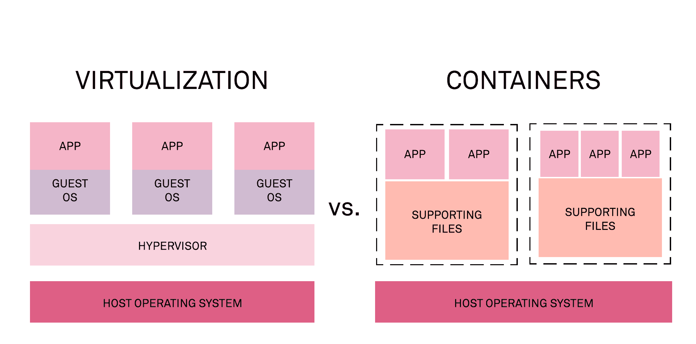

# 初级读本:部署到 Kubernetes 的开发者指南

> 原文：<https://thenewstack.io/primer-a-developers-guide-to-deploying-to-kubernetes/>

Kubernetes 的成立是为了帮助开发者发布和扩展他们的应用程序。我们知道事情在交付之前是不会结束的。为了帮助你实现这一点，这里有一个快速的 411，告诉你开发人员在 Kubernetes 上部署他们的应用需要知道什么。

## 进入容器:

容器打包了你的应用程序和运行它所需要的一切。这包括任何应用程序依赖项或文件以及应用程序的运行时环境。

容器，顾名思义，就是便携的。您可以在不同的环境和不同的基础设施中旋转容器，而不会听到“嗯，它在我的机器上工作。”这也是容器和虚拟机之间的主要区别。VM 就像船，集装箱就像船。你可以把船放在船上，但是你不能把船放在船上。

虚拟机与容器

 [蒂芙尼·雅克哈

Tiffany Jachja 是 Harness 的开发者倡导者。在加入 Harness 之前，Tiffany 是 Red Hat 应用开发咨询公司的顾问。在那里，她用自己的经验帮助客户构建他们生活在云中的软件应用。在业余时间，她喜欢和她的猫 Rico 一起散步，并写关于自我发展的博客。](http://harness.io/) 

容器是图像的运行实例。容器映像包含应用程序的源代码、库和依赖项。如果您的应用程序使用 ssh，那么您应该确保容器映像安装了 ssh。图像就像模板，您可以向它们添加层，以向您的容器添加附加功能。

容器图像存储在公共或私有存储库的注册表中，如 [Docker Hub](https://www.docker.com/products/docker-hub) 。通常，您从存储库中下载一个映像，或者构建自己的容器映像，并使用它来启动容器。

容器技术的生态系统继续增长。 [Docker](https://www.docker.com/products/docker-desktop) 和 [Buildah](https://buildah.io/) 是两种技术，它们有助于为您的应用程序构建轻量级容器，以便在整个组织中有效地伸缩。这里有一份来自 TechBeacon 的 30 种不同容器技术的列表。

## 装运集装箱

Kubernetes 是一个用于编排和管理容器的工具。容器平台还有助于构建、部署和管理您的容器。在这样的生态系统中，当使用容器时，您需要知道一些额外的事情。

[Pods](https://kubernetes.io/docs/concepts/workloads/pods/pod/) 将您的容器分组，以允许它们在您的基础设施上运行。Pods 是由 Kubernetes 创建和管理的最小可部署单元。Kubernetes 将分配 pods 在 Kubernetes 管理的称为节点的机器上运行。

pod 可以包含一个容器(这是最常见的用例)，也可以包含多个容器。部署到同一个箱中的集装箱称为边车集装箱。sidecar 模式确保容器在 pod 级别共享同一组资源。

一个 [DaemonSet](https://kubernetes.io/docs/concepts/workloads/controllers/daemonset/) 部署经常被考虑并与边车模式进行比较。DaemonSet 是 Kubernetes 资源，它确保一个 pod 实例在集群中的所有节点上运行。DaemonSets 模式比 sidecar 模式消耗更少的资源，因为每个节点只有一个实例。

因为你有作为容器包装器的 pod，你可以使用 Kubernetes [服务](https://cloud.google.com/kubernetes-engine/docs/concepts/network-overview#services)使 pod 可寻址。您可以配置您的容器平台，以指定您希望如何构建映像、部署和操作您的应用程序。

## 之后会发生什么？

有几种方法可以确保您的应用程序运行良好。健康检查提供活性检查和就绪检查功能。活性探测器检查容器是否正在运行。准备就绪探测器确定容器是否准备好服务请求。准备就绪探测器可以配置为进行 HTTP 检查。通过这种方式，您将知道服务已经准备好接收流量。查看您的 [Kubernetes 文档](https://kubernetes.io/docs/concepts/workloads/pods/pod-lifecycle/#container-probes)以获得可用的探针。

我最后的指导是关于性能的。节点上运行的每个容器消耗[计算资源](https://kubernetes.io/docs/concepts/configuration/manage-compute-resources-container/#meaning-of-cpu)。如果您注意到性能或功能下降，请确保您的 pods 分配有足够的 CPU 资源和内存资源单元。每个 pod 在一个节点上的内存和 CPU 消耗都是有限的。在某些情况下，如果 pod 超过了内存限制，它们就会被终止。资源疏忽的一个典型例子是 Jenkins 的一个实例执行构建很慢，因为它的 CPU 限制是 500m CPU 或半个内核。

## 结论

技术的未来将包括构建在 Kubernetes 之上的易于使用的工具和平台，供开发人员快速开发和部署代码。记住这一点，理解正确的 Kubernetes 术语和概念是很有用的，即使您不是作为开发人员提供或部署您的应用程序。要了解更多关于容器原生应用程序开发的信息，请考虑查看[十二因素应用程序](https://12factor.net/)。如果你有兴趣了解更多 Kubernetes 的概念，请查看[这篇文章。](/kubernetes-an-overview/)

<svg xmlns:xlink="http://www.w3.org/1999/xlink" viewBox="0 0 68 31" version="1.1"><title>Group</title> <desc>Created with Sketch.</desc></svg>