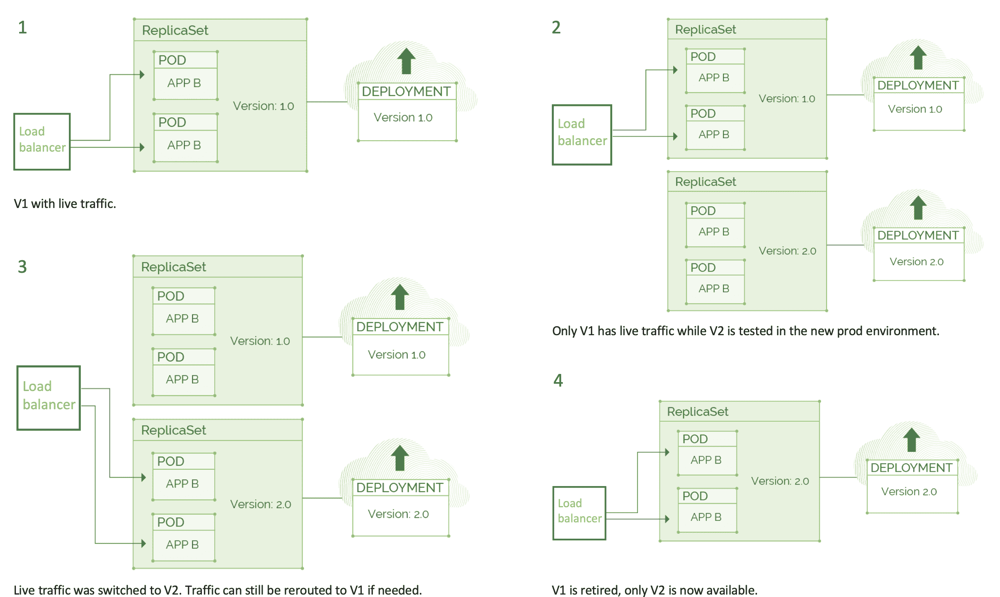
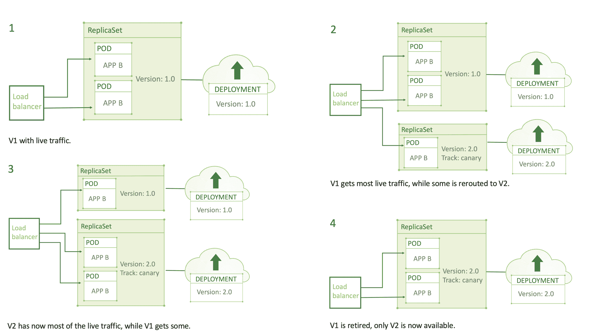

# 初级:蓝绿色部署和金丝雀释放

> 原文：<https://thenewstack.io/primer-blue-green-deployments-and-canary-releases/>

 [凯瑟琳·帕格尼尼

凯瑟琳·帕格尼尼在 Kublr 领导营销工作。从战略到战术，Catherine 帮助 Kublr 宣传云原生技术的无限力量，塑造品牌，并与增长保持同步。在加入这家科技初创公司之前，凯瑟琳在博思艾伦汉密尔顿和华盛顿邮报营销 B2B 服务。](https://www.linkedin.com/in/catherinepaganini/en/) 

*这篇文章是凯瑟琳·帕格尼尼正在进行的系列文章的一部分，该系列文章致力于为商业领袖解释 IT 概念。*

在我们关于 CI/CD 的[上一篇文章](/a-primer-continuous-integration-and-continuous-delivery-ci-cd/)中，我们简要讨论了蓝绿部署和金丝雀发布及其在持续交付(CD)中的作用。这些都是非常强大的方法，可以显著降低与应用程序部署相关的风险，值得专门撰写文章。所以让我们更深入地研究一下。

蓝绿色部署和 canary 版本降低了应用程序部署风险，因为如果在发布期间出现问题，IT 可以恢复到以前的版本。在不同版本之间来回切换就像扳动开关一样简单，而且可以自动化，最大限度地减少用户暴露于潜在错误代码的时间。但是在我们深入研究之前，让我们首先区分部署和发布。

## **从发布中分离部署**

虽然经常互换使用，但部署和发布是两个独立的过程。部署是为任何环境(包括生产环境)安装软件版本的过程。它不一定要与版本相关联。另一方面，发布是当一个新的特性对你的客户群可用时。

传统上，更新或功能在发布日期的前一天部署，这可能会在媒体上广泛宣传。正如我们所知，部署过程中可能会出现问题，几乎没有解决问题的空间。在特性开发过程中频繁的产品部署的目标是降低风险。

## **蓝绿色展开**

在蓝绿色部署中，有两种生产环境:蓝色和绿色。蓝色是具有实时流量的当前版本，绿色是具有更新代码的环境。在任何时候，只有一个有实时流量。

为了发布新版本，代码被部署到没有流量的环境中，在那里执行最终测试。一旦确信应用程序准备就绪，*所有*流量都会被路由到绿色环境。绿色现在是活的并且实际的释放被执行。

这是第一次使用生产负载(真实流量)测试新代码。在代码真正发布之前，风险仍然存在，永远不会消失。但如果出现问题，它可以迅速将流量重新路由回蓝色版本。他们所要做的就是密切监视代码行为，这可以通过适当的工具自动完成，看看 green 是否工作良好，或者是否需要回滚。

***蓝绿部署:*** *在任何给定时间，一个环境中只有实时流量。*

这种方法绝不是新的。它总是创建一个新版本，然后重新路由实时流量到它。*新增的*是通过版本控制中的**组件编码**提供的**可靠性和再现性**。

我们如何达到这种可靠性和再现性？开发人员在版本控制中编码所有参数，版本控制是一个类似数据库的系统，跟踪所有代码的变化。包括 app 逻辑、构建流程、测试、部署流程、升级流程、恢复流程等。简而言之，影响 app 的一切。然后，计算机执行代码，将应用程序部署到与版本控制中编码的确切状态相匹配的环境中。

在 DevOps 之前，这个过程更多地是手动的，而且容易出错。所有的变更都必须记录在文档中(顺便说一句，文档的版本化和分析要困难得多)，开发人员可以根据文档重新创建应用程序和环境。由于两个关键步骤是手动的，这个过程太不可靠，导致问题频发。

虽然编写应用程序和环境也是一项人工任务，但它是开发过程的一部分，而不是单独的一部分，例如创建文档的任务。生产中的相同代码在版本控制中进行编码。任何更改或更新都会自动触发测试，确保代码处于可部署状态。通过这种方式，如果一个人为错误偷偷摸摸，系统很可能会抓住它。

## **金丝雀释放**

与蓝绿色部署类似，canary 发布从两个环境开始:一个有实时流量，另一个包含更新的代码，没有实时流量。与蓝绿色部署不同，流量逐渐转移到更新的代码。它可以从 1%开始，然后移动到 10%、25%等等，直到达到 100%。通过自动化发布，当代码被确认为正确运行时，它被成功地提升到更大和更关键的环境中。如果在任何时候出现问题，所有流量都会回滚到以前的版本。这极大地降低了风险，因为最初只有一小部分用户会接触到新代码。

它不仅可以控制用户部署的百分比，而且 canary 的发布还可以从不太重要的用户开始，例如那些拥有免费帐户或在对您的业务不太重要的市场中的用户。

***金丝雀发布:*** *直播流量从老版本逐渐滚动到新版本，直到只有更新才直播。*

## **集群免疫系统**

集群免疫系统使金丝雀的释放更进一步。与生产监控系统相连，当面向用户的性能偏离预定义的范围时(例如错误率增加 2%)，会自动回滚一个版本。这种方法可以识别通过自动化测试很难发现的错误，并减少检测和响应性能下降所需的时间。

通过将部署与发布分离，并利用蓝绿色部署或金丝雀发布，风险会大大降低。在任何时候，它都能够将应用程序恢复到以前的版本——这与传统版本的现实相去甚远。

新的技术和方法使这第一次成为可能:版本控制、代码基础设施、容器和 Kubernetes 都在这个新的、灵活的、面向 DevOps 的 IT 世界中发挥着作用。

*像往常一样，非常感谢 [Oleg Chunikhin](https://www.linkedin.com/in/olegch/) ，他的每篇文章都让我对云原生技术有了更多的了解。*

<svg xmlns:xlink="http://www.w3.org/1999/xlink" viewBox="0 0 68 31" version="1.1"><title>Group</title> <desc>Created with Sketch.</desc></svg>