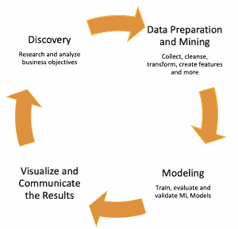

# 入门:揭开数据科学的神秘面纱

> 原文：<https://thenewstack.io/primer-demystifying-data-science/>

[Levon Paradzhanyan](https://www.linkedin.com/in/lparajanoff/)

[Levon 是 EastBanc Technologies 的一名软件工程师和架构师，他在软件开发领域已经工作了 14 年多。最近，他越来越多地参与数据科学和人工智能项目。Levon 对当前的技术发展感到兴奋，并热衷于将他们的力量传播给更广泛的商业和 IT 社区。](https://www.linkedin.com/in/lparajanoff/)

*这是由 [Levon Paradzhanyan](https://www.linkedin.com/in/lparajanoff/) 撰写的系列文章的第一部分，该系列文章揭示了数据科学、机器学习、深度学习和人工智能，同时解释了它们如何相互联系。*

人工智能在很多年前就出现在我们的生活中。首先，作为科幻小说和今天嵌入在现实产品中。此后，数据科学、机器学习和深度学习等更新的流行词汇紧随其后。然而，有许多与这些术语相关的误解。大多数人认为他们指的是同一件事。即使是刚开始这一领域之旅的开发人员也很难理解它们之间的区别。

在这个初级系列的第一部分中，我们将关注数据科学，所有这些方法都属于这个学科。在这些文章中，我们将探索每种技术和它们共有的基本资产——数据。

### 人类首次尝试创造类似人类的能力

几个世纪以来，聪明人发明了新技术，将以前手工操作的活动自动化，并创造了新的可能性。虽然这些创新缺乏类似人类的智能，但在古希腊、中国、犹太和其他国家的历史中有许多“自动机”的例子，这是一种自我操作的“智能”机器，旨在自动执行预定的操作序列。今天，我们称它们为“机器人”，它们的能力是无限的。

但是机器人并不是唯一的智能技术。一切都变得越来越智能，例如，社交、音频或视频流媒体服务，如脸书、Spotify 和网飞，会推荐符合用户偏好的内容。类似地，公司越来越多地处理收集的消费者行为数据，以改进他们提供的服务，检测和防止欺诈或提供新的服务。最后，特斯拉开发了自动驾驶的智能汽车，这些汽车在不断自主改进。

数据助长了这一切。

### 您的数据，您的金矿

想想如今公司和组织正在生成或收集的所有数据。数量，最重要的是，它的结构有时是难以想象的庞大和复杂。因此有了“大数据”这个术语。

 **大数据声称能够提供改变业务的分析和见解。不幸的是，这很大程度上只是炒作。归根结底，大数据只是大量数据的另一种说法。 其实，在[east bancTechnologies](https://eastbanctech.com/)，我们崇尚 ing 为年 开始 数据的准确性、质量和完整性以及良好的分析方法才是真正重要的。

与此相关的一些著名行业包括医疗保健、教育、媒体和娱乐、政府、交通、银行等。

利用数据的力量，这些行业可以揭示趋势、做出预测并改进决策。数据可以帮助公共卫生组织了解他们应该采取哪些预防措施来最大限度地降低流行病爆发的风险。它可以帮助指导学生根据自己的兴趣、优势和学业成绩选择最合适的职业。数据有助于预测由于公共事件、节假日、事故或新闻警报而导致的交通拥堵。

但数据也可能隐藏尚未考虑的模式和见解，这些模式和见解可能对公司的商业智能/运营具有潜在价值。例如，数据可能揭示欺诈者从网上银行系统窃取资金的新模式。它还可以表明，如果一个人更换了手机供应商，他的朋友很可能会效仿，或者买尿布的男人更可能会买啤酒。或者，也许，个人寻求商业贷款谁完成了他们的申请表在正确的照顾是更可靠的债务人。

这些都是现实生活中的例子。那么，我们这里有什么？数据是任何业务的基础。这就是为什么理解它并发现隐藏的相关性、新模式，甚至发现新的见解可以积极地影响商业成功。

挑战在于，如今组织的大部分数据是非结构化的，并且分散在不同的来源中，例如分析软件、日志文件、传统系统、基于云的服务、第三方企业解决方案等等。没有通用工具可以智能地确定这些系统之间的关系，并对它们进行大量处理。

这就是数据科学发挥作用的地方。

### 什么是数据科学？

数据科学结合了统计学、数学、计算机和信息科学、数据分析和机器学习技术，以了解和发现数据中的隐藏模式，并帮助构建预测分析和决策工具。

数据科学与商业智能(BI)工具有何不同？通常，BI 关注于对历史数据的分析，以解释它，监控当前状态，并发现业务趋势的模式。相比之下，数据科学是一种更具动态性、进步性和前瞻性的方法，侧重于预测未来(预测性分析)或为企业提供明智的决策能力(规定性分析)。

为了更好地理解什么是数据科学，掌握数据科学家的角色和职责非常重要。

### 数据科学家

数据科学家是一个可以轻松应对许多不同领域和学科的人，是夏洛克·福尔摩斯、商业分析师和软件开发人员的共生现象。事实上，大量的技能和知识；此外，深入不同行业、分析它们并创建预测模型的能力是任何数据科学家的必备条件。

数据科学家负责导航数据科学生命周期，如下所示:

让我们来分解这些阶段:

1.  **发现**。这包括理解和分析业务问题或目标。
2.  **数据准备和挖掘。**在这里，数据科学家从不同的来源收集数据，清理数据，并将其转换为适合机器学习算法的格式。然后，他或她通过做出假设或检查数据中隐藏的模式等等，创建一个新的特征(个人可测量的属性)。这可能是工作中最重要也是最耗时的部分。
3.  **造型**。现在，数据科学家训练机器学习模型，并评估和验证性能(准确性)。
4.  **可视化并传达结果。**使用图表和其他方法展示结果，以易于理解的方式清楚地传达和解释调查结果。

数据科学家可以参与任何形式的业务用例。例如，帮助营销部门根据客户的购物和愿望清单改进零售商的营销技巧。数据科学家还可以通过分析消费者购买力、竞争对手的报价、销售历史、产品的受欢迎程度等来帮助优化价格形成过程。他们还可以通过分析数以千计的不同因素和属性来揭示公开审判中的隐藏模式。

### 数据科学家对机器学习工程师

在某些情况下，同一个人执行数据科学生命周期中的每个步骤，但并不一定是这样。在许多情况下，机器学习工程师(ML 工程师)将接管设计模型的步骤。当数据科学家缺乏解决方案全栈开发所需的编程技能时，通常会出现这种情况。

数据科学家和 ML 工程师有两个不同的角色:

**数据科学家**必须完全理解业务需求和数据，找到解决问题的正确方法，并帮助构建和验证结果。

**ML 工程师**不需要理解算法和解决方案背后的整体科学，但可以参与构建机器学习模型(ML 模型)，使用特殊技术、编程框架，并确保数据从数据管道中收集，净化并适合 ML 模型。

这样，机器学习使传统数据分析的功能成长为数据科学。

总之，数据具有揭示未知相关性和模式的巨大潜力，可以改善决策并最终改善业务成果。如今，大多数公司都积累了大量数据，但这些数据大多是非结构化的，而且是孤立的。没有通用的工具来确定关系和有效地处理数据，揭示这些趋势不是一件容易的事情。这就是数据科学的用武之地。

数据科学可以统一和处理数据，以发现隐藏的模式，并构建预测性和规范性的分析工具，从而做出更好的决策。在我们的下一篇文章中，我们将研究机器学习以及它与数据科学的比较。

由[乔·塞拉斯](https://unsplash.com/@joaosilas?utm_source=unsplash&utm_medium=referral&utm_content=creditCopyText)在 [Unsplash](https://unsplash.com/s/photos/mystery?utm_source=unsplash&utm_medium=referral&utm_content=creditCopyText) 上拍摄的特写图片。

<svg xmlns:xlink="http://www.w3.org/1999/xlink" viewBox="0 0 68 31" version="1.1"><title>Group</title> <desc>Created with Sketch.</desc></svg>**