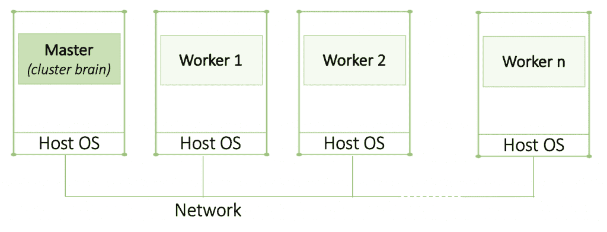
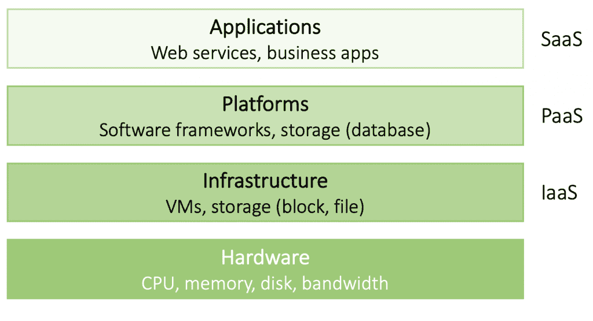

# 为商业领袖解释分布式系统

> 原文：<https://thenewstack.io/primer-distributed-systems-and-cloud-native-computing/>

编者按:这篇文章是 Catherine Paganini 正在进行的系列文章的一部分，重点是为商业领袖解释 IT 概念。

软件正在成为各行各业的战略性竞争优势，今天的数字化转型竞赛就是证明。企业正在投资(通常是数百万美元)技术来更好地服务于他们的客户群。对于在决策和规划过程中起关键作用的企业领导来说，对业务应用程序如何工作有一个基本的了解是必不可少的。什么是组织约束，新技术发展带来了什么机遇？

在本文中，我们将提供什么是分布式系统或应用程序的高级概述。我们将讨论特征、设计目标和扩展技术，以及分布式系统的类型。最后，我们将探讨云原生技术如何改变现状。

## 分布式系统的激增

从 20 世纪 80 年代中期开始，两项技术进步使得分布式系统变得可行。

首先是强大的微处理器的发展，后来通过多核中央处理器(CPU)变得更加强大。这导致了所谓的并行性，即多个进程可以同时运行。另一方面，单核 CPU 一次只能运行一个进程，尽管 CPU 能够在任务之间快速切换，以至于它们看起来像是同时运行多个进程。随着 CPU 容量的增加，更强大的应用程序被开发出来。

第二个关键发展是高速计算机网络的发明。局域网(LAN)允许数以千计的物理上接近的机器相互连接和通信。广域网(WAN)使数亿台机器能够在世界范围内进行通信。由于计算能力实际上没有物理限制，企业现在能够创建“超级计算机”

### 分布式系统的特征

分布式系统是自治计算元素的集合，对其用户来说是一个单一的连贯系统。这些组件通常被称为节点，可以是硬件设备(例如，计算机、移动电话)或软件进程。一个很好的例子是互联网——世界上最大的分布式系统。由数百万台机器组成，对你来说，感觉就像一个单一的系统。您不知道数据存储在哪里，涉及多少服务器，或者信息是如何到达您的浏览器的。这个概念叫做抽象，在里面反复出现。简而言之，你的浏览器抽象了互联网的复杂性。这同样适用于 Gmail、Salesforce 或您可能使用的任何企业应用程序。您几乎每天都要与分布式应用程序进行交互！

节点(机器或过程)被编程以实现一个共同的目标。为了合作，他们需要交换信息。假设:

1.  你的浏览器发送请求从域服务器拉取网站信息(节点 A 向节点 B 发送请求)；
2.  域服务器从其数据存储中提取网站信息(节点 B 处理请求)，
3.  域服务器将网站代码推送到您的浏览器(节点 B 向节点 A 发送响应)。

显然，通信是分布式系统的核心；如果失败，就不可能进行协作，你的浏览器也不会显示任何内容。

### 中间件和 API——将分布式系统结合在一起的粘合剂

分布式系统通常在其各自的操作系统(OS)之上有一个单独的软件层，称为中间件。它创建了允许不一定兼容的应用程序进行通信的标准。它还为应用程序提供各种服务，例如安全性或屏蔽以及故障恢复。

今天，我们越来越少听到中间件，而更多听到应用编程接口(API)。API 的作用相当于一个网关，应用程序可以通过它进行通信。它基本上是一个应用程序接口抽象。为了让应用程序直接通信，它们必须有兼容的接口，但这种情况并不常见。API 允许不同的应用程序通过它进行通信。因此，它从应用程序中抽象出实现细节和差异。除了应用程序的 API 之外，应用程序不需要知道其他应用程序的任何信息。

你可能听说过开放 API，围绕着它有相当多的讨论，这是有充分理由的。一些应用程序开发人员向公众开放他们的 API，以便外部开发人员可以利用他们的数据。谷歌地图和 Yelp 就是很好的例子。Yelp 接入谷歌地图的 API。你可能见过餐馆描述旁边的小地图。要得到指示，你只需在地图上点击一下——多方便啊！开放 API 显然让我们的生活变得更加容易，如果你注意的话，你会发现它们无处不在。

虽然这并不意味着中间件面临消亡——它仍然具有安全、协调和管理功能——API 在很大程度上取代了它的通信功能。

## 设计目标

分布式系统有四个主要目标:

**1。资源共享。**无论是存储设施、数据文件、服务还是网络，您都可能希望在应用程序之间共享这些资源。为什么？这是简单的经济学。在多个应用程序之间共享一个高端可靠的存储设施，显然比单独为每个应用程序购买和维护存储要便宜。

**2。抽象。**隐藏进程和资源分布在多台计算机上的事实，甚至可能是地理上分散的。换句话说，正如上面所讨论的，过程和资源是从用户那里抽象出来的。

**3。开放性。**一个开放的分布式系统本质上是一个由易于被其他系统使用或集成到其他系统中的组件构建的系统。遵循标准化的接口规则，任何具有该接口的任意进程(例如，来自不同的制造商)都可以与具有相同接口的进程对话。接口规范应该是**完整的**(指定了实现所需的一切)和**中立的**(没有规定实现应该是什么样子)。

完整性和中立性是互操作性和可移植性的关键。互操作性意味着来自不同制造商的两个实现可以一起工作。**可移植性**描述了为系统 A 开发的应用程序无需修改即可在系统 B 上运行的程度。

此外，分布式系统应该是可扩展的，允许团队容易地添加新的或替换现有的组件，而不影响那些组件留在原处。灵活性是通过组织一批相对较小且易于更换或适应的组件来实现的。

**4。当出现需要更多资源的用户高峰时，也需要可伸缩性**。一个很好的例子是每周五晚上网飞体验的收视率增加。横向扩展意味着动态添加更多资源(例如，增加网络容量以支持更多视频流)，并在消耗正常化后缩减。

## 缩放应用

让我们仔细看看可伸缩性。系统可以纵向扩展或横向扩展。要纵向扩展系统，您可以增加内存、升级 CPU 或更换网络模块—机器数量保持不变。另一方面，向外扩展意味着通过添加更多的机器来扩展分布式系统。然而，向上扩展通常是指向外扩展。因此，如果它谈论的是纵向扩展应用程序，他们很可能指的是横向扩展(云使这变得非常容易)。

 [凯瑟琳·帕格尼尼

凯瑟琳·帕格尼尼领导 Kublr 的市场营销。从战略到战术，Catherine 帮助 Kublr 宣传云原生技术的无限力量，塑造品牌，并与增长保持同步。在加入这家科技初创公司之前，凯瑟琳曾在博思艾伦汉密尔顿(Booz Allen Hamilton)和华盛顿邮报(Washington Post)等知名机构推广 B2B 服务。她最近发现自己热衷于打破复杂的 IT 概念，以便没有技术背景的人可以轻松理解云原生技术和数字化转型给我们带来的当前技术革命。](https://www.linkedin.com/in/catherinepaganini/en/) 

向外扩展对于经历突然峰值的应用程序尤其重要，这种应用程序需要更多的资源，但时间有限，就像我们在网飞的例子一样。例如，当实时数据生成高峰或算法运行时，数据分析工具可能会突然需要更多的计算能力。在这些高峰期间，使用所需的全部资源容量构建应用程序是非常昂贵的，尤其是在这些高峰很少发生的情况下。可伸缩性允许应用程序在高峰期间动态添加资源(向外扩展)，然后在不再需要时将它们放回资源池(向内扩展)。这使得其他应用程序可以在需要更多资源时使用它们，从而显著提高效率并降低成本。然而，可伸缩性带来了一些挑战。以下是解决这些问题的三种技巧:

**1。隐藏通信延迟。**当将应用扩展到地理上分散的机器时(例如使用云)，响应远程服务请求的延迟是不可避免的。网络天生不可靠，导致必须对用户隐藏的延迟。这就是异步通信可以发挥作用的地方。

传统上，应用程序通信是同步的。就像电话线一样，**同步通信**只有在两个进程连接的时候才是可能的(两个人通过电话交谈)。一旦连接断开，消息交换就会停止。当连接时，不能进行进一步的交换(如果其他人试图呼叫，它将被占用)。回复延迟(延迟)意味着进程保持连接，等待回复到达，无法接受新消息，从而降低整个系统的速度。

**另一方面，异步通信**更像电子邮件。进程 A 向网络发送消息，不关心 B 是否在线。该消息将被传递到流程 B 的“收件箱”中，并在 B 准备好时进行处理。与此同时，进程 A 可以继续工作，一旦 B 的响应到达，它就会得到通知。

**2。分区和分布**一般用于大型数据库。通过将数据分成逻辑组，每个逻辑组放置在不同的机器上，处理该数据集的进程知道在哪里访问它。例如，亚马逊的全球员工数据库可能非常庞大，但可能会按姓氏进行分区。当执行“John Smith”的搜索查询时，程序不必扫描所有包含员工数据的服务器。取而代之的是，它将直接转到存放姓氏以“s”开头的雇员数据的服务器，从而显著提高数据访问速度。顺便说一下，这正是互联网域名系统(DNS)的构建方式。你可以想象，每次你在寻找一个网站时，不可能扫描整个互联网。相反，URL 指示通向数据的路径。

**3。复制。**组件在分布式系统中复制，以提高可用性。例如，维基百科的数据库在世界各地复制，因此无论用户在哪里，都可以快速访问。在地理上广泛分散的系统中，在附近有一个副本可以隐藏大量的通信延迟。副本还有助于平衡组件之间的负载，从而提高性能。想想谷歌地图。在高峰时段，有大量的交通数据需要分析，以便提供及时的预测。通过复制处理这些数据的进程，谷歌能够平衡更多进程之间的负载，从而更快地返回结果。

**缓存**是一种特殊形式的复制。它是资源的副本，通常靠近访问该资源的用户。你可能很熟悉你的浏览器的缓存。为了更快地加载页面，您的浏览器会将最近访问过的网站数据保存在本地一段有限的时间。

缓存和复制带来了一个严重的缺点，会对可伸缩性产生负面影响:一致性。虽然完全的一致性是不可能达到的，但是不一致性可以容忍到什么程度取决于应用。

### 集群、网格和云计算

分布式计算系统可以分为三类:

*   **集群计算**是通过高速局域网连接的相似机器的集合。每个节点运行在相同的硬件和操作系统上。集群计算通常用于并行编程，其中单个计算密集型程序在多台机器上并行运行。每个集群由一个或多个主节点监控和管理的计算节点集合组成。主节点处理诸如将工作节点分配给特定进程和管理请求队列之类的事情。它还为用户提供了系统界面。简而言之，主机管理集群，而工作机运行实际的程序。

*   **网格计算**由硬件和网络技术差异明显的节点组成。今天，为特定任务专门配置节点的趋势导致了更多的多样性，这在网格计算中更为普遍。在硬件、操作系统、网络或安全策略的相似性方面不做任何假设。请注意，在日常技术术语中，集群通常用于集群和网格计算。
*   **云计算**是托管在云提供商数据中心的虚拟化资源池。客户可以构建虚拟化基础架构并利用各种云服务。虚拟化意味着资源看起来是一个硬件(例如单独的机器或存储设备)，但实际上是在该硬件上运行的一个软件。例如，虚拟机(VM)是“包装”应用程序的代码，假装是硬件。在虚拟机内部运行的代码认为虚拟机是一台独立的计算机，因此有了“虚拟”机器这个术语。对客户来说，他们似乎是在租用自己的私人机器。然而，事实上，他们很可能会与其他客户分享。这同样适用于虚拟存储或内存。这些虚拟化资源可以动态配置，从而实现可扩展性:如果需要更多计算资源，系统可以简单地获取更多。

既然云计算如此流行，让我们快速看一下它是如何组织的。我们可以区分四层:

*   **硬件**由处理器、路由器、电源和冷却系统组成。它们“生活”在云提供商的数据中心，用户永远看不到。
*   **基础设施**代表云计算的主干。客户租用由虚拟机、虚拟存储和其他虚拟化计算资源组成的基础架构，有时甚至租用裸机。
*   平台为开发者提供了一种在云中开发和部署应用的简单方法。通过特定于供应商的应用编程接口(API)，开发人员可以上传和执行程序。
*   **应用**是云托管的应用，开发人员可以进一步定制或最终用户应用。

每一层都代表一个额外的抽象层，这意味着用户不需要也不需要任何关于底层的知识。云提供商在每一层提供各种服务:

*   **基础设施即服务**:亚马逊 S3 或 EC2
*   **平台即服务** : Google App engine 或者 MS Azure
*   **软件即服务** : Gmail、YouTube、Google Docs、Salesforce 等。

### 原生云，提供更高水平的开放性和可移植性

随着云原生技术和开源技术的兴起，我们听到了很多关于开放性、可移植性和灵活性的说法。然而，基于这些原则构建分布式系统的愿望并不新鲜。然而，云原生技术将这些概念带到了一个全新的水平。

在我们进入“如何做”之前，让我们后退一步，讨论一下什么是云原生技术。与云托管服务类似，云原生技术提供存储、消息传递或服务发现等服务。与云托管服务不同，它们独立于基础设施，可配置，在某些情况下更安全。而云提供商是这些服务背后的驱动力(这给我们带来了前所未有的开发效率！)，开源项目和初创公司开始编纂它们，并提供具有一个很大优势的类似服务:它们不会把你锁在里面。现在，云原生这个术语可能有点误导。虽然是为云开发的，但它们不受云的限制。事实上，我们越来越多地看到企业在内部部署这些技术。

所以，有什么大不了的？云原生技术通常被称为新的堆栈，它使组织能够构建比以往更加开放、可移植和灵活的分布式系统，*如果*实施得当的话。以下是一些云原生创新的例子:

*   **容器**可以解释为新的轻量级虚拟机(尽管它们可能部署在虚拟机上)。容器更加独立于基础设施，因此更易于跨环境移植。此外，由于重量更轻，它们的转速比虚拟机更快，占用的资源也更少。
*   **Kubernetes** 作为某种数据中心操作系统，为跨环境的容器化应用程序管理资源。如果实施正确， [Kubernetes](/primer-how-kubernetes-came-to-be-what-it-is-and-why-you-should-care/) 可以作为一个基础设施抽象，其中所有基础设施(本地和云)都成为一个资源池的一部分。这意味着开发人员不必关心他们的应用程序在哪里运行，他们只需将它们部署在 Kubernetes 上，Kubernetes 会处理其余的事情。
*   **云原生服务**是云托管服务的新的独立于云的对等物。服务包括存储(如 Portworx、Ceph 或 Rook)、消息传递(如 RabbitMQ)或服务发现和配置(如 etcd)。它们是自托管的，提供了更多的控制和跨环境工作。
*   **微服务**是被分解成微组件的应用，称为服务。每个服务都是独立的，因此可以在系统运行时添加、删除或更新。这进一步简化了可扩展性。
*   **互操作性和可扩展性**:云原生技术导致了从锁定客户的大型和重型技术解决方案向模块化、开放式技术的转变，如果架构是根据架构最佳实践以分层方式构建的，则您可以将这些技术即插即用到您的架构中。

云原生技术有潜力创建一个真正开放和灵活的分布式系统，来验证您的技术投资。这种潜在的好处通常会因为构建系统时考虑了特定的用例并将其与特定的技术堆栈或基础设施联系起来而受到影响。这最终将开源组件转化为固执己见的软件，否定了我们都称赞的好处。

为了避免这种情况，系统应该基于架构上的最佳实践来构建，比如层与层之间的清晰分离。虽然它需要更多的早期规划和纪律，但它将加速更新技术的采用，使组织能够快速适应市场需求。

因为这是如此重要，一个[企业级 Kubernetes 平台](https://kublr.com/)，将是你的云原生栈的核心，应该建立在这些原则之上。因此，做你的研究，理解其中的含义，并记住未来的要求。云原生技术提供了全新开始的机会，不要再把自己锁在里面了。

如果这是有用的或者你有任何反馈，请使用下面的评论区或[发微博给我](https://twitter.com/CathPaga)。

*感谢 [Oleg Chunikin](https://www.linkedin.com/in/olegch/) 耐心地澄清任何问题，并确保我获得所有正确的技术细节。*

<svg xmlns:xlink="http://www.w3.org/1999/xlink" viewBox="0 0 68 31" version="1.1"><title>Group</title> <desc>Created with Sketch.</desc></svg>