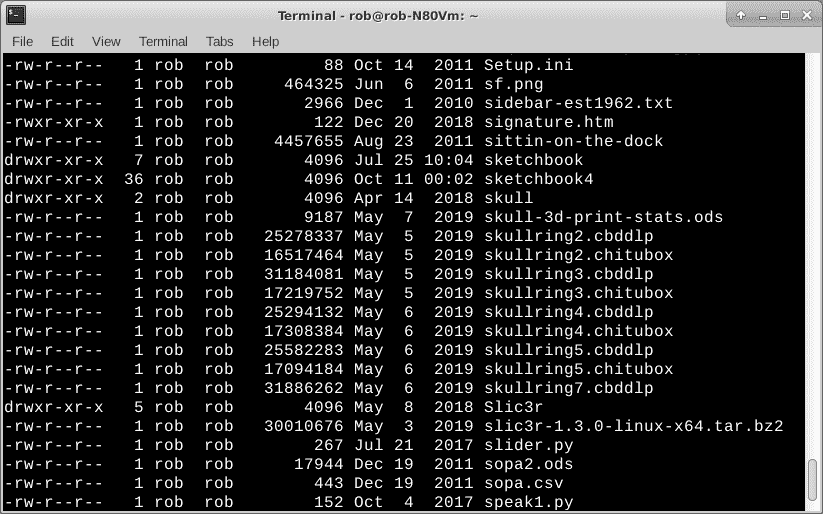
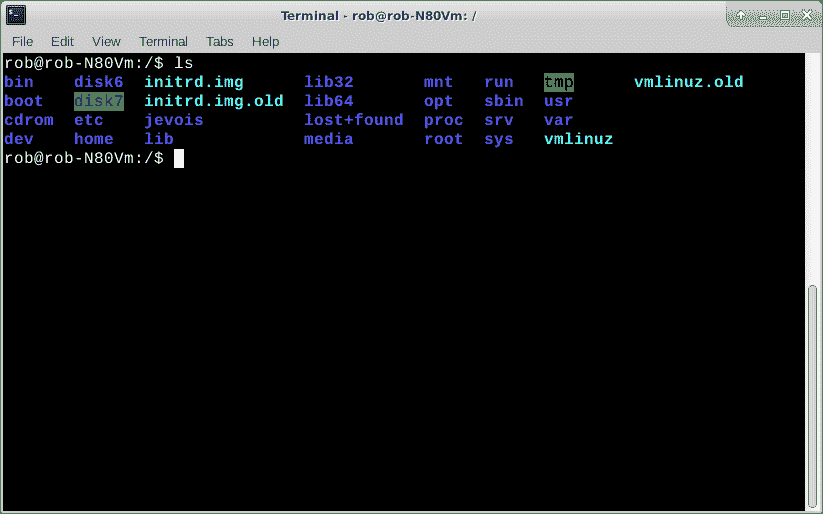

# 初级:了解 Linux 文件和目录

> 原文：<https://thenewstack.io/primer-get-to-know-linux-files-and-directories/>

文件和目录是 Linux 中的基本概念。文件包含内容和数据，而目录将这些文件组织成有意义的标准化组。掌握文件和目录的工作知识，特别是在 Linux 命令行上，可以让您自由地配置系统、自动化流程和轻松地操作数据。

今天，我们将从实际出发，看看 Linux 文件和目录的一些基础知识。我一直在用这种东西。

### 文件里有什么？

文件只是数据的容器。数据可以是程序、二进制数字、数字音频、视频、普通的旧文本或其他任何东西。

以普通用户的身份登录到您的 Linux 机器，打开一个终端窗口。在命令行中使用 ls 来获取您的主目录中的内容列表。

`rob% ls -l`

这是典型用户主目录的一部分。

/home/rob 目录的一部分

最左边的列是目录指示器和文件权限。向右移动，我们就有了所有者和组。再往前一点就是文件大小和创建日期。最后，最右边的一列包含文件或目录名。如果在最左边的列中有一个“d ”,那么这一行实际上列出了一个目录。

文件名通常包含字母和数字的组合，通常没有特殊字符。文件名中的大写字母和小写字母是有意义的，在 Linux 中不能互换使用。一个“抢。TXT”文件不同于“rob.txt”，尽管它可能包含完全相同的数据。它们是完全不同的文件名。同样，“Rob.txt”是一个不同于 roB.Txt 的文件，你明白了。

大多数 Linux 配置是通过使用文本文件来执行的。使用文本文件进行配置，即使您没有使用桌面或窗口类型的图形用户界面，也可以使用简单的命令行可读文本编辑器轻松地进行更改。我更喜欢使用 [vi](https://www.guru99.com/the-vi-editor.html) ，在终端窗口编辑文本文件。其他人喜欢一个叫做 [nano](https://www.howtogeek.com/howto/42980/the-beginners-guide-to-nano-the-linux-command-line-text-editor/) 的程序。

文件扩展名通常反映了文件中的内容。例如，“rob.txt”包含人类可读的文本。rob.wav 文件包含 wav 格式的数字音频。程序使用标准的文件扩展名。例如，一个. odt 文件就是一个 LibreOffice 文档。在 Windows 世界中，. ppt 文件是 Microsoft PowerPoint 幻灯片堆栈。

整个地图上的文件大小各不相同。一个简单的 Linux shell 脚本或十几行的文本文件可能只有几千字节(KB)大小。另一方面，当前版本的 Linux，以. iso 镜像文件的形式，大小可能超过 1.5 千兆字节(GB)。了解文件大小总是有好处的，因为随着时间的推移，大文件会越积越多，填满您的磁盘空间。我喜欢在 ls 中使用-h 选项，以 KB 和 GB 为单位显示大小。

`rob% ls -lh`

好了，现在我们对文件有了更多的了解。他们到底在哪里？目录组织和分组你的文件。

### 我的文件在哪里？

Linux 文件系统看起来像一棵倒置的树。目录只是 Linux 文件系统树上的一个分支。其他操作系统称目录为文件夹。它们是一体的。你可能会认为文件是树枝上的叶子。您还可能有更小的分支(子目录)以及它们的叶子(文件)集合，甚至更小的分支(子子目录)。我的大多数目录都不会超过四五层。

最顶层的 Linux 目录称为根目录，用“/”(斜线)符号表示。“/”符号也索引较低级别的目录名。/etc 是包含 Linux 操作系统使用的辅助文件的目录名。我的用户文件和低级目录驻留在/home/rob 目录中。一些常见的 Linux 系统目录包括/etc、/bin、/home、/dev 和/sys。我的一些 rob 用户目录包括/home/rob/Downloads、/home/rob/music 和/home/rob/webdocs。使用您的用户名和密码登录会自动将您置于您自己的“home”目录，通常是/home/[您的用户名]。

这是一个典型根目录的截图。

典型的 Linux 根目录

您可以使用 **mkdir** 命令创建一个新目录，并随意命名。

`rob% mkdir tech`

在终端中执行这一行将在我的当前目录中创建“tech”目录。

我如何知道我在目录树中的位置？使用 **pwd** (当前工作目录)命令。

`rob% pwd`

创建了一个新的“tech”目录后，我们可以使用 cd 命令进入它。

`rob% cd tech`

注意，我没有使用/tech。这将把我放在“tech”子目录中的根(/)目录下，如果它存在的话。

通过使用完全限定的目录名，无论您在 Linux 文件系统树中的什么位置，都可以找到您的 tech 目录。假设您在/bin 目录中。键入以下内容。

`rob% cd /home/rob/tech`

现在你回到了你的技术目录。

然后，我可以通过简单地单独发布一张 **cd** 来返回我的主目录。这也适用于任何地方。您也可以通过发布一张 **cd 进入一个目录(到我的主目录)..**命令。我一直用这个。你甚至可以发挥想象力使用 **cd../..**向上转两个目录。

### 更进一步

熟悉 Linux 文件和目录的最好方法是开始使用 **cd** 、 **mkdir** 和 **ls** 命令来浏览树形结构。也可以用 cat 或 vi 查看一些文本文件。使用“VI[文件名. txt]查看文本文件。提示:使用 ESC 键，然后“:”，然后“q”退出 vi。使用 VI–help 列出命令行选项。

你也可能得到一个树莓 Pi 4，并把它作为你的教育平台。此外，您还需要一个 HDMI 显示器、键盘/鼠标垫、3 安培电源和至少一个空白的 16GB micro-SD 卡来使 Pi 运行。查看他们的“[入门](https://www.raspberrypi.org/products/raspberry-pi-4-model-b/)”页面。这样你就可以避免不可避免的错误，没有太多的痛苦，并在现有的 Linux、Windows 或 Mac 笔记本电脑上保持所有个人和生产工作的安全，避免学习过程中的意外事故。毕竟，Pi 产品系列是作为一种学习工具而设计的。

*在[doc@drtorq.com](mailto:doc@drtorq.com)或 407-718-3274 联系 [Rob "drtorq" Reilly](/author/rob-reilly/) 咨询、演讲约定和委托项目。*

Linux 基金会是新堆栈的赞助商。

来自 Pixabay 的 TeeFarm 的特征图像。

<svg xmlns:xlink="http://www.w3.org/1999/xlink" viewBox="0 0 68 31" version="1.1"><title>Group</title> <desc>Created with Sketch.</desc></svg>