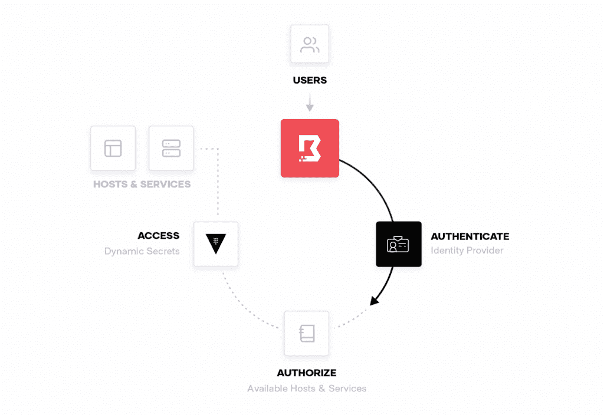
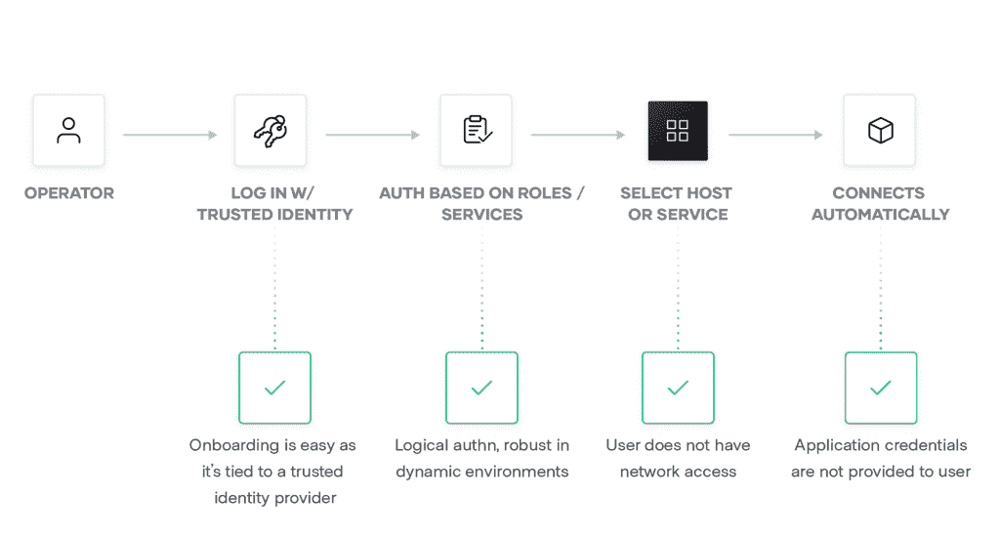

# 初级读本:HashiCorp Boundary 如何将云原生计算引入开发人员桌面

> 原文：<https://thenewstack.io/primer-how-hashicorp-boundary-brings-cloud-native-computing-to-the-developer-desktop/>

HashiCorp 的开源远程访问软件 [Boundary](https://www.boundaryproject.io/) ，上周在 [HashiConf](https://hashiconf.com/) 上发布，据[hashi corp](https://youtu.be/tUMe7EsXYBQ)联合创始人兼首席技术官 [Armon Dadgar](https://www.linkedin.com/in/armon-dadgar/) 的介绍，承诺为开发者提供一种简单的方式来连接云原生服务。

云原生正在转向零信任的安全方法，因此开发人员用来构建应用程序的远程访问工具需要更好地适应这种转变。Dadgar 说，有了 Boundary，“我们转向以身份为中心、策略驱动的安全方法，不再让用户直接访问凭据或直接访问私有网络。

传统上，需要访问数据库或其他内部资源的在家工作的开发人员或承包商需要获得访问组织专用网络的权限。他们可能使用 VPN 或 ssh，防火墙限制不需要的用户访问其他潜在的敏感区域。数据库本身可能也需要用户名/密码。

Dadgar 指出，这种方法有一些管理上的问题:ssh 密钥必须被分配，当不再需要时就取消配置，动态分配的 IP 地址必须被跟踪，最终用户必须被信任来保护他们的数据库登录。当然，一般来说，向私有网络分发密钥是一种安全隐患。

在 HashiCorp 的[新方法](https://www.hashicorp.com/blog/hashicorp-boundary)中，终端客户端没有被桥接回私有网络。“他们不能要求网关发起连接，”Dadgar 说。相反，用户由可信身份提供商(IDP)在本地进行身份验证，如 Active Directory。为了管理访问，组织根据基于角色的访问控制设置系统范围的策略配置文件，以确定最终用户具体可以访问哪些服务。例如，数据库管理员只能访问数据库。资源不是由它们的 IP 号码定义的，IP 号码在动态的云本地环境中总是变化的，而是由定义服务的标签定义的，抽象出低级配置设置。“我们将规定这一政策的粒度不一定是单个主机/单个 IP，而是逻辑服务，”Dadgar 说。

使用这种方法，不需要分发 VPN 或 SSH 凭证。在大多数情况下，用户甚至不需要应用程序凭证。对于那些需要认证但边界不认可的应用程序，临时证书或“秘密”可以由 [HashiCorp Vault](https://www.vaultproject.io/) 发布，以限制它们在野外存在的时间。

最终用户对此有何看法？它们有一个命令行界面(CLI ),其中边界命令 kicks 启动一个本地代理，该代理将处理与网关的授权流，通过策略代理检查权限。网关直接与目标系统建立连接。然后，用户像往常一样输入典型的命令，这些命令会通过隧道传回给应用程序。Boundary 也有一个网络用户界面，最终将提供一个桌面应用程序，提供一个可点击的可用服务目录。

在架构上，Boundary 有一组控制器，它们提供 API 并管理 API 调用。控制器是无状态的，尽管它们可以与键值存储交互来保存所需的信息和元数据。另一个组件 workers 负责将客户机连接到资源，与控制器通信以获得身份验证凭证。工作器和控制器都是可伸缩的，尽管最初它们都可以作为单个二进制文件运行。

在幕后，Boundary 依赖于 HashiCorp 的开源 [Terraform](https://www.terraform.io/) 基础设施即代码供应工具，该工具管理策略和配置(尽管假设控制器是 API 驱动的，也可以使用其他方法)。这些策略不是在 IP 层表达的，而是作为逻辑服务表达的。Terraform 在“动态主机集”上运行，这些主机集为与不同的动态分配的服务提供商(如 Amazon Web Services 或 Kubernetes)一起运行提供了必要的元数据。

[https://www.youtube.com/embed/tUMe7EsXYBQ?feature=oembed](https://www.youtube.com/embed/tUMe7EsXYBQ?feature=oembed)

视频

<svg xmlns:xlink="http://www.w3.org/1999/xlink" viewBox="0 0 68 31" version="1.1"><title>Group</title> <desc>Created with Sketch.</desc></svg>