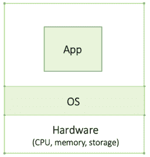
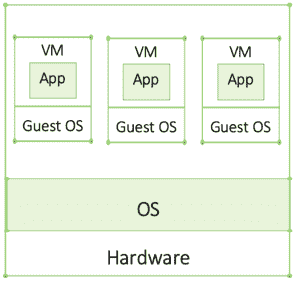
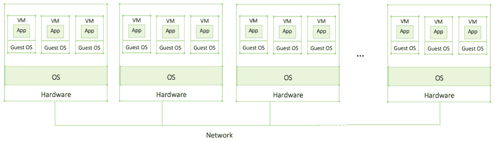
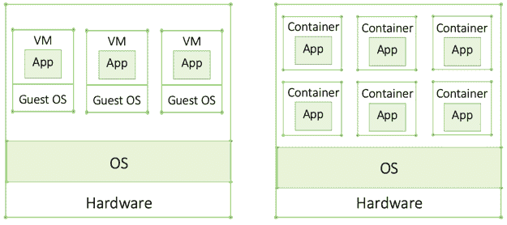
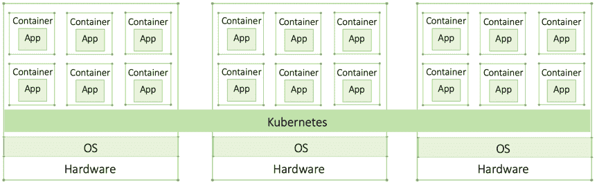
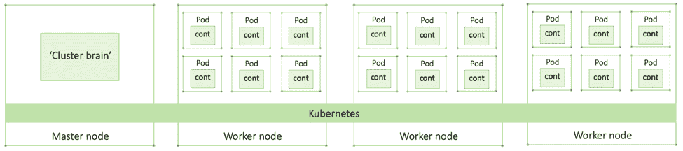
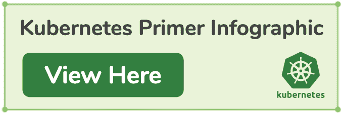

# 初级读本:Kubernetes 是如何产生的，它是什么，以及为什么你应该关注它

> 原文：<https://thenewstack.io/primer-how-kubernetes-came-to-be-what-it-is-and-why-you-should-care/>

 [凯瑟琳·帕格尼尼

凯瑟琳·帕格尼尼在 Kublr 领导营销工作。从战略到战术，Catherine 帮助 Kublr 宣传云原生技术的无限力量，塑造品牌，并与增长保持同步。在加入这家科技初创公司之前，凯瑟琳曾在博思艾伦汉密尔顿(Booz Allen Hamilton)和华盛顿邮报(Washington Post)等知名机构推广 B2B 服务。她最近发现自己热衷于打破复杂的 IT 概念，以便没有技术背景的人可以轻松理解云原生技术和数字化转型给我们带来的当前技术革命。](https://www.linkedin.com/in/catherinepaganini/en/) 

当我开始为企业级 Kubernetes 平台 Kublr 进行营销时，我需要考虑一下 Kubernetes。我在互联网上阅读了一些文章，与我们的技术团队进行了交谈，并在某种程度上理解了基本概念。然而，我并没有真正了解全貌。我意识到我需要放大，放大。大部分文章和技术人员都是从非技术人员一般不具备的语境假设出发的。所以，我读了一本*计算机科学导论*，然后继续学习分布式系统，天啊，我有没有啊哈时刻！

最终理解新堆栈所基于的核心概念是如此具有启发性，我想与所有那些努力理解这种开源技术是什么以及为什么它如此具有革命性的人分享我的新发现。

让我从理解 Kubernetes 从何而来所需的基本概念开始:背景。对于技术人员来说，这可能听起来非常简单，也应该如此。我们的目标是提供一个简化的概述来理解全局。我将从单台计算机开始，转到虚拟机，然后简要讨论分布式应用程序。如果您已经熟悉了这些概念，请随意跳到对您来说是新的内容。

[https://www.youtube.com/embed/XfBrtNZ2OCw](https://www.youtube.com/embed/XfBrtNZ2OCw)

视频

## 裸机

计算机由硬件组成，主要是中央处理器(CPU)、内存和存储器，运行不同的应用程序或程序。操作系统(OS)是位于硬件之上并管理这些资源的软件。操作系统之上是应用程序(例如，笔记本电脑上的 Outlook 或微软堆栈)。操作系统会安排每个应用程序何时可以访问哪些资源，以确保每个应用程序都有足够的资源来顺利运行(虽然 Outlook 和 Word 可能感觉像是同时运行，但事实并非如此。信不信由你，你的电脑不能多任务处理。程序一次运行一个。然而，间隔如此之快，以至于它们似乎同时运行——这就是操作系统的魔力！).应用程序与硬件无关，它们只与操作系统交互。这个原则被称为抽象:一个在另外两个层(硬件和应用程序)之间起中介作用(操作系统)的层。应用程序不需要知道任何关于硬件的事情，因为操作系统管理一切。

在虚拟化出现之前，无法隔离同一台机器或服务器上的应用程序。在处理任务关键型应用程序时，公司通常会在每台服务器上安装一个应用程序，以避免一个应用程序崩溃时会拖累另一个应用程序。在每台机器上运行一个应用程序是非常昂贵的，因为每台机器都必须拥有该应用程序在高峰期可能达到的最大资源容量，即使它只在百分之一的时间里达到该容量，这是一种计算资源的低效使用。像这样的机器(没有虚拟机)被称为裸机。

协同定位应用程序优化了资源利用率。由于所有应用程序不太可能在同一时间达到峰值(您只需协同定位不太可能达到峰值的应用程序)，因此应用程序可以共享峰值容量，从而显著降低资源需求。虚拟化通过消除一个应用崩溃和影响协同定位应用的风险，实现了这一点。

## 虚拟机

虚拟机(VM)是“包装”应用程序的代码，假装是硬件。在虚拟机内部运行的代码认为虚拟机是一台独立的计算机，因此有了“虚拟机”这个术语就像物理机器一样，虚拟机也需要操作系统。在虚拟机中运行的操作系统称为来宾操作系统，而在真实计算机上运行的操作系统称为主机操作系统。

由于没有影响协同定位的应用程序的风险，多个应用程序现在可以在一台服务器上运行，从而实现更高效的资源利用，这在当时是一场真正的革命。

从应用程序的角度来看，在虚拟机上运行和在真实的物理机上运行没有区别。然而，从系统管理员的角度来看，虚拟机要方便得多，因为添加或删除虚拟机要容易得多，从而简化了日常基础架构管理。

## 大型企业应用程序和分布式系统

企业应用程序可能非常庞大，通常需要比单台机器所能处理的更多的计算能力。可能还需要同时运行多个程序的并行计算。为了实现这一点，多台机器通过一个网络连接起来，形成一个分布式应用程序/系统。分布式系统的两个主要特征是:( 1)自治的虚拟机或物理机的集合;( 2)对最终用户(可以是个人或应用程序)来说，它表现为一个单一的连贯系统。

一起工作的一组机器形成一个集群；每台机器被称为一个节点。为了让集群实现共同的目标，节点必须进行通信或“交换消息”在网络上，交换数据、给出或接受命令、提供状态更新等。

这里的关键概念是集群或分布式系统成为一个强大的机器，即使节点可能不一定位于相同的物理位置。

除非我们处理的是整体应用程序(通常是作为一个单一实体构建的较旧的应用程序)，否则这些大型分布式应用程序都是模块化的，并被分解为放置在虚拟机中的几个组件。这简化了更新、修复和部署。这也意味着，如果一个组件崩溃，整个系统不一定会崩溃。

## 容器:新的轻量级虚拟机

容器是虚拟化发展的下一步。与需要消耗额外资源的客户操作系统的虚拟机不同，容器更加轻量级。这意味着您可以在一台机器上部署比虚拟机多得多的容器，这也是一个显著的效率提升。

容器的另一个很大的好处是它们是便携的。可移植性意味着它们可以在任何环境下工作，并且可以在任何环境之间移动(例如，将应用程序从数据中心迁移到云)，而不会影响应用程序。应用程序所需的一切都在容器中，使其完全独立于环境——这是 it 领域的另一个巨大发展。

另一方面，使用虚拟机时，基础架构依赖性仍然存在。不同的云或数据中心有不同的虚拟化工具。这意味着我不能将驻留在本地的虚拟机移动到使用自己的虚拟化技术的亚马逊云中。移动应用程序需要将其放入特定环境的虚拟机中，并进行进一步的配置和测试。这带来了额外的风险，必须仔细计划和准备。如果您迁移容器，所有这些都是不必要的，为公司节省了大量资源。

## 微服务

微服务是被分解成更小组件的应用程序。每个微组件被称为一种服务，因此称为微服务。更多组件意味着需要更多虚拟机或容器。事实上，容器需要的资源少得多，这使得微服务对许多组织来说是可行的，这就是为什么我们现在听到这么多关于它们的消息。

放置在容器中，每个微服务都是相互隔离的。为什么这是有益的？独立组件越小，构建、测试、部署、调试和修复就越容易。显然，在几行代码中找到一个 bug 要比在数百行代码中容易得多。因为它们是独立的，所以当新特性或更新被证明有问题时，回滚也更容易。但是微服务应该有多微呢？定义它的一种方式是可以在一周内构建、测试和部署的代码。

## 容器编排器

如果具有数百个虚拟机的传统应用程序迁移到容器，它现在可能由数千个容器组成。可以想象，手动管理它们是不可能的。这就是像 Kubernetes 这样的容器编排工具的用武之地。orchestrator 确保正确数量的容器启动并运行，并在必要时介入修复。它自动化了许多原本非常繁琐的手动工作，这使得它无法扩展。container orchestrator 跨越整个集群，并抽象出底层资源(集群中的硬件，如 CPU、内存和存储)。

虽然市场上有一些容器编制器(Docker Swarm 是一个众所周知的例子)，但 Kubernetes 赢得了容器战争，2018 年所有主要的云提供商都采用了它。

## Kubernetes 登上世界舞台

Kubernetes 最初由谷歌开发，并于 2014 年捐赠给开源社区，是目前最热门的开源项目之一。如果你正在读这篇文章，你可能知道它很大，但是它到底是做什么的？

看待 Kubernetes 的一种方式是将其视为某种类型的数据中心或集群操作系统。如上所述，集群只不过是运行在本地、云中、物理和/或虚拟机(是的！您可以混合搭配)，它通过网络连接，对用户来说就像一台大型计算机。集群资源由 Kubernetes 管理，就像您的操作系统管理笔记本电脑的资源一样。开发人员不必担心他们的应用程序应该使用哪个 CPU 或内存，Kubernetes 会处理这些问题。

### 集群组件

一个群集由一个主节点和多个工作节点组成。所有节点都是 Linux 主机(运行在 Linux 上的机器)，尽管最近 Kubernetes 也开始支持 Windows 节点。实际的容器化应用程序运行在 worker 节点上。每个容器都被放在一个容器中——一个类似沙盒的环境，除了托管和分组容器之外，它并不扮演主要角色。要扩展一个应用程序，您可以使用它们各自的容器来扩展 pod，而不仅仅是容器。

主节点是集群的大脑。这是所有控制和调度决策制定的地方。它通过监视循环确保应用程序窗格按照声明性状态的定义启动并运行(更多内容见下文)。除系统应用程序外，主服务器上不运行任何应用程序。它的功能完全集中在监控和管理集群上。

### Kubernetes 的好处

Kubernetes 带来了许多强大的功能，最具革命性的是:

**声明性状态**—Kubernetes 的核心是声明性模型。开发人员声明他们的应用程序的期望状态(例如，多少个 pod 副本和什么配置等。他们的应用程序需求), Kubernetes 实现了监视循环，以确保集群不会偏离期望的状态。这是一个非常强大的功能，支持自我修复和扩展。

**自我修复** —由声明性模型支持，Kubernetes 确保集群始终匹配声明性状态。这意味着当有差异时它会自我修复。如果 Kubernetes 检测到偏差，Kubernetes 会介入并修复它(例如，如果一个 pod 出现故障，将部署一个新的 pod 来匹配所需的状态)。

**自动扩展** — Kubernetes 能够在容量达到峰值时自动扩展(增加更多节点和/或单元)(例如，更多人在周五晚上观看《网飞》,需要更多来自网飞服务器的计算资源),并在峰值后再次降低。这是一笔巨大的资产，尤其是在现代云中，成本是基于消耗的资源的。

### Kubernetes 很棒，但是…

Kubernetes 真的很难。专业知识很难找到，它也不是一个成熟的、现成的解决方案。Kubernetes 和容器只是拼图的一部分。为了在生产中运行 Kubernetes 上的应用程序，企业需要一整套技术。您将需要一些东西来进行日志记录和监控(收集和分析应用程序指标，以了解一切是否顺利)、基于角色的访问控制(通常缩写为 RBAC)(以确保只有那些应该访问集群的人才可以访问集群)、灾难恢复等等。配置和微调这些不同的技术，使它们能够很好地与 Kubernetes 一起工作不是一件容易的事情，需要大量的资源——时间、金钱和高度专业化的技能。此外，Kubernetes 的季度发布时间表意味着，公司必须跟上定期更新。大多数组织既没有资源也没有内部专业知识来部署纯开源的 Kubernetes。

Kubernetes 的复杂性催生了众多的 Kubernetes 解决方案。只要参观一下官方的 Kubernetes 会议 [KubeCon](https://events.linuxfoundation.org/events/kubecon-cloudnativecon-north-america-2019/) ，你就会看到一整个展厅都是 Kubernetes 的解决方案——都在努力简化 Kubernetes 的采用。虽然有些针对某个特定领域(如 Portworx、Linkered)，但其他一些则侧重于更广泛的领域，如安全性、合规性和运营(如 Kublr)。乍一看，它们都是 Kubernetes 的解决方案，在这个领域导航可能会非常混乱。然而，虽然这个空间看起来很拥挤，但实际上并不拥挤，至少没有看起来那么拥挤。

## 业务影响

将应用程序分解为微服务使得今天的大型云企业(如亚马逊、谷歌、优步)能够快速推出新功能和更新，或者在它们不能按计划工作时回滚。这为他们提供了快速适应的灵活性，超过了更多传统的竞争对手。这一趋势给更传统的组织带来了巨大的压力，因为它们的变革步伐明显变慢了。当前数字化转型的趋势是由这些技术为其采纳者提供的竞争优势所驱动的。随着越来越多的公司采用这些技术，组织也被迫采用它们，否则就有被淘汰的风险。

容器和 Kubernetes 彻底改变了当今公司的经营方式。软件在商业成功中扮演着越来越重要的角色，这些技术使软件能够以越来越快的速度改进和适应市场需求。今天，它不再是一个垂直排列的部门；它横向贯穿整个组织。每个部门都是由软件实现的，无论是提供关于市场趋势的宝贵见解的新数据分析工具，还是根据客户需求定制内容的人工智能平台，都可以增加保留率。谁适应和进化得更快，谁就有竞争优势。

既然我们已经做到了这一点，那就让我们把另外三个相关的术语放到上下文中:云原生、DevOps 和数字化转型——所有这些都是这一趋势的一部分。**云原生栈**，也称为新栈，用于构建云原生应用。云原生应用被定义为容器化的、动态编排的(也称为 Kubernetes)和面向微服务的。虽然是为云开发的，但是云原生堆栈并不受云的限制。今天，许多企业在内部部署容器和 Kubernetes，有时甚至在有空气间隙的环境中(与外部世界完全隔离、没有连接的环境)。事实上，Kublr 的许多用户都是为了这个特殊的用例来找我们的。

**DevOps，**云原生技术支持的方法，集成了开发、IT 运营、质量保证和 IT 安全。如果实施得好，它会转化为更好的代码、更低的成本以及更有动力的团队。然而，要实现这一目标，需要组织内部进行巨大的文化转变。事实上，经验表明采用新的堆栈更容易(这已经很有挑战性了！)而不是改变企业文化，接受这种完全不同的做事方式。

**数字化转型**是描述这一整体趋势的更宽泛的术语。它指的是将组织转变为敏捷的软件优先的方法，以应对快速变化的技术发展的过程——这是保持当今竞争力的必要条件。借助新的堆栈和 DevOps 方法，数字化转型得以实现，并变得更加高效和灵活。

我希望这为您提供了必要的背景来继续阅读并了解这个令人兴奋的领域。我们目前正在见证一场真正的 IT 革命，了解正在发生的事情非常令人兴奋！如果这篇文章有帮助或者你有任何意见，请随时给我发 [tweet。](https://twitter.com/CathPaga)

<svg xmlns:xlink="http://www.w3.org/1999/xlink" viewBox="0 0 68 31" version="1.1"><title>Group</title> <desc>Created with Sketch.</desc></svg>