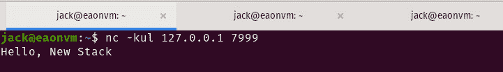
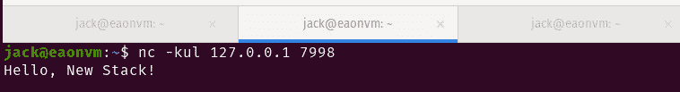

# 初级读本:XDP 和 eBPF 如何通过 Linux 内核加速网络流量

> 原文：<https://thenewstack.io/primer-how-xdp-and-ebpf-speed-network-traffic-via-the-linux-kernel/>

偶尔，一个新的流行词或首字母缩略词出现，它背后真的有重量。XDP ( [eXpress 数据路径](https://www.iovisor.org/technology/xdp))就是这种情况。这项技术允许开发者在 Linux 内核中将 [eBPF 程序](https://thenewstack.io/how-ebpf-turns-linux-into-a-programmable-kernel/)附加到一个由网络设备驱动程序实现的低级钩子上。XDP 类似于数据平面开发套件(dpdk)，但不会与驱动程序分离。

有许多方法可以获得高性能数据包处理的性能优势。其中一种方法是内核旁路，它将 NIC 的控制权交给用户空间程序，以大大减少由上下文切换、网络层处理和中断等引入内核的开销。当您以更高的网络速度(10Gbps 或更高)工作时，这就变得很重要了。

然而，内核旁路方法有几个缺点。首先，用户空间程序需要编写自己的驱动程序。这是开发人员的额外工作。此外，当内核空间被用户空间取代时，内核中的所有网络功能都会被跳过。这意味着用户空间的程序员将不得不在他们的工作中加入必要的功能。最后，用户空间程序(在内核旁路方法下)将在沙箱中运行，这使得它很难与操作系统的其他领域集成。

这些限制正是 XDP 成为高性能网络宠儿的原因。使用这种方法，用户空间程序将被允许直接读写网络包数据，并在包到达内核级之前决定如何处理它。换句话说，用户空间负责一些开销，所以这些决策和操作的大部分都单独放在内核的肩上。

## XDP 和 eBPF 一起工作

XDP 不是一种语言。相反，XDP 使用 [eBPF](https://ebpf.io/) 编程语言来访问底层内核钩子。然后，在可以为传入分组分配套接字缓冲区之前，该挂钩由网络设备驱动程序在入口流量处理功能内实现。

让我们看看这两者是如何协同工作的。这个突出的例子来自 Jeremy Erickson，他是一名高级 R&D 开发人员，在 [Duo](https://duo.com/labs) (现在是思科的一部分)工作。我们将通过 Ubuntu 20.04 来说明 Erickson 的例子。所以为了跟进，你应该准备好一个 Ubuntu 实例。我们要做的是展示 XDP 和 eBPF 在 C 和 Python 的帮助下协同工作。这其实是一个相当有趣的小实验。

您需要做的是 SSH 到您的 Ubuntu 实例四次(使用四个不同的终端)。成功登录后，我们将创建一个. py 文件和一个. c 文件。Python 文件将作为我们的 XDP 加载器来加载 XDP 程序。c 文件)放入数据路径。

使用以下命令创建 Python 文件:

`nano main.py`

在该文件中，粘贴以下内容:

```
#!/usr/bin/env python3

from bcc import BPF

import time

device  =  "lo"

b  =  BPF(src_file="filter.c")fn  =  b.load_func("udpfilter",  BPF.XDP)b.attach_xdp(device,  fn,  0)

try:  b.trace_print()except KeyboardInterrupt:  pass

b.remove_xdp(device,  0)

```

如您所见，上述文件的大部分功能都使用了 BPF。

保存并关闭文件。

接下来，使用以下命令创建实际的 XDP 程序

`nano filter.c`

在该文件中，粘贴以下内容:

```
#define KBUILD_MODNAME "filter"
#include &lt;linux/bpf.h&gt;
#include &lt;linux/if_ether.h&gt;
#include &lt;linux/ip.h&gt;
#include &lt;linux/in.h&gt;
#include &lt;linux/udp.h&gt;

int udpfilter(struct xdp_md *ctx)  {
bpf_trace_printk("got a packet\n");
void *data  =  (void *)(long)ctx-&gt;data;
void *data_end  =  (void *)(long)ctx-&gt;data_end;
struct ethhdr *eth  =  data;
if  ((void*)eth  +  sizeof(*eth)  &lt;=  data_end)  {
struct iphdr *ip  =  data  +  sizeof(*eth);
if  ((void*)ip  +  sizeof(*ip)  &lt;=  data_end)  {
if  (ip-&gt;protocol  ==  IPPROTO_UDP)  {
struct udphdr *udp  =  (void*)ip  +  sizeof(*ip);
if  ((void*)udp  +  sizeof(*udp)  &lt;=  data_end)  {
if  (udp-&gt;dest  ==  ntohs(7999))  {
bpf_trace_printk("udp port 7999\n");
udp-&gt;dest  =  ntohs(7998);
}
}
}
}
}
return XDP_PASS;
}

```

我们再次利用 BPF 让 XDP 成为现实。

保存并关闭文件。

万一您的 Ubuntu 机器没有安装 Python，请使用以下命令:

`sudo apt-get install python3 -y`

您可能还需要安装一些依赖项。这可以通过以下三个命令来完成:

`sudo apt install clang llvm libelf-dev libpcap-dev gcc-multilib build-essential -y`

`sudo apt install linux-tools-$(uname -r)`

`sudo apt install linux-headers-$(uname -r) -y`

现在，转到第一个终端窗口，运行以下命令:

`nc -kul 127.0.0.1 7999`

以上命令将创建到环回设备的任意 TCP 连接，监听端口 7999。

在第二个终端上发出命令:

`nc -kul 127.0.0.1 7998`

这次我们监听 7998 端口。

从第三个终端，我们将发出命令:

`nc -u 127.0.0.1 7999`

发出上面的命令后，键入以下内容(在终端 3 中):

`Hello, New Stack!`

按下键盘上的回车键，你应该会看到“你好，新堆栈！”在第一个终端窗口的输出中(图 1)。



图 1:我们的消息在第一个终端上打印出来。

为什么消息会在第一个终端上打印出来？因为我们将消息发送到了 7999 端口。

好，使用[Ctrl]+，退出所有三个命令。

我们现在要演示的是，使用 Erickson 的便捷加载程序和程序，XDP 如何将该消息从监听端口 7999 重新路由到端口 7998。为什么会这样？在 **filter.c** 程序中使用 BPF，数据包被重新路由到 7998 端口……所有这些都是在用户空间(而不是内核空间)完成的。

在相同的终端中发出与上面相同的命令。一旦所有命令都监听了它们所需的端口，就进入第四个终端并发出命令:

`sudo python main.py`

回到第三个终端(在那里运行了命令 nc -u 127.0.0.1 7999 ),并键入:

`Hello, New Stack!`

如果您转到第一个终端(端口 7999)，您将看不到该消息。但是，如果您查看第二个终端(端口 7998)，您会看到消息(图 2)。



图 2:数据包在用户空间中被重新路由到不同的端口。

您还会在 4 号航站楼看到重复打印的以下内容:

`b'    Raven.Server-26114 [000] .Ns1 54853.031451: 0: got a packet'`

这是一个使用 eBFP 将 XDP 程序加载到数据路径以重新路由网络数据包的非常简单的例子。这是一项非常强大的技术，可能会对 Linux 在高速网络和从用户空间到内核空间的数据包传输方面的性能产生巨大的影响。

<svg xmlns:xlink="http://www.w3.org/1999/xlink" viewBox="0 0 68 31" version="1.1"><title>Group</title> <desc>Created with Sketch.</desc></svg>