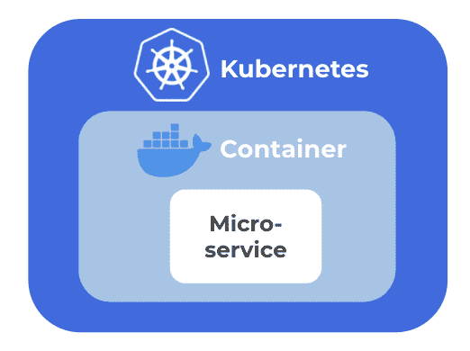

# 微服务解释

> 原文：<https://thenewstack.io/primer-microservices-explained/>

在本文中，我将讨论什么是微服务，这个概念从何而来，以及它们为什么重要。我们将从微服务的简史以及它们与单片系统设计的比较开始。然后，我们将讨论支撑微服务架构的一些原则，它们潜在的缺点，以及像容器和 Kubernetes 这样的现代工具如何适应。

## 微服务是如何产生的

 [凯瑟琳·帕格尼尼

凯瑟琳是 Linkerd 的创建者 buppy 的营销主管。作为一名营销领导者，Catherine 热衷于向业务领导者介绍新堆栈及其提供的关键灵活性。](https://www.linkedin.com/in/catherinepaganini/en/) 

当组织开始构建更复杂的应用程序，编写单一应用程序的实践变得越来越有问题时，微服务就出现了。

传统上，应用程序是作为整体构建的，所有代码都集中在一个大的代码库中。由于不同功能之间没有明确的区分，当你更新应用程序的一部分时，你可能会无意中影响到一个完全不同的部分。要推出一个简单的更改，您必须重新部署整个应用程序，如果出现问题，一切都会受到影响，而不仅仅是您想要更新或扩展的组件。

虽然前者可以通过将单片分成模块(半独立组件)来解决，这种方法已经存在了几十年，但它从未真正流行起来，即使它可能比实现微服务简单得多。

然而，工程师们确实开始模块化应用程序。从基于对象的架构风格到面向服务的架构(SOA)再到微服务，应用架构变得越来越分离(要了解关于软件架构的更多信息，请查看主题为的本[初级读本)。](https://thenewstack.io/primer-understanding-software-and-system-architecture/)

SOA 获得了相当多的关注，但很大程度上失败了，主要是因为它留下了许多没有答案的问题，比如如何正确地拆分服务。基于微服务的架构是一种更规范的 SOA 类型，它源于真实世界的用例，并已被众多组织成功采用。

独立云顾问 [Sam Newman](https://samnewman.io/) 认为微服务只不过是一种模块化架构，其中模块运行在通过网络通信的不同进程上。这使得微服务成为寻求解耦系统的持续架构发展的最新高潮。

## 什么是微服务？

微服务是小型自主应用程序组件，它们共同构成一个应用程序。他们从 SOA 继承了基本的操作模型，但是以更规范的方式扩展了它。微服务通常被认为是代码库的独立部分，由单个团队维护。

它们为什么重要？要更新应用程序，可以独立更新和部署微服务，而不必重新部署整个应用程序。它们还允许单个应用程序团队完全专注于单个业务流程，而无需理解整个应用程序。

微服务的特征是什么？在高层次上，所有微服务都应该保持可独立部署，这是微服务背后的核心设计理念。为了支持这一点，微服务具有以下属性:

*   松散耦合:每个服务都是自治的，只是松散地连接到系统的其余部分。这意味着它有自己的生命周期，可以独立部署、更新、扩展和删除。
*   高内聚:具有相关行为的代码被分组在一起。你不想在应用程序中传播行为。否则，每次您想要更新行为时，您必须更新应用程序中的不同部分，每个部分代表一个额外的版本。这不仅更加耗时，而且还增加了风险。通过将所有相关的行为组合在一起，工程师只在他们想要改变某个特定行为的时候在一个地方更新代码。要更深入地了解这个话题，请参见[领域驱动设计(DDD)](https://martinfowler.com/bliki/DomainDrivenDesign.html) 。
*   信息隐藏:每个微服务只共享其他服务需要的数据，并且只隐藏与自己的进程相关的数据。数据共享可能会无意中导致耦合，因此应该始终小心谨慎。

为了作为一个内聚的应用，所有这些不同的自治服务通过网络接口在网络上通信。这个网络和网络上的通信量带来了新的挑战。顺便说一下，这正是服务网格适合它的地方。但是我将在另一篇文章中讨论这些内容。

现在我们知道了什么是微服务，让我们来探究为什么组织会采用它们。

## 微服务优势

无论是通过将服务与团队相结合来解决“人的问题”，还是通过降低采用新技术的风险来加速创新，或者简化部署和可扩展性，采用微服务都会带来诸多好处。让我们仔细看看:

*   自治团队:微服务允许小团队完全掌控服务的整个生命周期。这增加了责任性、代码质量和工作满意度。对于大多数大型组织来说，这种“人的方面”是采用微服务方法的主要原因之一。
*   技术异构性:理论上，开发人员可以用不同的语言和不同的技术构建每个服务。这使得开发人员能够为特定服务选择最佳技术，而不是更传统的标准化、一刀切的方法。也就是说，使用太多不同的技术确实会增加开销，许多组织限制他们来应对这种情况。
*   降低采用新技术的风险:开发人员还可以在低风险服务中试验新技术，因为他们知道如果出现问题，不会影响系统的其余部分。由于风险是采用新技术的最大障碍，这是一个巨大的优势。
*   弹性:当一个组件发生故障时，它不一定会蔓延到系统的其他部分。这个问题在特定的服务中仍然是孤立的，允许每个应用程序组件成为它自己的故障域。但是请注意，一个应用程序只有在其架构允许的情况下才具有弹性。如果没有良好的代码实践，如跟踪、可观察性和断路，小故障仍然会在复杂系统中级联。
*   可扩展性:要扩展任何一项功能，您只需扩展微服务，而不是扩展整个整体应用。
*   易于部署:要更新一行代码，只需更新和重新部署特定的微服务，而不是重新部署整个整体。相反，回滚服务要比回滚整个应用程序容易得多。像 Docker、OCI 容器和 Kubernetes 这样的工具极大地降低了推出和回滚的成本。
*   可更换性:更换作为关键任务应用程序一部分的微服务比更换关键任务应用程序要容易得多(也没那么可怕)。微服务可以一个接一个地重写或更新，直到整个系统更新，这大大降低了一次性更新一个巨大的整体的风险。

## 分组微服务

微服务实现是否成功很大程度上取决于服务如何分组。如上所述，SOA 实现举步维艰的原因之一是它们缺乏定义服务边界的指导。让我们看看微服务是如何解决这个问题的。

### 将业务领域分解成有界的上下文

每个微服务都有一个围绕业务领域建模的特定功能。业务领域解决特定的业务问题，这是应用程序的首要目标。以 Gmail 为例。它的业务领域包含了使世界各地的人们能够通过电子邮件进行交流的所有功能。

一个业务领域由多个[有界上下文](https://martinfowler.com/bliki/BoundedContext.html)组成:与相同应用行为相关的代码。Gmail 具有多种功能，包括撰写、发送和接收、存档、搜索等。这些都有可能形成这样一个有界的上下文。我们来看看作曲。

要撰写电子邮件，您需要多种功能，包括文本编辑、自动更正、格式化等等。所有这些函数可能都有与相同应用程序行为相关的代码，形成一个有界的上下文。有界上下文中的函数也必须高度了解彼此。例如，自动更正必须知道我输入的每一个字符才能正常工作。这些有界的上下文代表了自然的微服务边界。

但是请注意，相关行为不一定与功能一一对应。可能存在跨越特征障碍的类似行为。因此，请记住，微服务边界通常很复杂，由个人判断决定。有界上下文和单个特征可能不总是一致的。

## 以分离的方式协作

微服务由高度相关的行为组成，这些行为被捆绑到一个容器中，形成一个独立的单元。但是即使适当地容器化，仍然存在耦合的风险。这些容器化的服务必须相互通信或集成才能协作，而集成也可以是耦合的来源。

解耦你的系统就是能够独立地改变它的一部分而不影响系统的其他部分。

需要相互了解的服务越少，它们就越自治。更大的自主权带来更大的弹性。理想情况下，如果一个服务崩溃，其他服务仍然能够提供应用程序的降级版本。

虽然解耦系统是最终目标，但 100%解耦并不总是可能的。服务以不同的方式通信，您使用哪种技术实际上是由应用程序本身决定的。

## 网络传播的作用

微服务通过它们的应用编程接口(API)在网络上通信。为了发送和接收消息，它们必须就这些消息的封装方式达成一致。这些包规则是由协议决定的，也就是您的“网络通信规则”你可能对 HTTP 很熟悉。这是网络上常用的协议。还有更多这样的协议。

沟通的协调方式不同。您可以将它们大致分为同步通信和异步通信。

同步有点像座机。您建立连接并交换信息，当您连接时，您不能接听任何其他电话。这种类型的通信通常用于请求/响应消息，其中一个服务发送请求并等待另一个服务响应。当它等待时，两个服务都被阻塞。可以想象，这只有在连接速度快如闪电的情况下才可行。

以这种方式通信的服务通常以一种协调的方式运行。Orchestrated 指的是一些服务比其他服务更“聪明”的系统，告诉它们做什么。

就耦合而言，带有编排行为的同步通信不允许完全解耦。服务相互了解，并相互提供方向。如果“智能服务”中的一个出现故障，“哑”服务可能不知道该怎么办。

异步通信更像电子邮件。你给某人发一封电子邮件，然后继续你的生活。一旦你得到回应，你就会再次参与。这就是异步通信的本质:服务发送一条消息，并继续执行它所做的任何事情，直到收到响应。当网络不可靠或距离较远时，通常使用这种通信方式。它通常与发布-订阅(或发布-订阅)模式一起使用，在这种模式下，一个服务发布一个事件，任何订阅它的人都会得到通知。

这种类型的通信允许编排的服务行为。在精心设计的系统中，智能更均匀地分布在所有服务中，每个服务都了解自己在系统中的角色。

具有编排行为的基于发布-订阅的系统可以被视为“解耦系统中的凯迪拉克”一个服务只是发布事件，不知道谁订阅了它。另一个服务订阅由所谓的消息代理管理的事件。他们谁也没有真正意识到对方。移除或添加服务甚至不会被其他服务注意到。这些系统非常灵活，可以以最小的风险进行更新。

那么为什么不是所有的系统都是精心设计的发布-订阅系统呢？这种灵活性是有代价的。建立这样一个系统是复杂的，需要大量的时间和精力。然而，一旦启动并运行，这可能是您的最佳选择。

并不是所有的应用程序都值得这样做。这就是为什么你还会看到使用异步和/或协调系统的高度现代化的基于微服务的应用。

## 什么时候应该使用微服务架构？

开发和维护基于微服务的应用程序要比处理设计良好的单片多得多。我们已经看到微服务有很多强大的优势，但它总是最好的方法吗？不，除非有令人信服的理由，否则应用程序所有者应该总是默认编写 monoliths。

根据经验，小型团队的小型应用程序最好使用整体架构，而大量团队同时工作的大型应用程序可能更适合使用微服务方法。当您需要扩展、性能或弹性优势，并且这些优势超过复杂性和计算资源方面的额外成本时，可以从单一应用开始，然后将其分解为微服务。何时是转折点，很大程度上取决于您的用例。没有灵丹妙药，你必须在仔细考虑后做出决定。

你可以在早期做的是保持一个干净的、模块化的代码库。当您开始运行和扩展应用程序时，这将使构建和扩展变得更加容易，并且当您开始将整体应用分解为微服务时，这将降低您的成本和工作量。

## 集装箱和 Kubernetes 如何融入？

在微服务的背景下，你会听到很多关于容器和 Kubernetes 的内容。让我们探索一下它们之间的联系。

如上所述，每个微服务都放在一个容器中，这是一种新的打包机制，在概念上类似于超轻型虚拟机(VM)，有助于保持微服务的分离(注意，虽然容器在概念上类似于 VM，但它们不提供相同的隔离或安全保证)。虽然微服务先于容器，但容器使微服务变得更简单、更具成本效益。

[Kubernetes 管理(或协调)你的集装箱化微服务车队](https://thenewstack.io/primer-how-kubernetes-came-to-be-what-it-is-and-why-you-should-care/)确保他们有足够的资源并正常运行。它充当容器的某种数据中心操作系统。

简而言之，微服务包含业务逻辑，即提供业务价值的代码。容器有助于打包微服务，使它们与系统的其余部分分离。Kubernetes 管理在特定系统中运行的所有服务。容器和 Kubernetes 在现代基于微服务的应用中起着关键作用。它们简化了每项服务的打包和管理，也是微服务如今如此受欢迎的原因之一。

## 结论

正如我们所看到的，微服务通过不断的架构演变来寻求解耦系统。虽然它们比整体方法提供了更多的灵活性，并提供了令人难以置信的强大功能，但这些好处是以复杂性为代价的。组织必须仔细考虑采用微服务方法是否适合他们。

在微服务的背景下，你会听到很多关于容器和 Kubernetes 的内容。这是因为它们是重要的技术创新，为微服务提供了巨大的价值。如今，大多数使用微服务方法的组织都通过容器和 Kubernetes 来实现它。

要了解更多关于微服务的信息，请查看 Sam Newman 的书“[构建微服务](https://samnewman.io/books/building_microservices/)”这是一本很好的读物，提供了更多的细节。

* * *

非常感谢 [Sam Newman](https://samnewman.io/) 花时间回顾、提供反馈并分享他对这个话题的一些新观点。也非常感谢[杰森·摩根](https://www.linkedin.com/in/jasonmorgan2/)的所有投入和深思熟虑的讨论。感谢 [Carol Scott](https://www.linkedin.com/in/carolscott/) 和 [Elise Serbaroli](https://www.linkedin.com/in/eliseserbaroli/) 的宝贵反馈。

由 [Sangga Rima Roman Selia](https://unsplash.com/@sxy_selia?utm_source=unsplash&utm_medium=referral&utm_content=creditCopyText) 在 [Unsplash](https://unsplash.com/?utm_source=unsplash&utm_medium=referral&utm_content=creditCopyText) 上拍摄的特写图片。

<svg xmlns:xlink="http://www.w3.org/1999/xlink" viewBox="0 0 68 31" version="1.1"><title>Group</title> <desc>Created with Sketch.</desc></svg>