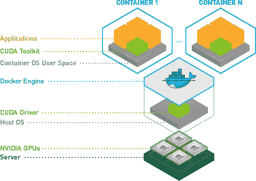
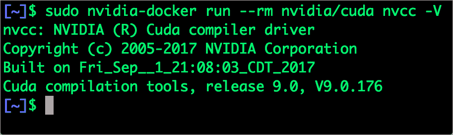

# Nvidia 入门-Docker -容器与 GPU 相遇的地方

> 原文：<https://thenewstack.io/primer-nvidia-docker-containers-meet-gpus/>

GPU 对于训练深度学习模型和神经网络至关重要。虽然基于线性回归和逻辑回归的简单模型可能不需要它，但围绕卷积神经网络(CNN)和递归神经网络设计的复杂模型严重依赖 GPU。尤其是基于 Caffe2、TensorFlow 等框架的计算机视觉相关模型，对 GPU 有依赖性。

在监督机器学习中，使用一组特征和标签来训练模型。深度学习算法甚至不需要显式特征来进化训练好的模型。他们从现有的用于训练、测试和评估的数据集中“学习”。

在最终模型形成之前，神经网络对成千上万的矩阵进行复杂的计算。当一幅图像被传送到 CNN 时，它会被转换成一个实数矩阵。根据图像的密度和大小，神经网络会生成多个这样的矩阵。在前向传播和后向传播期间，这些矩阵与其他矩阵相加并相乘，直到导出适当的权重。

经过训练的模型可以在 CPU 上运行进行推理。由于推理不像训练那样激烈，所以在运行模型进行推理时，GPU 是严格可选的。

CPU 不是为处理如此快速的计算而设计的。虽然它们在执行常规数字运算时速度更快，但 CPU 并不意味着并行数学运算。这就是 GPU 发挥至关重要作用的地方。他们可能没有 CPU 的马力，但他们可以执行大规模并行计算。

## Nvidia CUDA 和 cuDNN

传统程序无法直接访问 GPU。他们需要一个特殊的并行编程接口来将计算转移到 GPU。最受欢迎的显卡制造商 Nvidia 创建了[Compute Unified Device Architecture](http://developer.download.nvidia.com/compute/cuda/1.0/NVIDIA_CUDA_Programming_Guide_1.0.pdf)(CUDA)，作为 GPU 上通用计算的并行计算平台和编程模型。有了 CUDA，开发人员将能够通过利用 GPU 的能力来显著加快计算应用程序的速度。

在支持 GPU 的应用中，工作负载的顺序部分继续在 CPU 上运行，这针对单线程性能进行了优化，而应用的并行计算密集型部分被卸载，以在数千个 GPU 内核上并行运行。为了集成 CUDA，开发人员使用 C、C++、Fortran、Python 和 MATLAB 等流行语言进行编程，通过一些基本关键字形式的扩展来表达并行性。

深度学习网络和神经网络严重依赖 CUDA 进行并行计算。Nvidia 还开发了一个专门的库，名为 [CUDA 深度神经网络库](https://developer.nvidia.com/cudnn) (cuDNN)，这是一个 GPU 加速的深度神经网络原语库。cuDNN 为标准例程提供了高度优化的实现，例如前向和后向卷积、池化、规范化和激活层。

全球深度学习研究人员和框架开发人员依赖 cuDNN 进行高性能 GPU 加速。这使得他们可以专注于训练神经网络和开发软件应用程序，而不是花时间在低级别的 GPU 性能调优上。cuDNN 加速了广泛使用的深度学习框架，包括 Caffe2、MATLAB、微软认知工具包、TensorFlow、Theano 和 PyTorch。

## NVIDIA-Docker——弥合容器和 GPU 之间的鸿沟

2016 年，Nvidia 为 Docker 创建了一个名为[的运行时 Nvidia-Docker](https://github.com/NVIDIA/nvidia-docker) 。这个开源项目的目标是将容器的易用性和敏捷性引入 CUDA 编程模型。

由于 Docker 本身并不支持 GPU，这个项目立刻在 CUDA 社区引起了轰动。Nvidia-Docker 基本上是 docker CLI 的一个包装器，它透明地提供了一个具有必要依赖关系的容器，以便在 GPU 上执行代码。只有在使用 Nvidia-Docker run 执行使用 GPU 的容器时才有必要。

您可以在安装了 GPU 和所需驱动程序的 Linux 机器上运行 Nvidia-Docker。有关先决条件的详细信息，请参考 Nvidia-Docker 的 [Github](https://github.com/NVIDIA/nvidia-docker) 存储库上的[自述](https://github.com/NVIDIA/nvidia-docker/blob/master/README.md)。



下面是我用来在一台由 Nvidia Quadro P4000 GPU 驱动的 Ubuntu 16.04 机器上安装和验证 Nvidia-Docker 的命令。

```
$  curl  -s  -L  https://nvidia.github.io/nvidia-docker/gpgkey |  sudo apt-key add -

$  curl  -s  -L  https://nvidia.github.io/nvidia-docker/ubuntu16.04/amd64/nvidia-docker.list | sudo tee /etc/apt/sources.list.d/nvidia-docker.list

$  sudo apt-get update

$  sudo apt-get install  -y  nvidia-docker

$  sudo pkill  -SIGHUP dockerd  # Restart Docker Engine

$  sudo nvidia-docker run  --rm nvidia/cuda nvidia-smi

```


nvidia-smi 命令运行系统管理接口(smi)来确认 Docker 容器能够访问 GPU。在幕后，SMI 与 Nvidia 驱动程序对话，以与 GPU 对话。

我们还可以通过运行下面的命令来验证是否安装了 CUDA。

```
$  sudo nvidia-docker run  --rm nvidia/cuda nvcc  -V

```



数据科学家和开发人员可以使用这个 Docker 图像作为运行流行的神经网络框架(如 TensorFlow、Apache MXNext、Microsoft CNTK 和 Caffe2)的基础。

## Kubernetes 怎么样？

[谷歌 Kubernetes 引擎](https://cloud.google.com/kubernetes-engine/) (GKE)增加了对 GPU 的测试支持。这是首批托管的 Kubernetes 服务之一，增加了对英伟达特斯拉 K80 和特斯拉 P100 GPU 的支持。这一增加为开发人员和数据科学家开辟了有趣的途径。我们现在可以在 Kubernetes 中训练深度学习模型和神经网络。不仅仅是机器学习，任何需要访问 GPU 的可并行化工作负载如视频渲染或游戏开发都可以利用这一特性。

作为一个对容器充满热情的深度学习爱好者，我非常兴奋地看到 GPU 对 Kubernetes 的支持。我把一些咖啡模型移植到 GKE 进行试水。测试版的整体体验相当流畅。

在接下来的多部分教程中，我将向您介绍创建基于 GPU 的 Kubernetes 集群所需的所有步骤，训练卷积神经网络(CNN)，并在没有 GPU 的开发机器上运行用于推理的训练模型。虽然该教程没有深入研究深度学习和 CNN 的概念，但它确实给了你在 Kubernetes 上启动模型训练所需的一切。

敬请期待！

<svg xmlns:xlink="http://www.w3.org/1999/xlink" viewBox="0 0 68 31" version="1.1"><title>Group</title> <desc>Created with Sketch.</desc></svg>