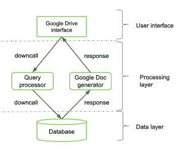
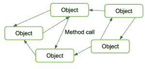
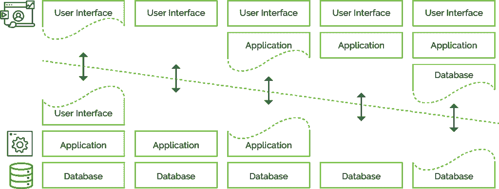
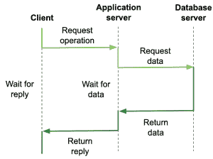
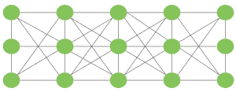

# 初级读本:理解软件和系统架构

> 原文：<https://thenewstack.io/primer-understanding-software-and-system-architecture/>

这篇文章是

[ongoing series](https://thenewstack.io/author/catherine-paganini/)

来自凯瑟琳帕格尼尼，专注于为商业领袖解释 IT 概念。这篇文章提到的一些关键概念在她之前的

[Distributed Systems Primer](https://thenewstack.io/primer-distributed-systems-and-cloud-native-computing/)

文章。

 [凯瑟琳·帕格尼尼

凯瑟琳·帕格尼尼在 Kublr 领导营销工作。从战略到战术，Catherine 帮助 Kublr 宣传云原生技术的无限力量，塑造品牌，并与增长保持同步。在加入这家科技初创公司之前，凯瑟琳曾在博思艾伦汉密尔顿(Booz Allen Hamilton)和华盛顿邮报(Washington Post)等知名机构推广 B2B 服务。](https://www.linkedin.com/in/catherinepaganini/en/) 

随着技术成为一个关键的区分因素，企业领导越来越多地与 IT 领导进行战略讨论，以更好地了解他们开发的解决方案将如何满足他们的业务需求。在这个关键时刻，他们必须对软件和系统架构的工作原理有一个基本的了解，并了解选择正确的架构将如何影响最终的业务应用程序或解决方案的可用性、可伸缩性、灵活性等。这一高层次的概述将有望为更好地开展此类交流提供所需的背景。对于需要理解、部署和管理分布式云原生系统的系统架构师来说，这种处理方式会特别有意义。

[正如我们在上一篇文章](https://thenewstack.io/primer-distributed-systems-and-cloud-native-computing/) ，中概述的，分布式系统是复杂的软件。为了掌握这种复杂性，系统必须被适当地组织起来。让我们从区分两个关键的组织概念开始:软件架构和系统架构。

**软件架构**是指将分布式系统逻辑组织成软件组件。分布式系统被分解成多个组件，而不是一个大的整体应用程序。这些组件的分解方式会影响从系统性能到可靠性再到响应延迟的方方面面。

**系统架构**是指这些软件组件在物理机器上的放置。两个密切相关的组件可以共处一地或放置在不同的机器上。组件的位置也会影响性能和可靠性。

由此产生的**架构风格**最终决定了组件如何连接、数据如何交换，以及它们如何作为一个连贯的系统一起工作。

## 软件体系结构

有许多不同的架构风格，包括分层架构、基于对象的架构、面向服务的架构、RESTful 架构、发布/订阅架构等等。所使用的样式最终取决于应用程序。此外，当您开始构建更复杂、互连的系统时，分布式系统的规模会不断扩大。因此，通信等流程必须简化。

### 1.分层架构

让我们从分层架构开始。在分层体系结构中，组件是按层组织的。较高层上的组件进行向下调用(向较低层发送请求)。虽然较低层的组件可以进行向上调用(发送请求),但它们通常只响应较高层的请求。

以 Google Drive/Docs 为例:

1.  **界面层**:你请求查看你硬盘上的最新文档。
2.  **处理层**:处理你的请求，从数据层索取信息。
3.  **数据层**:存储持久数据(也就是你的文件)并提供对更高层的访问。

数据层将信息返回给处理层，处理层又将信息发送给界面，您可以在界面上查看和编辑信息。虽然它看起来像是一个内聚的过程，但它被分解成三个不同层上的三个(或更多)组件。每一层可能放在不同的机器上，也可能不放在不同的机器上(这是一个系统架构问题)。

*Google Drive/Doc 查看请求的简化组织*

### 2.面向对象、面向服务的架构、微服务和网状架构

面向对象、面向服务的架构(SOA)、微服务和“网状”架构都是更松散的组织，代表一个进化序列。虽然我们将它们归类在一起，但面向对象不是一种架构风格，而是一种编程方法，它使面向服务的架构(SOA)和微服务成为可能。

#### 基于对象的架构风格

对象的快速注释

在里面，任何东西都可以是物体。然而，在面向对象架构的上下文中，它指的是如上所述的可区分但又相互链接的应用程序组件。如果您听到它在不同的上下文中谈论对象，它们不一定指应用程序组件(尽管所有组件都是对象)。

面向对象编程是一种通常用在单片应用环境中的方法(尽管它也用在更现代的架构中)。在 monolith 中，逻辑组件作为对象组合在一起。虽然它们是可区分的组件，但对象仍然高度相互关联，不容易分离。面向对象是一种在单片中组织功能和管理复杂性的方法。

每个对象都有自己的封装数据集，称为**对象的状态。**你可能听说过有状态和无状态应用程序，指的是它们是否存储数据。在这种情况下，状态代表数据。一个**对象的方法**是对该数据执行的操作。

对象通过**过程调用机制**连接。在过程调用期间，一个对象“调用”另一个对象以获得特定的请求。所以当你听到“过程调用”的时候，想一个请求。

*基于对象的架构风格*

**面向服务的架构**

对象构成了将服务封装成独立单元的基础，从而导致了 SOA 的发展。服务是利用其他服务的自包含、独立的对象。通信通过发送到每个接口的“消息”在网络上进行。

**微服务**

微服务是这一进化序列的下一步。这些微服务比 SOA 中的服务更小，耦合度更低，也更轻量级。然而，从业务角度来看，更重要的区别是它们缩短上市时间的能力。

与 SOA 不同，开发人员需要在部署服务之前设计和规划所有的交互和接口(这个过程可能需要几个月)，微服务更加独立，允许开发人员推出更新，而不用担心架构细节。此外，开发人员可以使用他们想要的任何编程语言。为特定程序选择最佳语言进一步提高了速度，从而加快了上市时间。

**网状架构**

网状架构是由运行在节点上的服务或流程形成的，这些节点不容易被考虑。他们可能经常连接和断开，有些人甚至不使用互联网。这些服务建立临时的点对点连接，并在整个过程中保持匿名。例子是点对点技术，如 TOR、torrents、p2p 信使、区块链等。

网状架构带来了两个额外的特性:

1.  **交互服务/流程更加统一**:网状网络中可能只有少数甚至一种类型的服务参与。他们被认为是平等的——例如，如果我们谈论安全性，他们同样值得信任或不值得信任。这与传统的基于服务的体系结构有很大的不同，在传统的基于服务的体系结构中，通常有许多不一致的服务。
2.  **更强调它的分布式**。

即使在组件之间的连接很容易中断的高度不稳定的环境中，网格技术也能够保持高效。一些组件，在某些情况下甚至是大多数组件，不是直接连接的。相反，它们通过其他系统元素在多个“跳”上通信(消息从一个元素“跳”到另一个元素，直到到达其目的地)。

虽然您可以看到从面向对象编程到 SOA、微服务和网格架构的演变，但这并不意味着这种方法已经过时。面向对象仅仅是指在一个组件或整体内部的块的分离。这是一种曾经使用过的方法，现在仍然在使用。事实上，您可以开发面向对象的微服务，其中微服务由对象组成。

### 3.表述性状态转移(REST)或 RESTful 架构

REST 是一种广泛用于 Web 的架构风格(一种 Web 原生架构)。分布式系统被视为一个巨大的资源集合，由组件单独管理。在 REST 的上下文中，资源是一种独特的服务形式，遵循以下约定:

*   他们理解有限的命令集，通常仅限于上传、获取、删除和发布
*   只有一种(基于 URL 的)命名方案
*   资源接口遵循相同的约定和语义
*   消息是完全自描述的
*   在对资源执行操作后，资源会忘记来自客户端的调用的所有内容，除了服务状态中的结果更改

最后一个属性叫做**无状态执行**。

为什么对命令和接口规范有这么多限制？嗯，想想那些必须通过互联网进行通信的千差万别的系统。通过标准化接口和减少命令，开发兼容的系统就容易多了。REST 基本上是一种简化，用于处理像互联网这样的大型分布式系统中的多样性。

尽管有这些限制性的命令，开发人员有足够的灵活性来表达他们需要的任何东西。这是因为 URL，一个描述性的资源地址，包含了表达操作所需的所有细节。我们以HTTPGETHTTP://Amazon . com/shopping cart/546/items/12345为例。这个命令是一个从购物车“546”中获取商品“12345”的请求关于它是什么以及在哪里可以找到它的所有细节都在 URL 中表达出来了。

### 4.发布-订阅架构

发布-订阅，或者像技术人员说的，发布/订阅，是一个更加松散耦合的架构，允许进程轻松地加入或离开。这里的关键区别是服务如何通信。服务不是调用并获得响应，而是发送单向的、通常是异步的消息，通常不发送给特定的接收者。他们依靠配置人员、管理员或开发人员来配置谁将接收什么消息。在某些情况下，接收者自己可以注册接收消息。顺便说一下，这就是你获得突发新闻推送通知的方式。例如,《华盛顿邮报》,发布了一条被归类为“突发新闻”的新闻，任何订阅这些更新的人都会收到。

发布/订阅最适用于网络可靠性经常成为问题的移动应用。如果一个移动应用程序依赖服务呼叫，一旦失去连接，你就会得到糟糕的用户体验。另一方面，使用 pub/sub，你可以稍后获得更新(例如，最糟糕的情况是，其他人在你之前发现了特朗普的最新推文)，但用户体验本身不会受到影响。

## 系统架构

系统架构包含关于在哪里放置特定软件组件的决策。某些组件应该放在同一台服务器上还是不同的机器上？企业可能拥有特定的高速处理服务器或高端可靠的存储设备，他们希望将这些设备用于特定的组件。这些决定将导致不同类型的架构组织。我们可以把他们大致分为集权型和分权型组织。

### 1.集中式组织:客户机-服务器系统

服务器是实现特定服务(例如数据库服务)的进程。客户端是从服务器请求服务的进程。客户端发送请求并等待回复(请求-回复行为)。这些过程的物理分布将导致不同的**多层架构**风格。

还记得上面讨论的三层(接口、处理、数据层)吗？虽然我们区分了三个逻辑级别，但是有几种方法可以跨机器物理地分布客户机-服务器应用程序。

最简单的组织是使用两种类型的机器:1)具有用户界面的客户机(第一层)，以及 2)包含实现过程**和**数据的程序的服务器接口(第二层和第三层)。在这种情况下，一切都由服务器处理，而客户端只不过是一个哑终端。这被称为**(物理上)两层架构**。然而，在两台机器上还有其他方法来分离这三层。可能性范围从上面提到的分离到让除了存储的数据之外的所有东西都在客户机上运行。你可以在下图中看到这些不同的变化。

*物理两层三层架构的变体。*

在**(物理上)三层架构**中，其中一个服务器还必须充当客户端。该应用程序分布在三台机器上，一台客户机和两台服务器。其中一个服务器可能需要来自另一个服务器的输入来处理客户端请求，充当客户端。

*三层架构:一个客户端和两个服务器，应用服务器也充当客户端。*

多层客户机-服务器体系结构是将分布式应用程序分成用户界面、处理组件和数据管理组件的直接结果。不同的层直接对应于应用程序的逻辑组织(软件架构对应于系统架构)。这被称为**垂直分布**，其中逻辑上不同的组件被放置在不同的机器上。这使得每台机器都可以定制特定的功能，例如，将处理层放在高端处理服务器上。

### 2.分散式组织:对等系统

在现代架构中，客户端和服务器本身是分布式的，即所谓的**水平分布**。客户端或服务器在物理上可能是分离的，但每个部分都在自己的完整数据份额上运行，从而平衡了负载。因此，每个组件都有自己的数据集，而不是拥有一个所有组件都可以访问的数据存储，这可能会成为一个瓶颈。这些被称为**点对点系统**。每个进程同时充当客户端和服务器，通常被称为**服务器**。

对等架构围绕如何在**覆盖网络**中组织流程的问题而发展，覆盖网络中的节点由流程组成，链接代表可能的通信通道。

通过覆盖网络连接的对等系统网络。

正如我们所看到的，有多种方式将应用程序组织成逻辑组件(软件架构考虑)。分层、面向对象/服务、REST 还是发布/订阅是最好的方法，这在很大程度上取决于应用程序。然后，这些组件被放置在不同的物理机器上(系统架构考虑)，或者以客户端-服务器方式，或者以对等方式。在我们的文章“[初级读本:理解云原生对架构的影响](https://thenewstack.io/primer-understanding-the-cloud-native-impact-on-architecture/)”中，我们讨论了云原生如何打破更多传统技术的壁垒，使企业能够快速适应市场需求。

*像往常一样，非常感谢 [Oleg Chunikhin](https://www.linkedin.com/in/olegch/) 帮助我们获得所有技术细节。叶夫根尼* *[皮什纽克](https://www.linkedin.com/in/evgeny-pishnyuk-03440111/)也提供了宝贵的反馈。*

<svg xmlns:xlink="http://www.w3.org/1999/xlink" viewBox="0 0 68 31" version="1.1"><title>Group</title> <desc>Created with Sketch.</desc></svg>