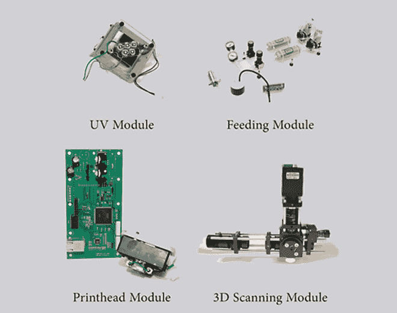
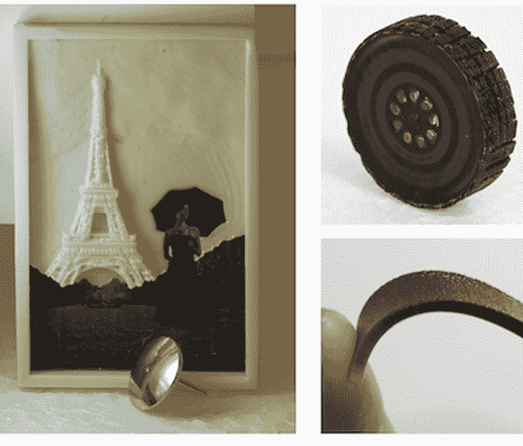
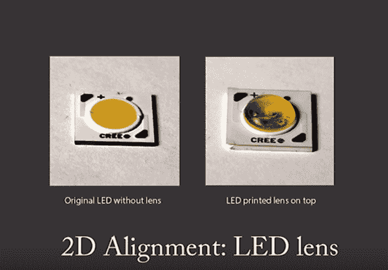
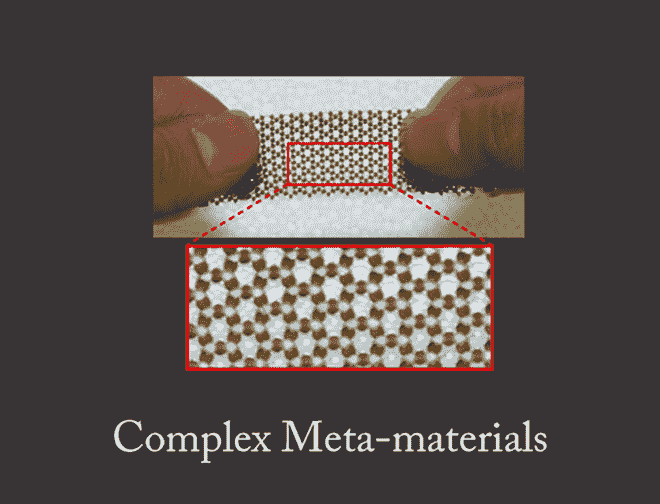
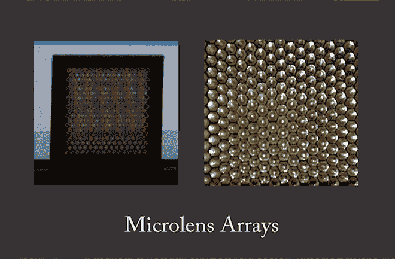

# 一台来自麻省理工学院的打印机可以看到并打印它所看到的东西

> 原文：<https://thenewstack.io/printer-mit-can-see-print-views/>

近年来，围绕 3D 打印有很多炒作，观察家们预测传统设计流程将发生彻底变革。3D 打印等技术被描述为不断发展的“T0”设计民主化，它将颠覆传统的生产和销售方式，许多人预测桌面 3D 打印机最终将进入许多家庭。这场制造业革命是正在发生还是炒作[仍有待辩论](https://www.zdnet.com/article/3d-printing-dont-believe-all-the-hype/)，但很明显[有些事情正在进行](http://phys.org/news/2015-06-hype-3d-bridge-future.html)。

现在，3D 打印似乎将从麻省理工学院计算机科学和人工智能实验室建造的原型中获得巨大的推动，该原型不仅可以同时打印多达 10 种材料，而且价格实惠。

## 具有机器视觉的 3D 打印机

被称为 MultiFab 的“视觉辅助多材料”3D 打印机在几个重要方面区别于以前的“多材料”机器。首先，它使用了被称为“T8”的机器视觉“T9”，使它比它的前辈更有优势。与语音识别类似，采用一个或多个摄像头的机器视觉系统赋予了计算机“看”的能力——来自视觉的数据被转换并发送到计算机或控制器。机器视觉使 MultiFab 能够提供高分辨率的 3D 扫描和打印功能，公差高达 40 微米，不到人类头发宽度的一半。

[https://www.youtube.com/embed/poRFPjiB9vw?feature=oembed](https://www.youtube.com/embed/poRFPjiB9vw?feature=oembed)

视频

机器视觉还使 MultiFab 能够“自我校准和自我校正”，这是一种节省时间的功能，大多数传统 3D 打印机的用户都可以欣赏，因为典型的 3D 打印机需要为每个项目进行一些手动校准，并且可能必须进行几次试打印。MultiFab 有一个反馈系统，可以“循环”3D 扫描并检测每一层中的任何差异，从而创建一个方便的“校正掩模”,提高效率和准确性。

CSAIL 的研究工程师哈维尔·拉莫斯(Javier Ramos)说，这是一个与传统 3D 制造工艺不同的先进平台，他与[计算制造小组](http://cfg.mit.edu/)的成员共同撰写了这篇论文，该论文在本月早些时候提交给了 SIGGRAPH 会议:

> 该平台为制造业开辟了新的可能性，使研究人员和爱好者能够创造出以前难以甚至不可能打印的物体。

## 功能齐全的打印机

不仅如此，原型实际上允许用户打印和镶嵌复杂的组件，如传感器和电路，直接到任何物体上，消除了逐个打印由不同材料制成的各种组件，然后再组装它们的需要。这种复杂的计算 3D 打印形式允许完整、完全成形的产品——即使是带有移动部件的产品——基本上是一次完成的。

这种同时进行的多部件印刷还辅以更细致的材料处理。MultiFab 不像其他 3D 打印机那样使用注射器在低分辨率的挤出过程中喷出塑料，而是从喷墨打印机样的头中射出精确的微滴感光聚合物。结合其 3D 扫描功能，这意味着 MultiFab 可以扫描一个对象，然后在原始对象周围打印必要的组件。

【T2

最重要的是，这台机器是由低成本的现成零件制成的，建造成本仅为 7000 美元——与其他多材料打印机相比，这是一个巨大的折扣，因为其他多材料打印机一次只能打印三种材料，价格相当于在郊区买一栋房子。

到目前为止，该团队已经在手机上打印了智能手机外壳，并直接在 LED 灯上打印了镜头。他们预计，这种系统将创造出一系列由复杂的“超材料”制成的意想不到的产品，如果他们未来试验嵌入式执行器和电机的计划成功，有朝一日将在消费电子、医疗成像、微传感甚至机器人领域取得巨大进展。

那么这对设计、工程和生产的未来意味着什么呢？该团队认为这一发展是朝着 3D 打印多材料、全功能物体的“圣杯”迈出的一步——就在打印机上。拉莫斯说，它有望彻底改造设计堆栈:“设计师和工程师习惯于用一种材料进行设计。因此，整个设计模式必须改变，这将需要新的硬件、新的软件和全新的平台。我们将不得不改变美国工程师和设计师思考设计、创造产品和物品的方式。”

图片:麻省理工学院 CSAIL。

<svg xmlns:xlink="http://www.w3.org/1999/xlink" viewBox="0 0 68 31" version="1.1"><title>Group</title> <desc>Created with Sketch.</desc></svg>