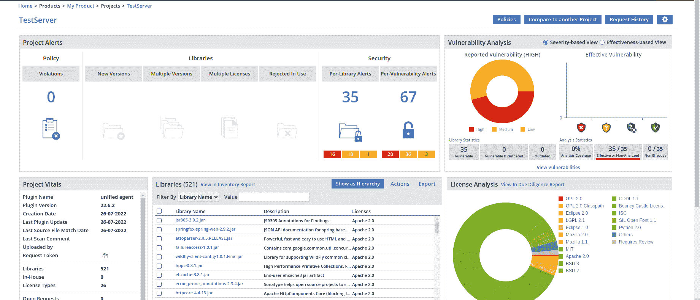

# 通过动态可观察性区分运行时漏洞的优先级

> 原文：<https://thenewstack.io/prioritize-runtime-vulnerabilities-via-dynamic-observability/>

弄清楚如何最好地识别代码库中的潜在漏洞，并快速将这些漏洞的缓解措施投入生产，是企业软件开发中的一个主要挑战。

现有的方法往往是开发人员最头疼的问题，因为它们不够准确，花费太多的时间和精力，并且会扰乱开发人员的工作流程。开发人员可以冒险忽略一个漏洞并保持交付正常进行，或者投入大量的时间和精力找出哪些漏洞是真正的漏洞并推迟它们的发布。

## 第三方库:喜忧参半

据估计，企业应用程序中 60%到 80%的代码来自第三方代码(库、组件和软件开发工具包)，这主要是由于开源软件在企业中的广泛使用。

这意味着许多部署到生产中的代码不是由该组织的开发人员编写的，而是由代码所依赖的数百个(或者通常是数千个)第三方库的创建者和维护者编写的。这降低了成本，加速了软件开发，并受益于对这些库的广泛社区支持。

不幸的是，这也带来了巨大的风险，因为这些第三方来源(无论是商业提供的还是开源的)中的漏洞会影响整个软件供应链。例如，在流行的 [Log4j Java 日志记录实用程序](https://logging.apache.org/log4j/2.x/)中发现的 [Log4Shell 漏洞](https://www.cve.org/CVERecord?id=CVE-2021-44228)被国土安全部认定为[“历史上最严重的软件漏洞之一”](https://www.yahoo.com/video/log4j-software-flaw-endemic-cyber-152540923.html)

此类漏洞的传统补救方法包括静态应用程序安全测试(SAST)或软件组合分析(SCA)。这两种方法通过自动化工具不断地执行，很多时候是在持续集成(CI)工作中执行的。这些工具输出的问题是，它们提供了大量的信息，这些信息没有被开发人员正确地划分优先级或消化，因此，导致了大量的“噪音”、假阳性警报和发布速度的延迟。

在按需或通过 CI 计划执行这些工具时，开发人员通常会经历以下过程:

1.  查看结果列表，并优先考虑最紧急的结果。(请注意，许多漏洞可能具有相同的严重级别。)
2.  修复代码中存在的每个漏洞，以确保应用程序在所有攻击媒介下都是安全的。
3.  冲洗并重复。

我们应该清楚地区分从 SAST 工具和 SCA 工具接收的输出。SAST 工具只扫描内部源代码的安全漏洞，而 SCA 工具扫描第三方库，一旦它们确定哪些库正在被使用，它们就将这些库与已知漏洞列表( [CVEs](https://cve.mitre.org/) )进行交叉引用，以识别任何可能影响代码的漏洞。

下面的例子来自一个流行的 SCA 应用程序的仪表板，以及它带来的问题。请注意，近 50%的漏洞被视为高风险。

另外两个问题进一步加剧了这个问题:

1.  **传递依赖:**开发者使用的每个库都有一个它所依赖的其他库的列表，通常称为传递依赖。这使得潜在易受攻击的库的总数更高，没有办法确定哪些传递依赖项是实际需要的。
2.  **Docker 映像:**更多的库——每个库都有自己的一组 CVE——被打包在每个 Docker 映像中，没有办法知道它们为什么会在那里，以及是否需要它们。

考虑到上述情况，开发人员根本没有必要的信息来决定一个给定的漏洞是否重要。他们必须调查潜在的威胁，甚至确定它是否是真实的，这应该是这些工具的目的。

如果这还不够复杂的话，我们还会看到一个名为 [VEX](https://www.chainguard.dev/unchained/putting-vex-to-work) 的不断增长的漏洞问题优先级标准，它表明在许多情况下，90%的安全漏洞发现都是噪音，或者是不影响生产中运行代码的问题，因此正确的优先级划分和补救非常重要。

## **动态可观察性:为开发人员提供在运行时区分漏洞优先级所需的信息**

应用程序安全性的发展迈出了新的一步，通过为开发人员提供有效确定漏洞优先级所需的信息，可以大大减少这些问题。

开发人员需要关于生产中漏洞的存在和可利用性的更详细的信息，以确保他们致力于减轻最紧迫的(和真实的！)先威胁。

动态可观察性是理解实时应用程序中发生的任何事情的能力——无论应用程序部署在哪里，都是按需、实时的。

这种方法意味着您不像 SAST 那样扫描整个代码库的漏洞，也不像 SCA 那样扫描 CVE 的软件材料清单。

相反，动态可观察性允许开发人员和应用程序安全专家获得问题的答案*，这些问题实际上关系到漏洞对生产的影响*，例如:

*   确定给定的漏洞是否实际上是其应用程序执行路径的一部分。
*   确定哪些特定用户/客户容易受到攻击。
*   确定应用程序的哪些部分易受攻击。

我们已经看到采用[动态可观测性](https://lightrun.com)的用户的噪声降低了 85%,因为他们的大多数 CVE 实际上是不可利用的(或者根本不存在！)生产中。

除了降低噪声，这如何帮助确定漏洞的优先级？

假设您有三个代码模块，每个模块都有一定的漏洞。不要假设它们都需要紧急修复，您可以检查它们中的哪一个正在生产中运行该代码，并优先修复该代码模块。

这个过程可以用于任何和所有的安全漏洞。但是，让我们来看一个具体的例子，演示如何使用动态可观察性来确定运行时漏洞的优先级并消除误报。

## **使用动态可观察性区分漏洞优先级**

作为整体安全漏洞优先化流程的一部分，当过渡到动态可观察性解决方案时，开发人员可以遵循以下优化流程，并提高他们的整体工作效率，修复真正的高优先级问题和更安全的生产代码。

这个过程包括三个步骤。

**1。通过 SCA 工具或同等工具接收 CVE 警报。**

您会收到一条警报，通知您应用程序使用的某个第三方库中已标记了一个漏洞。

**2。确定漏洞对实际部署的影响。** 

使用 Lightrun 等平台，您可以调查:

*   该漏洞的代码实际上是在一个实时代码路径中加载的。
*   哪些用户/路径/客户受到影响。
*   漏洞的范围有多广(代码的哪些部分受到影响)。
*   漏洞被利用的频率(通过查看代码路径调用的数量)。
*   在代码的不同位置添加日志、拍摄快照和设置指标，以更好地了解漏洞的影响。

**3。根据对运行时应用程序的实际影响重新确定优先级。**

有了相关知识，您现在可以重新确定所有“关键”和“高”严重性漏洞的优先级，并以正确的顺序缓解它们。

## **对具有动态可观察性的漏洞进行优先级排序**

通过使用 Lightrun 之类的动态观察平台，您甚至无需离开您的集成开发环境(IDE ),就可以立即从实时应用程序中获取确定安全警报优先级所需的信息。

您可以直接查询在生产环境中运行的代码，并辨别代码中的哪些特定模块易受攻击，哪些不容易。这是您在确定安全警报的优先级和保持一点理智时需要的信息。

在最近的一个被归类为 [CVE- 2021-37136](https://cve.mitre.org/cgi-bin/cvename.cgi?name=CVE-2021-37136) 并由以下[代码提交](https://github.com/netty/netty/commit/41d3d61a61608f2223bb364955ab2045dd5e4020)引起的漏洞中，使用 Lightrun 平台的动态可观察性，我们能够扫描被利用代码的使用情况(具体来说是以下类名:“bzip2 block decompressor . Java:230”)，并确定代码在运行时没有被到达。

我们使用 Lightrun IDE 插件放置了一个虚拟断点，并确认作为应用程序运行时的一部分，此漏洞没有影响。

这种动态可观察性的最新发展使开发人员能够正确地确定安全警报的优先级，并大大减少误报的数量。他们可以花更少的时间在令人困惑的警报上绞尽脑汁，而有更多的时间来编写有价值的(安全的)代码。

<svg xmlns:xlink="http://www.w3.org/1999/xlink" viewBox="0 0 68 31" version="1.1"><title>Group</title> <desc>Created with Sketch.</desc></svg>