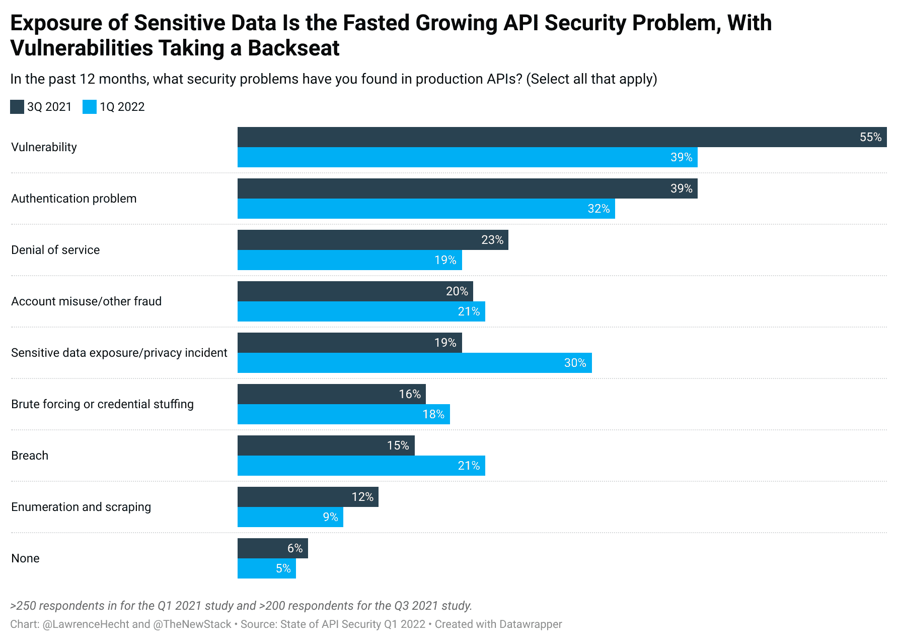

# 隐私作为 API 安全问题越来越突出

> 原文：<https://thenewstack.io/privacy-gains-prominence-as-an-api-security-concern/>

网络战成为头条新闻，但通过 API 暴露个人身份信息(PII)对大多数公司来说同样具有威胁性。根据 [Salt Security](https://salt.security/) 的最新[API 安全状态](https://salt.security/api-security-trends)报告，识别哪些 API 暴露了 PII 或敏感数据被认为是 API 安全平台中需要的一个重要属性。

虽然阻止攻击始终是重中之重，但人们意识到主动解决漏洞和利用说起来容易做起来难。

根据 Salt Labs 的数据，针对 API 的攻击数量的增长速度是已经达到白热化程度的整体 API 使用增长速度的两倍。然而，面对这些攻击，我们最大的收获是，在 250 多名调查受访者中，30%的人表示他们遇到了与“敏感数据暴露/隐私事件”相关的 API 问题，而在 Salt Security 的 2021 年第 3 季度研究中，这一比例仅为 19%。与之形成鲜明对比的是，因“漏洞”和“认证”导致的 API 安全问题分别从 55%下降到 39%和 48%下降到 32%。

认证问题的减少可能是因为技术的采用，但 Salt Labs 研究的 94%被利用的 API 都是针对认证 API 的。此外，根据其客户数据，91%的 API 暴露 PII 或个人数据。

记录您拥有的 API 和它们公开的数据对解决隐私问题大有帮助。许多人认为他们在过去的两年里取得了很大的进步，但他们可能过于自信了。当 API 安全的第一个状态发布时，55%的人多少或非常确信 API 库存是完整的；在最新的研究中，这一比例跃升至 72%。当被问及这些 API 库存是否提供了足够的细节，比如关于敏感数据的暴露，75%的人现在至少有一定的信心，高于一年前的 61%。

当 Salt Security 实际与潜在客户和客户打交道时，该公司识别的 API 至少比以前知道的多 40%。43%的人很现实地表示，他们最大的 API 安全问题是[“僵尸”或过时的 API](https://thenewstack.io/shadow-zombie-and-misconfigured-apis-are-a-security-issue/)。

敏感信息的暴露并不是一个新问题，但是 API 优先公司的突出使得这个问题比以往任何时候都更加重要。在这个重新想象的世界中，API 可能会按照设计的那样工作，但当 5000 万条 LinkedIn 记录被曝光时，这听起来只是一个借口。Salt Security 的营销副总裁 Michelle McLean 告诉新堆栈，虽然数据泄露显然不是一个新问题，但操纵 API 的机制是全新的。

当考虑他们需要从 **API 安全平台**获得什么时，81%的人认为哪些 API 暴露了 PII 或敏感数据为 4(重要)或 5(高度重要)，而 65%的人认为是“阻止攻击”的方式。资料来源:Q1 2022 年盐安全局 API 安全状况

## 零碎东西

### 隐私和 API 优先

*   或许 GGV 资本在本周早些时候发布其 [API 优先指数](https://www.apifirstindex.com/)之前，从 [Karthik Krishnaswamy 的](https://thenewstack.io/author/karthik-krishnaswamy/ "Posts by Karthik Krishnaswamy")关于 API 优先文化的文章中获得了一些灵感。该指数列出了 50 家将 API 商业化的以开发者为中心的公司。他们对 API-first 的定义比 [Postman's Kin Lane](https://blog.postman.com/what-is-an-api-first-company/) 提出的定义要宽松得多，并且与由 [Platformable](https://platformable.com/api-landscape-measuring-the-value-generated-by-api-tools-and-consultants-as-ecosystem-enablers) 维护的更大的 [API 景观](https://apilandscape.apiscene.io/)有明显的重叠。一家脱颖而出的公司是 [Skyflow](https://www.skyflow.com/company) ，它正在构建 API 来通过 API 提供安全性、合规性和治理——也就是隐私。拥有新堆栈的 Insight Partners 投资了 Skyflow。
*   有趣的是，律师、隐私和合规官员并没有关注 API 的安全性。如果这个话题没有引起他们的注意，那么开发人员、开发人员、SOC 分析师和其他安全部门之间的合作就没有意义了。为了正确清点和保护 PII，还需要相当于首席数据官的人员参与进来。

<svg xmlns:xlink="http://www.w3.org/1999/xlink" viewBox="0 0 68 31" version="1.1"><title>Group</title> <desc>Created with Sketch.</desc></svg>