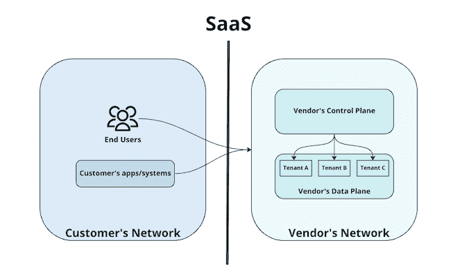
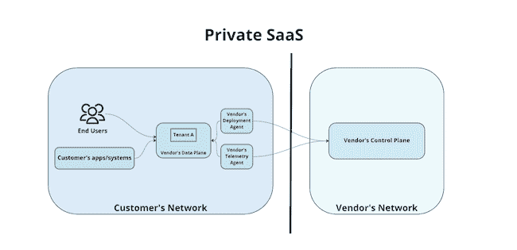
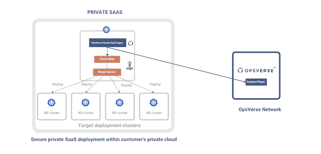

# 二等兵 SaaS，新典范

> 原文：<https://thenewstack.io/private-saas-a-new-paradigm/>

交付软件的软件即服务(SaaS)方法彻底改变了我们的行业。随着 SaaS 市场[预计](https://www.mckinsey.com/capabilities/mckinsey-digital/our-insights/the-saas-factor-six-ways-to-drive-growth-by-building-new-saas-businesses)到 2030 年将从 3 万亿美元增长到 10 万亿美元，未来是光明的。组织越来越多地采用 SaaS 应用程序，因为它们是在提供商的服务器上管理和运行的。这减轻了管理软件应用程序的基础架构、可用性、安全性和性能的责任。

虽然这使得客户可以简单地租赁软件并只为他们使用的东西付费，但使用 [SaaS 并不总是可行的](https://thenewstack.io/the-growing-security-risk-of-shadow-saas-integrations/)。SaaS 的一些垂直领域，如开发人员或安全工具，经常需要与组织的代码库或生产环境进行交互，这对于拥有专有算法或敏感数据的组织来说是绝对不允许的，特别是在金融科技、医疗保健和政府行业。然而，这些行业的企业仍然需要使用尖端技术，并且负担不起过时的软件。

作为回应，一些软件供应商将其产品作为自我管理版本提供，以便公司可以在其基础架构范围内保持其运行，从而满足安全性和数据保护需求。但是设置、运行和扩展工具可能是一项复杂且耗费资源的任务，公司可能不想承担。他们将时间和资源从专注于构建核心产品上转移开。

这就是为什么我认为需要一种新的范式。

## 什么是二等兵 SaaS？

[私有 SaaS](https://opsverse.io/2022/08/17/what-is-private-saas/) 是 SaaS 的变体，提供商在客户网络内运行软件，但负责管理和保护软件。提供商的私有 SaaS 框架负责可靠性、可用性、升级和第二天的操作。它将控制平面和数据平面分开，允许客户数据保留在其网络内。

因为软件完全由提供商管理，所以客户不需要处理部署、配置、可靠性、安全性、灾难恢复和升级。由于软件数据保留在组织的网络中，组织可以控制数据的保存位置和保留时间，从而有助于符合 SOC2、HIPAA 和 GDPR。最后，对于处理大量数据的工具，比如日志管理和 ETL，私有 SaaS 可以消除大量的数据传输成本。

**SaaS 模式:**

*   供应商的“数据层”(每个客户的应用程序和软件在其中托管和运行)位于供应商的网络中。
*   因此，基础架构(机器、内存、CPU、磁盘)由供应商提供。

然后，为了让供应商的“数据平面”接收更新，为每个客户运行的代理与供应商的控制平面(也位于同一个供应商网络中)协调。

**私人 SaaS 模式:**

*   供应商的“数据平面”位于客户 A 的网络环境中，因此由客户 A 管理和控制
*   基础设施—机器、内存、CPU、磁盘—由客户 a 提供。
*   只有供应商的“控制平面”(负责将哪些更新发送到“数据平面”)位于供应商的基础架构中，而工具和应用程序位于客户的基础架构中。

## 私人 SaaS 的反向使用

在 OpsVerse，我们提供托管 DevOps 工具平台，允许公司使用 Argo、Grafana、Jaeger 和 Prometheus 等开源软件。我们的私人 SaaS 产品非常受欢迎，超过 55%的客户都在使用它。这主要是因为客户希望将他们的数据保存在内部。从信息安全(InfoSec)的角度来看，通过私有 SaaS 启动工具可以使他们遵守数据保护规则或他们必须满足的任何法规。

一个例子是客户通过私人 SaaS 运行 [Argo CD。为了理解为什么，我们必须先了解 Argo CD 提供了什么，它是如何工作的。](https://opsverse.io/2022/09/14/launch-your-own-fully-managed-argocd-deploynow/)

Argo CD 是一个开源的、基于 GitOps 的“连续交付”工具，它迅速得到采用和流行。术语 GitOps 指的是一组使用 Git 作为单一事实来源来管理基础设施和应用程序配置的实践。Argo CD——流程的“连续交付”部分——监控 Git 并确保基础设施的状态匹配。

因此，Argo CD 需要访问组织的 Git 存储库和生产基础设施(如 Kubernetes ),在那里它需要操作更改——这两者都是非常脆弱的资产。使用私有 SaaS，这两个组件都保留在组织自己的网络中，提供了信息安全团队所需的安全级别。

## 如何建立一个私人 SaaS

打造一款私人 SaaS 产品可以为一家公司打开一个新市场，但这并非没有挑战。

主要挑战之一是了解私有 SaaS 应用程序的健康状况。为了保证高质量的服务，供应商必须有很强的观察能力。

这包括收集以下信号:

*   指标—查看应用趋势并设置警报。
*   日志——查看应用程序到底在做什么。
*   跟踪-查看应用程序的哪些组件可能会成为瓶颈。
*   事件—寻找底层基础结构的变化。

这可以通过对其应用的所有组件实施遥测来实现。这可确保服务始终正常运行，并让供应商知道何时为在客户周边运行的部件提供更新或维护。

另一个挑战是向私有 Saas 中运行的应用程序推出更新。如果网络配置不允许进出客户边界，供应商应该将管理集群复制到客户边界，这样代理在轮询时就不必离开边界。这种方法将保持供应商的自动更新框架的一致性，但是客户将有额外的负担来与供应商协调操作管理集群。

如果客户的网络配置仅限制来自其外围的入侵，则需要供应商提供一个驻留在客户外围的代理。该代理将轮询供应商的管理集群，下载并安装更新。

在自动更新期间解决客户集群上的问题也可能是一个挑战。供应商应确保客户运行诊断程序，并将报告发送给供应商进行故障排除。

## 二等兵 SaaS 才刚刚开始

针对数据安全和隐私的政府法规不断变化，合规性始终是工程团队面临的一大挑战。据估计， [66%](https://unctad.org/page/data-protection-and-privacy-legislation-worldwide) 的国家有某种形式的数据隐私和消费者权利立法，因此我们应该预计使用 SaaS 将越来越具有挑战性。

无法使用 SaaS 的组织正在转向他们在内部部署和组装的操作系统，而[内部开发平台](https://internaldeveloperplatform.org/) (IDP)的[崛起](https://github.com/backstage/backstage/blob/master/ADOPTERS.md)反映了这一趋势。然而，他们通常没有足够的时间、带宽和技能来开发主题专业知识，以可靠地[运行、维护和保护开源软件](https://thenewstack.io/the-stone-ages-of-open-source-security/)。而且理由很充分。最近的一份报告发现，拥有 10，000 多名员工的组织中，48%的组织面临着遵守政府要求的挑战，30%的组织报告称其 OSS 堆栈的安全性是重中之重。

这就是为什么我们认为私有 SaaS 的概念是必要的，我们已经看到公司使用类似的方法。你认为这个新概念有必要吗？你正在基于相似的原则构建一个产品吗？[联系我们](https://opsverse.io/contact/)！我们很高兴分享我们所学到的，并向他人学习。

<svg xmlns:xlink="http://www.w3.org/1999/xlink" viewBox="0 0 68 31" version="1.1"><title>Group</title> <desc>Created with Sketch.</desc></svg>