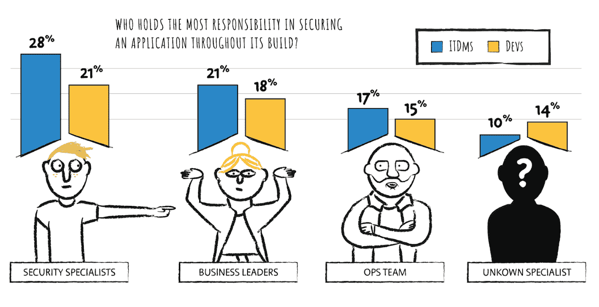
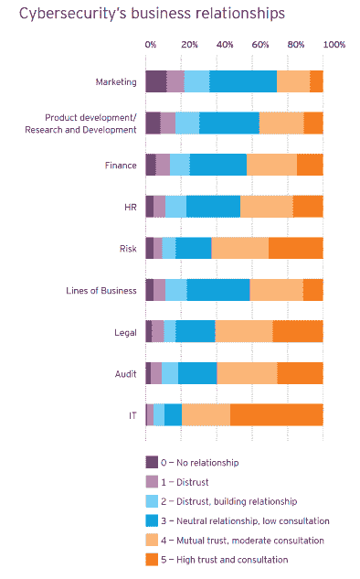
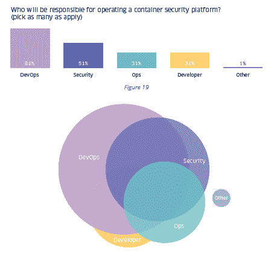
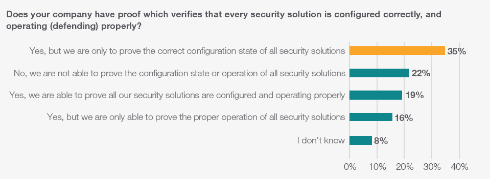

# 分担安全责任的问题

> 原文：<https://thenewstack.io/problems-with-sharing-responsibility-for-security/>

首席执行官、董事会、开发人员、开发人员——似乎除了实际的安全团队之外，每个人都要对安全负责。我们对最近行业研究的回顾表明，对工作角色的混淆是如何导致潜在的破坏性冲突的。

Scale Venture Partners 的一项新调查发现，65%的人认为首席管理人员最终要对安全负责。在出现重大安全漏洞时，大多数 C 级高管会理解并帮助安全团队，但英国域名经纪商 [Nominet](https://www.nominet.uk/) 的最新[报告](https://media.nominetcyber.com/wp-content/uploads/2020/02/Nominet_The-CISO-Stress-Report_2020_V10.pdf)中 29%的首席信息安全官(CISOs)也认为应对漏洞负责的员工或承包商将被解雇。由于他们的工作岌岌可危，安全专家们怀疑网络安全是每个人的工作。

针对高级商业领袖的最新“ [EY 全球信息安全调查](https://assets.ey.com/content/dam/ey-sites/ey-com/en_gl/topics/advisory/ey-global-information-security-survey-2020-report.pdf)”发现，80%的公司在安全和 IT 团队之间存在相互信任，但不到 40%的公司认为安全与研发和产品开发团队之间存在相互信任。该报告强调了一个事实，即 36%的公司有网络安全团队在规划阶段加入新的业务计划。另有 27%的公司在设计阶段就涉及到了安全性，另有 21%的公司在构建、测试或部署阶段加入了新的计划。从这些结果来看，公司似乎至少在口头上承认了安全团队的重要性。

去年，我们[注意到](/integrating-security-into-build-processes-signals-devsecops-tipping-point/)当安全和非安全团队合作时，会有一些小摩擦。特别是，处于发展中的公司让安全角色的人讨论这些关系的问题。然而，在来自 [Snyk](https://snyk.io) 的[同一研究](https://snyk.io/blog/86-percent-of-security-and-tech-roles-agree-that-security-is-a-shared-responsibility/)中，86%关注安全的受访者认为安全是安全和“交付”团队的共同责任。

然而另一项[调查](https://www.mongodb.com/blog/post/five-security-principles-developers-must-follow)，这是由 [MongoDB](https://www.mongodb.com/) 进行的，发现欧洲开发者和 IT 决策者(ITDMs)对于谁在整个应用构建过程中最有责任保护应用存在分歧。29%的开发人员认为开发应用程序的开发人员最有责任。ITDMs 更可能说他们能够识别的安全专家最负责任(28%)，而不太可能说 cite 开发人员(21%)。令人担忧的是，所有受访者中有 12%的人说是一名身份不明的安全专家造成的——如何让一个不知名、不知名的团队承担责任？

图表上没有显示:21%的 ITDMs 说“构建它的开发人员”，而 29%的开发人员这样回答。来源:2019 年 6 月，MongoDB 与 CensusWide 合作，调查了平均分布在法国、德国和英国的 1516 人。

MongoDB 还发现，92%的开发人员认为他们在构建新应用程序时采取了适当的预防措施。如果开发人员在构建阶段一切都做得很好，也许只有当生产应用程序老化并需要维护时，软件依赖关系中的安全漏洞才是最大的问题。或者，云基础设施的安全性可能是新威胁的根源。

[将安全性集成到构建过程中标志着 DevSecOps 的转折点](https://thenewstack.io/integrating-security-into-build-processes-signals-devsecops-tipping-point/)，但是随着 DevOps 过程的成熟，开发人员和安全团队之间的冲突将会继续。我们知道绝大多数开发人员接受应用程序安全性的一些责任，但是缺乏时间来有效地解决安全性问题。[以开发人员为中心的扫描和测试自动化](https://thenewstack.io/automation-security-sdlc/)有助于降低安全事故的可能性和严重性。然而，如果没有具体的关键性能指标(KPI ),开发人员只能模糊地对安全问题负责。

[在当今的云原生世界中，安全性可能会有所不同](/why-security-is-really-different-in-todays-cloud-native-world/)，但规避风险的底线是不变的。在未来几周，我们希望探索 DevOps 实践如何解决安全问题，特别是关于错误配置的云基础架构的问题。

## **更多图表**

在 SDLC 的右侧，安全和 IT 运营部门建立了牢固的关系。随着 DevOps 将安全性转移到左边，与开发人员和营销团队的信任问题可能会变得越来越成问题。资料来源:“EY 全球信息安全调查”。

81%的人认为 DevOps 将负责运营一个集装箱安全平台。然而，这个问题允许回答者给出不止一个答案。下方的文氏图显示了职责的明显重叠。来源:StackRox 最新的“[Kubernetes 和容器安全的状态](https://www.stackrox.com/kubernetes-adoption-and-security-trends-and-market-share-for-containers/)”。

307 名安全参与者中有 51%能够证明其企业的安全解决方案配置正确。如果他们不能保证他们的应用程序正常工作，安全团队还有什么希望帮助解决基础设施即代码的配置问题呢？来源:Keystone Technologies“[安全运营有效性](https://www.keysight.com/find/securityeffectiveness-report)”。

MongoDB 和 Snyk 是新堆栈的赞助商。

来自 Pixabay 的 Steve Buissinne 的特写图片。

<svg xmlns:xlink="http://www.w3.org/1999/xlink" viewBox="0 0 68 31" version="1.1"><title>Group</title> <desc>Created with Sketch.</desc></svg>