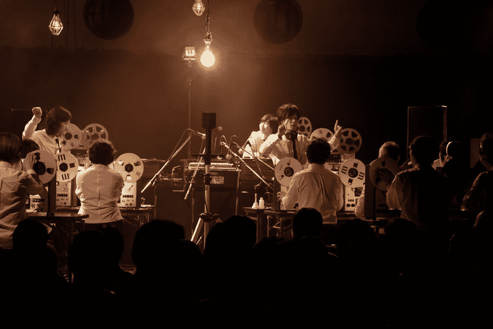
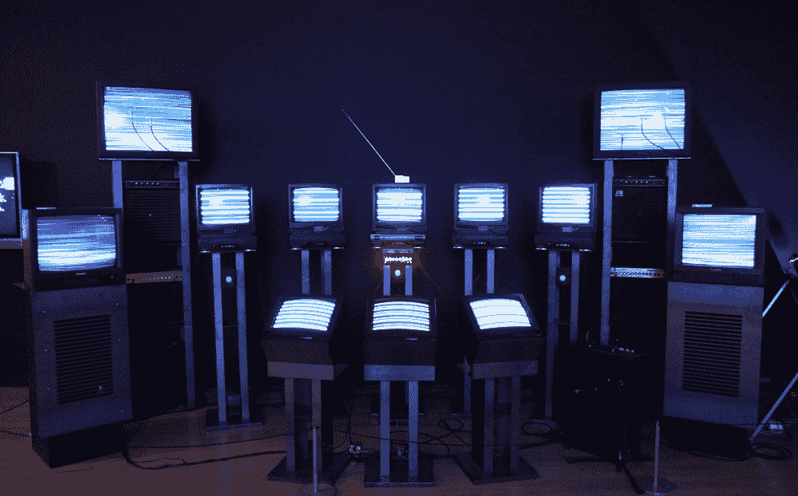

# 程序员用电子垃圾创造非凡的音乐

> 原文：<https://thenewstack.io/programmer-creates-extraordinary-music-electronic-waste/>

一台孤零零的、大腹便便的老式阴极射线管电视机被丢弃在路边，这种景象你可能已经见过了。在我们这个痴迷于科技产品的社会，最新的产品通常被认为是最棒的，旧的电子设备经常在使用寿命结束前就被扔掉，导致电子垃圾问题日益严重，堵塞了我们的垃圾填埋场，并迅速耗尽了我们的自然资源。

但不一定要这样。从声音极客复活模块化合成器，到研究人员探索生物 T2 细胞启发电路如何成为基于模拟计算的未来，模拟正在大规模回归。日本程序员出身的前卫音乐家[和田荣](https://eiwada.com/)以一种创新的方式将这些废弃的模拟阴极射线管(CRT)电视用作打击乐器，能够以一种令人惊讶的有机方式创作出嗡嗡声、重击声、光点声和嗡嗡声的音乐。听一听:

[https://www.youtube.com/embed/PJudRvR3FBk?feature=oembed](https://www.youtube.com/embed/PJudRvR3FBk?feature=oembed)

视频

[https://www.youtube.com/embed/m2u66vauf30?feature=oembed](https://www.youtube.com/embed/m2u66vauf30?feature=oembed)

视频

世界反兴奋剂机构如何陷入这种创造性的环境是一个偶然的故事。根据 Wada 的说法，他对音乐的兴趣始于四岁时的一次家庭度假，当时他第一次听到印尼本土乐器 gamelan 的怪异而迷人的声音。十几岁时，和田开始摆弄老式盒式磁带，复制类似怪异的“外星人声音”，这使他想起了那次印度尼西亚之行。

在偶然发现他的绰号为 Braun Tube Jazz Band 的打击乐电视接口之前，Wada 试验了卷对卷录音机(这些文物可以追溯到 70 年代)，最终与他和几个朋友组成的 [Open Reel Ensemble](https://openreelensemble.com/) 一起创造了令人着迷的表演。他们的声学风格很难确定，从扭曲的风笛发出的扭曲的雷声到振奋人心的流行音乐。

Wada 告诉[主板](http://motherboard.vice.com/read/this-japanese-band-makes-music-with-e-waste)“这些(卷对卷录音机)机器感觉就像是我一直在玩的磁带的更大的亲戚。“我用手移动磁带，机器就会发出非常奇怪的声音。我真的觉得这台机器把我和一个我不知道的世界联系了起来。”

Wada 和他的同事们对使用技术从普通的家庭物品中哄出意想不到的声音特别感兴趣，比如过时的电子产品甚至换气扇。但是几年前，Wada 不小心把一根音频线插到了一台老式 CRT 电视的复合视频接口上，把声音变成了屏幕上的图像。

Wada 对此很感兴趣，开始进行实验，用摄像机记录图像，并以音频信号的形式播放。此后，Wada 进一步完善了他的系统，将电视连接到经过改造的计算机控制的盒式录像带。Wada 将他的角色描述为“天线”，利用他的手和整个身体的运动来调节音高，使他们能够在他以富有感染力的节拍拍打时发出不同的声音。

## 美化电子垃圾

世界反兴奋剂机构的项目超越了这种日益严重的环境问题所带来的典型严重性。从艺术的角度来看，Wada 的独特灵感来自于从废弃的东西中创造新的、创造性的和完全意想不到的东西的热情。

“所有这些科技产品都是日本经济增长的象征，但它们也大量被扔掉，”Wada 说。“不只是对被扔掉的东西说‘再见’，而是给旧的东西注入新的意义，并庆祝它们的独特之处，这很好。”

当然，以这种方式再利用电子垃圾可能不会对减少全球不断增长的电子垃圾数量产生太大影响，但它可能会让人们在扔掉旧设备之前三思而行。虽然很明显，技术可以帮助我们完成无数实际的事情，但在 Wada 的例子中，它以一种看起来极其不切实际的方式帮助一个人与废弃的电器交互——让他可以将它们作为自己身体的音乐制作延伸，以创造令人难以置信的行为艺术。

特色图片:来自 [Ei Wada](https://eiwada.com/) 网站。图片:Masahiro Hasunuma，Sumi Takeshi，来自 Ei Wada 网站。

<svg xmlns:xlink="http://www.w3.org/1999/xlink" viewBox="0 0 68 31" version="1.1"><title>Group</title> <desc>Created with Sketch.</desc></svg>