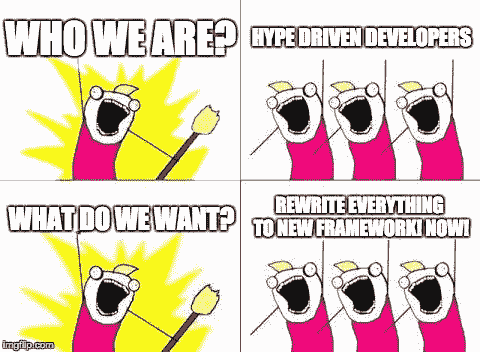
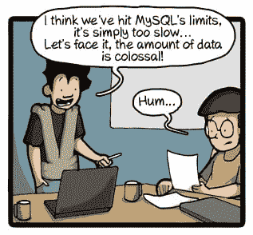

# 炒作驱动的开发，从框架到微服务

> 原文：<https://thenewstack.io/programmers-react-warning-hype-driven-development/>

上周[Marek Kirejczyk](https://twitter.com/marekkirejczyk)[在 Medium 上发表了一篇关于炒作驱动的开发](https://blog.daftcode.pl/hype-driven-development-3469fc2e9b22#.xzb70jlwe)的危险的文章，他将其描述为“团队如何给自己带来厄运”，引发了一场关于是什么在驱动当今技术决策的大规模在线讨论。

简而言之，炒作驱动的开发(简称 HDD)是一个长期流行的词——或者反流行词？—这已经在[流传多年了](http://www.gartner.com/technology/research/methodologies/hype-cycle.jsp)，但是 Kirejczyk——一家小型开发商店的工程副总裁——试图用一篇权威的文章来捕捉它。

当一个开发团队根据技术在 Twitter 上的趋势，或者一些热情的博客帖子或会议讨论，选择“最新、最热的技术”用于一个项目时，HDD 就发生了。硬盘的一个关键症状是，与宣传相反，当新技术开发出来时，进步并没有加快，而是相反:工作慢得像爬行。

Kirejczyk 警告说，HDD 有多种风格:栈溢出驱动开发、会议驱动开发，当然还有最响亮的家伙驱动开发。“当一个人一直在谈论他没有经验的新框架/库/技术，但一直在谈论它，最终团队决定使用它，”他写道。

HDD 可以出现在任何项目中，从新的 JavaScript 框架到新的流行组合，如 [Elixir](http://elixir-lang.org/) 和 [Phoenix](http://www.phoenixframework.org/) (“或者把你最喜欢的语言/框架组合放在这里”)。

他甚至将整个案例研究都放在了微服务上。根据 Kirejczyk 的说法，这个特殊的场景始于 IT 经理怀疑地盯着他们的整个应用程序，突然确信它被一个充斥着意大利面条式代码的“单片”架构所困扰。这个场景从“让我们把所有东西都重写为微服务”转变为“现在开发应用程序的速度慢了很多，很难部署，而且我们花了很多时间在多个系统上跟踪 bug。”

最终，Kirejczyk 承认微服务“通过正确的投资，作为扩展系统和团队的一种方式可能会有回报”，但是“微服务是提取出来的，而不是编写出来的。你必须这么高才能使用微服务。”

Kirejczyk 关于泡沫破灭的消息引起了网络开发者的许多反应，有正面的也有负面的。

至少有一个产品开发人员[把他的批评看得更重](https://medium.com/@sbellware/microservices-might-be-extracted-but-that-usually-leads-to-a-distributed-monolith-not-a-service-17714b7a2d41#.jbec193n9)，他在评论中抱怨说，最终甚至提取微服务“通常会导致一个分布式的整体，而不是服务架构。”并称其为支持微服务“仅仅是炒作，而不是经过深思熟虑的合法追求”这一理论的证据。

"框架也是如此."

在继续贬低整个 Rails 社区之后，这位产品开发人员最终决定，任何人都没有希望了。“对基本面有足够深刻的理解有助于我们避开纯粹的炒作，但即使是追求‘不炒作’也可能充满不切实际的炒作，并受其影响。”

在几十名专业开发人员的参与下，讨论变得非常富有成效。一位年长的开发人员指出，终极问题是[我们*如何知道*我们正在明智地选择新兴技术](https://medium.com/@starypatyk/this-is-so-true-bce4160700f8#.smgausfio)？“目前，我觉得唯一的方法是用新技术运行一个小项目，直到最后——即交付生产。并准备好承认这个决定是错误的。”

另一位评论者提出，答案可能是卡内基梅隆大学软件工程研究所的[架构权衡分析方法](http://www.sei.cmu.edu/architecture/tools/evaluate/atam.cfm)(它有自己的概念流程图)。

开发人员 Bensan George 甚至链接到他自己的文章，列出了在向您的基础架构添加新技术时要问的关键问题。(“如果一天结束时，你仍然发现收益大于成本，那么就为自己将想法付诸实践而感到欣慰。”)

Linagora Engineering 的编辑斯蒂芬·科尔森(Stéphane Colson)也警告了基于技术的新颖性或 T2 感知的权威性的认知偏见(T3)，以及我们对现状的补偿偏见(并建议他自己的文章《[作为测试者管理偏见》(T5)，以供进一步阅读)](https://www.lyontesting.fr/en/manage-your-biases-as-a-tester-part-14/)

与此同时，在 Reddit 上的一个[讨论中，有人提到了一家小开发公司的负责人杰森·凯斯特的另一篇文章，题目简单地说就是“](https://www.reddit.com/r/programming/comments/5ehnpc/hype_driven_development/)[幸福是一堆无聊的东西](http://www.expatsoftware.com/articles/happiness-is-a-boring-stack.html)”

在对 Medium 的评论中，Infobeans Systems India 的项目副经理也分享了一个理论，即炒作驱动的开发[不一定源自开发人员](https://medium.com/@akhilesbhale/good-article-f426e22e5f28?source=responses---------29-31--------)。“有时候，客户和他们的经理有时会想出一些时髦的词……只是为了证明他们懂技术。这使开发团队处于非常尴尬的境地，他们不得不跳上‘宣传车’，这样他们就可以在所有人面前表现得很酷。”

另一位评论者看到了一个世界，在这个世界里，杰出的开发人员比普通人更快地掌握任何新技术，这创造了一种特殊的混乱。“优秀的开发人员带来新技术，然后他们继续下一个大项目，让优秀但不优秀的开发人员背黑锅。”

Kirejczyk 的原始文章建议“在你决定之前进行测试和研究”，根据实际经验做出决定，并计算潜在的时间节省。但是为了这个目的，它也主张雇佣有经验的人，这导致一个评论者提出了一个更重要的规则:“没有软件宗教”。那些想用一个工具做所有事情的人是软件团队的一大祸害。”

另一名开发人员[也敦促采取一种更负责任的方法](https://medium.com/@alexanderfradiani/i-think-developers-in-average-should-take-a-bit-more-responsible-approach-we-should-include-a-85b2cbdc7198?source=responses---------9---------)，补充道“当一个程序员实际上更关注工具而不是真正问题的解决方案时，这是一种职业自恋……”

开发者[安东尼·科米托抱怨道](https://medium.com/@arcomito/i-also-like-how-people-refer-to-new-technologies-like-it-is-some-minority-report-esque-5f9d0fc8dcef?source=responses---------15-31--------)，“我也喜欢人们称‘新技术’为某种*少数派报告*式的技术飞跃，但实际上它只是一个新的 JavaScript 库。”

Medium 还允许文章作者推荐读者留下的评论，这提供了一个听取不同意见的好机会。Marek 批准了一个名为“[问题不在于工具本身](https://medium.com/@abchaudhri/the-problem-is-not-the-tool-itself-4a8a302c7af7#.e13cmjult)”的漫画，该漫画来自名为 *CommitStrip、*的系列漫画，该系列漫画讲述了一位开发人员的警示故事，他建议整个团队迁移到 NoSQL，因为他忘记了优化 MySQL 查询。

但这篇关于 Medium 的文章也在 Twitter 上引起了一些有趣的反应(至少有一家小型软件公司的首席执行官回应称“[有罪，罪名成立](https://twitter.com/belgort/status/802909865349742592)”IBM 的一位设计总监是读者之一，他认为还有另一种力量在起作用，他在推特上写道“[炒作的一个动机是简历填充](https://twitter.com/jeoffwilks/status/802909211994701824):把当前的工作作为下一份工作的编码训练营。”

当 Kirejczyk 的帖子出现在 Reddit 上时，另一位发帖者甚至认为“从你的发展过程中清除所有‘炒作’大多只是以你的简历为代价服务于你的雇主”，并建议“时不时地选择性地赶时髦。”

另一位 Redditor 似乎同意，仅仅因为你紧跟新技术[并不意味着你就是一个追逐潮流的潮人](https://www.reddit.com/r/programming/comments/5ehnpc/hype_driven_development/dadljza/)。“有很多缓慢的转变正在发生，不跟随它们会让你被淘汰。例如，微服务、容器和容器编排器不会消失。”

另一个分享了他们自己的[个人策略](https://www.reddit.com/r/programming/comments/5ehnpc/hype_driven_development/daeipma/)，看看炒作是否会持续超过 18 个月:“我理解不要跟风，但有时跟风很棒，因为它有音乐、金钱和酒。”

Reddit 上一个更生动的帖子甚至暗示[硬盘是生活的调味品](https://www.reddit.com/r/programming/comments/5ehnpc/hype_driven_development/daeib26/)。“底线是炒作是主观的，你必须用你的大脑知道什么时候它会对简历有帮助，什么时候它只是在偷懒，因为你可以。你绝对无法从炒作、蛇油或伪科学中净化这个世界，我宁愿你不要让这个世界变得非常‘完美’，因为如果没有一点变化和乐趣，我们会有什么？”

回到 Medium，Kirejczyk 的文章获得了超过 1400 个“赞”——但也有评论者不同意这篇文章的整个前提。一位高级 Java 开发人员[反驳了](https://medium.com/@pjagielski/for-sure-following-hype-just-for-being-hot-can-bring-problems-5c3552d3757b?source=responses---------9-31--------)，写道“我参与的项目中，微服务和 NoSQL 是很好的选择。”

首席软件工程师 Zachary Friedman[也评论](https://medium.com/@_kulte/nice-article-overall-b1a2950389fa?source=responses---------6---------)说，虽然他总体上喜欢这篇文章，“我真的不认为你做了足够好的工作来说服我这绝对是一件消极的事情……更让我害怕的是糟糕的耦合代码、糟糕的接口定义，以及浪费时间重新发明轮子。”

<svg xmlns:xlink="http://www.w3.org/1999/xlink" viewBox="0 0 68 31" version="1.1"><title>Group</title> <desc>Created with Sketch.</desc></svg>