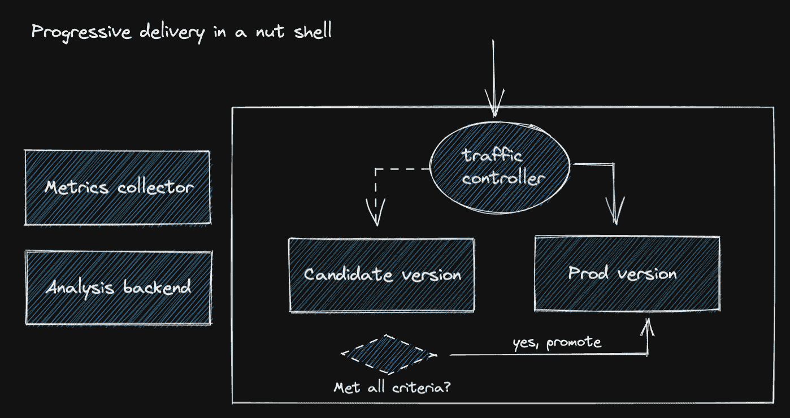
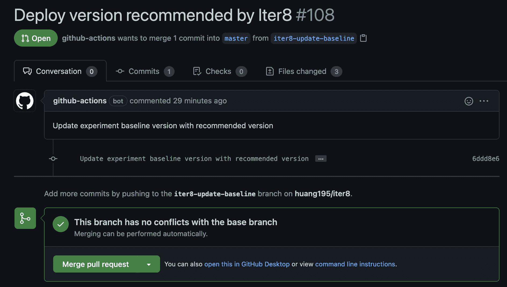

# 开放式轮班渐进交付

> 原文：<https://thenewstack.io/progressive-delivery-on-openshift/>

[](https://researcher.watson.ibm.com/researcher/view.php?person=us-haih)

[海是 IBM 屈臣氏研究中心的研究科学家。他是 Kubernetes、Istio、Iter8 和 TPM 的贡献成员。](https://researcher.watson.ibm.com/researcher/view.php?person=us-haih)

[](https://researcher.watson.ibm.com/researcher/view.php?person=us-haih)[](https://researcher.watson.ibm.com/researcher/view.php?person=us-haih)

我们习惯于对我们的应用程序抱有很高的期望。我们需要源源不断的新功能和错误修复，但是，我们不希望这些更新对我们的用户体验产生负面影响。结果，这些期望给开发者带来了巨大的压力。

这就是 Iter8 的用武之地；它帮助开发人员逐步推出新版本的应用程序，这些应用程序受到性能、功能甚至自定义业务指标的综合限制。如果一个新版本不能满足所有的标准，它会自动回滚，用户甚至不必看到它。



 [Siamak Sadeghianfar

Siamak 是 Red Hat 的技术产品经理，专注于 Kubernetes 和 OpenShift 上的 CI/CD 技术和开发人员工具。](https://www.linkedin.com/in/siamaks/) 

术语“渐进式交付*”*用于描述更高级的应用部署模式——金丝雀、蓝/绿、黑暗启动、A/B——旨在实现诸如最小化停机时间、降低风险和/或最大化某些业务指标等目标。Iter8 支持这些高级部署模式，可以在普通的 Kubernetes 及其企业版 OpenShift 上运行。

在本文中，我们将描述如何将 Iter8 集成到运行在 OpenShift 上的现有 DevOps 管道中。如果您已经有一个由 DevOps 管道部署和管理的应用程序，启用 Iter8 只需几分钟，禁用它也很容易。

为了迎合不熟悉 GitOps 和/或 OpenShift 的开发人员，在本文的第一部分，我们将通过一个场景来设置一个在 OpenShift 上运行的演示应用程序。我们还将坚持 GitOps 实践，在这种实践中，清单在 repo 中维护，更改将持续同步到集群。一旦这个演示应用程序完全设置好，文章的第二部分将描述如何将 Iter8 集成到我们刚刚部署的管道中，以支持渐进式交付。如果您已经熟悉 Openshift/DevOps，可以直接跳到第二部分。

## 第 1 部分:OpenShift 上的 GitOps

### 设置 OpenShift 集群

 [约翰·杜伊莫维奇

John 是 Red Hat 的一名经验丰富的软件工程师。](https://www.linkedin.com/in/duimovich/?originalSubdomain=ca) 

如果您还没有 OpenShift 集群，最简单的方法是通过 CodeReady Container 在您的笔记本电脑上本地运行集群。如果您熟悉用于供应本地 Kubernetes 集群的 Minikube，这是类似的:在 VM 中运行的一体化单节点 OpenShift 集群。

要安装和运行 CodeReady 容器，请遵循这里的说明。集群启动并运行后，您应该能够以 kubeadmin 的身份登录集群，例如:

```
oc login  -u  kubeadmin  -p  your_password https://api.crc.testing:6443

```

注意，应该已经有了关于如何在命令行上获取 kubeadmin 密码的明确说明，但是，您也可以使用:
来获取密码

```
crc console  --credentials  -o  json  |  jq  .clusterConfig.adminCredentials.password

```

### Fork Iter8 Repo(安装演示应用程序)

转到[github.com/iter8-tools/iter8](https://github.com/iter8-tools/iter8)并分叉回购，然后设置以下环境变量:

```
export YOUR_ORG=[your github org or username]

```

然后运行下面的命令来更新一些引用，使它们指向您自己的分支。

```
git clone github.com/$YOUR_ORG/iter8
cd iter8  &&  export ITER8=`pwd`
find samples/openshift/gitops  -name  "*"  -type  f  |  xargs sed  -i  ''  "s/MY_ORG/$YOUR_ORG/"
git commit  -a  -m  "update references"
git push origin head

```

### 安装 ArgoCD / OpenShift-GitOps

我们将 ArgoCD 用于 GitOps，以便 Github repo 中的清单更改可以立即反映在正在运行的集群中。要安装它，请遵循这里的说明。它应该像复制和粘贴以下命令一样简单:

```
oc create namespace argocd  --dry-run  -o  yaml  |  oc apply  -f  -
oc apply  -n  argocd  -f  https://raw.githubusercontent.com/argoproj/argo-cd/stable/manifests/install.yaml

```

或者，您可以直接从管理控制台安装 OpenShift GitOps，它会在后台安装 ArgoCD。这使得安装 ArgoCD 更加容易，您可以按照这里的说明[进行操作](https://docs.openshift.com/container-platform/4.8/cicd/gitops/installing-openshift-gitops.html)。

### 部署演示应用程序

我们使用一个书店应用程序来演示如何以安全的方式逐步部署其组件。可以用以下命令启动:

```
oc apply  -f  $ITER8/samples/openshift/gitops/argocd-app.yaml

```

ArgoCD 应在不久后检测到此操作，并将应用程序部署到我们的集群。之后，您可以打开另一个终端开始端口转发:

```
oc port-forward svc/productpage  -n  default  9080:9080

```

现在，您可以打开网页浏览器，在 http://localhost:9080/product page 试用该应用程序？u =正常。您应该会看到类似如下的内容:


此时，我们有一个遵循 GitOps 实践的工作应用程序。对应用程序的更新是通过更改 repo 中的应用程序清单来完成的，然后它们将通过 ArgoCD 同步到集群。

## 第 2 部分:为渐进交付启用 Iter8

### 为 Iter8 创建一个 Github 令牌

如果你想让 Iter8 在你的应用程序通过某些成功标准时自动升级新版本，你需要为它提供一个 Github 令牌来创建 pull requests (PRs)。可以通过转到 github.com >设置>开发者设置>个人访问令牌>生成新令牌来生成令牌。此令牌可以通过以下方式添加到集群:

```
oc create secret generic github-token  --from-literal=token=[YOUR_TOKEN]
oc apply  -f  https://raw.githubusercontent.com/iter8-tools/iter8/master/samples/tasks/rbac/read-secrets.yaml

```

### 安装 Iter8

现在让我们安装 Iter8。你需要按照这里的说明[来安装 Kustomize。运行以下命令安装 Iter8:](https://kubectl.docs.kubernetes.io/installation/kustomize/) 

```
export TAG=master
kustomize build  "https://github.com/iter8-tools/iter8/install/core/?ref=${TAG}"  |  oc apply  -f  -
oc wait crd  -l  creator=iter8  --for condition=established  --timeout=120s
kustomize build  "https://github.com/iter8-tools/iter8/install/builtin-metrics/?ref=${TAG}"  |  oc apply  -f  -
oc wait  --for=condition=Ready pods  --all  -n  iter8-system

```

### 升级演示应用程序

现在一切就绪，我们可以升级演示应用程序，看看 Iter8 如何帮助开发人员在将其推广到生产之前测试新版本。为了更容易理解，我们创建了一个 Github 动作。你可以去 github.com/YOUR_ORG/iter8/actions,，点击“在 OpenShift 上模拟 CI 管道”，然后点击“运行工作流”

这将创建一个 Iter8 实验定制资源和新的演示应用程序部署。如果您运行`oc get experiments`和`oc get deployments`，您将看到 ArgoCD 在集群中部署了这些资源。由于默认情况下，Iter8 将使用一个合成的工作负载来测试新版本，它将需要一点额外的时间来收集足够的数据，以决定新版本是否好，您可以运行以下命令来监控 Iter8 实验的进度:

```
oc get experiments.iter8.tools  --watch

```

### 推广新版本

一旦实验被宣布成功，你就可以去 github.com/YOUR_ORG/iter8/pulls,了，应该会有一个由 Iter8 自动创建的新 PR 来推广新版本，即:



点击“Merge pull request ”,等待一段时间，让 ArgoCD 获取此更改，现在您可以使用 web 浏览器再次访问该应用程序。这一次，您应该会看到类似如下的内容:


新版本中的微妙变化是“威廉·莎士比亚的”字样以不同于我们最初版本的颜色突出显示。

## 第三部分:下一步是什么

如果您想了解更多关于 Iter8 如何帮助您管理应用程序更新的信息，您可以访问最新版本的 Iter8 及其文档，网址为 [https://iter8.tools](https://iter8.tools/) 。代码和其他资源可在 https://github.com/iter8-tools 的[获得。我们可以随时找到 Slack，也有一个双周社区会议。查看此](https://github.com/iter8-tools)[链接](https://iter8.tools/0.7/getting-started/help/#iter8-community-meetings)了解更多信息。欢迎随时加入我们并提出问题！

<svg xmlns:xlink="http://www.w3.org/1999/xlink" viewBox="0 0 68 31" version="1.1"><title>Group</title> <desc>Created with Sketch.</desc></svg>