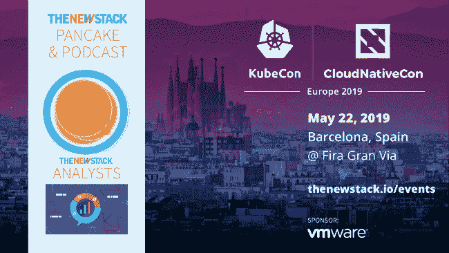

# Calico 项目和云本地网络的挑战

> 原文：<https://thenewstack.io/project-calico-and-the-challenge-of-cloud-native-networking/>

本播客由 InfluxData 和 KubeCon+CloudNativeCon 赞助。Tigera 是新堆栈的赞助商。

[Calico 项目和云原生联网的挑战](https://thenewstack.simplecast.com/episodes/project-calico-and-the-challenge-of-cloud-native-networking)

*[Christopher Liljenstolpe](https://www.linkedin.com/in/liljenstolpe/)是云原生安全和网络软件提供商 [Tigera](https://www.tigera.io/) 的创始人兼首席技术官。他成立了 Tigera，为 Calico 项目提供商业支持，这是他为云原生应用程序创建的控制平面。在本期[新堆栈分析师](https://thenewstack.io/podcasts/analysts)播客中，TNS 执行主编 [Joab Jackson](https://twitter.com/Joab_Jackson) 和 TNS 特约分析师 [Janakiram MSV](https://www.janakiram.com/) 与 Liljenstolpe 谈论 Calico 的创建、覆盖网络、服务网格和 IPv6。*

## 关键要点

*   Calico 最初是为 OpenStack 创建的，旨在使用 IP 路由等互联网技术，而不是交换、虚拟网络、覆盖网络或其他复杂的方法，轻松地将数据包从网络的一部分传输到另一部分。
*   这种形式的网络仅提供了跨节点的粗粒度隔离，因此 Calico 使用实时分布式过滤引擎来控制哪些节点可以相互通信，实际上充当了网络策略执行工具。
*   Calico 是为非常动态的环境设计的，可以管理成千上万个随时改变位置的端点。

*   每个主机做出过滤决定，使系统作为一个整体可以轻松扩展。过滤器可以位于底层主机上，也可以安装在 pod 本身中以管理更高级别的策略，处理来自服务网格和 Kubernetes 的数据。
*   为了获得更高层次的数据，Calico 监听来自 Kubernetes API 服务器的事件，从容器网络接口(CNI)和 Kubernetes 策略 API 获取元数据更改和策略添加。
*   印花布不依赖于管弦乐队。它也可以在裸机上运行。它还可以支持和跟踪非 Kubernetes 遗留应用程序和云服务。
*   Calico 与谷歌的[零信任安全](https://www.beyondcorp.com/)模型非常契合，该模型假设网络和主机将被攻破，因此限制了可能造成的损害。Liljenstolpe 说:“我们不仅保护其他工作负载免受其他工作负载的影响，还保护世界其他地方免受工作负载的影响。”他谈到了基于每个对象对入站和出站流量进行的多重身份验证检查。
*   尽管 Calico 表面上看起来像是一种用于联网的 [SE Linux](https://github.com/SELinuxProject) ，但它的部署和管理要容易得多。Liljenstolpe 说:“我们试图让这很容易理解。

*   *   关于印花布 vs. [法兰绒](https://coreos.com/flannel/docs/latest/):法兰绒不一定要与底层基础设施整合。Calico 也可以在这种“覆盖网络”模式下运行，但也可以与基础设施集成，以提高易用性:无需加载和卸载覆盖网络，所需的地址空间更少。Tigera 还参与了法兰绒项目。
    *   总体而言，Calico 和零信任模型简化了处理传统安全措施的大量开销，例如修改防火墙规则，这通常涉及向安全团队提交请求并等待对所有其他策略的审查。Calico 的分层策略模型通过确保广泛的合规性策略(即任何 PCI 合规性组件都不能与非 PCI 组件通信)得以实施，同时给予开发人员单独进行本地更改的自由，从而简化了这一过程。
    *   Tigera 提供了许多可视化工具来了解交通流向。来源的 IP 地址变化很快，由来自 orchestrator 的元数据进行注释。可以很容易地生成实时合规性报告，或者可以很容易地将数据发送到搜索引擎，如 Elastic。

### 在这个版本中:

[1:43:](https://thenewstack.simplecast.com/episodes/project-calico-and-the-challenge-of-cloud-native-networking?t=1:43) 什么是印花布？
[11:25:](https://thenewstack.simplecast.com/episodes/project-calico-and-the-challenge-of-cloud-native-networking?t=11:25)Calico 是如何从 Kubernetes 获得这些信息的，这对于 Kubernetes 管理员来说又是如何呢？
[21:02:](https://thenewstack.simplecast.com/episodes/project-calico-and-the-challenge-of-cloud-native-networking?t=21:02) 绒布和印花布有什么区别，开发人员什么时候应该选择一种而不是另一种？
[27:15:](https://thenewstack.simplecast.com/episodes/project-calico-and-the-challenge-of-cloud-native-networking?t=27:15) 为什么防火墙的变化需要这么长时间，Tigera 打算如何解决这个问题
[35:15:](https://thenewstack.simplecast.com/episodes/project-calico-and-the-challenge-of-cloud-native-networking?t=35:15) 转向多云运营
[37:36:](https://thenewstack.simplecast.com/episodes/project-calico-and-the-challenge-of-cloud-native-networking?t=37:36) 您在哪里看到 Calico 网络阻止 Istio 接管，在哪里看到这些界限变得模糊和趋同？

OpenStack 基金会是新堆栈的赞助商。

图片由 Pixabay 的 sweetmeatone 提供。

<svg xmlns:xlink="http://www.w3.org/1999/xlink" viewBox="0 0 68 31" version="1.1"><title>Group</title> <desc>Created with Sketch.</desc></svg>