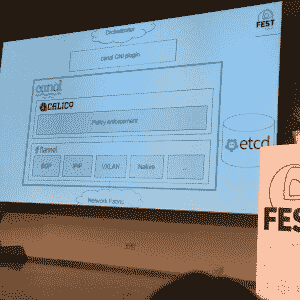

# 项目印花布，法兰绒联手为政策安全的网络

> 原文：<https://thenewstack.io/project-calico-flannel-join-forces-policy-secured-networking/>

传统的网络管理和安全方法不适合容器和基于微服务的架构的流动性。容器的出现、消失以及在不同计算节点之间的移动过于频繁，以至于无法分配静态 IP 地址，更不用说受到网络外围的防火墙和 IP 表的保护。

考虑到这一点，两个开源项目 CoreOS 的[法兰绒](https://coreos.com/flannel/docs/latest/)虚拟网络技术和[项目 Calico](https://www.projectcalico.org/) ，另一种具有强大安全控制的网络覆盖技术，联手提供了一个名为 [Canal](https://github.com/tigera/canal) 的单一包，将为容器和微服务时代提供基于策略的安全网络。

“IP 地址不是特殊的雪花”——Andrew Randall，Tigera。

一家总部位于旧金山的新公司 Tigera 已经成立，将负责管理这两个项目。Tigera 是网络解决方案提供商 [Metaswitch](http://www.metaswitch.com/) 的子公司，许多在 Calico 工作的旧金山 Metaswitch 工程师已经转移到 Tigera。CoreOS 将法兰绒代码库捐赠给 Tigera。

[安德鲁·兰德尔](https://twitter.com/andrew_randall)将担任新公司的首席执行官，新公司已经获得了[新企业联合公司](http://www.nea.com/)的首轮投资。

法兰绒和 Calico 都提供虚拟网络，因为它们都可以创建虚拟的基于 IP 的网络，为一组虚拟服务器或容器建立一个基于 IP 的结构以相互通信。

虚拟网络对于云计算和云协调工具(如 Kubernetes)的用户来说是一个难题，因为客户可能只能从提供商那里获得一个 ip 地址，并且必须在其背后建立一个完整的微服务系统。虚拟网络还可以提供更大的灵活性，因为虚拟 IP 地址可以快速分配和重新分配，同时结构控制器可以跟踪当前哪个节点拥有哪个 IP 地址。

除了虚拟网络，Calico 还为虚拟网络提供基于策略的安全管理。使用一组标签，开发人员可以定义哪些服务应该与其他服务对话。然后，控制器将对通过其网络的所有数据包实施这些策略。

“每个微服务都非常简单，开发者可以非常容易地在高层次上定义他们期望该微服务与什么通信，以及与什么端口通信，”Project Calico 布道者 Alex Pollitt 在本周柏林举行的 CoreOS Fest 的分组会议上解释道。

当与虚拟网络结合时，这种方法的优势在于，结构控制器“可以直接从开发人员那里获取高级意图，并将其直接自动呈现到网络结构中，并动态地实时更新，以便在网络中流动的唯一数据包正是开发人员期望流动的数据包。”

这将有助于安全性，因为它将攻击面减少到运行服务所需的最低限度。

Pollitt 解释说，将法兰绒和印花棉布结合起来有很多好处。最重要的是，合并后的代码库为希望进入容器和/或微服务的组织提供了一站式服务，因为这两个项目将紧密集成。两者都依赖于 [etcd](https://thenewstack.io/coreos-updates-etcd-large-scale-container-coordination/) 键值存储来保存运营数据。

随着两种技术的融合，那些使用法兰绒或印花布的组织现在将获得更大的功能集。Pollitt 说，Tigera 将保持印花布和法兰绒作为单独的项目，但将提供方便的升级途径来移动运河。

进一步增强 Canal 的潜力将是与 Kubernetes 容器编排引擎的紧密集成。Kubernetes 的下一个版本是 1.3，将于 6 月发布，将会推出一个网络政策 API 的测试版。有了适用于 Kuberentes 的 Canal CNI(容器网络接口)插件，开发人员可以使用标签来注释每个容器的通信策略，Kubernetes 在部署容器单元时，无论它们运行在什么网络上，都可以强制执行这些策略。

Kubernetes 当前的 CoreOS 发行版包含了一个 Canal 的实现，它可以通过[vagger](https://thenewstack.io/vagrant-developers-researchers/)在单台机器上运行，也可以在 Amazon Web Services 上运行。

*TNS research 分析师 Lawrence Hecht 对本文有贡献。*

<svg xmlns:xlink="http://www.w3.org/1999/xlink" viewBox="0 0 68 31" version="1.1"><title>Group</title> <desc>Created with Sketch.</desc></svg>