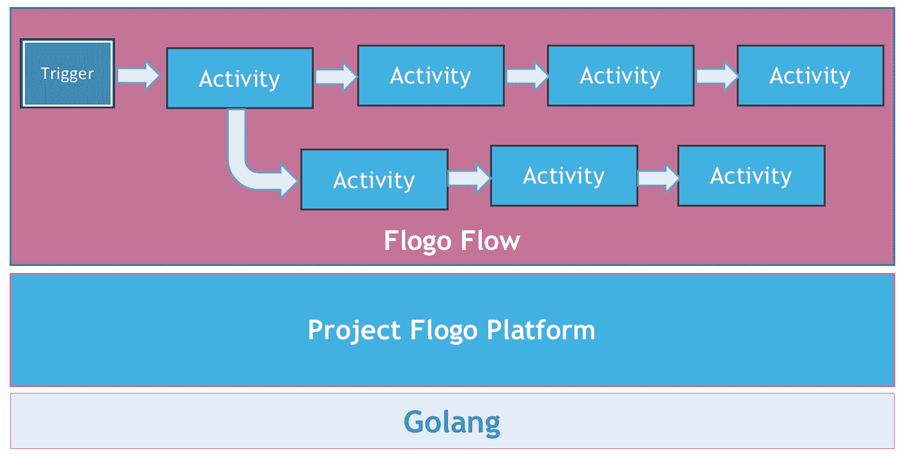
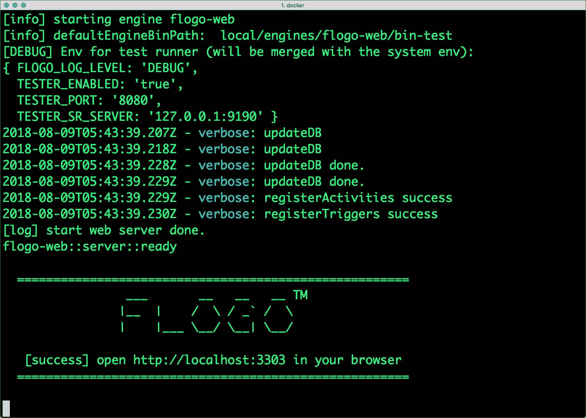
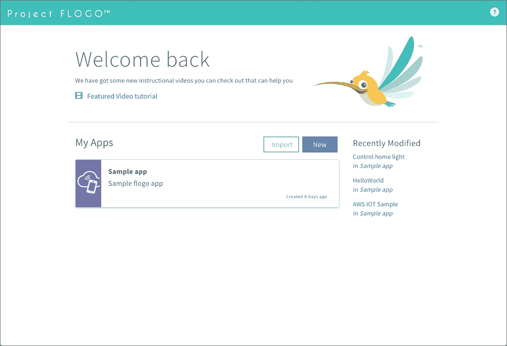
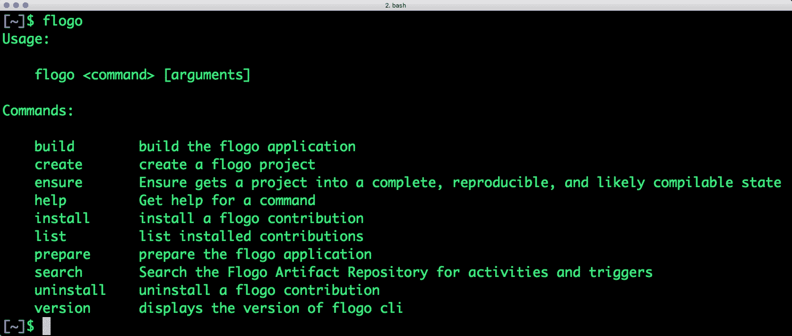

# Project Flogo:面向边缘计算的轻量级运行时

> 原文：<https://thenewstack.io/project-flogo-a-lightweight-runtime-for-edge-computing/>

边缘计算的兴起标志着企业物联网平台下一波浪潮的开始。主要的公共云提供商——AWS、谷歌和微软——已经将其物联网平台扩展到边缘。对于客户来说，边缘计算是公共云的延伸。他们获得微型版本的云服务，包括设备管理、机器对机器通信、身份验证和授权，以及通常通过容器和功能交付的核心计算服务。

AWS Greengrass、Azure IoT Edge、Google Cloud IoT Edge 将物联网平台服务延伸到边缘。但是这些服务与它们各自的云平台服务紧密耦合。客户需要一种不受云、平台限制的边缘计算平台，可以在内部部署。

TIBCO 的 Project Flogo 是一个轻量级边缘计算平台，不依赖于任何特定的公共云平台。这是一个考虑到可移植性而开发的[开源项目](https://github.com/TIBCOSoftware/flogo)。因为它主要是用 Golang 编写的，所以可以跨各种环境部署运行时。Project Flogo 可以在由运行 Kubernetes 的 x86 服务器或基于 ARM CORTEX 处理器的微型 Raspberry Pi Zero 主导的数据中心中运行。

与其他边缘计算平台不同，Project Flogo 占地面积非常小。它比 Node.js 和 Java Dropwizard 运行时轻 20 到 50 倍。执行 Project Flogo 应用程序所需的二进制文件只有 3.3Mb。

TIBCO 基于事件驱动和无服务器计算模型构建了 Project Flogo。该平台与 AWS Lambda 等主流无服务器平台无缝集成。

## 一个开发者对 Flogo 项目的看法

Project Flogo 是一个建立在 Node-Red 基础上的无代码平台。熟悉 Node-Red 的开发人员将能够立即使用该工具。但是 Flogo 在执行环境和运行时方面与 Node-Red 有着本质的不同。要运行 Node-Red 节点，部署平台应该安装 Node-Red。使用 Flogo，绝对没有来自目标环境的期望。Flogo 发出的二进制文件可以像本机 x86 或 ARM 可执行文件一样运行，没有任何依赖性。

在 Flogo 上构建应用时，开发人员要么处理 Web UI，要么处理 CLI。Flogo 应用被建模为流，流是基于 JSON 用领域特定语言(DSL)编写的声明。

Flogo 应用程序不是在运行时动态解析和执行流，而是将流嵌入到独立的二进制文件中。虽然开发人员每次更改流程时都需要编译二进制文件，但这样做的好处在于生成的二进制文件大小紧凑。编译后的二进制文件是独立的、可移植的、独立的实体，没有任何依赖关系。这就是 Project Flogo 最大的好处。这些轻量级的二进制文件可以通过现代的 CI/CD 工具轻松地推送到目标环境中。

一旦开发和部署了一个流，就可以通过各种触发器调用它。Flogo 中的触发器连接到入站和出站通道，如 REST、MQTT、CoAP、Kafka 主题、Cron 作业，甚至是直接通过 CLI 发送的参数。

当执行一个流时，它开始监听声明中定义的触发器。例如，MQTT 触发器将订阅现有的主题，并等待发布者发送消息。类似地，REST 触发器将在特定端口上同步等待 HTTP 请求到达。

那么，当在流中触发触发器时会发生什么呢？一系列动作将按顺序或以并行方式发生。这些操作在 Flogo 中作为活动提供。活动通过处理来自触发器的入站消息来完成繁重的工作。例如，一个活动可能会调用 Twilio API 来发送文本消息。另一个活动可能加载张量流模型，以发现传感器遥测中的异常。Project Flogo 附带了十几个预定义的活动，可以立即包含在流程中。开发人员还可以在 Golang 中创建自定义活动，并将其与流程连接起来。

[](https://storage.googleapis.com/cdn.thenewstack.io/media/2018/08/770c3dbb-flogo-1.jpg)

由于 Project Flogo 是一个事件驱动的平台，我们可以调用流程来响应外部事件。AWS Lambda 活动可用于调用现有的 Lambda 函数。

但是 Project Flogo 的无服务器功能超出了函数调用的范围。这些流可以以 AWS Lambda 为目标。有了 AWS Lambda 对 Golang 的本地支持，Project Flogo 流就可以作为 Lambda 函数打包和部署。Flogo CLI 和 AWS CLI 的组合可用于自动化功能部署。

## **弗洛戈项目启动**

Flogo 项目可以通过 web 界面或命令行访问。最简单的入门方法是拉一下 Project Flogo 的 Docker 图片。

下面是访问 Flogo web UI 的简单步骤。

```
$  docker run  -it  -p  3303:3303  flogo/flogo-docker:latest eula-accept

```

等待图像提取和初始化完成。终端将显示以下输出，表明平台已准备就绪。

[](https://storage.googleapis.com/cdn.thenewstack.io/media/2018/08/b1b730f8-flogo-2.jpg)

我们现在可以访问 web UI 了。点击 http://localhost:3303 将显示控制台:

[](https://storage.googleapis.com/cdn.thenewstack.io/media/2018/08/fbc128f2-flogo-3.jpg)

请随意探索一些流附带的示例应用程序。

您也可以通过三个简单的步骤安装 Flogo CLI。

1)从[https://golang.org](https://golang.org)下载 Golang，按照说明配置开发环境。确保正确设置了 GOPATH 和 GOBIN 环境变量。

2)安装 Golang Dep 工具来管理依赖关系。运行以下命令来配置该工具。

```
$  curl https://raw.githubusercontent.com/golang/dep/master/install.sh | sh

```

最后，使用以下命令安装 Flogo CLI:

```
$  go get  -u  github.com/TIBCOSoftware/flogo-cli/...

```

如果一切安装和配置正确，Flogo CLI 应该工作。

[](https://storage.googleapis.com/cdn.thenewstack.io/media/2018/08/2f7e26a1-flogo-4.jpg)

在下一篇文章中，我将带您逐步构建和部署一个可以在边缘计算设备上运行的端到端 Flogo 应用程序。

<svg xmlns:xlink="http://www.w3.org/1999/xlink" viewBox="0 0 68 31" version="1.1"><title>Group</title> <desc>Created with Sketch.</desc></svg>