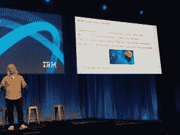
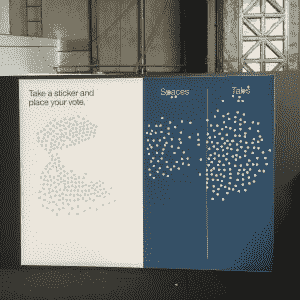

# IBM 通过项目 Intu 向开发人员介绍认知计算

> 原文：<https://thenewstack.io/project-intu-aims-inspire/>

为了帮助编码人员掌握认知计算的新兴实践，IBM 推出了一项名为 [Project Intu](https://www.ibm.com/watson/developercloud/project-intu.html) 的实验性服务，它提供了一种将各种 IBM Bluemix 认知服务快速集成到各种计算平台上的方法。

上个月，IBM 在该公司的[沃森开发者大会](http://www.ibm.com/watson/developer-conference/)上首次推出了项目 Intu，允许开发者测试语音转文本等服务。与会的开发人员可以免费使用 Watson 的 BlueMix 和 Intu，每次演示后都有一个“会见专家”工作会议，鼓励开发人员自己复制结果。

Intu 项目有一个大的工作区，旨在立即在您选择的设备上开箱即用，并包括一套样本认知能力，因此您可以立即开始与沃森进行对话。预配置的产品包括对其他服务的绑定，作为开发人员快速启动和运行 Watson 的一种方式，使之变得简单。

这在与会者中引起了巨大的轰动。IBM 首席技术官兼沃森副总裁 [Rob High](https://www.linkedin.com/in/highrobert) 在电话采访中表示，超过 350 名开发人员利用了工作区现场提供的指导，自大会以来，还有数百名开发人员访问了 Project Intu。开发人员可以编写代理来扩展 Intu 支持的行为。他对这种对创造认知体验的影响感到非常兴奋。

Bluemix 服务分为多个区域，如数据系统、物联网、网络、安全、分析、移动等。“我们不为您提供解决方案，”High 在会议上发言时说，“我们提供的是构建模块，让您能够创建自己的优秀解决方案。”

在线研讨会展示了如何扩展已交付的功能。例如，它展示了如何用你自己的意图和对话来创建你自己的对话。但更有趣的是，它还演示了如何将您的设备与其他功能(例如 GPS、陀螺仪、摄像头)连接起来，并将其融入对话行为中。

> “情绪是人们的感觉，语气是他们试图在你身上创造的感觉”——IBM 的 Rob High

他解释说，扩大人类认知应该有能力以某种方式激励人们。“总和大于其组成部分，”High 说。"它会让你比仅仅得到一个搜索结果更有见识."

通过发声或动作或其他认知行为，机器可以给用户更直观的与认知系统的交互。High 说，这种直观的体验提供了一种略有不同的视角。他说，希望他们至少会留下一点点灵感。

## 你是怎么做到的？

罗布·海描述认知计算。

High 解释说，在正确的时间拥有信息是成功的认知应用的一部分，但归根结底，这不仅仅是单词的问题，还与节奏和语调有关，单词的说话方式有助于传达信息，表现出你想要表达的意思。归根结底，认知能力的意义在于影响人类的体验。

Bluemix 目前提供 30 种与认知相关的服务，每一种都旨在帮助你解决整体问题的某些方面，High 解释道。沃森解决方案被分为三种主要服务，大致相当于诺贝尔经济学奖得主 T2·丹尼尔·卡内曼关于快速和慢速思维的研究。这三个服务领域是:

1.  **更高的推理能力**

几乎所有的人类互动都源于保持对话的能力。High 说，即使是看书或看电视也有对话重叠。就推理而言，这是最基本的构建模块。每个对话都被分解为开发人员需要解决的三个基本部分:

1.  辨别所说的话，并辨别其背后的意图。
2.  映射出的实体可能已经在其中表达了。
3.  确定下一步该如何处理这些信息。

Watson 的工具集允许开发人员以对话方式构建这种交互，一些基本工具包含在 Project Intu 中。

2.  **基础认知技能**

对话结束后，你想了解谈话背后的人——他们的心情，他们的个性。沃森提供了关于言语、视觉、移情和理解对话语气的工具。如果能够理解语气，无论是高兴、生气还是厌恶，沃森就能写出更好的答案。想象一个客户服务机器人，它会根据客户是生气还是悲伤来回答相同的问题。

你还需要理解情绪，高说。“情绪是这个人的感觉，语气是他们试图在你身上创造的感觉。”这些元素可以让你了解个性。沃森可以控制文本到语音的处理，以辨别悲伤或愤怒的陈述之间的差异，从而更好地继续对话。

3.  **知识组织能力**

这些沃森服务是基于智能认知的，什么是认知互动背后的智能，包括我们如何才能智能地接近某人，用他们需要知道的信息打动他们，以他们可以表达的方式吟诵和说出事情。

手势在对话中同样重要，需要包含在机器人对话中。High 说，想象一下一个门房机器人，它需要向电梯做手势，同时说“它在那边。”这些手势是认知体验的一部分。

## 这在现实世界中是什么样子的？

High 举了一个例子，说明如何在商业服务中将这些组件组合在一起。如果一个人来到一个沃森支持的网站询问购买抵押贷款，认知助理可以从他们的其他数据中推断出，他们不仅想知道抵押贷款利率，还可能会有超出抵押贷款利率的问题，关于房价，或者某个特定房子的社区和学区是什么样的。没有孩子？然后你就看不到任何学校信息了。你经常去咖啡店吗？您将看到搜索住房时返回的附近咖啡店列表。或许还可以提供一些如何应对搬家压力的信息。

开发者在旧金山沃森开发者大会上投票。

High 说，大数据有两个关键信息。首先，需要了解需要什么样的定量和定性分析组合来应对不同的商业和社会问题。分析只是解决方案的第一部分。我们需要的是“在客户的特定环境下，说出客户的特定问题的东西。”

理解赛义德·海的第二件事是“我们过去所知道的关于计算机的一切，所有这些都将被花在认知空间的时间所超越。”认知计算正在扩展到日常活动，进入新的空间，它可以学习我们从未有时间学习的所有东西。这些系统“将理解我们，我们的动机，我们的个性，对我们做出反应，了解我们的需求并做出情感反应。”

最后一点，开发者是这个新世界的关键，而理解机器学习的人并不多。但是像 INTU 这样的项目将帮助更多的编码人员参与即将到来的认知计算革命。

IBM 是新堆栈的赞助商

照片由 T.C. Currie 拍摄。

<svg xmlns:xlink="http://www.w3.org/1999/xlink" viewBox="0 0 68 31" version="1.1"><title>Group</title> <desc>Created with Sketch.</desc></svg>