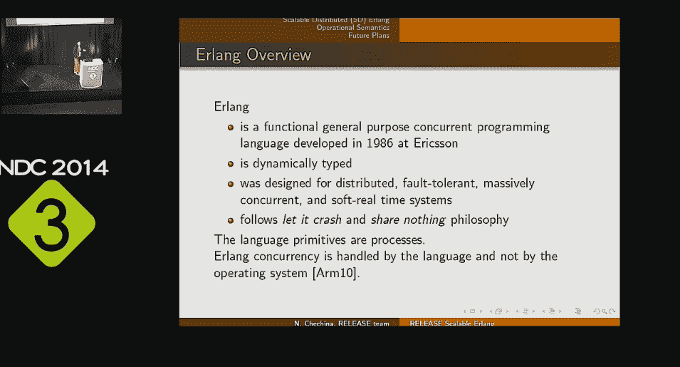

# Project Orleans:不同于 Erlang，是为广大开发人员设计的

> 原文：<https://thenewstack.io/project-orleans-different-than-erlang-designed-for-a-broad-group-of-developers/>

在我们之前的帖子中，我们给出了

[Project Orleans](https://thenewstack.io/project-orleans-the-net-framework-from-microsoft-research-used-in-halo-4/)

，由微软设计，旨在简化构建云服务。在本帖中，我们将更详细地了解奥尔良，以及它与市场上其他类似技术的比较。

Project Orleans 是由微软研究院的极限计算小组构建的一个. NET 框架，与演员模型最著名的例子 [Erlang](http://www.erlang.org/) 相比，它赋予了演员模型一个有些不同的角色。正如 Glasgow 大学的 Natalia Chechina 博士去年在 T2 关于可扩展 Erlang 的演讲中提到的，Erlang 是为分布式系统设计的，最初由 Ericsson 在 1986 年创建，用于控制电信设备中的电路。

例如，Riak Core 中使用了 Erlang，Yan Cuti 在一篇名为“[透过 Erlang 有色眼镜看微软奥尔良](http://theburningmonk.com/2014/12/a-look-at-microsoft-orleans-through-erlang-tinted-glasses/)”的精彩文章中对此进行了讨论。他写道:

在 Erlang 领域， [Riak Core](https://github.com/basho/riak_core) 提供了一套工具来帮助您构建分布式系统，它的方法让您能够更好地控制系统的行为。但是，您必须自己实现更多的东西，比如当集群拓扑发生变化时如何移动数据(尽管 vnode behav ior 为您提供了这样做的基本模板)以及如何处理冲突，等等。

## 奥尔良方法

当考虑高可用性和一致性之间的权衡，尤其是易用性和更学术的方法之间的权衡时，Orleans 团队做出了一些非常不同的决定。

这个想法是为了使 actor 模型民主化，并把它交给广大的开发人员，他们可能喜欢像 Erlang 这样的语言，但绝不会在日常开发中使用它。“演员比其他范例更好地代表了现实生活，”来自奥尔良团队的谢尔盖·比科夫认为。"面向对象是紧密的，但是在现实生活中并没有紧密耦合."这使得它成为一个非常有用的模型，不能局限于那些准备从零开始，在一个小的生态系统中学习一门新语言的开发人员。

“我们经常听到人们说‘这太容易上手了——我刚下载了 SDK，它就工作了。“我不需要学习任何东西，我在 Azure 的集群上部署了 worker 角色，它就工作了，”Bykov 说。“他们非常高兴，这就是我们在寻找的客户。”

> “当我们考虑如何构建关键 API 以及面向哪些受众时，我们特意选择了更民主化的消息传递版本。我们在易用性、灵活性和大多数开发人员的接受度之间做了权衡。”

这意味着不仅仅是。Orleans 框架是用. NET 编写的，开发者看起来会很熟悉。“方法名、参数名；他们对一切都很熟悉，”比科夫说。任何与 Windows Communication Foundation 合作过的人也会有宾至如归的感觉。

“你总是可以通过手工制作的东西挤出几个百分点的额外性能，但在现代世界中，5%，10%甚至 20%的性能与开发人员的生产力和上市时间以及能够快速雇佣人员来构建产品相比微不足道，”Bykov 坚持说。“昂贵的开发人员可能会在五年后创建一个更快的系统，但你需要一个一年或六个月的系统。这是一个复杂的优化问题，不仅关乎原始性能，还关乎软件开发和招聘人员的经济性。”

## 设计决策

消息传递是 actor 模型的一个关键特性，Orleans 在消息传递方面的效率取决于您是在单个系统上运行它还是通过网络分发它。“如果你在不同机器上的两个参与者之间发送消息，你没有选择，你必须通过网络发送，效率取决于你发送多少数据，”Bykov 指出。“奥尔良的信息有一堆标题——谁发的，发给谁，一些跟踪信息。有些字段看起来无关紧要，但实际上，当您调试一个系统时，因为某些东西不工作，您很希望有调用堆栈和调试上下文，这样您就可以看到发生了什么。当您在生产中遇到关键问题时，它可以节省时间。"

如果您在单一系统上运行，Orleans 可以节省序列化消息的开销。“你可以隔离消息并进行内存复制，而不是真正的序列化，如果一条消息在同一台机器上的两个粒度之间，我们就会这样做。”

该团队还对序列化做出了一个似乎不寻常的选择，并构建了自己的序列化层。“我们本可以选择邦德或另一个框架。我们查看了微软内部已经使用的五种序列化框架，”Bykov 解释道，但是它们都有缺点，通常在计算和消息大小方面都很昂贵。".NET 是昂贵的，二进制 XML 更是如此。其他人要求您预先定义消息格式并编译它们；WCF 通过合同做到了这一点。Bond 非常高效，但受限于必须预先定义消息类型。我们想要更灵活的东西。我们希望它看起来像几乎任何函数调用。所以我们最终构建了自己的序列化层。听起来可能很贵，但它确实管用。您可以发送一个字典，其中有十个对同一个对象的引用，在接收端，您会得到完全相同的引用。它将保留类型，所以您不必预先知道将发送什么类型。为了获得灵活性和效率，我们做出了增加(开发)投资的权衡。”

开发人员经常问奥尔良团队的一个决定是可用性和一致性之间的权衡。Bykov 不同意这种观点，即演员模型需要一致性，以至于你只能有一个演员的实例。“这不是演员模型的特征，而是实现细节。我们特意选择了优化可用性。如果您有分区失败，如果您的集群处于某个奇怪的转换状态，它会超时自行解决，但具有不确定性，这可能会创建具有相同身份的重复参与者。您可能会得到不止一个。即使在失败的情况下也不太可能，但这是有可能的。”

他表示，这是云系统中常见的一种权衡。

> “对于云系统，人们总是选择可用性。您不想保持一致但又不可用，因为这意味着您将在五分钟后保持一致。我们选择了这一点，而不是在不确定性解决之前让参与者无法参与。”

奥尔良给你的是最终的一致性。“这最终只是一个演员的例子。这是相对罕见的，你最终与两个实例；你几乎永远不会得到三个，最终我们保证一个演员的实例，所以最终状态是一致的。”

如果参与者的两个实例都已更新，则需要合并更新。“这可能看起来是个大问题，但实际上远没那么大，因为实际上您的系统通常由持久存储支持。如果是 Azure 表或 blob，它们支持检测冲突。”

您的系统也许能够在不解开更新的情况下获得执行元的状态。对于跟踪游戏中每个人的 Halo presence 服务，“真相在控制台上，所以即使你在云中变得不一致，也不需要解决任何事情。最终控制台会把真相的新版本发送到云端。”

即使你需要添加到一个现有的值，而不仅仅是更新它，Bykov 认为最终的一致性是足够的，因为分布式系统的本质。“在一个分布式系统中，如果没有两阶段提交，你永远无法保证只交付一次；事实上至少有一次。你可能会丢失一个进来的消息或者你可能会丢失确认，你知道拜占庭式的失败是可能的，所以你的操作需要是可交换的。这意味着您已经在构建最终保持一致并处理重复的存储层。这些都是分布式系统固有的问题。”

在云级别，选择可用性更加重要。“说我将锁定存储中的这个东西很容易，没有人可以同时更新它，但这导致了一些东西不可用。假设你锁定它一分钟，在此期间，机器死亡。现在，没有人可以更新它，直到检测到故障，锁被移除或锁过期。它既昂贵又缓慢，而且需要大量资源来跟踪锁。如果你有一百万个对象，现在你要跟踪一百万个锁。”

为了提高效率，奥尔良团队在全球范围内进行了类似的权衡。“我们决定一切都是异步的；您不能定义冻结操作。如果你使用了承诺，并在承诺上阻塞，而不是使用 async/await，你就阻塞了线程。如果你有十个并发请求，你就阻塞了十个线程；如果你阻塞了一千个线程，你就有麻烦了。如果您试图每秒处理 10，000 个请求，您就无法获得吞吐量。螺纹贵。”

为了解决这个问题，Orleans 在服务器端有一个受到严格控制的线程池，每个物理调用一个线程。Bykov 解释说:“如果线程上没有要处理的东西，如果代码发出一个 IO 调用需要 100 毫秒，那么等待 100 毫秒是没有意义的。”“所以我们实质上把线程交给了系统。当你在等待那个线程有东西要处理的时候，我们可以处理成千上万条需要 CPU 的消息。这是一个设计决策，意味着您可以在不耗尽资源的情况下处理大量请求。”

甚至在 async/await 模式出现之前，这就是 Orleans 模型。以前它是用 promises 库实现的，但是 Bykov 热情地称赞这种新模式，尽管他承认它有一些额外的开销(因为编译器必须创建一个状态机来处理它)。

> “这种 async/await 模式是自并行编程以来最好的模式。这使得编写没有任何回调的顺序代码变得容易得多，并且同步工作非常高效。这是一种范式转变。”

在 Orleans 内部使用 async/await 意味着团队可以删除将近一半的应用程序代码。“我们只是尝试捕获、等待调用和捕获异常，而不是继续符、花括号和‘万一成功’。”同样，这有助于让广大开发人员更容易理解 Orleans，也更容易使用它进行开发。

> “我们都是人。代码越长，我们就越有可能漏掉一些东西，犯错误。”

## 奥尔良:一种不寻常的不复杂的规模化方式

云规模应用不适合常见的 MVC、MVVM 和其他 n 层设计模式，尤其是在为横向扩展部署开发微服务时。这就是位于奥尔良市中心的演员模型发挥作用的地方。消息在代码块之间传递，代码块是处理消息内容的参与者。这种模型允许您快速创建 actor 的新实例，因为没有并发性——您只需要一个新地址来发送消息。因为每个参与者都是一个独立的功能元素，所以它们很容易用作大规模并行计算框架的基础。一个 actor 所需要的只是作为其消息的预期接收者的 actor 的地址，对于单个 actor 来说，除了在消息到达时处理消息内容并将结果发送给下一个 actor 之外，不需要做更多的事情。下一个参与者可能是任何东西，从 API 端点到编组引擎，再到一部分业务逻辑。

奥尔良的演员结构和 Erlang 有很多相似之处。Erlang 最初是作为一种开发电话交换应用程序的语言出现的，它可以被认为是一种带有消息传递的 actor 模型的函数式编程环境。Erlang 是一个强大的工具，是构建大规模 actor 服务的常用工具，尤其是在金融服务行业，它利用其功能基础来处理复杂的任务。它还在分布式 NoSQL 数据库的核心以及配置和源代码控制管理系统中扮演了一个角色。但这是一种复杂的语言，并非所有开发人员都有兴趣学习，而且它没有奥尔良虚拟演员的优势。

同样，Scala 也得到了很多支持，它在金融服务和在线游戏中也很受欢迎。正如 RedMonk 分析师 James Governor 指出的那样，“它可能不适合所有人，尽管 Scala 带来了规模和真正强大的模式匹配，但它有一个陡峭的学习曲线。”正如 Governor 指出的，这给了 Orleans 一个机会，“如果微软能够提供基于 actor 的并发性和更简单的编程语法，Orleans 可能是一个有用的工具，当然是对微软商店来说。”

也许最著名的 actor 框架是 Typesafe 的开源 Akka。这是一个基于 Scala 的框架，运行在标准 JVM 上。像 Orleans 一样，它是围绕异步消息构建的，带有额外的工具来处理集群和与消息队列系统一起工作。Akka 已经开发了一个大型生态系统，拥有超过 250 个 GitHub 项目，以及一个到. NET 的端口。由于 Akka 是 Typesafe 平台的一部分，所以它为 Play Java 框架提供了事件驱动的中间件功能。但是你不仅要应付 Scala 的陡峭的学习曲线，Akka 是一个比 Orleans 低得多的解决方案。

其他的 actor 框架包括 Pulsar，它为 Clojure 添加了 actor。虽然它提供了异步 IO，但它通过同步 API 工作，降低了代码的复杂性。Pulsar 的底层是一个使用轻量级线程——Quasar——编写的 Java 排队框架，Pulsar 提供了一个类似 Erlang 的 API。它仍处于开发阶段，目前并未设计为处理分布式参与者，这使得编写横向扩展微服务更加困难，因为许多操作最终都是阻塞操作。目的是提供一个框架，其中 Java 处理繁重的工作，而 Clojure-wrapper 作为 Parallel Universe 的 Galaxy 内存数据存储的一部分管理并发性，该存储处理分布式数据结构。使用 actors，可以使用点对点消息传递在处理节点之间一致地共享数据。

以一位开拓性的梵语语法学家的名字命名， [Panini](http://www.cs.iastate.edu/~panini/man/index.html) 将自己描述为一种“面向胶囊”的语言，在 JVM 之上交付为 PaniniJ。目标是在顺序代码封装处理消息的同时，使用异步消息为并发编程提供一个类似于 actor 的编程环境，避免常见的并发错误。Panini 可能被认为是一种在 Java 上交付并行编程的方式，使用从底层参与者-消息模型中抽象出来的熟悉技术进行开发——与垃圾收集器管理内存的方式非常相似——代码在模块(称为胶囊)内运行。胶囊是通过将一个程序分解成简单的参与者来创建的，参与者用需要工作的胶囊的定义来包装——同时定义消息和 API。Panini 目前是一种研究语言，但它显示了作为一套技术的前景，可以移植到其他语言和运行时，而不仅仅是 JVM。

虽然有些框架没有明确实现 Actor 模型，但它们仍然在使用它。以 [Seneca](http://senecajs.org/) 为例，这是一个崭露头角的 Node.js 应用框架。它专为微服务而设计，专注于构建用户故事的 API 实现，利用它们来定义用于在端点和服务之间发送信号的消息。当与开放的 [MQTT 消息框架](http://mqtt.org/)结合时，它成为一个可伸缩的 actor-message 框架，Node.js 托管的服务作为 actor 运行，JSON 消息由 MQTT 整理。Seneca 可能不是一种明确的编写 actors 的方法，但它(和 Node.js 的底层交换模型)使它成为一种有趣的方式，可以滚动自己的异步前端抽象，从物联网的消息处理和处理到高度可伸缩的电子商务系统，同时仍然使用熟悉的 JavaScript 结构。

这些都不像奥尔良那样真正在高抽象层次上工作。这一点，以及成功的 Xbox 服务，使用奥尔良启发的电子艺术公司的生物软件部门为其云游戏资产开发自己的虚拟演员平台， [Orbit](https://github.com/electronicarts/orbit) 。电子艺术公司认为奥尔良是其创建虚拟演员模型 Java 版本的灵感来源，其目的是通过“轻量级和简单易用，提供位置透明性和一等公民的状态”来解决“许多使演员框架难以工作的问题”这是对奥尔良方法的明确认可，使用虚拟演员，偏爱简单而不是所谓的“更纯粹”的建筑理念。

Orbit 现在已经被开源为一个 JVM actor 框架，因此它可以与任何可以在 JVM 上运行的语言一起工作，包括 Java 和 Scala。像 Orleans 一样，Orbit 将为您管理您的演员，简化应用程序开发。容器可以用来包装应用程序，处理连接在一起的对象，以及启动和停止应用程序。该框架还包括 web 服务接口，因此您可以将 Orbit 应用程序与其他服务和工具挂钩。

actor 模型的未来是充满希望的，有许多不同的实现正在使用和开发中。它也是流行的构造游戏的核心，如《我的世界》和 Project Spark，在这些游戏中，可编程对象很容易被认为是交互的参与者，这些交互由异步消息处理。这意味着下一代开发人员将会在不知道的情况下熟悉事件驱动的 actor 框架，只是通过玩游戏。这将使一个易于使用的演员框架——像奥尔良一样——特别有吸引力。

## 开源未知

由于 Orleans 的开源模型和简单性，团队对许多 Orleans 开发人员一无所知，或者只从 Azure 支持团队或通过 GitHub 或 Codeplex 上的评论听说过。光环系统众所周知，但还有很多其他项目使用奥尔良。“它非常容易使用，以至于有些人没有问我们一个问题就投入生产，”Bykov 指出。

直到他们在 Codeplex 上问了一个问题，或者关于另一家开发大型物联网解决方案的欧洲企业，他才知道这家德国公司已经生产了六个月的奥尔良系统；"他们管理着一个主要的可再生能源储能设施."他们的奥尔良系统被用于害虫控制:“他们管理多达两百万个捕鼠器。”他接触过广泛的项目。“它们控制设备或处理来自设备的数据，并以分层方式组织它们，以实现楼宇控制或车辆遥测。”

这是可能的，因为虚拟演员模型的灵活性。“范围从大规模设备部署到处理少量高吞吐量设备。它适用于高吞吐量和每天或每小时到达一次的不频繁的消息。资源是自动管理的:我只是设置时间窗口，并说我希望在两个小时或五分钟不活动后对其进行垃圾收集。我不用担心它们有多少来来去去，有多少被激活或停用。我可以编写程序，就好像它们总是在那里一样。我不必编写代码来管理它们，这真的扩大了应用范围。”有了这样一个广泛社区，成为一个开源项目对奥尔良来说是有意义的。

<svg xmlns:xlink="http://www.w3.org/1999/xlink" viewBox="0 0 68 31" version="1.1"><title>Group</title> <desc>Created with Sketch.</desc></svg>