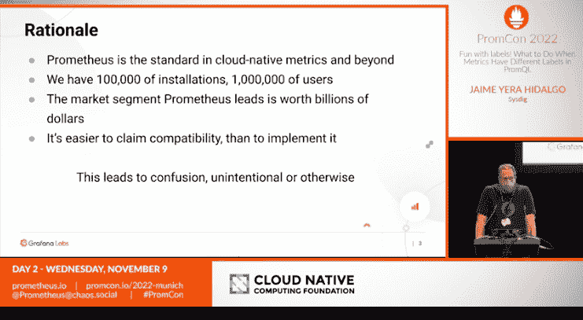

# PromCon 2022:为什么普罗米修斯必须改变

> 原文：<https://thenewstack.io/promcon-2022-why-prometheus-had-to-change/>

Prometheus 将继续作为监控的重要工具，尤其是作为[云本地环境](https://thenewstack.io/cncf-prometheus-agent-could-be-a-game-changer-for-edge/)的[可观测性平台](https://thenewstack.io/prometheus-at-10-whats-been-its-impact-on-observability/)的关键组件。作为[云本地计算基金会](https://cncf.io/?utm_content=inline-mention)(CNCF)的“发展最快”的项目之一，时间序列数据库对于收集 Kubernetes 集群的指标特别有用，并且通常与 Grafana 仪表板一起用作可视化的可观察性工具。

在今天的疫情环境中，度量和可观测性数据对于许多过度扩展和高度分散的开发运维团队来说变得越来越重要，尤其是那些在开发环境中工作的团队。

Grafana Labs 的社区主任和 CNCF 技术顾问小组 Observability chairman 在他的演讲中说:“我不需要说服这个房间，普罗米修斯是基于云的本地度量监控的事实标准。”

但是，随着普罗米修斯的维护者庆祝其 10 周年纪念日，社区对监控 Kubernetes 的需求正在迅速发展。用户也越来越清楚他们想要什么和需要什么。 [PromCon EU 2022，](https://promcon.io/2022-munich/talks/native-histograms-in-prometheus/)11 月在慕尼黑举行的 Prometheus 年度用户大会，是一个关于 Prometheus 必须如何和为什么发展以及 Prometheus 维护者必须做什么的论坛。

## 普罗米修斯移位

Kubernetes 当然很努力。监控和可观察性度量当然有助于驯服 Kubernetes 的管理。但是使用工具做到这一点并解释通常大量的数据带来了明显的挑战。

在 Prometheus 的案例中，尽管自前谷歌工程师最初于 2012 年在 SoundCloud 发布并创建 Prometheus 以来，它越来越受欢迎，但许多人认为它很难使用(正如我们下面看到的那样，Grafana 在这方面帮了大忙)。哈特曼告诉新堆栈，可用性因此成为普罗米修斯用户在该项目存在的 10 年间寻求解决的主要痛点，以及该项目面临的其他挑战。

“普罗米修斯曾经有一个难以使用的内涵，”哈特曼说。“现在来看，快速获得价值要容易得多。”

Prometheus 的大部分都要归功于它的逻辑和算术运算符，这些运算符与 PromQL 查询函数一起服务于大规模数据需求。哈特曼说:“普罗米修斯解决的根本问题是，它第一次允许你以一种真正灵活和可扩展的方式用你的监测数据做数学运算。”“整个行业将不再一样，因为人们看到了可以做些什么。”

众所周知，Prometheus 还能适应伸缩需求，这显然是从 Kubernetes 环境中的指标进行推断所必需的。“我们现在支持的规模是前所未闻的，除了超大规模，”哈特曼说。“10 年前，没有人预料到我们能够处理这么多数据。这是一个飞跃。”

## 新东西

PromCon 期间的讲座涵盖了用户可以利用的新功能，旨在使可观测性在未来几年更容易获得和更强大。换句话说，这次演讲并不仅仅是提供了一系列新的特性和功能，这些特性和功能已经成为 Kubernetes 事实上的监控工具。

普罗米修斯的直方图有其缺点，Grafana 高级软件工程师 [Ganesh Vernekar](https://in.linkedin.com/in/ganeshvernekar) 的直方图代表了更重要的会议讨论之一。Vernekar 说，Prometheus 中的直方图已经可靠地工作了多年，但在存储效率、直方图查询的准确性和使用直方图的灵活性方面，它们有一些缺点。Vernekar 在他的演讲中宣布的好消息是 Prometheus v2.40.0 现在支持原生直方图，这代表了一个相当重要的发展。

普罗米修斯项目去年引入了它的[一致性计划](https://github.com/cncf/prometheus-conformance)，作为一种帮助确保被吹捧为与普罗米修斯兼容的数据源之间的互操作性的方法。哈特曼去年表示，该计划旨在确保互操作性，保护用户免受意外，并实现更多并行创新。

在过去的一年中，测试流程和合规计划提供的其他支持已经成熟，使组织更容易确保他们已经完成了适当的尽职调查。“从本质上来说，说你们合得来是非常非常容易的。哈特曼说:“实际上要做到兼容要困难得多，尤其是当它涉及到具体功能如何运作的本质细节时。“人们很难自己搞清楚这一点。”

哈特曼以一种微妙的方式描述了未经测试的兼容性声明如何会导致“混乱”，有时是“故意的，有时不是故意的”，这就是“为什么我们感到被迫走上这条道路，”哈特曼说。作为对策，Hartmann 描述了一致性项目如何提供一组测试，可以在云环境中运行这些测试来测试 Prometheus 实现。

## 房间里的大象

会议期间房间里的大象是格拉法纳。当然，Grafana 在普罗米修斯的发展过程中起到了并将继续起到关键作用。Grafana 在 2015 年通过构建其数据可视化面板来适应 Prometheus 用户，从而增加了对 Prometheus 的支持。今天，很难找到不使用 Grafana 的普罗米修斯用户。Grafana 继续保持对开源项目 Prometheus T1 的主要贡献者的支持，超过 44%的 Prometheus 维护者来自 T2 Grafana 实验室 T3。

Grafana 还创建了许多自己的数据可视化开源项目，包括最近发布的用于连续分析的 [Grafana Phlare](https://go.grafana.com/MzU2LVlGRy0zODkAAAGIAT7RMxj4_xBkiwbzWZHMTsHOLos11o7raEaBmG_NkWkTYf3cwl-hfKTZMWIs4ANzQlhWgDc=) 和用于前端应用程序可观察性的 [Grafana Faro](https://go.grafana.com/MzU2LVlGRy0zODkAAAGIAT7RM7_7OVhm0vSzzC6416KuN1b2eA89MNiDx_mKZ-TtR1J-QG5j4FJARqtVlLvYdkb6q-U=) 。这些开源项目建立在 Grafana 现有的开源项目[米伊美(metrics)](https://grafana.com/oss/mimir/)[Loki(logs)](https://grafana.com/oss/loki/)和 [Tempo (traces)之上。](https://grafana.com/oss/tempo/)

“格拉夫纳和普罗米修斯共同进化了。哈特曼说:“Grafana 软件更适合普罗米修斯，而不是相反。“但是普罗米修斯的大量工作是由格拉夫纳实验室支付的。几乎是共生的，尽管不是每个人都会喜欢这个词。”

<svg xmlns:xlink="http://www.w3.org/1999/xlink" viewBox="0 0 68 31" version="1.1"><title>Group</title> <desc>Created with Sketch.</desc></svg>