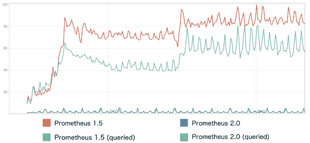

# 普罗米修斯 2.0 带来了一个快速的新的本地存储引擎

> 原文：<https://thenewstack.io/prometheus-2-0-bulks-local-storage/>

据 [CoreOS](https://coreos.com/) 软件工程师、 [Prometheus](https://prometheus.io/) 监控系统的核心开发者 [Fabian Reinartz](https://fabxc.org/) 称，改进的本地存储是 Prometheus 2.0 新版本的核心。

Reinartz 在一篇博客文章中指出，随着分布式系统协调软件如 Kubernetes 和 Mesos 的出现，监控环境变得越来越动态。运动软件需要自己的专用存储来确保在这些动态环境中的响应能力。

尽管 Prometheus 1.6 引入了自动调优功能，但该团队一直在开发一个性能更高的时间序列数据库。“这样更可靠、更快。理想情况下，你不希望总是不得不重新配置，所以普罗米修斯只是对需求的变化做出反应，所以运行它的人要做的事情少得多，”Reinartz 在采访中说。

它从数百万个点收集数据来监控应用程序和基础架构，并将其存储在收集数据的同一个节点上。

“我们谈论的是每分钟都有数百万个数据点涌入。存储引擎将这一点提高了几个数量级。内存使用率提高了五倍，CPU 提高得更多，”他说。

Reinartz 解释说，Prometheus 2.0 最显著的改进是写入磁盘的数据减少了两个数量级。这增加了固态硬盘的寿命，从而降低了成本。在高序列变动的情况下，即使使用相同的时间序列压缩算法，也可以观察到显著的磁盘空间节省。

Prometheus 2.0 写入磁盘的数据减少了两个数量级。这增加了固态硬盘的寿命，从而降低了成本。在高序列变动的情况下，即使使用相同的时间序列压缩算法，也可以观察到显著的磁盘空间节省。

查询延迟更加一致，并且在面对高系列变动时具有更好的伸缩性。

在去年 8 月举行的慕尼黑普罗米修斯大会 [PromCon 2017](https://promcon.io/2017-munich/) 上，Reinartz 描述了新存储层是如何从头开始设计的，并深入探讨了他如何为监控软件[创建时间序列数据库](https://fabxc.org/blog/2017-04-10-writing-a-tsdb/)，该数据库现在由[云本地计算基金会](https://www.cncf.io/)管理。

[https://www.youtube.com/embed/b_pEevMAC3I?list=PLoz-W_CUquUlnvoEBbqChb7A0ZEZsWSXt](https://www.youtube.com/embed/b_pEevMAC3I?list=PLoz-W_CUquUlnvoEBbqChb7A0ZEZsWSXt)

视频

新设计提供了高效的索引技术来处理监控目标的高周转率，并提供一致的查询性能。它还降低了资源需求，为热备份和动态保留策略等高级功能铺平了道路。

新的存储引擎“使用受全文搜索启发的倒排索引，在 Prometheus 中的时间序列可能具有的任意维度上提供快速查找。一种新的磁盘格式确保了相关时间序列数据的良好搭配，而预写日志使 Prometheus 2.0 能够抵御崩溃，”Reinartz 在博客中解释道。

2.0 版本还增加了陈旧处理，这是最受欢迎的路线图项目之一。现在可以精确跟踪消失的监控目标，减少查询伪影和警报响应。

[https://www.youtube.com/embed/GcTzd2CLH7I?list=PLoz-W_CUquUlnvoEBbqChb7A0ZEZsWSXt](https://www.youtube.com/embed/GcTzd2CLH7I?list=PLoz-W_CUquUlnvoEBbqChb7A0ZEZsWSXt)

视频

普罗米修斯 2.0 还提供:

*   对整个数据库快照备份的内置支持。
*   YAML 格式的记录和警报规则，使其更容易与配置管理和模板集成。

简单开放的存储格式和库还允许用户轻松构建自定义扩展，如动态保留策略。这使得存储层能够满足广泛的需求，而不会给 Prometheus 本身带来复杂性；Reinartz 在博客中说，这使它能够专注于其核心目标，并补充说，远程 API 将继续发展，以满足长期存储的要求，而不会牺牲普罗米修斯通过简单实现可靠性的模式。

Reinartz 说，Prometheus 背后的任何长期存储环境的本地读/写集成(T4)仍在未来。

Prometheus 最初由 [Soundcloud 开发，供内部使用](https://thenewstack.io/soundcloud-relies-open-source-prometheus-monitoring/)，是一个基于谷歌 [Borgmon](https://research.google.com/pubs/pub43438.html) 思想的分布式监控工具，它使用时间序列数据和指标让管理员深入了解他们的运营情况。

通过将数据流标识为键值对，Prometheus 聚合并过滤指定的指标，同时允许进行细粒度的查询。

它的[成熟、可扩展的数据模型](https://thenewstack.io/contributing-prometheus-history-alertmanager/)允许用户为每个时间序列附加任意的键值维度，相关的查询语言允许你进行聚合、切片和切割。

它对多维数据收集和查询的支持被[标榜为一种特殊的优势，尽管对于诸如按请求计费这样的应用来说并不是最好的选择。](https://prometheus.io/docs/introduction/overview/#architecture)

普罗米修斯成为继 [Kubernetes](/category/kubernetes/) 之后[云原生计算基金会](https://www.cncf.io/) (CNCF)采用的[第二个项目](https://thenewstack.io/cloud-native-computing-foundation-prometheus-second-hosted-project/)。CNCF 采用 Prometheus 的部分原因是它适合云原生技术，如容器和微服务。

在上个月的[开源峰会](http://events.linuxfoundation.org/events/open-source-summit-europe)上，CNCF 在其项目组合中增加了关注安全的[公证人](https://github.com/theupdateframework/notary)和[更新框架(TUF)](https://github.com/theupdateframework/specification) ，并宣布了 [30 名新成员](http://markets.businessinsider.com/news/stocks/The-Cloud-Native-Computing-Foundation-Announces-30-New-Members-1005308286)。

云本地计算基金会和 CoreOS T21 是新堆栈的赞助商。

特征图片:[阿尔贝托](https://www.flickr.com/photos/ambs/)的[普罗米修斯](https://www.flickr.com/photos/ambs/112083914/in/photolist-aUsDh-eGZRyq-eGZJJj-eGTxDV-7TEwXH-arMg6q-ii6Co6-H4qoe9-vXNkeJ-kYGYi-H4qvW3-HSTy9a-H4qxV3-HQBaPA-akDXLK-cLycFA-HyP6LA-aZnFvH-HZm1gM-cE9owW-92TgSs-HWfouq-H4qHQy-oBpaAt-HQxka7-eGTzwF-eGZDhJ-eG)，以 [CC BY-SA 2.0](https://creativecommons.org/licenses/by/2.0/) 授权。

<svg xmlns:xlink="http://www.w3.org/1999/xlink" viewBox="0 0 68 31" version="1.1"><title>Group</title> <desc>Created with Sketch.</desc></svg>