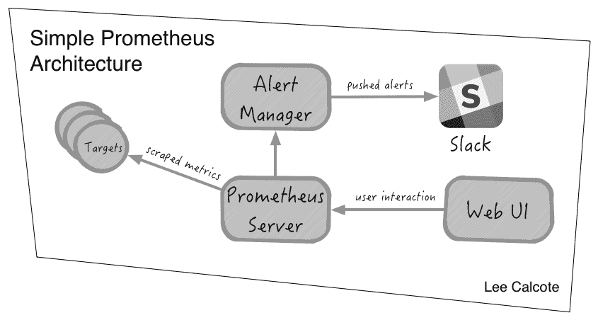

# Prometheus 微服务监控器报告生产情况

> 原文：<https://thenewstack.io/prometheus-microservice-monitor-reports-production/>

到目前为止，众所周知，传统的应用监控工具[不适合](https://thenewstack.io/qa-james-turnbull-art-monitoring-age-microservices/)监控微服务。直到最近，我们才开始看到新一代工具足够灵活，可以收集一些关于容器化服务的运营指标，这些服务可能在这些动态系统中一两分钟内出现或消失。

最近，一个开源微服务监控工具， [Prometheus](https://prometheus.io/) ，刚刚从 beta 状态中毕业。该软件的创造者之一朱利叶斯·沃尔茨宣称，该软件在过去的一年里已经为生产做好了准备。 [1.0 名称](https://prometheus.io/blog/2016/07/18/prometheus-1-0-released/)仅仅是为了确保在未来保持向后兼容性，为任务关键型系统的程序化使用铺平道路。

在过去的几年中，该项目不得不致力于完善软件的各个方面，特别是正确地使用查询语言和存储引擎。该项目于 2012 年在 SoundCloud 上启动，现在每月有大约 20 名新的外部贡献者。

据沃尔茨估计，大约有 300 到 400 个组织已经在使用该软件，其中包括 12 家财富 500 强企业。它可以用来监控非常小的工作负载:一个用户部署 Prometheus 来捕获 Raspberry Pi 的操作信息。但是它也很容易扩展。例如，DigitalOcean 使用该软件来监控其机器。

也许最值得注意的是，Prometheus 与 [Kubernetes](/category/kubernetes/) 容器编排工具紧密集成。这种耦合无疑是云本地计算基金会[将 Prometheus 纳入旗下](https://thenewstack.io/cloud-native-computing-foundation-prometheus-second-hosted-project/)作为继 Kubernetes 之后的第二个项目的原因之一。

这并不令人惊讶，因为普罗米修斯与 Kubernetes 有着密切的联系，这两者的基本想法都是在谷歌孵化的。

## 微服务时代的监控

该项目由两位前谷歌工程师沃尔茨和马特·普劳德于 2012 年在 SoundCloud 启动。“我们都觉得开源世界缺乏对动态集群调度环境的良好监控工具，”沃尔茨说。

SoundCloud 已经有了一个内部集装箱调度系统。实例总是在不同的主机和端口上，并且是动态调度的。沃尔茨说，作战部需要一个工具来“搞清楚这一切”。大多数监控工具更适合静态工作。

他们模仿 BorgMon 的软件，Borg mon 是谷歌所有容器操作的内部监控工具。“普罗米修斯之于博格蒙，就像库贝内特斯之于博格，”沃尔茨说。

沃尔茨解释说:“普罗米修斯的与众不同之处在于，它不仅能测量机器的性能，还能测量服务的性能。”。“在云中，你可能有很多机器，但你并不关心它们。你关心机器上运行的服务，”巴西说。

Prometheus 提供的另一大优势是一个成熟的、可扩展的数据模型。数据模型允许您将任意键值维度附加到每个时间序列，然后以强大的方式使用这些维度。相关的查询语言允许你做聚集、切片和切割。您可以确定多台机器上的整体服务是否缓慢，而不仅仅是确定一台机器是否缓慢。

当然，其他监控服务也提供监控，尽管很少有这样一个表达数据模型，沃尔茨断言。在《普罗米修斯》之前，SoundCloud 使用的是[石墨](https://graphiteapp.org/)，尽管“数据模型相当扁平，”沃尔茨说。他指出，所使用的石墨点符号是“相当隐含的”，这意味着管理员必须已经知道像“apiservice.get.200”这样的字符串将意味着什么。

像任何时间序列数据的收集代理一样，Prometheus 可以快速收集大量数据。好消息是普罗米修斯的工作效率很高。开发团队[演示了](https://prometheus.io/blog/2016/07/23/pull-does-not-scale-or-does-it/)单台机器如何每秒捕获 80 万个条目样本。

不像其他基于拉的监视器，比如 Nagios ，Prometheus 不会通过大量产生复杂的拉请求来压倒它的主机。相反，它坚持向服务代理发出简单的 HTTP 请求。因此，从理论上讲，一台 Prometheus 服务器能够以 10 秒的时间间隔监控 10，000 多台机器。

初始设置可以在几分钟内完成。它可以安装在一台机器上，首先安装 Prometheus 二进制文件，然后只安装机器代理，这些代理可以位于容器内，也可以直接安装在服务器操作系统上。

虽然设置很简单，但是根据您的特定工作负载进行定制可能需要一些时间。沃尔茨说，这涉及到一个学习曲线，因为“它做的事情与传统的监控工具非常不同”。

## 库伯内特和普罗米修斯

该软件还可以扩展到非常大的环境中。普罗米修斯与库伯内特合作得特别好。例如，Kubernetes 已经输出了普罗米修斯公司自己的许多端点的许多指标。此外，Prometheus 本身支持 Kubernetes 的服务发现。

“普罗米修斯找到它想要轮询度量数据的服务的方式通常是通过某种服务发现，它对 Kubernetes 有本机支持，所以它可以从 Kubernetes 容器中运行的实例中提取数据，”沃尔茨说。

它们之间的粘合剂是由两个软件程序共享的数据模型。用户可以将 Kubernetes 服务发现标签映射到 Prometheus 时间序列标签。

普罗米修斯不仅仅致力于基于容器的服务，布莱恩·巴西说道，他是普罗米修斯咨询商店 [Robust Perception](http://www.robustperception.io/) 的创始人，也是普罗米修斯的核心开发者。

例如，普罗米修斯已经被用于监控医疗设备。其他部署用于监控网络、大型应用程序，甚至虚拟机。巴西说，只要你能把你想要监测的东西装进一个时间序列模型，那么普罗米修斯就是一个合适的模型。

通过 Pixabay 的特征图像[。](http://www.travelbusy.com/kevin-dooley-photography/)

<svg xmlns:xlink="http://www.w3.org/1999/xlink" viewBox="0 0 68 31" version="1.1"><title>Group</title> <desc>Created with Sketch.</desc></svg>