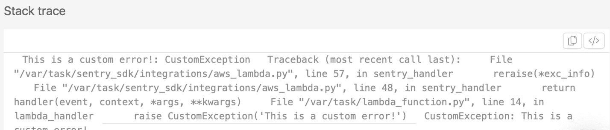
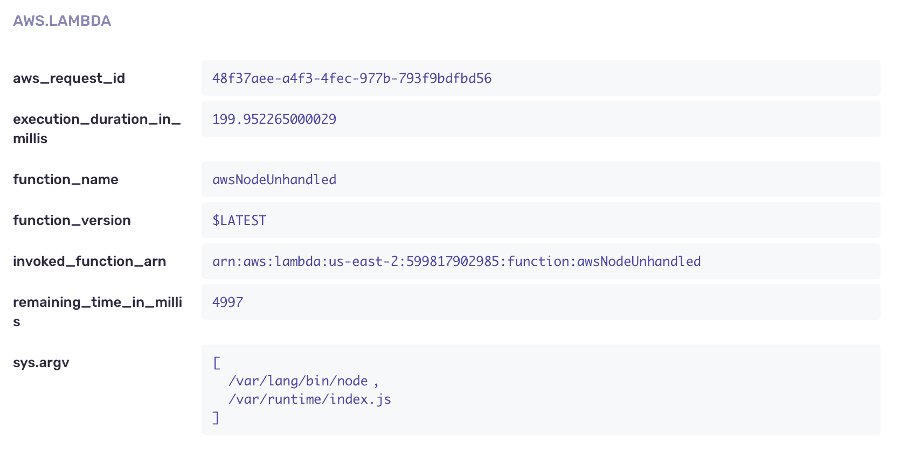

# CloudWatch 用于错误监控的利弊

> 原文：<https://thenewstack.io/pros-and-cons-of-cloudwatch-for-error-monitoring/>

[哨兵](https://www.sentry.io/signup)赞助此贴。

 [阿努帕姆·阿杰·金达尔

AJ 喜欢破解新的市场技术，构建创收的产品解决方案。这些天，他痴迷于无服务器和 Spring Boot 平台。作为 Sentry 的增长主管，AJ 正在推动增长计划。](https://www.linkedin.com/in/anupamjindal/) 

作为一名开发人员，我喜欢 Lambda 函数。它们让我能够专注于功能的目的，并节省大量编写和部署代码的时间。同时，在生产中使用 Lambda 函数的最大挑战之一是问题的故障排除。这源于代码和用户体验应用程序之间的可见性差距，以及缺乏专门解决无服务器环境中这一关键问题的监控工具。

当然，亚马逊的监控工具 [CloudWatch](https://aws.amazon.com/cloudwatch/) 提供了一种跟踪功能指标和深入日志进行调试的方法。然而，梳理日志并不是我想调试问题的方式——这需要花费*个小时。*

我看了一些帮助您设置日志转发、监控错误和异常的工具。它们通常是这样工作的:

1.  使用预配置的 CloudFormation 堆栈在您的环境中设置云资源和权限。
2.  使用 CloudWatch APIs 将过滤后的日志流式传输(通常使用 Kinesis+Firehose)到自己的工具中。
3.  对获取的日志应用格式化，以更易于使用的方式呈现错误和异常。

这个过程非常有效。我能够在几分钟内设置错误监控，而不用修改我的代码。此外，我现在有了堆栈跟踪和有趣的函数细节，如:

1.  函数内存使用
2.  函数调用时间
3.  执行我的 lambda 函数的成本

## 挑战

现在，这种方法面临的挑战如下:

1.  我不喜欢一个工具控制我的 aws 帐户，因为它使用`assumeRole`来访问我的帐户信息。
2.  堆栈跟踪仍然很难阅读。这里有一个例子:
    
3.  丢失了许多运行时上下文，例如其他线程和配置附加参数的能力。
4.  我看不到跟踪或事务，无法调试整个应用程序中的问题，以关联前端和后端行为。

因此，虽然从 CloudWatch 转发日志比使用 CloudWatch 本身更好，但它也不是没有缺陷。

## 通过代码检测报告错误

接下来，我尝试通过代码检测进行错误报告。在我的试验中，我使用了我们的开源工具:[哨兵](https://sentry.io/)。以下是我对节点函数的设置步骤(尽管注意 Sentry 也支持 [Python](https://docs.sentry.io/platforms/python/guides/aws-lambda/) 环境)。

我按照 Sentry 的文档进行了[节点λ集成](https://docs.sentry.io/platforms/node/guides/aws-lambda/)。仪器的工作方式如下:

1.  1.  用 dsn 初始化 Sentry(我是通过创建一个帐户得到的)。

```
const Sentry  =  require("@sentry/serverless");

Sentry.init({
  dsn:  "https://05b28b635e8d415ca5ea4415b785d271@o1.ingest.sentry.io/155735",
});

```

1.  1.  用 Sentry 的包装器包装我的 lambda 处理器。

```
exports.handler  =  Sentry.AWSLambda.wrapHandler(yourHandler);

```

就这样。我正在向哨兵报告错误。

这似乎是一个更好的方法，因为:

1.  Sentry 使用运行时工具来突出异常，而不是在我的帐户上使用`assumeRole`来设置日志转发。这消除了提供第三方工具访问我的 AWS 帐户的顾虑。附带好处:我不必为日志转发所需的任何额外资源向 AWS 付费。

2.  我有所有的函数上下文，包括 request_id 和执行时间。我可以使用像`aws_request_id`这样的参数来理解错误的下游影响。
    
3.  深度链接到 CloudWatch 日志，以节省搜索正确日志流和时间窗口的时间。
    

缺点是使用这种方法我不能得到内存使用量或函数调用时间，但是我无论如何也不能移动这些数字。

运行时插装的另一个未来好处是，它允许我监视分布式跟踪，以便识别哪些特定部分降低了我的函数执行速度。因此，我能够确保更好的用户体验并节省 AWS 成本。

无服务器承诺减少开发团队的管理负担，但是故障排除的限制会抵消节省的时间。考虑提供功能上下文而不增加风险和成本的监控工具是很重要的。CloudWatch 和 Sentry 的对比凸显了这些因素及其重要性。

亚马逊网络服务是新堆栈的赞助商。

通过 Pixabay 的特征图像。

<svg xmlns:xlink="http://www.w3.org/1999/xlink" viewBox="0 0 68 31" version="1.1"><title>Group</title> <desc>Created with Sketch.</desc></svg>