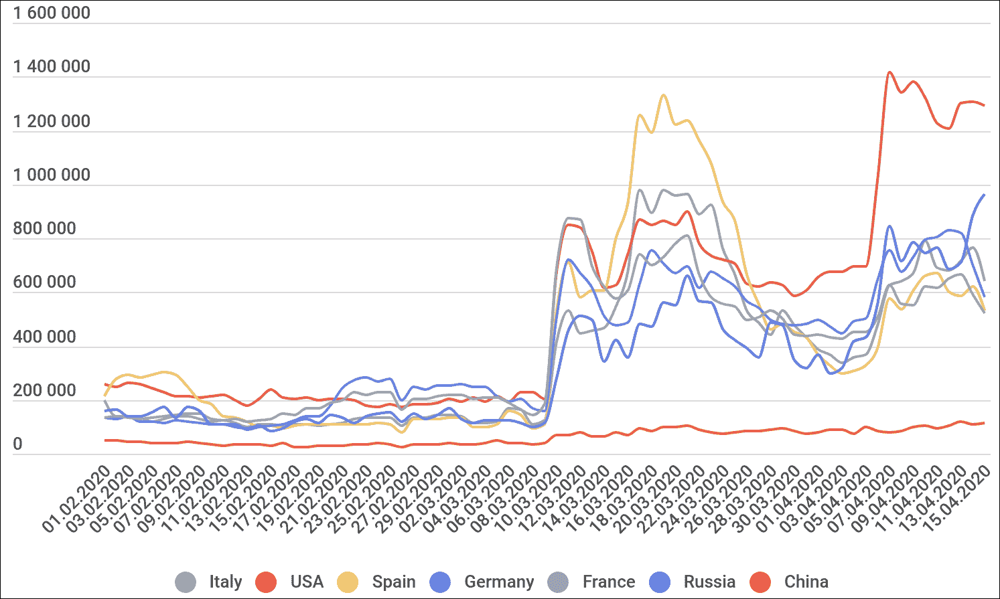
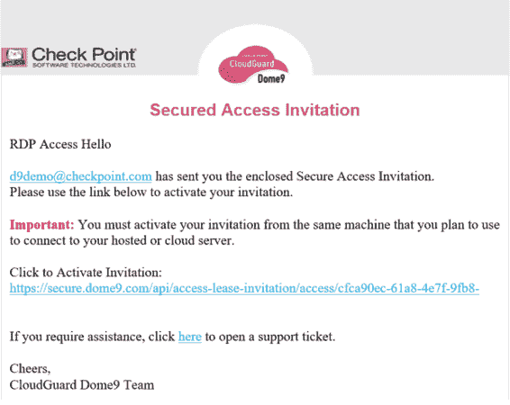
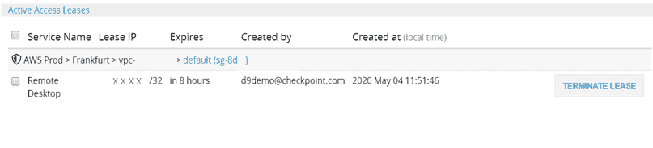

# 利用 AWS 中的 RDP 保护工作负载免受常见的暴力攻击

> 原文：<https://thenewstack.io/protect-workloads-utilizing-rdp-in-aws-from-common-brute-force-attacks/>

企业争相扩展现有工作负载，并向市场推出新的解决方案，以帮助支持不断增长的远程工作人员。与此同时，黑客们正把注意力转移到这些相同的系统上。例如，访问 Windows 工作站或服务器的应用层协议:RDP(远程桌面协议)。

事实上，据卡巴斯基的研究人员称，自 2020 年 3 月初以来，世界各地针对暴露的 RDP 服务的暴力攻击数量激增。

RDP 暴力攻击数量的增长(来源:卡巴斯基)

 [玛雅·莱文

Maya 是一名专注的分析型安全工程师，是 Check Point Software 的技术营销工程师，专注于云技术。她在多个领域(安全、软件工程、云)拥有深厚的技术知识，并拥有与技术和业务受众沟通的认真简洁的沟通风格。](https://www.linkedin.com/in/maya-levine-2ba05aa7/) 

通过暴力攻击，黑客系统地尝试 RDP 用户名和密码的所有可能选项，直到他们能够登录。他们经常使用以前泄露的密码记录，或者尝试不同的随机字符组合(在旭日攻击后你是否更改了密码？).一旦登录正确的用户名/密码组合，他们就可以远程访问网络中的目标系统。

卡巴斯基的研究人员解释道:

*“…蛮力攻击者的方法不像外科手术，而是按区域行动。据我们所知，在大规模转向在家工作后，他们从逻辑上得出结论，配置不佳的 RDP 服务器数量将会增加，因此攻击数量也会增加。”*

值得注意的是，远程桌面协议并不是公共云环境中唯一需要担心的事情。根据卡巴斯基的研究，类似的 VNC 协议在不同的客户端中发现[有 37 个漏洞](https://www.kaspersky.com/blog/vnc-vulnerabilities/31462/)。

对于那些在亚马逊网络服务(AWS)中利用 RDP 托管工作负载的人，可以利用 CloudGuard 的动态访问租赁功能等工具来保护自己。动态访问租约允许 AWS 云服务器和其他资源几乎完全封闭，而不是通过允许 RDP 访问的入站规则将安全组附加到实例。它只在必要时为某些活动打开微小的安全“漏洞”,并提供对资源的所有访问和更改的完整审计跟踪。

## 动态接入租用的工作原理

通过特定的服务组(例如，SSH、远程终端或 RDP)向特定用户授予对资源的访问权限。租约是指定用户在给定时间段内对服务的一次性访问合同。

用户可以在客户端或通过电子邮件链接激活特定 IP/CIDR 的租约。当动态访问电子邮件收件人单击该链接时，将从收件人的当前公共 IP 地址(/32)激活访问租约，用于租约中指定的特定服务或端口。租约的激活会触发为每个为动态访问选择的入站端口或连续端口范围创建一个临时安全组入站访问规则。

## 动态访问租用如何防范暴力攻击

本质上，使用动态访问租赁使用户能够关闭云中的敏感资源。以 RDP 为例，在窗口服务器的安全组中不需要让服务器由 RDP 打开的规则。相反，对于动态访问，只为必要员工使用的特定 IP 地址添加规则，时间有限。一旦访问租约到期，此规则将自动删除。

这使得即使攻击者能够暴力破解您的用户名/密码登录 RDP 服务，他们也无法访问 Windows 服务器，因为他们不是从您的特定 IP 地址连接。此外，对服务器的任何访问都将被审计，这样您就可以确切地看到谁正在连接到服务器。通过将可能的 IP 地址列表从整个世界缩小到一个更小的组，访问租约减少了攻击的范围。它还降低了暴力攻击的成功率，大大减少了攻击者或机器人可以找到您可用的 RDP 服务的时间。

这只是如何阻止暴力攻击的一个工具示例，但是市场上还有很多工具。关键是找到在您的云环境中自动工作以防止攻击的最佳工具，这样您就不会成为下一个受害者。

<svg xmlns:xlink="http://www.w3.org/1999/xlink" viewBox="0 0 68 31" version="1.1"><title>Group</title> <desc>Created with Sketch.</desc></svg>