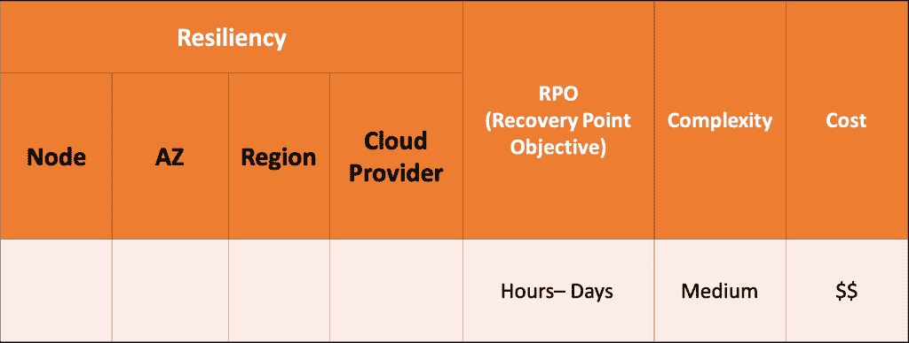
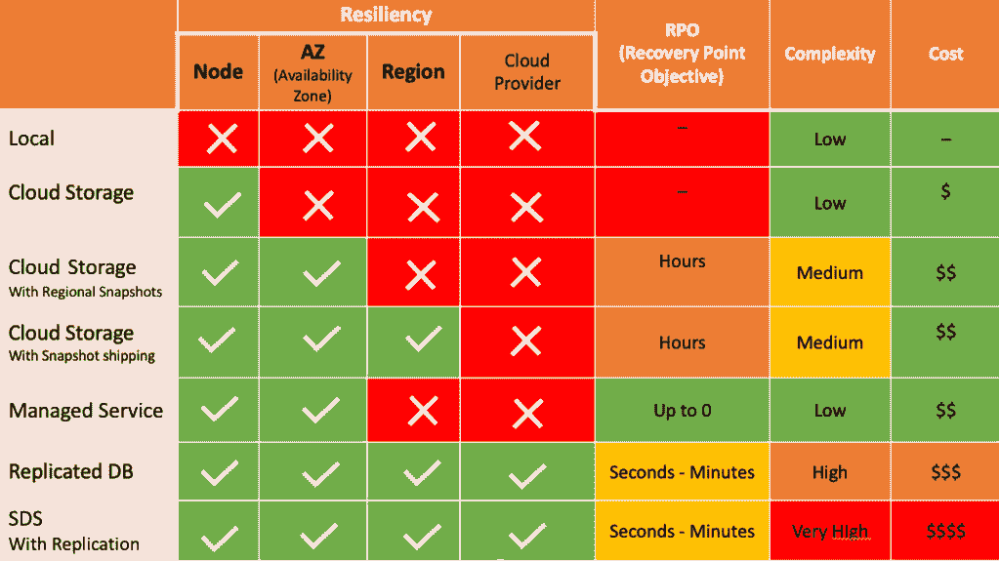

# 保护 Kubernetes 数据:有状态应用程序版本

> 原文：<https://thenewstack.io/protecting-kubernetes-data-the-stateful-application-edition/>

 [西里尔·普利斯科

西里尔·普利斯科是 Kubernetes 旗下多云数据服务 Replix 的首席技术官和联合创始人。作为一名经验丰富的 UNIX 专家，他拥有丰富的系统管理和内核开发背景，在企业存储和网络解决方案设计以及小型和大型系统配置的性能分析和调优方面拥有丰富的经验。Cyril 是 Solaris 社区的长期成员，也是 Polaris 项目(OpenSolaris PowerPC port)以及蓝牙堆栈和设备映射器项目的技术负责人。](https://www.linkedin.com/in/cyrilplisko) 

随着超过 83%的企业在生产中部署 Kubernetes，它正在成为部署应用程序的事实方式。原因是显而易见的。

Kubernetes 支持声明式配置，可以存储为代码并重用，可移植的工作负载可以通过简单地运行 YAML 文件或掌舵图转移到不同的集群，以及自我修复的应用程序弹性。

这些都是非常令人印象深刻的功能，至少对于无状态应用程序来说是这样。但并不是所有的应用程序都是无状态的，大多数都需要数据。

对于有状态的应用程序来说，存储是一个完全不同的故事，充满了您通常希望在接触点时避免的所有精彩挑战，如:

*   **数据弹性**:存储通常是单点故障，存储弹性架构复杂且昂贵，
*   **恢复点目标和数据一致性**即使使用数据保护机制也很难实现，
*   **复杂性:**联网和复制绝非易事，需要专业知识和时间。

当然还有成本；端到端数据保护解决方案非常昂贵！

## 状态挑战

简而言之，有状态应用程序面临存储难题:选择什么？如何部署，以便存储在所有群集上都可用。如何保护你的数据不被破坏？

有状态应用程序如何调配和使用可用存储？有状态的应用程序将如何使用这些数据？

首先，您需要评估您的数据保护需求:什么会失败？你需要避免哪些失败？

换句话说，您的应用程序需要多精细的冗余？

*   结节
*   可用性区域
*   地区
*   云提供商

你能承受多大的数据丢失？每笔交易都算吗？或者，从一天前的备份/快照中恢复是否足够好？

你愿意投资多少？更高的数据保护选项增加了复杂性和成本。您的目标是将工作负载与其经济高效的 RPO 相匹配

让我们回顾一下我们的选择:

## 本地磁盘

让我们从直接连接到节点的本地磁盘开始。它们无法保护数据免受节点、AZ 区域或云提供商故障的影响。如果节点出现故障，数据将会丢失。

## 云存储

让我们看一下公共云数据块存储，它局限于单个可用性区域，它将在节点级别防止故障，但不在 AZ、区域或云提供商级别。如果失败，数据就会丢失。

## 带有区域快照的云存储

带区域快照的云块存储怎么样？这将我们带回 RPO 问题:您会丢失多少数据？固有数据丢失的时间点解决方案对您的数据是否足够好？

区域快照将允许您在节点和 AZ 级别恢复运营，但不会保护您免受区域和云提供商故障的影响。

## 带快照运送的云存储

采用快照交付的云存储能够扭转局面吗？这种将快照复制到不同区域的过程可以保护数据免受区域故障的影响。但是，这仍然是一种时间点解决方案，存在数据丢失的风险。它将涵盖区域故障，但仅限于单个云提供商，并且有其复杂性和相关成本。

## 托管服务

你们中的一些人可能会对自己说“我将使用托管服务”，让其他人来处理存储和基础架构，以确保数据弹性并最大限度地降低管理成本。这种方法的问题是，大多数托管服务(例如 Aurora 或 RDS)都局限于一个区域，并且存在于您的 Kubernetes 集群之外。如果一个区域消失了，您不能在另一个区域恢复操作。

## 带复制的数据库

好吧，如果我们在 K8s 集群中运行一个已经内置了复制功能的数据库会怎么样？这是一个很好的解决方案，可以确保您拥有一个端到端的数据弹性架构，数据丢失不会达到几个小时，但您仍然需要自己建立所有的网络，这将花费您很多钱。

## 带复制的 SDS

另一个选择是运行软件定义的存储解决方案。openEBS 或 Portworx 等将提供云和区域之间的异步复制，但仍需要托管存储和已建立的网络。这些选项既昂贵又复杂，而且不能保证零数据丢失。

如果我们将所有选项叠加起来进行比较，我们可以看到成本和复杂性与数据恢复能力之间的明显权衡，但是为什么不能两者兼得呢？

## 答案

我们在 [Replix](https://replix.io/) 发现答案很简单:数据弹性需要数据移动性。当一个位置发生故障时，您最好在故障位置之外有一个最新的数据副本，这一过程需要数据移动性。当前的解决方案完全不是围绕数据移动性而设计的。除此之外，网络的复杂性以及存储和复制复杂、昂贵，而且公共云供应商并未真正推动风险迁移。我们可以理解，虽然大多数有状态应用程序还没有利用 Kubernetes。

Koushik Chowdavarapu 在 [Unsplash 上拍摄的特写照片。](https://unsplash.com/collections/1817672/shapes?utm_source=unsplash&utm_medium=referral&utm_content=creditCopyText)

<svg xmlns:xlink="http://www.w3.org/1999/xlink" viewBox="0 0 68 31" version="1.1"><title>Group</title> <desc>Created with Sketch.</desc></svg>