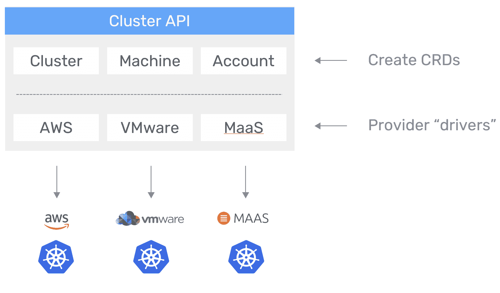
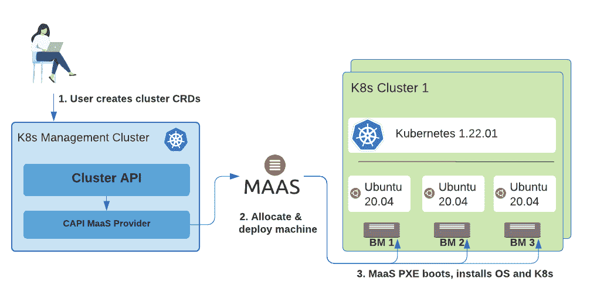
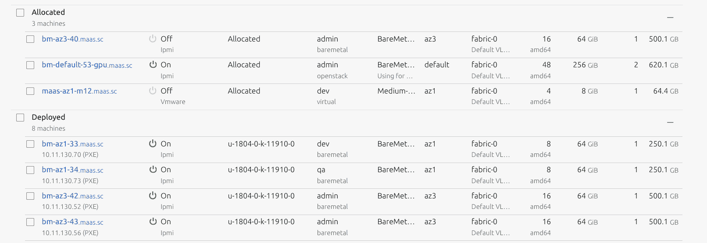

# 使用集群 API 配置裸机 Kubernetes

> 原文：<https://thenewstack.io/provision-bare-metal-kubernetes-with-the-cluster-api/>

[](https://www.spectrocloud.com/)

 [萨阿德·马利克

萨阿德·马利克是 Spectro Cloud 的首席技术官/联合创始人。Saad 热衷于构建云、虚拟化、容器和分布式系统领域的产品。在他 15 年的经验中，Saad 在企业、服务提供商和消费技术领域推出了多种新产品。他是一个超级科幻迷，喜欢和他的孩子一起建造乐高宇宙飞船。](https://www.spectrocloud.com/) [](https://www.spectrocloud.com/)

随着应用程序现代化的全面展开，各行各业的企业都在构建云原生应用程序，并使用 Kubernetes (K8s)对它们进行编排。随着越来越多的应用程序在容器中运行(并且越来越多的应用程序参与生产)，IT 和开发团队正在寻找进一步的优化方法来提高效率。

其中之一是直接在裸机服务器上运行应用程序和 Kubernetes 平台。好的一面？更好的性能，当然还有更低的成本(告别虚拟机管理程序许可证)和工作量(少管理一层)。事实上，K8s 拥有我们在裸机上直接运行应用所需的一切。

坏处呢？到目前为止，安装、运行和管理裸机 K8s 集群通常都非常具有挑战性，通常被视为底层服务器和 K8s 节点之间的“断开”体验，更不用说将它们视为多环境 K8s 管理策略的另一个“位置”了。但是，如果有一种方法可以统一体验，像对待任何其他集群一样对待裸机服务器，那会怎么样呢？

现在有了，在这篇博客中，我们将看看两种开源技术(和一个项目)如何在几分钟内为我们提供部署和管理裸机 K8s 集群所需的一切！

这篇博客反映了 Spectro Cloud 对来自[云本地计算基金会](https://cncf.io/?utm_content=inline-mention)的集群 API 项目(最近发布了其 [1.0 版本](https://www.cncf.io/blog/2021/10/06/kubernetes-cluster-api-reaches-production-readiness-with-version-1-0/))和最近发布的[集群 API MaaS 提供商](http://t.yesware.com/tt/c85bbed8eeff81a3ec1df499c015012080af1a9d/37766602f375b9e71b2ff55046deab11/5bf0d69c898bec7217ffd4ddecf467b9/github.com/spectrocloud/cluster-api-provider-maas)的贡献。

## 挑战真的是操作系统！

如今，运行和管理裸机 K8s 集群的挑战在于，服务器和操作系统是在 K8s 节点的生命周期之外单独管理的。

通常情况下，机器会预配置一个操作系统(OS)，然后 K8s 组件才会被初始化到运行系统中(使用 kubeadm、kops 或其他 K8s 编排工具)。让物理服务器及其操作系统不属于 K8s 管理的一部分会严重妨碍生命周期运营:不支持自动弹性和扩展，并且通过过时的“内联”流程进行升级可能会降低群集和应用程序的可用性。

对于较小的部署和边缘用例，这可能足够好，因为我们只是没有处理足够的规模，一次性的“宠物”方法并不是世界末日。但是，当不得不在数据中心或与提供商一起运行和管理许多裸机时(例如，用于 AI/ML 大规模处理)，服务器和操作系统需要您提供的“独特”服务就成了一个非常令人头疼的问题、风险以及最终的成本。

如今，大多数组织在虚拟机管理程序上运行 k8，完全是为了简化管理节点和 k8 的体验。好处显而易见:我们获得了节点和配置的一致性，同时还获得了集群扩展等基本操作，允许滚动升级，甚至可能通过用健康节点替换故障节点来自动修复故障节点。

如果我们能够在裸机 K8s 集群上运行这些完全相同的功能，同时获得在裸机上运行应用程序的效率，会怎么样？即提高性能，并降低虚拟机管理程序增加的成本和操作复杂性。

## 解决方案:桥接集群 API 和规范的“金属即服务”(MaaS)

在我们开始之前，让我们先来看看配料:

1.  声明式生命周期管理最流行的 K8s 子项目之一是[集群 API](https://t.yesware.com/tt/c85bbed8eeff81a3ec1df499c015012080af1a9d/37766602f375b9e71b2ff55046deab11/5eac11bb94b31727bbca5ddddfaffb24/cluster-api.sigs.k8s.io/) 。Cluster API 是一个项目，它为集群生命周期管理(创建、配置、升级、销毁)带来了 K8s 风格的 API 和“最终状态”方法。它旨在跨各种数据中心和云环境工作。集群 API 的采用在过去几年中飞速增长，主要的现代容器和 K8s 管理平台都支持它——Google Cloud 的 Anthos、VMware 的 Tanzu 和我们自己的 Spectro Cloud 产品。集群 API 的声明性方法使得一致地管理许多不同的集群和按需扩展变得容易。虽然集群 API 当然是一个很好的工具来声明性地管理 K8s 环境，但它本身并没有解决我们的问题，因为直到现在还没有办法在裸机服务器上使用它。
2.  这就是 [Canonical MaaS](https://t.yesware.com/tt/c85bbed8eeff81a3ec1df499c015012080af1a9d/37766602f375b9e71b2ff55046deab11/eb8fbe91466d8c13ea1d2df407642002/maas.io/) 的用武之地。对于裸机服务器生命周期管理，虽然有几种不同的接口和平台(Metal3、Tinkerbell、Ironic 等。)也许最流行和最成熟的(开发了近十年)是 Canonical MaaS，它允许裸机服务通过一组丰富的类似于 IaaS 云的 API 进行管理；从分配机器、配置网络、部署操作系统等等。MaaS 的吸引力在于它通过 IPMI 或 Redfish 接口广泛支持思科、戴尔、惠普和大多数其他供应商的不同类型的硬件供应商。

为了支持跨各种环境(云、数据中心、边缘位置)的供应，集群 API 提供了一个抽象层，其中每个环境的实施都在一个单独的“提供者”组件中实施。这个“提供者”组件是集群 API 抽象(集群、机器等)和底层环境之间的桥梁。例如，当给定一个集群 AWS 集群资源时，带有“AWS”提供者组件的集群 API 将管理 [Amazon Web Services](https://aws.amazon.com/?utm_content=inline-mention) 上的基础设施(管理 VPC、子网、EC2 实例、负载平衡器等的生命周期)。



换句话说，为了让某人使用规范的 MaaS 作为接口来呈现要用集群 API 管理的裸机服务器，需要开发一个提供者。随着越来越多的客户探索运行裸机 K8s 的选项，这是一个我们不能忽视的领域，我们在 [Spectro Cloud](https://t.yesware.com/tt/c85bbed8eeff81a3ec1df499c015012080af1a9d/37766602f375b9e71b2ff55046deab11/670e50749513c12e5cf2a22740011654/www.spectrocloud.com) 的团队很高兴地宣布第一个集群 API MaaS 提供商([Cluster-API-provider-MaaS](http://t.yesware.com/tt/c85bbed8eeff81a3ec1df499c015012080af1a9d/37766602f375b9e71b2ff55046deab11/6de2802978e9a3345d25a4f93cf784e4/github.com/spectrocloud/cluster-api-provider-maas))的发布，让任何人都可以轻松使用裸机 K8s。



该提供商使用规范的 MaaS(金属即服务)来供应、分配和部署机器、配置机器网络以及管理所有控制平面节点的 DNS 映射。一旦用户为 Cluster/MaasCluster 创建了相应的集群 API CRDs，集群 API MaaS 提供程序就会以编程方式分配和部署向 Canonical MaaS 注册的裸机。MaaS 将打开电源，PXE 启动将指定的操作系统安装到机器上。

一旦机器启动，集群 API 将初始化 K8s 控制平面节点，然后将工作节点机器加入 K8s 集群。所有的集群 API 功能都是在提供者中实现的，例如提供符合多主控 K8s 的集群、实现安全最佳实践、滚动升级支持等。

本质上，这意味着裸机基础设施的生命周期现在可以(最终)与整个 Kubernetes 环境的生命周期管理联系起来。

## 演示时间

在下一节中，我们将逐步指导您配置自己的裸机 K8s 集群。我们将介绍设置规范 MaaS 的步骤，设置集群 API 框架，然后当然是提供 K8s 集群。所以让我们开始吧！

1.  ### 让规范的 MaaS 运行起来

在我们可以使用集群 API 供应裸机 K8s 集群之前，我们需要在一些机器上配置规范的 MaaS。如果你还没有，请[按照 MaaS 指南](https://maas.io/docs/snap/3.0/ui/maas-installation)在 Ubuntu 上设置 MaaS。

我们建议您在 MaaS 界面中至少有 7 台裸机可用(3 台用于 CP，3 台用于工人，1 台用于升级)。但是，如果您需要达到最低要求，那么就准备两台可用的机器(一台用于 CP，一台用于 worker)。

注意:MaaS 可以使用其 [BMC](https://www.bmc.com/?utm_content=inline-mention) / IPMI 功能管理任意数量的硬件供应商。如果您只是跟着做，并且需要一种简单的测试方法，您甚至可以在 [VMware](https://tanzu.vmware.com?utm_content=inline-mention) vSphere(甚至是 VirtualBox)上启动虚拟机，并让 MaaS 管理生命周期。



Figure 2: MaaS machines in an allocated and deployed state

作为下一步设置的一部分，我们需要获得 MaaS 的 IP 地址和 API 密钥。用户密钥可以在您的配置文件设置中找到！

最后，我们将上传一个操作系统映像，该映像将用于控制平面和工作节点。请[返回本页](https://github.com/spectrocloud/cluster-api-provider-maas/tree/main/image-generation)了解上传图像到 Canonical MaaS 的说明。如果你没有一个定制的 K8s 就绪的图像，不用担心——Spectro Cloud 发布了安全加固的图像，可供任何人使用。

### 1.使用 Kind 设置管理集群

集群 API 使用 K8s 作为 orchestrator 来管理其他 K8s 集群。我们将首先使用 Kind 建立一个管理集群。如果您已经有一个可用的 K8s 集群，可以跳过这一步。

如果你正在寻找一个在你的工作站上运行 K8s 的快速解决方案，看看 CNCF Kind 集群，按照他们的[快速指南](https://t.yesware.com/tt/c85bbed8eeff81a3ec1df499c015012080af1a9d/37766602f375b9e71b2ff55046deab11/db6e9f76226094a04c88ed92f4372bc7/kind.sigs.k8s.io/docs/user/quick-start/)让你的集群运行起来。

确保集群运行正常，并且所有单元都在运行:

`kubectl get nodes` 

`kubectl get pods -A` 

太好了，现在您的管理集群已经运行了！这将是启动裸机 K8s 群集的控制平面。

### 2.安装集群 API

在接下来的几个步骤中，我们将安装集群 API orchestrator 组件。

首先，按照这里针对您的操作系统的说明下载`clusterctl`实用程序:[https://release-0-3 . cluster-API . sigs . k8s . io/user/quick-start . html # install-cluster CTL](https://t.yesware.com/tt/c85bbed8eeff81a3ec1df499c015012080af1a9d/37766602f375b9e71b2ff55046deab11/d29aaee04b6660ecd135866b410496e8/release-0-3.cluster-api.sigs.k8s.io/user/quick-start.html#install-clusterctl)。一定要下载 0.3 版本！

运行以下命令安装基本集群 API:

`clusterctl init`

接下来，安装最新版本的集群-api-provider-maas provider:

`kubectl apply -f [https://github.com/spectrocloud/cluster-api-provider-maas/releases/download/v0.1.1/infrastructure-components.yaml](https://github.com/spectrocloud/cluster-api-provider-maas/releases/download/v0.1.1/infrastructure-components.yaml)` 

在下一个代码片段中，确保将 MAAS_ENDPOINT 和 MAAS_API_KEY 分别替换为前面的 MAAS 先决条件部分中的 MaaS Endpoint 和 MAAS API KEY:

```
cat  &lt;&lt;EOF  |  kubectl apply  -f  -

apiVersion:  v1

kind:  Secret

metadata:

  name:  manager-bootstrap-credentials

  namespace:  system

type:  Opaque

stringData:

  MAAS_ENDPOINT:  &lt;MAAS_ENDPOINT,  e.g:  http://10.11.130.10:5240/MAAS &gt;

  MAAS_API_KEY:  &lt;MAAS_API_KEY,  e.g:  xxx:yyy:zzz&gt;

EOF

```

并重启 MaaS provider pod:

```
kubectl delete pod  -n  capmaas-system  --all

```

### 3.启动第一个裸机集群！

是时候推出第一个裸机集群了。首先将下面的文件(“cluster1.yaml”)保存到您的本地目录:

```
yaml

# Creates a cluster with one control-plane node and one worker node

apiVersion:  infrastructure.cluster.x-k8s.io/v1alpha3

kind:  MaasCluster

metadata:

  name:  my-cluster

spec:

  dnsDomain:  maas.sc

---

apiVersion:  cluster.x-k8s.io/v1alpha3

kind:  Cluster

metadata:

  name:  my-cluster

spec:

  clusterNetwork:

    services:

      cidrBlocks:  ["10.96.0.0/12"]

    pods:

      cidrBlocks:  ["192.168.0.0/16"]

    serviceDomain:  "cluster.local"

  controlPlaneRef:

    apiVersion:  controlplane.cluster.x-k8s.io/v1alpha3

    kind:  KubeadmControlPlane

    name:  my-cluster-cp

    namespace:  default

  infrastructureRef:

    apiVersion:  infrastructure.cluster.x-k8s.io/v1alpha3

    kind:  MaasCluster

    name:  my-cluster

    namespace:  default

---

apiVersion:  infrastructure.cluster.x-k8s.io/v1alpha3

kind:  MaasMachineTemplate

metadata:

  name:  my-cluster-cp

  namespace:  default

spec:

  template:

    spec:

      minCPU:  2

      minMemory:  4096

      image:  u-1804-0-k-11912-0

---

apiVersion:  controlplane.cluster.x-k8s.io/v1alpha3

kind:  KubeadmControlPlane

metadata:

  name:  my-cluster-cp

  namespace:  default

spec:

  replicas:  1

  version:  v1.19.12

  infrastructureTemplate:

    apiVersion:  infrastructure.cluster.x-k8s.io/v1alpha3

    kind:  MaasMachineTemplate

    name:  my-cluster-cp

    namespace:  default

  kubeadmConfigSpec:

    clusterConfiguration:  {}

    initConfiguration:  {}

    joinConfiguration:  {}

---

status:

apiVersion:  infrastructure.cluster.x-k8s.io/v1alpha3

kind:  MaasMachineTemplate

metadata:

  name:  my-cluster-worker

  namespace:  default

spec:

  template:

    spec:

      minCPU:  2

      minMemory:  4096

      image:  u-1804-0-k-11912-0

---

apiVersion:  cluster.x-k8s.io/v1alpha3

kind:  MachineDeployment

metadata:

  name:  my-cluster-worker

  namespace:  default

spec:

  clusterName:  my-cluster

  replicas:  1

  selector:

    matchLabels:

      cluster.x-k8s.io/cluster-name:  my-cluster

  template:

    spec:

      clusterName:  my-cluster

      version:  1.19.12

      bootstrap:

        configRef:

          apiVersion:  bootstrap.cluster.x-k8s.io/v1alpha3

          kind:  KubeadmConfigTemplate

          name:  my-cluster-worker

      infrastructureRef:

        apiVersion:  infrastructure.cluster.x-k8s.io/v1alpha3

        kind:  MaasMachineTemplate

        name:  my-cluster-worker

---

apiVersion:  bootstrap.cluster.x-k8s.io/v1alpha3

kind:  KubeadmConfigTemplate

metadata:

  name:  my-cluster-worker

  namespace:  default

spec:

  template:

    spec:

      joinConfiguration:

        nodeRegistration:  {}

```

要使用您的 MaaS 环境，可能需要修改以下参数:

*   MaaS cluster . spec . DNS domain-要附加的 MaaS DNS 域
*   maasmachinetemplate . template . spec—除了 minCPU、minMemory 之外，还有其他属性，比如将计算机限制到特定的资源池或区域。
*   Maas machine template . template . spec . image-要使用的图像，例如:u-1804-0-k-11913-0。

然后开始配置集群:

`kubectl apply -f cluster1.yaml`

集群 API 将开始配置集群。我们可以使用以下方式监控资源调配的状态:

`clusterctl describe cluster my-cluster --show-conditions all`

注意:忽略有故障的节点健康状况，这通常表明网络由于缺少 CNI 而没有准备好。

如果在设置过程中出现任何错误，请描述相应的计算机或 MaasMachine 对象:

`kubectl describe machine` 

一旦集群完全配置完毕，下载工作负载集群的 kubeconfig:

`clusterctl get kubeconfig my-cluster > my-cluster.yaml` 

`export KUBECONFIG=my-cluster.yaml`

安装一个 CNI，像纤毛一样:

`kubectl create -f [https://raw.githubusercontent.com/cilium/cilium/v1.9/install/kubernetes/quick-install.yaml](https://t.yesware.com/tt/c85bbed8eeff81a3ec1df499c015012080af1a9d/37766602f375b9e71b2ff55046deab11/c558f4ec9ab849c94ea851311161a686/raw.githubusercontent.com/cilium/cilium/v1.9/install/kubernetes/quick-install.yaml)`

恭喜你。现在，您拥有了一个完全调配的裸机 K8s 集群。

既然您像对待 K8s 环境中的任何其他集群一样对待裸机集群，那么您可以尝试许多其他有趣的事情:

*   部署应用——使用`kubectl run hello1 --image=nginx`保持简单。
*   把工人从三个增加到六个怎么样？
*   升级非常简单，只需将镜像版本更改为较新的版本，例如:u-18-k-12101。
*   想看看弹性的作用吗？尝试杀死其中一个节点——“猛拉”BM 服务器的电源线(或者只是关闭机器电源)，看看会发生什么。

新的[集群 API MaaS provider](http://t.yesware.com/tt/c85bbed8eeff81a3ec1df499c015012080af1a9d/37766602f375b9e71b2ff55046deab11/b3588c117489e411231faebdb5c8910a/github.com/spectrocloud/cluster-api-provider-maas) 使组织能够直接在裸机服务器上轻松部署、运行和管理 K8s 集群，从而提高性能并最大限度地降低成本和运营工作量。与此同时，Cluster API 为 Kubernetes 集群生命周期管理带来了一种现代化的声明式方法，消除了繁重的脚本编写需求，使统一配置和管理 K8s 节点的体验变得更加容易——现在包括裸机服务器！

感谢您的阅读，请不要忘记查看[我们的网络研讨会](http://t.yesware.com/tt/c85bbed8eeff81a3ec1df499c015012080af1a9d/37766602f375b9e71b2ff55046deab11/31e8199380b5aa1fab74bf8e5d770b12/www.spectrocloud.com/webinars/managing-bare-metal-k8s-like-any-other-cluster/)，我们将在会上演示如何为 MaaS 设置集群 API 提供者。同时，如果您对我们的提供商有任何疑问或需要帮助实施，请联系。

<svg xmlns:xlink="http://www.w3.org/1999/xlink" viewBox="0 0 68 31" version="1.1"><title>Group</title> <desc>Created with Sketch.</desc></svg>