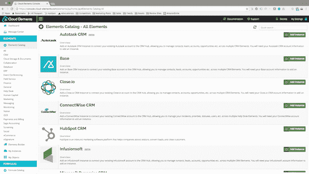
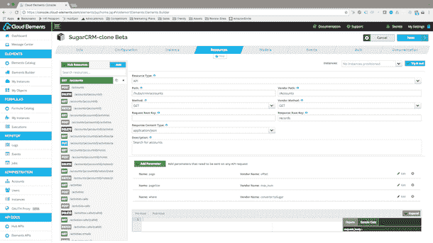

# 将 API 发布为带有云元素的 AWS Lambda 函数

> 原文：<https://thenewstack.io/publish-apis-aws-lambda-functions-cloud-elements/>

在上周的 AWS re:Invent 大会上， [Cloud Elements](http://cloud-elements.com/) 在 AWS Marketplace 上发布了 Element Builder，目的是让开发者可以使用各种 API 集成作为 Lambda 函数。

迄今为止，Cloud Elements 一直是一个集成平台，专注于标准化 SaaS API，使它们能够在开发人员创建的应用程序和工作流中互操作。现在，他们的新[元素构建工具](http://cloud-elements.com/element-builder/)旨在让这些标准化的 API 集成在 AWS Lambda 平台中可用，供任何使用亚马逊 API 网关、移动中心或无服务器平台的开发人员使用。

在新服务的发布会上， [Lambda](https://aws.amazon.com/lambda/) 和 [Amazon API Gateway](https://aws.amazon.com/api-gateway/) 的 AWS 总经理 [Tim Wagner](https://www.linkedin.com/in/timawagner) 表示:“Cloud Elements 通过加速将 SaaS 应用 API 发布为 AWS Lambda 函数，解决了一个关键挑战。“使用 AWS 的开发人员正在寻找将各种 SaaS 和软件应用程序的 API 结合到他们的应用程序中的方法，以支持他们的无服务器架构和扩展他们的代码，而不会产生额外的运行成本。”

Cloud Elements 首席执行官 Mark Geene 表示，到目前为止，Cloud Elements 一直专注于支持开发人员更轻松地集成 API，而不必首先抽象和规范各个 API 管理数据和服务访问的不同方式。

Cloud Elements 将集成发布为 API 连接器，并将它们组织到 API hubs 中，创建了一个跨各种 SaaS API(例如，联系人管理)的标准，因此无论基于云的 SaaS 工具用于访问数据，它现在都可以与其他基于云的 SaaS 工具互操作。这与 API 管理提供商 [MuleSoft 创建应用网络平台](https://www.mulesoft.com/press-center/anypoint-platform-application-network)的模式类似:集成不再是点对点的，而是一对多的枢纽，在应用开发环境中充当可重用和可互操作的标准。

## 开放的 API 分发平台

“我们现在已经扩展了 Element Builder，这样你不仅可以为集成场景创建一个连接器，还可以以 AWS Lambda 函数的形式将该连接器作为微服务进行分发，”Geene 说。

“这是我们创建开放 API 分发平台战略的第一步。亚马逊是我们将与之合作的许多平台中的第一个，以分发我们的集成目录，并将其发布到 AWS 亚马逊市场等市场和其他供应商，”Geene 说，他还提到了微软 Azure、IBM Bluemix 和 SAP HANA 平台。

AWS 平台对 Element Builder 等功能的需求反映了微服务和 API 的日益融合。毕竟，API 使微服务架构成为可能，并引发了对混合组合的新需求，这种混合组合可能采用内部和专有 API，将它们与第三方服务 API 混合，或连接来自 SaaS 工具的数据，以及更小的微服务功能。

## 新常态:将 API、微服务和功能缝合在一起

最近的 API 服务和产品提供商都希望重新定位他们的产品，更加关注微服务。像 [RedHat 和 3scale 这样的 API 管理提供商已经与 Stormpath](https://thenewstack.io/microservices-calls-robust-api-management-tools/) 这样的外部合作伙伴合作，将身份管理作为微服务引入他们的服务产品。 [Nanoscale.io 重新定位其无服务器 API 架构](https://thenewstack.io/nanoscale-io-connects-legacy-systems-microservices/)产品，让用户不仅可以创建 API，还可以为无服务器计算创建微服务和功能。

最近，API 生命周期工具 [Stoplight.io 创建了一个场景构建器](http://stoplight.io/platform/scenarios/)，旨在帮助自动化工作流，将内部和第三方 API 与 AWS Lambda 功能结合起来。

[Marc MacLeod](https://www.linkedin.com/in/marcmacleod),[stop light . io](http://stoplight.io/)的创始人兼首席执行官给出了一个例子，从 [OpenCV 面部识别节点库](http://docs.opencv.org/2.4/index.html)中获取低级函数作为 lambdas。“这是关于协调两个世界:无服务器和 lambda 功能本身的世界，以及第三方和内部 web APIs 的世界，”麦克劳德说。

麦克劳德解释说:“我们的总论点是，当你得到越来越小的单个功能时，你可以将它们分割开来。API 并不总是容易混合，因此如果它们的功能可以在多个较小的片段中使用，您可以将这些较小的片段混合并匹配到一个更大的工作流中，这就是我们的 [Scenarios Builder](https://help.stoplight.io/docs/scenarios) 帮助您做的事情。”

Cloud Elements 看到了应用程序开发人员的这种需求，即在他们的应用程序和工作流中组合外部 API 作为微服务和功能，而不是更大的 API，他们新的 Element Builder 集成到 AWS 中意味着，对于已经在他们目录中的 SaaS，这些云产品现在可以自动在 AWS 中提供，供开发人员集成。

随着微服务架构成为大型分布式应用程序和网络系统的首选范例，API 不仅变得更加重要，而且需要以更细粒度的方式进行打包，以便它们能够更好地作为功能单元进行组合，从而可以插入到应用程序工作流中。

“我们正在通过发布功能提供我们的 API 集成，”Geene 说。“您可以将任何 API 作为微服务组合在一起，例如 AWS Mobile Hub，以创造新的应用体验。”

云元素和其他 API 利益相关者的举动反映了目前 API 经济中的三个主要趋势:

*   无服务器作为新的云和混合架构格式的不断增长，超越了 DevOps 的讨论，带来了更广泛的开发人员兴趣。
*   API 在多个平台上可被发现的需求。
*   使用机器学习和自动化技术来帮助发现功能、微服务和 API 服务，这是一个尚未解决的挑战。

## 无服务器的增长和 DevOps 讨论的扩大

Mark Geene 对 AWS Re:Invent 的一个评论是，在过去两年中，他看到它成为一个关键的云技术会议，涵盖了 SaaS、应用程序和集成开发人员以及更传统的焦点 [DevOps](/category/devops/) ，两年前主导了该计划。现在看来，无服务器是一个关键的讨论话题，随着越来越多的 SaaS 企业和系统集成商的参与。这反映了今年看到的一些重大变化，钟摆从围绕 DevOps 的兴奋转向支持开发人员创建新应用。

无服务器距离成为适用于所有人(甚至大多数人)的应用程序部署和分发解决方案还有很长的路要走，因为企业现在需要利用基于云的基础架构来平衡内部数据和网络系统。但是，SimilarWeb 最近转向完全基于云的基础架构作为其增长管理的一部分，这样的例子并不鲜见，而且随着这种情况在各个行业的各种企业中继续发生，对能够完全在云中管理应用程序的兴趣将继续增长。

## 在多个平台上发布 API

随着[无服务器应用程序开发平台](https://thenewstack.io/guide-serverless-technologies-functions-backends-service/) (AWS、IBM OpenWhisk、Microsoft Azure、Syncano、Stamplay 等)的增长，API 提供商现在需要能够确保他们的 API 能够在越来越多的目录和市场中被发现。除此之外，还要优化他们自己的 SEO 开发者门户，并在 StackOverflow 上与他们感兴趣的领域的开发者进行互动。与 API 提供商通过用多种编程语言创建 SDK 来支持开发人员采用的方式一样，API 提供商现在也必须确保他们的 API 以正确的方式列出，以包括在这些不同的无服务器和应用程序平台中。

随着功能即服务/无服务器平台的引入，这变得更加困难。API 提供者必须将他们的 API 重定向到多个函数中，并使它们对 AWS 可用，例如 Lambdas。他们需要为使用微软 Azure 平台的开发人员以不同的方式格式化这些相同的功能。以及与 IBM OpenWhisk 等。

“我们所做的是瞄准应用程序提供商:SaaS 公司，以及建立数字商务应用程序的企业部门，”Geene 解释道。“消费原料药的市场越来越多。下一代 API 消费将发生在领先的平台提供商身上，通过 Element Builder，我们希望帮助提供商将其 API 打包到这些不同的平台中。”

## 解决服务发现

但是，即使引入了 Element Builder 并且扩展了 API 工具，将微服务和更小的功能都包含为可组合的单元，仍然有一个关键的可发现性方面不仅没有解决，而且实际上由于粒度服务的增加而恶化了。像 AWS 这样的平台没有可用 lambdas 的目录。开发人员需要知道他们想要将哪些资源和功能整合到他们的应用程序中，或者自己构建它们。

随着 API 集成作为 AWS lambdas 的发布，接下来需要发生的是在应用程序开发平台中具有某种可发现性，以便当开发人员开始在他们的应用程序中使用联系人姓名或面部图像等对象时，平台将会注意到他们正在进行的工作，并推荐可能与他们手头的任务(或对象)相关的可用 API、微服务和功能。这种可发现性离提供给开发人员还有一段距离。与此同时，开发人员只能搜索繁琐的目录或重建自己的功能，因为他们不知道别人已经这样做了。

“这是未来的潜力，”基恩说。“这就是市场的走向。组织如何访问所有这些微服务将是未来的一大挑战，尤其是随着 API 和微服务变得更加精细。”Geene 指出了一个互补的云元素产品， [Formula Builder](http://cloud-elements.com/formula-builder/) ，它允许开发者使用“逻辑单元”创建他们自己的 API，这是一个小的代码片段，可能像一个函数一样。“我们对 API 和微服务协同工作的部分愿景是让客户选择和创建逻辑，并将其插入到他们的应用程序中。”Geene 说，将 Formula Builder 和 Element Builder 连接起来是他们未来的发展方向。

这就是[机器学习](/category/machine-learning/)机会将开始更多地与应用程序设计相结合的地方。算法已经通过 API 集成到工作流和应用程序设计中。但是，机器学习来决定下一步在工作链中使用哪种微服务或功能仍然是新的，使用现有的应用开发平台仍有一段路要走。但是在 AWS 中发布 API 集成是一个很好的起点。

特写:迈克·威尔逊。根据 [CC 0 1.0](https://creativecommons.org/publicdomain/zero/1.0/) 授权。

<svg xmlns:xlink="http://www.w3.org/1999/xlink" viewBox="0 0 68 31" version="1.1"><title>Group</title> <desc>Created with Sketch.</desc></svg>