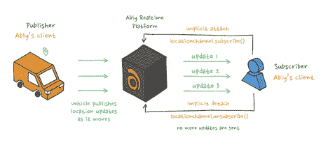
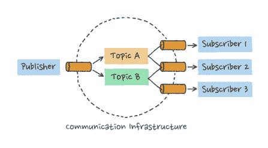
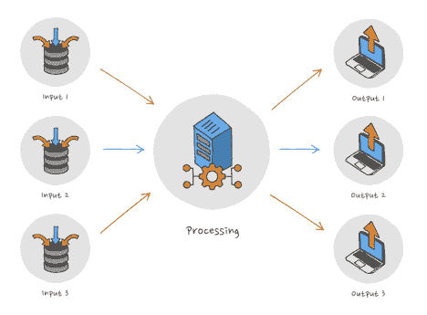
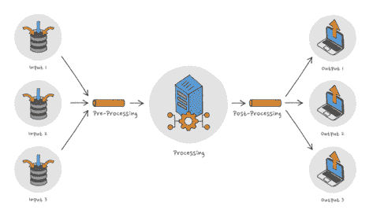

# 发布-订阅:可伸缩消息传递简介

> 原文：<https://thenewstack.io/publish-subscribe-introduction-to-scalable-messaging/>

发布-订阅(或发布/订阅)消息传递模式是一种设计模式，它提供了一个交换消息的框架，允许消息的发送者(发布者)和接收者(订阅者)在他们订阅的主题上进行松散耦合和伸缩。

当消息可用时，从发布者向订阅者发送(推送)消息。主持人(发布者)将消息(事件)发布到频道(主题)。订阅者可以注册他们感兴趣的主题。

这不同于标准的请求/响应(拉)模型，在这种模型中，发布者检查新数据是否可用。这使得发布/订阅方法成为最适合实时流数据的框架。

这也意味着动态网络可以建立在互联网的规模上。然而，在这样的规模上构建消息传递基础设施可能会有问题。

对发布/订阅消息模式的介绍描述了它是什么，以及开发人员为什么使用它，并讨论了在大规模构建消息系统时必须克服的困难。



描述:Ably realtime 平台使用互联网规模的发布-订阅模式实时传递消息。

## 什么是 Pub/Sub？松散耦合和缩放

在发布/订阅消息传递模式中，发布者不直接向所有订阅者发送消息；相反，消息是通过代理发送的。发布者不知道谁是订阅者，也不知道他们订阅了哪些(如果有的话)主题。这意味着发布者和订阅者操作可以相互独立地操作。这就是所谓的松散耦合，它消除了传统消息传递模式中存在的服务依赖性。

发布/订阅不同于标准的请求/响应模型，在标准的请求/响应模型中，发布者(拉)检查新数据是否可用。这使得发布/订阅方法成为有效的实时数据流的核心。

发布/订阅模式允许大规模构建极其动态的网络，而不会使发布组件过载或导致不必要的成本。但是，存在与扩展相关的困难，以及需要考虑的解决这些困难的不同方法。

发布/订阅模式的典型应用包括事件消息、即时消息和数据流(比如直播体育赛事)。发布/订阅还用于工作负载平衡和异步工作流。



发布/订阅系统的通信基础设施(图表改编自 msn)。

## 消息系统和发布/订阅的背景

一个简单的信息系统可以遵循一个简单的模式:输入—处理—输出。在合理的规模下，系统将需要多个输入和输出模块来处理并发请求。于是出现了将消息从输入模块路由到它们各自的输出模块的问题。

为了解决这个路由问题，输入和输出模块需要一个寻址机制。处理模块将处理消息，并基于地址将它们路由到正确的接收者。



在 internet 规模上，发布-订阅模式可以处理数万个并发连接。

在互联网规模上，系统将处理数千甚至数万个并发连接。它还需要能够处理高容量和全球地理分布的用户。

在如此大的规模下，该系统需要解决以下问题:

*   由于高容量和地理分布，负载需要分布在多个处理模块之间。
*   模块之间的预定义寻址成为巨大的开销。

简而言之，问题归结为最小化地址的共享知识。发布/订阅通过使用数据管道来解决这些问题，模块可以通过数据管道发布和检索它们的消息。

模块不需要维护其他模块的位置的共享知识。输入模块只接受用户输入，处理模块只处理数据，输出模块只显示输出。

在发布/订阅中，有一个发布消息的通道和一个检索消息的通道。它是这样一步一步发生的:

1.  输入模块将收集用户输入并在预处理通道中发布消息。
2.  处理模块将从该通道中选取消息，对其进行处理，并将其发送到后处理通道。
3.  最后，输出模块将从后处理通道收集信息并显示在用户屏幕上。

同样的模式可以在任何规模下遵循。



在发布/订阅消息传递中，消息的预处理和后处理用于解决互联网规模的路由问题。

## 为什么开发人员使用发布/订阅

从理论上讲，一家物流公司通常混合了客户数据和通用数据，并且客户负载变化很大。客户、司机和投递局之间的数据通道也可能不可靠。重要的是，消息/信息的订户接收客户发送的所有消息，但是没有必要知道客户或有多少客户。

同样重要的是，公司不要过度供应他们的服务(这将是昂贵的)，或者过度供应负载平衡，这将对网络的性能有害(因为:额外的复杂性)。

重要的是要记住，发布/订阅模式适合于传递相关性很快消失的信息。(现在比分是多少？现在呢？)由于信息经常被替换，因此没有存储信息的迫切需要。通常，保留最近的消息就足够了，或者有足够的信息来重新创建最近事件的视图。

开发人员使用发布/订阅来利用边缘计算和网络主干:

*   边缘计算允许您在边缘扩展系统。这是扩展更容易实现的地方，也是最具成本效益的地方。
*   使用网络主干和多个存在点意味着消息传递可以更快、更可靠。

## 现实世界中如何采用发布/订阅

 [马修·奥莱登

Matthew O'Riordan 是 Ably 的技术联合创始人，Ably 是一个协议不可知的全球分布式数据流网络。他做程序员已经 20 多年了。他在 90 年代中期开始从事商业互联网项目，当时 Internet Explorer 3 和 Netscape 正在竞争，Java 和 Flash 是给浏览器带来交互性的新兴技术。作为一名开发人员，他不仅在各种项目的复杂技术方面做出了贡献，还在商业、UX 和设计方面做出了贡献。他还建立并出售了两家科技公司，最后一家是 Econsultancy。在 Ably，作为一名开发人员，他关注的不仅仅是最好的技术解决方案，更多的是开发人员对他们的 API 的体验。考虑到他们的客户都是开发者，Ably 的开发者关系必然是他们所做的一切的核心。](https://www.linkedin.com/in/lemon/?originalSubdomain=uk) 

事件消息:发布/订阅广泛用于交付物流。随着我们越来越频繁地在网上购买各种各样的商品，包裹递送已经变得司空见惯。物流公司需要更有效地利用配送资源。为了优化运输，调度系统需要关于司机位置的最新信息。发布/子活动消息有助于物流公司做到这一点。

调度员需要根据需要访问司机的位置信息，最好是连续访问。这些数据将使他们能够更好地预测到达时间，并改进路线方案。调度系统也发送诸如取消、交通信息和新包裹取件等信息。

随着时间的推移，这一信息变得越来越重要，因为维护交付时间窗口变得越来越困难，并且必须调整计划以最大限度地提高准时交付的数量。

这是大量的数据，并不是所有的数据在任何给定的时间都是相关的。为了解决这个问题，设备需要能够订阅对它们重要的更新。使用 pub/sub 这样的模式，各方只订阅与他们相关的内容:

*   驾驶员设备可以订阅交通和路线信息。
*   调度和 ERP 系统可以订阅完整的交货更新。
*   跟踪和调度系统可以在需要时获得实时位置更新。

这些系统使客户能够实时跟踪交付情况。例如，重新安排运输中的任何包裹，并提醒司机在途中要进行拾取，以实现更有效的路线安排，从而降低燃料成本并提高效率。

其他用例示例包括:

*   **即时消息:**提供近乎即时互动的服务，例如，通知你的对话人正在打字。
*   **数据流:**应用程序可以将数据即时提供给客户端进行处理、保存或实时预览。例如，提供网球锦标赛的最新比分，并确保在页面加载时新的网站访问者可以看到这些比分。请参阅后续阅读中的案例研究。
*   **工作负载平衡:**了解系统各部分的容量和位置可以更好地利用工作。例如，这包括允许物流调度员使用部分空载的送货车辆进行提货和按需送货。
*   **异步工作流程:**例如，工厂机器和电力、水和其他公用事业传感器可以实时更新中央控制系统。提高供应链的效率可以实现即时制造和产能控制。

## 发布/订阅代码示例

下面是两个带有代码片段的发布/订阅应用程序示例。

### 王菲

[Faye](https://faye.jcoglan.com/) 是 Aha 用的开源系统！路线图软件和 Shopify。它基于发布/订阅消息传递。下面的代码示例显示了如何启动服务器、创建客户端以及发送消息:

```
var http  =  require('http'),

      faye  =  require('faye');

var server  =  http.createServer(),

      bayeux  =  new faye.NodeAdapter({mount:  '/'});

bayeux.attach(server);

server.listen(8000);

var client  =  new Faye.Client('http://localhost:8000/');

client.subscribe('/messages',  function(message)  {

   alert('Got a message: '  +  message.text);

});

client.publish('/messages',  {

   text:  'Hello world'

}).

```

### 巧妙的实时聊天应用

下面是一个例子，展示了如何使用[或](https://www.ably.io/)的实时软件开发工具包为聊天应用添加发布/订阅功能。

当应用程序启动时，SDK 初始化并订阅代表公共聊天室的主题。

```
var realtime  =  new Ably.Realtime('api-key');
// Obtaining a channel instance
var chatRoomTopic  =  realtime.channels.get('channel-name');

chatRoomTopic.subscribe(function(message)  {
   console.log('message received for event '  +  message.name);
   console.log('message data:'  +  message.data);
});

```

随后，当用户想要发送聊天消息时，聊天应用发布相同主题的消息。

```
chatRoomTopic.publish('event',  'This is my payload',  function(err)  {
   if(err)  {
      console.log('Unable to publish message; err = '  +  err.message);
   }  else  {
      console.log('Message successfully sent');
   }
});

```

当用户退出或离开聊天室时，应用程序会取消订阅频道。

```
chatRoomTopic.unsubscribe('channel-name')

```

## 部署和扩展发布/订阅时需要考虑什么

实现单通道发布/订阅消息传递框架非常简单。但是当你开始扩展时，分布式系统工程的经典问题就出现了。当扩展到多通道甚至更大的复杂性时，问题会增加，保持可靠性变得困难。

## 构建大规模消息传递系统的问题

理想情况下，分布式消息传递系统应该具备三个要素:可靠性、速度和有序性。然而，通常情况下，你只能选择其中的两个。要创建一个允许这三者的系统，你必须从设计层面入手，建立一个严密的数学模型。以后要把你三个中缺少的元素加进去几乎是不可能的。

这些是需要处理的问题:

*   **消息的排序。**当您开始在一个大型网络上分发消息时，可靠地重建消息的传递顺序会出现问题。为了可靠地快速发送，您必须使用多条路由并行发送消息，但是您还必须能够重新排序并保持它们的原始顺序。
*   **消息的排队和自动持久化**。对于容错、可靠的消息传递，您必须在自动持久性中构建，否则如果系统崩溃并且没有记录，重建是不可能的。如果你不对消息进行排队，你就不能可靠地重建一个订单，或者处理带宽的波动。
*   **发一次正好。发送一次信息，并且只在指定的目的地被接收一次，这是一个经典问题。如果你不知道谁在接收信息，它就会到处传播。要么你必须在网络中有逻辑来阻止它到达两次，要么在应用程序中有逻辑来阻止它被处理两次。否则，您可能会触发一个事件两次，导致意想不到的后果。例如，在进行在线支付时，用户断开连接，然后很快重新连接。如果不支持恰好一次语义，用户在重新连接时可能会被收取两次费用。**
*   **分布式存储。**容错需要多点冗余、故障转移存储、不同物理位置的存储和自动修复网络。真正的可靠性需要不同的物理硬件和多个云实例。这种冗余的代价是复杂性与安全性之间的权衡。
*   **负载突增和减速。**如何动态地主动扩展非常短暂的负载，允许快速扩展和慢速缩减，从而为用户维护公平可用的网络。
*   **速率限制:公平的工作负载平衡是复杂的。**当您的系统变得复杂时，您需要考虑如何管理客户使用。您必须公平地为不同的客户提供服务容量，而不是强加硬性限制。

这些都是规模化建立系统的问题。因为您不一定知道在任何给定时间您可能需要的关于您的系统的所有信息，要么框架需要足够聪明来处理它，要么您的系统中的所有应用程序需要相当先进。

通过明智地使用 TCP 层巧妙地平衡了上述问题。通过允许多条路径，我们获得了可靠性，但不以牺牲速度为代价，我们可以进行快速路径选择，因为我们可以控制我们遵循的路径。此外，由于网络的设置方式，我们可以保持订购，这往往会在交货速度的权衡中失去。

这在设计阶段就已经存在了，因为在全球框架中构建时出现的问题几乎不可能在以后的阶段得到纠正。

## SaaS 还是自行部署？

您可以自己构建一个发布/订阅消息传递基础设施(自部署)，也可以采用云原生软件即服务(SaaS)基础设施，比如 Ably。

由于上一节中描述的原因，解决构建全局扩展系统的设计考虑远非易事。建立你自己的信息系统需要更多的前期设计预算。

如果选择自部署，还需要考虑基础设施设置、安装和框架配置等问题。自己做这些，监督在系统中构建你想要的特性，但是也是耗时且昂贵的。

“即服务”发布/订阅基础架构相对于自我部署的优势在于:

*   **缩短开发时间。**发布/订阅将应用程序开发与消息传递基础设施隔离开来。
*   **托管基础架构已预配置。**系统调整、安全性和设计考虑成本高昂且耗时。
*   **编程选项。**托管服务支持流行的编程语言和框架。另一方面，消息代理框架只支持几种语言。为自己的消息代理构建和维护 SDK 会分散开发精力和时间。
*   **技能。雇佣分布式系统工程师很困难。如果组建一个系统工程团队成为你的核心基础设施的一部分，那么你必须保持他们的技能。**
*   **成本。大多数 SaaS 商业模式都提供可控的支出水平。你根据你的需求和使用付费。尽管自部署看起来更便宜，但这隐藏了构建、运行和维护软件所需的投资。您的云账单不是唯一的开销。**

## 在 Ably 发布-订阅

Ably 是一个实时消息平台，建立在我们自己专有的发布-订阅消息基础设施之上。我们每天通过 web、移动和物联网平台向 5000 多万终端用户发送数十亿条实时消息。我们为 HubSpot 的实时聊天、数百万澳网球迷的比赛分数以及 300 万芝加哥人的实时交通更新提供支持。

Ably 的平台是围绕可靠性的四个支柱进行数学建模和构建的:性能、可用性、完整性和可靠性。在其他提供者为了低延迟而牺牲数据完整性的情况下(反之亦然)，能够保证消息排序和传递，而不牺牲延迟、容错或服务可用性。这种方法意味着我们可以提供发布/订阅消息服务，保证在严格、可靠、可预测和透明的边界内运行。

开发人员相信能够在他们的应用程序中构建实时功能。我们功能丰富的平台包括多协议[发布/订阅消息](https://ably.com/channels)、[在线状态](https://ably.com/documentation/realtime/presence)、[推送通知](https://ably.com/push-notifications)、[来自运输和金融等行业的免费流数据源](https://ably.com/hub)，以及能够巧妙扩展到 AWS Lambda 和 RabbitMQ 等第三方云和系统的[集成](https://ably.com/reactor)。

企业巧妙地利用[将他们的流媒体数据](https://ably.com/api-streamer)分发给其他企业。这使他们能够减轻工程和数据交付方面的挑战，提供高性能、可靠且可用于各种协议的数据流。

## 进一步阅读

请参阅 Ably 的深入文章:关于发布-订阅您需要知道的一切，以及关于发布-订阅模式的以下方面的更多细节。

<svg xmlns:xlink="http://www.w3.org/1999/xlink" viewBox="0 0 68 31" version="1.1"><title>Group</title> <desc>Created with Sketch.</desc></svg>