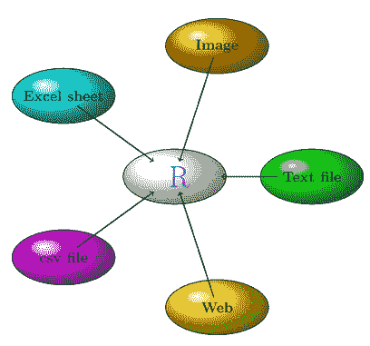
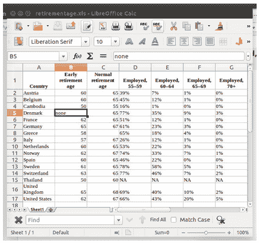
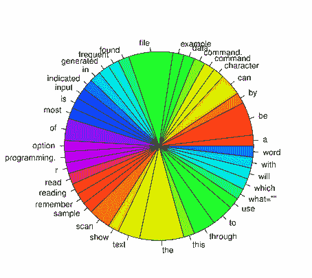
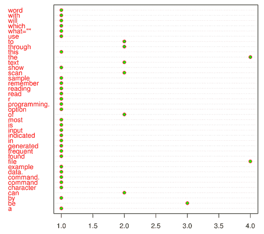
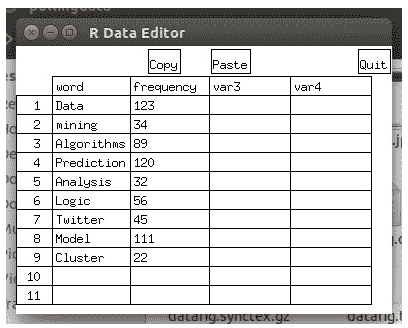

# 提取 R 中的数据进行智能分析

> 原文：<https://thenewstack.io/pulling-data-r-smart-analysis/>

这是关于 R 编程语言系列的第二部分。在…里

[part one](https://thenewstack.io/data-visualization-basics-r-programming-language/)

我们探索了 R 如何用于数据可视化。第二部分研究如何将数据提取到 R 中用于分析目的。在第三部分，文殊菩萨解释了如何

[understand data graphically](https://thenewstack.io/understanding-data-graphically-through-r/)

通过 R 编程语言，在第四部分她有我们

[drawing quick plots](https://thenewstack.io/r-package-drawing-quick-plots-with-ggplot2/)

使用 ggplot2。

毫无疑问，购买手机是一个非常具有挑战性的过程。有这么多型号和品牌可供选择，确定适合您使用的手机需要研究和了解产品的实用性。有趣的是，有几个产品评论和价格比较可供用户判断，帮助消费者做出正确的选择。这些实际数据被积累和缓存，供消费者在决策时使用，或者用于产品本身的综合分析。作为一名消费者，寻找合适的数据需要高度的技巧。这就是 R 编程有效的地方。使用 R 编程，可以使用脚本快速绘制适合自己分析的统计数据。让我们来看看 R 编程的一些特性和用法。

[](https://thenewstack.io/wp-content/uploads/2015/01/Smartanalysis_fig1.png)

## **R 中处理数据的不同方式**

r 可以从以下位置读取数据:

*   电子表格
*   Excel 表格
*   数据库
*   形象
*   文本文件
*   许多其他特殊格式

[](https://thenewstack.io/wp-content/uploads/2015/01/Smartanalysis_fig2.png)

## **将数据放入 R**

无论数据是本地的还是网上的，用 R 编程你都可以成功地导入不同格式的数据。

## **从文件中读取数据**

理想情况下，存储在系统中的文件上的数据是可用的。读取或写入这些数据所需要的只是识别存储文件的当前目录。

### **设置目录**

最重要的事情之一是建立工作目录。
在 linux pc 上使用命令 getwd()
识别目录(文件夹)，输出显示如下:

```
&gt;  getwd()
[1]  "/home/test"

```

在 Windows 上，它被描述为:

要设置保存数据文件的目录，使用命令 setwd ("path ")，其中 path 包含数据文件所在的子目录。例如，如果数据在文件 temp.txt 中，而该文件在文件夹/home/test/example/ then 中，则发出:

```
setwd("/home/test/example/")

```

在 Windows 上它将被表示为:

需要知道保存文件的文件夹。

### **阅读文本文件**

使用 s can 命令可以在 R 会话中读取文本文件中包含的数据。
记住将选项 what= " "与扫描命令一起使用，该选项指示输入将为字符数据类型。
为了这次会话，我创建了 [textsample.txt 文件](https://docs.google.com/document/d/1oVdFZxvNvfjhtVwr-NvOhNVEVPMtsd9Nb3_H0VNL0XU/edit)，可以在 R 会话中读取。

```
&gt;  fdata&lt;-  scan("textsample.txt",what="")

```

现在，fdata 将保存来自。txt 文件。
让我们回顾一下带有命令头(fdata)的前几个条目:

```
&gt;  head(fdata)
[1]  "this"       "is"         "a"          "sample"     "file"       "generated"

```

改为小写使用 to lower。

```
&gt;  fdata&lt;-tolower(fdata)

```

文件中有很多字是分开存放的。有些词也是重复的。

使用
统计单词的频率

使用命令
查看 ft 的饼状图

[](https://thenewstack.io/wp-content/uploads/2015/01/Smartanalysis_fig3.png)

从上图来看，单词“file”和“the”出现的频率最高。

使用 max 命令可以直接找到 ft 中单词的最大频率。

看命令的输出。

```
&gt;  head(ft)
fdata
a         be         by        can character    command
1          3          1            2              1              1

```

该图显示了单词出现频率的曲线图。

[
](https://thenewstack.io/wp-content/uploads/2015/01/Smartanalysis_fig4.png)

### **从文件中读取数据的命令**

众所周知，一些最常见的可用数据文件是 csv 和。xls 格式文件，其中 csv 是包含逗号分隔值的文件，xls 是 excel 文件的文件扩展名。

[T34](https://thenewstack.io/wp-content/uploads/2015/01/Smartanalysis_fig5.png)

可以通过命令处理的一些最常见的数据文件格式是 read.csv 和 read.table:

```
&gt;  read.csv("test.csv",header=TRUE)
1   Status    Age     V1      V2      V3     V4
2        P  23646  45190   50333   55166  56271
3       CC  26174  35535   38227   37911  41184
4       CC  27723  25691   25712   26144  26398
5       CC  27193  30949   29693   29754  30772
6       CC  24370  50542   51966   54341  54273
7       CC  28359  58591   58803   59435  61292
8       CC  25136  45801   45389   47197  47126

```

```
&gt;  read.table("test.csv",header=TRUE)
Status    Age     V1     V2     V3     V4
1       P  23646  45190  50333  55166  56271
2      CC  26174  35535  38227  37911  41184
3      CC  27723  25691  25712  26144  26398
4      CC  27193  30949  29693  29754  30772
5      CC  24370  50542  51966  54341  54273
6      CC  28359  58591  58803  59435  61292
7      CC  25136  45801  45389  47197  47126

```

### 直接从网上获取数据

直接从网上读取数据是可能的。Web 链接或 URL 中可用的数据将通过内存中的 R 直接获取。数据在[http://lib.stat.cmu.edu/datasets/csb/ch3a.dat](http://lib.stat.cmu.edu/datasets/csb/ch3a.dat)设置到网络上。

使用 read.csv 或 read.table 命令直接读取数据。

```
data1&lt;-read.table(  "http://lib.stat.cmu.edu/datasets/csb/ch3a.dat")  
&gt;  head(data1)
        V1    V2    V3    V4    V5
1  07/08/91  47.33  52.82  19.58  17.78
2  07/09/91  42.58  53.25  9.42  6.06
3  07/10/91  59.55  56.32  19.83  14.81
4  07/11/91  52.92  50.06  15.08  9.75
5  07/12/91  55.25  59.50  28.75  27.21
6  07/13/91  54.75  56.80  27.83  20.84

data2&lt;-read.csv(  "http://lib.stat.cmu.edu/datasets/csb/ch3a.dat")  
&gt;  head(data2)
  X07.08.91....47.33....52.82....19.58....17.78
1  07/09/91    42.58    53.25 9.42 6.06
2  07/10/91    59.55    56.32    19.83    14.81
3  07/11/91    52.92    50.06    15.08 9.75
4  07/12/91    55.25    59.50    28.75    27.21
5  07/13/91    54.75    56.80    27.83    20.84
6  07/14/91    35.33    40.88    11.83    15.65

```

数据 1 和数据 2 是保存不同格式的相同文件的对象。

### 阅读电子表格

为了读取电子表格数据，我们需要安装库 gdata。

```
&gt;  install.packages("gdata")
&gt;  library(gdata)

```

有了这个包，新命令 read.xls 将可用。
可以使用 read.xls("test.xls ")读取数据文件 test.xls。

## 通过 R 中的编辑器填充电子表格类型的数据

```
x&lt;-edit(as.data.frame(NULL))

```

[](https://thenewstack.io/wp-content/uploads/2015/01/Smartanalysis_fig6.png)

## **R 中的数据集**

用户可以使用 data()提取 R 中可用的数据集，这将显示 R 中可用的数据集列表。

要查看数据的描述，使用命令:

使用 head 命令查看实际数据:

```
&gt;  head(AirPassengers)
[1]  112  118  132  129  121  135

```

关于数据的更多信息可以在 [r-manual](http://cran.r-project.org/doc/manuals/r-release/R-data.html)
找到这里是我们在这篇文章中使用的代码的 [Github 回购链接](https://github.com/thenewstack/R-code/tree/master/PullingdatainR)。

特色图片[通过](https://www.flickr.com/photos/slugicide/26443079/in/photolist-3kwBa-7aUw5r-pCDSnk-gPHoN-potYkV-djS4qv-p7dMaU-74kJSf-6pp7x2-gPHaY-aLBH6T-gPHm8-6xNB9h-puC8tP-6RQbHn-83wKBS-n6wRcU-8YjTW1-8Wj98R-bSeJWa-7SM8EZ-doCrn4-dPBPpc-eimqcD-oXvKGk-kWeHv7-9XW7mL-dc3Bw4-bsxYwF-puuAAa-e85m82-fx6rVY-5ysSY-8VYEBu-ppnqHW-d4feEh-pdUiNe-5txCMa-a8n7pg-8M8EMS-dnFyRB-8MXdLV-fCaTF-6TwpAw-gPH19-aJnbQz-aV3GfF-nE6SuC-egMbo8-qsyGca) Flickr 知识共享。

Manjusha Joshi 是科学计算领域免费开源软件的自由职业者。她是一名数学家，也是 Pune Linux 用户组的成员。

<svg xmlns:xlink="http://www.w3.org/1999/xlink" viewBox="0 0 68 31" version="1.1"><title>Group</title> <desc>Created with Sketch.</desc></svg>