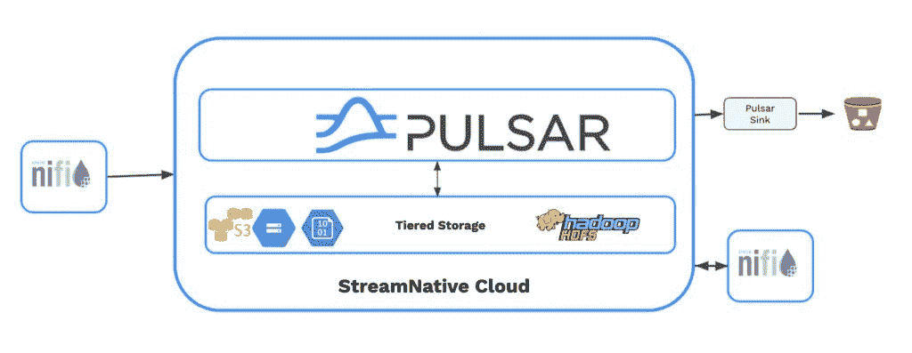

# Pulsar，NiFi:更好的消息和流媒体服务

> 原文：<https://thenewstack.io/pulsar-nifi-better-together-for-messaging-streaming/>

Cloudera 和 StreamNative 在 Apache Pulsar 和 Apache NiFi 之间发布了一个新的开源集成，看起来就像 Reese 的花生酱和巧克力的婚姻一样自然。这两者共同创建了一个云原生、可扩展的实时流数据平台，可以接收、转换和分析海量数据。

“[NiFi 是]一种非常简单快速地从 Pulsar 获取数据的好方法。StreamNative 的开发者倡导者和 NiFi 项目的长期贡献者[蒂姆·斯潘](https://www.linkedin.com/in/timothyspann/)说:“这是一个非常好的方式，能够非常简单地用低代码或无代码构建流媒体应用。

[StreamNative](https://streamnative.io/) 由阿帕奇 Pulsar 的最初创造者创建，NiFi 的许多创造者曾在国家安全局(NSA)工作过，直到 2015 年 Hortonworks 收购 Onyara。 [Cloudera](https://www.cloudera.com/) 在 2018 年买断了 Hortonworks。

Spann 说，虽然这两者之间已经有一段时间的开源连接器，但它不是最新的，所以他决定是时候做点什么了。与开源社区合作的两家公司使两个项目同步，并在他们的测试案例中运行集成。

有了这个更新，用户可以在 Apache NiFi 中通过简单的配置设置大规模地使用和产生来自 Pulsar 主题的消息。Cloudera 正在为数据中心 7.2.14 和更新版本提供四个处理器及其 [Cloudera 数据流](https://docs.cloudera.com/cdf-datahub/7.2.14/release-notes/topics/cdf-datahub-supported-partner-components.html)。

“Cloudera 将它作为第一款受其他公司支持的处理器推出，所以很高兴看到这一点，”Spann 说。“NiFi 生态系统在增长，脉冲星生态系统在增长。很高兴看到这两个项目之间的互动和重叠。”

[https://www.youtube.com/embed/LZG9IU6O78A?feature=oembed](https://www.youtube.com/embed/LZG9IU6O78A?feature=oembed)

视频

## **阿帕奇脉冲星**

Apache Pulsar 是一个分布式消息和流媒体平台，最初由 Yahoo！现在是顶级的 Apache 软件基础项目。它因提供可扩展的消息和流媒体服务而出名。虽然像 Apache Kafka 这样的流媒体系统可以扩展，但它们需要围绕数据再平衡做大量工作，StreamNative 的首席架构师 Addison Higham 在一篇关于新堆栈的[博客文章](https://thenewstack.io/apache-pulsar-a-unified-queueing-and-streaming-platform/)中写道。

它使用分布式发布-订阅模式，旨在将消息从一个端点路由到另一个端点，而不会丢失数据。在其核心， [Pulsar](https://github.com/apache/pulsar) 使用一个复制的分布式账本来提供持久的流存储，可以轻松扩展以保留数 Pb 的[数据](https://thenewstack.io/category/data/)，使事件数据的长期保留变得可行。

Higham 在一次采访中说，Pulsar 使缩放变得容易，并提供了更多的灵活性。

“作为一个堪比卡夫卡的流媒体系统，它非常有能力，因此它可以移动大量数据；它可以处理大量的并行处理，但也有一些优势，”他说。

他说，Pulsar 集群可以支持数百万个不同的主题，为组织提供更大的灵活性。例如，消息可能由客户或用户发送。

“Pulsar 的模型实际上看起来更像一个消息传递 API，所以它支持传统的工作队列。您可以连接任意多的消费者。您可以获得更高的无序处理吞吐量，以及执行传统消息传递和扇出工作负载的灵活性，许多消费者都可以获得自己的消息副本，”他说，并解释说这使其成为营销公司青睐的技术。

Higham 说，组织可以使用一个 Pulsar 集群，而不是为每个团队建立一个不同的集群，并与 NiFi 一起创建一种数据网格数据平台，使技术水平较低的用户也可以获得丰富的数据。

他将其描述为一种适用于各种不同用例及工作负载的技术。与此同时，它的目标是在操作上提供大量的简单性。

“所以[你]有能力在不降低性能的情况下处理数百万个主题，”他说。

其用户包括腾讯、威瑞森传媒、康卡斯特和 Overstock。2020 年，Splunk [发布了](https://www.datanami.com/2020/10/20/splunk-makes-a-whirlwind-of-news-at-conf20/)基于 Pulsar 的 Splunk 数据流处理器(DSP)。

## **阿帕奇尼菲**

美国国家安全局在 2014 年向阿帕奇软件基金会提供了 NiFi。第二年就成了顶级项目。

NiFi 支持强大且可扩展的数据路由、转换和系统中介逻辑的有向图。

这种可视化工具使用基于流的编程，使用户能够构建数据流，自动将数据从各种平台(数据库、云存储、消息系统)移动到另一个平台，从而快速、轻松、安全地接收数据。它还提供了事件级的数据来源和可追溯性，允许您将每一部分数据追溯到其源头。

它负责数据流管理需求，包括优先级、背压和边缘智能。

NiFi 平台还包括 100 多个预构建的处理器，可用于在数据从源流向目的地时对其执行丰富、路由和其他转换。

## **为什么是二合一？**

NiFi 专注于使软件系统之间的数据转移变得容易，而不是做任何长期的事情。与此同时，Pulsar 旨在充当事件数据的长期存储库，并提供与 Flink 和 Spark 等流行的流处理框架的强大集成。

通过 NiFi，数据可以在途中进行处理和转换，然后直接发送到 Pulsar 的持久流存储进行长期保留，并可用于许多更复杂的流处理和分析用例。

“NiFi 旨在进行集成，它在获取大量资源方面非常出色，让您可以进行基本的丰富、转换和查找路由。Pulsar 非常适合快速传输信息和许多其他东西，”Spann 说。“凭借 Pulsar 的灵活性，一旦 Nifi 消息存在，就可以使用许多其他选项，无论是用于流应用程序、工作用途，还是许多不同风格的消息传递。

“Pulsar 也有许多其他消息协议的网关，这就像我们将两个网关连接在一起。一旦您将数据放入一个或另一个系统，您就可以连接现代数据堆栈中的几乎任何地方。不管它在什么源或汇中，在他们两个之间，你有你需要的所有连接。”

该集成由四个处理器组成，两个用于向 Pulsar 发布数据——publish Pulsar 和 PublishPulsarRecord——两个用于从 Pulsar 消费数据——ConsumePulsar 和 ConsumePulsarRecord。还包括两个控制器服务:一个用于创建 Pulsar 客户端，另一个用于验证 Pulsar 集群的安全。

除了 Cloudera 产品之外，工件可以直接从 [maven 中央存储库](https://search.maven.org/search?q=g:io.streamnative.connectors%20nifi)下载，或者你可以直接从[源代码](https://github.com/streamnative/pulsar-nifi-bundle)构建它们。

Apache 软件基金会有一堆流技术项目。分析师[贾纳基拉姆·MSV](https://thenewstack.io/author/janakiram/)为他们制作了一个指南[在这里](https://thenewstack.io/apache-streaming-projects-exploratory-guide/)。

*[加入](https://streamnative.io/event/meetup-apache-pulsar-and-apache-nifi-for-cloud-data-lakes/)* *StreamNative 的 Spann 和[Cloud era 的首席解决方案工程师 John Kuchmek](https://www.linkedin.com/in/jkuchmek/) 参加今天下午 3 点(太平洋标准时间/美国东部时间下午 6 点)的会议:“Apache Pulsar 和 Apache NiFi 的云数据湖”。*

<svg xmlns:xlink="http://www.w3.org/1999/xlink" viewBox="0 0 68 31" version="1.1"><title>Group</title> <desc>Created with Sketch.</desc></svg>