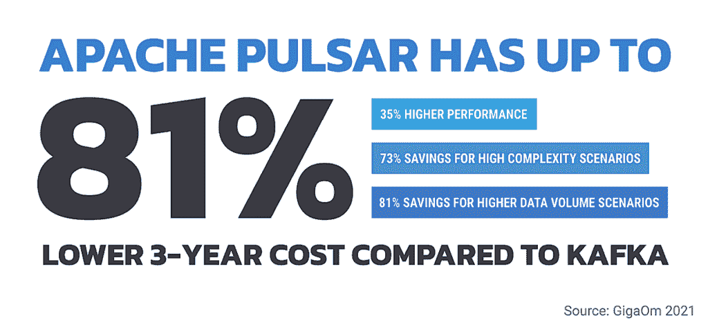

# 脉冲星以统一的架构和速度挑战卡夫卡

> 原文：<https://thenewstack.io/pulsar-takes-on-kafka-with-uniform-architecture-speed/>

Apache Pulsar，一个开源流处理平台，比 Apache Kafka 出现得晚，但是它开始看到它的社区、供应商支持和用例的增长。

本月，云数据库供应商 [DataStax](https://www.datastax.com/) 发布了 [Astra Streaming](http://datastax.com/products/astra-streaming) ，这是一个基于 Apache Pulsar 的可扩展、多云消息和事件流平台。Astra Streaming 与该公司的无服务器数据库 [Astra DB](https://www.datastax.com/resources/datasheet/datastax-astra) 相集成，使该公司更接近于能够处理运动和静止数据的全栈产品。

上周四[首次公开募股](https://www.cnbc.com/2021/06/24/confluent-climbs-26percent-after-raising-828-million-in-ipo.html)由 [Confluent](https://www.confluent.io/) 发起，这家公司由三位创造了 Kafka 的工程师创立，进一步证明了企业越来越多地使用成熟的开源技术来构建业务关键型应用程序。像 Apache Kafka 和 Apache Pulsar 这样的软件是高级的流媒体解决方案，可以满足广泛的使用案例。

## 脉冲星和卡夫卡:一个比较

Apache Kafka 是较早的项目，最初由 LinkedIn 开发，并于 2011 年初开源。

因为它存在的时间更长，卡夫卡周围有一个很大的社区。比如 [StackOverflow](https://stackoverflow.com/) 有[24000 多个与平台相关的问题](https://stackoverflow.com/questions/tagged/apache-kafka)，平台在 GitHub 上有[近 800 个贡献者](https://github.com/apache/kafka)。

相比之下，Pulsar 的 GitHub 贡献者只有 400 多人。

全球技术咨询公司 AArete 的技术实践董事总经理 John Carey 说，拥有一个强大的社区对于企业采用来说是非常重要的。

“开发人员通常很懒，而且有大量的代码复制，”他说。“如果我的企业试图解决一个问题，是否有类似问题的人以前解决过这个问题？”

但是 Apache Pulsar 社区正在展现实力，这预示着它将越来越多地被采用。例如，在 [2020 Pulsar 峰会](https://pulsar-summit.org/en/event/virtual-conference-2020)上，1600 名全球与会者代表了 300 多家公司，包括[美国运通](https://www.americanexpress.com/)、[迪士尼](https://thewaltdisneycompany.com/)、[谷歌](https://about.google/)、[微软](https://www.microsoft.com/)、 [PayPal](https://www.paypal.com/) 和 [Salesforce](https://www.salesforce.com/) 。

本月的 [Pulsar 峰会](https://www.na2021.pulsar-summit.org/agenda)包括来自 [Belvedere Trading](http://www.belvederetrading.com/) 、 [Cogito](https://cogitocorp.com/) 、 [Flipkart](https://www.flipkart.com/) [、Nutanix](https://www.nutanix.com/) 、 [Splunk、](https://www.splunk.com/) [腾讯、](https://www.tencent.com/en-us/index.html) [威瑞森媒体](https://www.verizonmedia.com/)和[雅虎日本](https://www.yahoo.co.jp/)的工程师的演讲。

Pulsar 最初由雅虎开发，2016 年贡献给开源社区，2018 年成为顶级 Apache 软件基金会项目。Pulsar 比 Kafka 有一些显著的架构优势，这有助于推动进一步的支持和采用。

Apache Kafka 是一个更加整合的系统，这可以使它更容易安装，但这也意味着处理和存储是捆绑在一起的。这使得很难独立地增加其中一个的容量。

在 Kafka 中，分区被表示为代理上的文件；换句话说，主题持久性与代理紧密耦合。

[相比之下](https://youtu.be/jLruEmh3ve0?t=456)，Pulsar 使用分层架构，将消息服务层从存储层中分离出来，存储层使用 Apache BookKeeper 实现为分布式分类账，完全独立于代理。

GigaOm 分析师威廉·麦克奈特[在 6 月份的一份报告](https://www.datastax.com/gigaom-pulsar)中写道，在 Kafka 中，“它的分区永远与其节点联系在一起，随着时间的推移，这阻碍了客户用更便宜的资源降低成本的能力，”该报告由支持 Pulsar 平台的供应商 DataStax 赞助 Kafka 节点不容易添加或删除，这意味着客户经常必须针对峰值负载调整规模。"

此外，他断言，“没有简单的方法来为卡夫卡的不同用户在逻辑上分离资源。你不能轻易地让某个业务部门的用户自由管理他们在 Kafka 中的资源，而不引入这些用户可能会影响平台上其他人的风险。”

对于像[龚](https://www.gong.io/)这样一家提供人工智能驱动的销售数据分析平台的数据驱动型公司来说，“Kafka 是一个容易的选择，因为它能够高效地处理和处理数据流——特别是在大规模的情况下，”该公司高级软件工程师 [Nadav Hoze](https://www.linkedin.com/in/nadavh/) 在去年 12 月的一篇文章中写道。

但是，Hoze 写道，龚仍然用一种涉及重新分区的变通方法解决了多租户问题，这种方法基于使用租户 id 作为中间主题。

DataStax 产品管理副总裁 Chris Latimer 说，Pulsar 的架构避免了 Kafka 方法的缺陷，这意味着它更容易添加，比如说，存储，而不必重新平衡整个系统。

此外，McKnight 的 GigaOm 报告包括了这两种技术的性能测试结果，显示 Pulsar 在所有测试场景中提供了比 Kafka 更快的吞吐量和更低的延迟。

因此，Pulsar 已经获得了一些高调的用户，包括 [Splunk](https://www.slideshare.net/KarthikRamasamy3/apache-pulsar-splunk) 、[威瑞森媒体](https://www.youtube.com/watch?v=FXQvsHz_S1A)、中国互联网巨头[腾讯](https://streamnative.io/en/blog/case/2020-02-18-pulsar-help-tencent)、云计算公司 [Nutanix](https://www.datastax.com/blog/why-nutanix-beam-selected-apache-pulsar-over-apache-kafka) ，以及最近的在线零售商 [Overstock](https://www.overstock.com/) 。

## 供应商支持

今年早些时候，[data tax 收购了 Kesque](https://www.datastax.com/press-release/datastax-delivers-scale-out-enterprise-event-streaming-modern-data-apps) ，这是一家基于 Apache Pulsar 建立云消息服务的初创公司，并使用它来创建自己的 DataStax Luna 流媒体产品。

现在，随着 Astra Streaming 的推出，DataStax 进一步扩大了对 Pulsar 的支持。

供应商支持可以使平台对企业客户更有吸引力，因为他们现在可以获得支持和增值功能。

事实上，Splunk 在 Pulsar 上是全押的。它的高级工程总监， [Karthik Ramasamy，](https://www.linkedin.com/in/kramasamy/)，[在 2020 年的海湾会议上谈论了该技术的使用。根据 Splunk 的说法，Pulsar 的单个集群可以支持许多租户和使用案例，实现无缝集群扩展，而不会出现任何宕机。它可以在单个分区中容纳 180 万条消息，并为地理上分散的应用程序提供开箱即用的支持。此外，它可以支持数百万个主题，使数据建模更容易。](https://youtu.be/rmiQb4wsCTI)

Overstock 的数据工程副总裁 George Trujillo 表示:“作为 Apache Pulsar 的用户，很高兴看到 DataStax 为 Pulsar 社区做出贡献，并使像我们这样的公司能够大规模地轻松访问它。“DataStax 是 Overstock 值得信赖的合作伙伴，它正在推动 Apache Pulsar 的全球应用，使我们的开发人员能够更快地构建具有无限可扩展性的现代数据应用。”

## 基准报告

在新的 GigaOm 报告中，分析公司[在几个不同的场景中比较了](https://www.datastax.com/gigaom-pulsar) Luna Streaming 和 Kafka 在 [AWS](https://aws.amazon.com/) [Kubernetes](https://kubernetes.io/) 集群上的表现。

在第一个场景中，GigaOm 为一家数据流呈简单线性增长的企业测试了这两个平台，发现与 Kafka 相比，使用 Luna Streaming 三年时间可节省 33%的基础设施成本。在第二个场景中，侧重于高峰期的工作负载，节省高达 50%。在第三个场景中，项目需要很大的复杂性和大量的主题和分区，节省了 75%。在某些使用案例中，节省的成本甚至会更高。

“Kafka 和 Pulsar 都是流媒体解决方案，”分析师 McKnight 写道。“但使用 Kafka，您将面临吞吐量方面的挑战，这将导致总体成本潜在增加 81%。”

## 新兴用例

在其他情况下，Pulsar 比 Kafka 更有优势。拉蒂默说，例如，存在可扩展性问题。Kafka 的方法是将消息代理和存储放在一个节点中。

“你可以添加更多的代理，但之后你要花时间重新平衡每个代理上的所有数据，”拉蒂默说，尽管 Apache Kafka 社区已经开发了像 [cruise control](https://github.com/linkedin/cruise-control) 这样的工具来解决这个问题。

拉蒂默区分了卡夫卡和脉冲星。他说:“有了 Pulsar，我们不再将计算和存储放在一起，而是在幕后使用一个分布式系统，所以你可以扩展代理，也可以扩展存储。”“这是一种立竿见影的缓解，你不必再去做再平衡了。”

雅虎！，即现在的威瑞森媒体，亲眼目睹了这种可扩展性，从 2015 年的一个租户雅虎财经和不到 100 个主题，增长到超过 100 个租户和 2800 万个主题，峰值每秒 600 万次请求。

“扩大规模就像增加服务器一样简单，”威瑞森媒体的首席制作工程师 Ludwig Pummer 在去年夏天的 Pulsar 峰会上说。

在同一个演讲中，负责为所有威瑞森媒体提供信息系统的团队负责人 Joe Francis 对这一评估表示赞同。“我们不做任何人工操作，我们只是添加硬件。这就是我们所做的一切。”

弗朗西斯补充说，该公司还将大型用例从 Kafka 转移到 Pulsar。

“我们没有强迫任何人离开，”他说。“但是到了更新堆栈的时候，他们会看一看选择，以及他们必须花费的美元金额和他们必须投资的运营复杂性，然后做出选择。”

*想了解更多关于 Pulsar 和 Kafka 的信息，[注册](https://dtsx.io/36AZDom)参加 7 月 20 日周二 GigaOm 的 William McKnight 的分析师讨论。*

<svg xmlns:xlink="http://www.w3.org/1999/xlink" viewBox="0 0 68 31" version="1.1"><title>Group</title> <desc>Created with Sketch.</desc></svg>