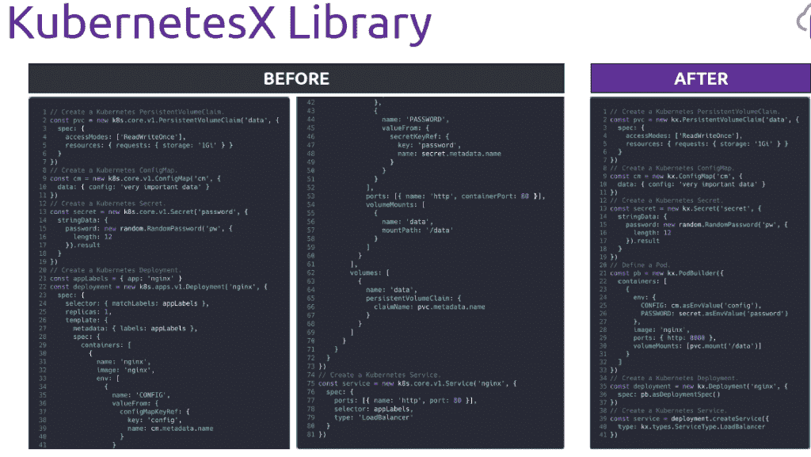
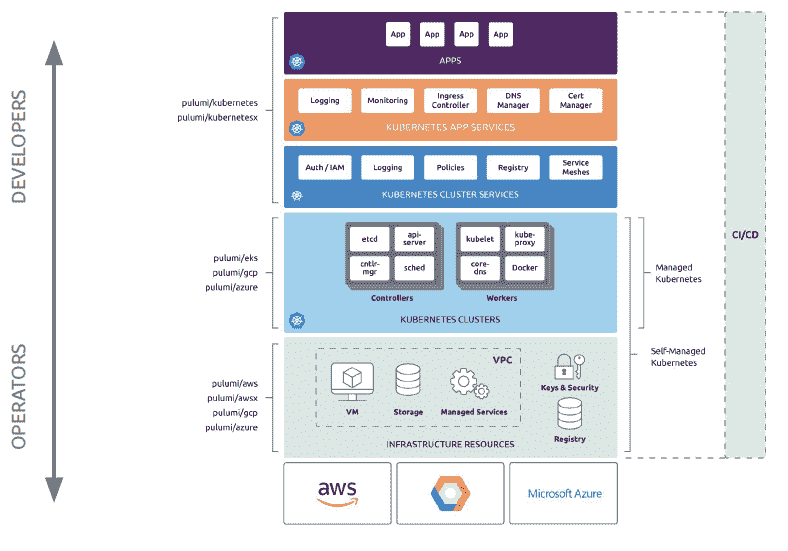

# Pulumi 为 Kubernetes 增加人行横道

> 原文：<https://thenewstack.io/pulumi-adds-crosswalk-for-kubernetes/>

在 6 月推出其 [AWS 人行横道](https://thenewstack.io/pulumi-crosswalk-aims-to-simplify-deploying-to-aws/)后，西雅图初创公司 [Pulumi](https://www.pulumi.com/) 也为 Kubernetes 发布了类似的服务包。

pulumi[Crosswalk for Kubernetes](https://www.pulumi.com/crosswalk/kubernetes)是一个开源的框架、工具和用户指南的集合，帮助开发者和运营商更快地开始工作，并在使用 Kubernetes 时采用最佳实践。

Pulumi 将基础设施作为代码的方法，基本上将一切都作为代码，使开发人员能够以他们喜欢的语言工作，并使用熟悉的工具生态系统，如 ide、测试框架和包管理器。这使得团队更容易共享和重用模式和实践。

与 AWS Crosswalk 一样， [Kubernetes 提供的](https://www.pulumi.com/blog/)包含了反复出现的模式库，并从该公司与 Kubernetes 的合作经验中提炼出最佳实践。

“在过去的一年里，通过帮助数十位客户启动和运行，我们学到了很多东西，并采取了一种让开发人员和运营商能够更好地合作的方法。Pulumi 创始人兼首席执行官 Joe Duffy 表示:“Pulumi Crosswalk for Kubernetes 以一种可重复使用的开源形式捕捉了这些知识，使整个 Kubernetes 社区受益。

Pulumi 支持跨公共云管理 Kubernetes 基础设施，包括 AWS 弹性 Kubernetes 服务(EKS)、微软 Azure Kubernetes 服务(AKS)和谷歌云平台 Kubernetes 引擎(GKE)。

使用 Kubernetes 的人行横道，团队可以:

*   **跨多个云部署到任何 Kubernetes 环境** —公共、私有或混合环境，并一致地部署 Kubernetes。
*   **在所有版本、对象、自定义资源定义(CRD)和 Helm 图表中使用整个 Kubernetes API** ，并在 Kubernetes 发布新版本的同一天提供新功能支持。
*   使用熟悉的语言。使用 TypeScript、JavaScript 或 Python 创作基础架构和应用配置，并使用一个工作流管理云基础架构和 Kubernetes 资源。
*   **用一个名为 Kx 的**新库减少应用程序配置样板文件。
*   **整合 CI/CD。**使用包括 GitLab、Jenkins、CodeFresh、Octopus、Azure DevOps Pipelines、GitHub Actions 等在内的十几个集成之一进行持续部署。
*   **回答操作查询**使用一组新的操作工具，称为 Kq，它扩展了核心的 Pulumi 引擎，以实时查询实时的 Kubernetes 资源。

Kubernetes 的 Pulumi 人行横道是开源的，可以在 [GitHub](https://github.com/search?p=1&q=Pulumi&type=Repositories) 上获得。Pulumi 还为需要高级策略和控制的企业提供高级版本，包括与 Azure ActiveDirectory、Okta 和 GitLab 等身份提供商的集成。

它允许用户强制执行安全性和合规性要求，在内部或自己的云帐户中自行托管，并使用 webhooks 实施高级自动化等功能。

Pulumi 是新堆栈的赞助商。

特征图像:[对](https://www.flickr.com/photos/gauthierdelecroix/31960190397/in/photolist-QGdk8t-83mkfg-9ioTqY-r75fcs-276oHhd-RMQja2-4EyKcU-G8CVH8-4MZCo5-2eR6ZQQ-o5EpJ8-25fRhTA-Ui6MKx-nhXnYL-23MZEC7-fLzge8-QS9kPg-73GqJ4-6T2pZK-Nk2oq-2h3mL1H-f4CQRe-5UPDBh-dsskEX-PL29jw-2at1ZWN-ocTcBP-7Q14qU-8oFE5E-VQq9G9-5g4MLM-CFxNN1-mqhCK1-2b6DVgx-dpLnF8-86c94c-4wRyTi-8YRSQY-8ef3GX-4z6dRC-dET5BG-b9xQxt-5NjGT4-dWDu4t-6ptJEM-uzWJ9H-f9iZQM-6qhxbJ-63T7AM-9JmWB2)由 [Gauthier Delecroix](https://www.flickr.com/photos/gauthierdelecroix/) 制作。根据 CC BY-SA 2.0 获得许可。

<svg xmlns:xlink="http://www.w3.org/1999/xlink" viewBox="0 0 68 31" version="1.1"><title>Group</title> <desc>Created with Sketch.</desc></svg>